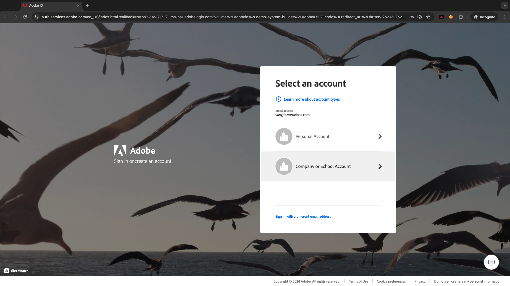

# 2.5.4 Transfert d’événements vers le sous-site/public GCP

>[!NOTE]
>
>Pour cet exercice, vous devez accéder à un environnement Google Cloud Platform. Si vous n’avez pas encore accès à GCP, créez un compte à l’aide de votre adresse électronique personnelle.

## Création de la rubrique Pub/sous-rubrique Google Cloud

Accédez à [https://console.cloud.google.com/](https://console.cloud.google.com/). Dans la barre de recherche, saisissez `pub/sub`. Cliquez sur le résultat de la recherche **Pub/Sub - Global real-time messaging**.

Vous verrez alors ceci. Cliquez sur **CRÉER LA RUBRIQUE**.

Vous verrez alors ceci. Pour votre ID de rubrique, utilisez `--aepUserLdap---event-forwarding`. Cliquez sur **Créer**.

Votre rubrique est maintenant créée. Cliquez sur l’ **ID d’abonnement** de la rubrique.

Vous verrez alors ceci. Copiez le **nom de la rubrique** dans le presse-papiers et stockez-le, comme vous en aurez besoin dans les exercices suivants.

Accédez à Transfert d’événement de collecte de données Adobe Experience Platform maintenant pour mettre à jour la propriété Transfert d’événement afin de commencer le transfert des événements vers Pub/Sub.

## Mettez à jour la propriété Event Forwarting : Secrets

**Secrets** dans les propriétés de transfert d’événement sont utilisées pour stocker les informations d’identification qui seront utilisées pour s’authentifier contre les API externes. Dans cet exemple, vous devez configurer un secret pour stocker votre jeton OAuth Google Cloud Platform, qui sera utilisé pour l’authentification lors de l’utilisation de Pub/Sub pour diffuser des données vers GCP.

Accédez à [https://experience.adobe.com/#/data-collection/](https://experience.adobe.com/#/data-collection/) et à **Secrets**. Cliquez sur **Créer un nouveau secret**.

Vous verrez alors ceci. Suivez les instructions suivantes :

- Nom : use `--aepUserLdap---gcp-secret`
- Environnement cible : sélectionnez **Développement**
- Type : **Google OAuth 2**
- Cochez la case pour **Pub/Sub**

Cliquez sur **Créer un secret**.

Après avoir cliqué sur **Créer un secret**, une fenêtre contextuelle s’affiche pour configurer l’authentification entre le secret de la propriété Transfert d’événement et Google. Cliquez sur **Créer et autoriser le secret `--aepUserLdap---gcp-secret` avec Google**.

Cliquez sur pour sélectionner votre compte Google.

Cliquez sur **Continuer**.

>[!NOTE]
>
>Votre message contextuel peut varier. Veuillez autoriser/autoriser l’accès demandé pour poursuivre l’exercice.

Une fois l’authentification réussie, vous verrez ceci.

Votre secret est maintenant correctement configuré et peut être utilisé dans un élément de données.

## Mettez à jour la propriété Event Forwarting : élément de données

Pour utiliser votre secret dans votre propriété Event Forwarding, vous devez créer un élément de données qui stockera la valeur du secret.

Accédez à [https://experience.adobe.com/#/data-collection/](https://experience.adobe.com/#/data-collection/) et à **Transfert d’événement**. Recherchez la propriété Event Forwarding et cliquez dessus pour l’ouvrir.

Dans le menu de gauche, accédez à **Data Elements**. Cliquez sur **Ajouter un élément de données**.

Configurez votre élément de données comme suit :

- Nom : **Secret GCP**
- Extension : **Core**
- Type d’élément de données : **Secret**
- Secret de développement : sélectionnez le secret que vous avez créé, nommé `--aepUserLdap---gcp-secret`

Cliquez sur **Enregistrer**.

## Mettez à jour la propriété Event Forwarting : Extension

Une fois votre secret et votre élément de données configurés, vous pouvez configurer l’extension pour Google Cloud Platform dans votre propriété Event Forwarding.

Accédez à [https://experience.adobe.com/#/data-collection/](https://experience.adobe.com/#/data-collection/), accédez à **Event Forwarding** et ouvrez votre propriété Event Forwarding.

Ensuite, accédez à **Extensions**, à **Catalogue**. Cliquez sur l’extension **Google Cloud Platform** et cliquez sur **Installer**.

Vous verrez alors ceci. Cliquez sur l’icône Élément de données .

Sélectionnez l’élément de données que vous avez créé lors de l’exercice précédent, nommé **Secret GCP**. Cliquez sur **Sélectionner**.

Vous verrez alors ceci. Cliquez sur **Enregistrer**.

## Mettre à jour la propriété Event Forwarting : Mettre à jour une règle

Maintenant que votre extension Google Cloud Platform est configurée, vous pouvez définir une règle pour commencer à transférer les données d’événement vers votre rubrique Pub/Sous-rubrique. Pour ce faire, vous devez mettre à jour la règle **Toutes les pages** que vous avez créée dans l’un des exercices précédents.

Dans le menu de gauche, accédez à **Règles**. Dans l’exercice précédent, vous avez créé la règle **Toutes les pages**. Cliquez sur cette règle pour l’ouvrir.

Vous ferez alors ceci. Cliquez sur l’icône **+** sous **Actions** pour ajouter une nouvelle action.

Vous verrez alors ceci. Effectuez la sélection suivante :

- Sélectionnez l’ **extension** : **Google Cloud Platform**.
- Sélectionnez le **Type d’action** : **Envoyer des données au Cloud Pub/Sub**.

Cela devrait vous donner ce **Nom** : **Plateforme cloud Google - Envoyer des données au Cloud Pub/Sub**. Vous devriez maintenant voir ceci :

Vous devez maintenant configurer la rubrique Pub/Sous-rubrique que vous avez créée précédemment.

Vous pouvez trouver le **nom de la rubrique** ici, le copier.

Collez le **nom de la rubrique** dans votre configuration de règle. Cliquez ensuite sur l’icône de l’élément de données en regard du champ **Données (obligatoire)** .

Sélectionnez **XDM Event** et cliquez sur **Select**.

Vous verrez alors ceci. Cliquez sur **Conserver les modifications**.

Cliquez sur **Enregistrer**.

Vous verrez alors ceci.

## Publier vos modifications

Votre configuration est maintenant terminée. Accédez à **Flux de publication** pour publier vos modifications. Ouvrez votre bibliothèque de développement **Main** en cliquant sur **Modifier** comme indiqué.

Cliquez sur le bouton **Ajouter toutes les ressources modifiées**, après lequel votre règle et votre élément de données apparaîtront dans cette bibliothèque. Cliquez ensuite sur **Enregistrer et créer pour le développement**. Vos modifications sont en cours de déploiement.

Au bout de quelques minutes, vous verrez que le déploiement est terminé et prêt à être testé.

## Tester votre configuration

Accédez à [https://dsn.adobe.com](https://dsn.adobe.com). Une fois connecté avec votre Adobe ID, vous verrez ceci. Cliquez sur les 3 points **...** dans le projet de votre site web, puis cliquez sur **Exécuter** pour l’ouvrir.

Vous verrez alors votre site web de démonstration ouvert. Sélectionnez l’URL et copiez-la dans le presse-papiers.

Ouvrez une nouvelle fenêtre de navigateur incognito.

Collez l’URL de votre site web de démonstration, que vous avez copiée à l’étape précédente. Vous serez alors invité à vous connecter à l’aide de votre Adobe ID.

Sélectionnez le type de compte et procédez à la connexion.

Votre site web est alors chargé dans une fenêtre de navigateur incognito. Pour chaque exercice, vous devrez utiliser une fenêtre de navigateur incognito actualisée pour charger l’URL de votre site web de démonstration.

Basculez votre vue vers votre sous-page/service cloud Google et accédez à **MESSAGES**. Cliquez sur **PULL** et, au bout de quelques secondes, certains messages s’affichent dans la liste. Cliquez sur un message pour visualiser son contenu.

Vous pouvez désormais voir la charge utile XDM de votre événement dans Google Pub/Sub. Vous avez maintenant envoyé avec succès des données collectées par la collecte de données Adobe Experience Platform, en temps réel, à un point de terminaison Pub/Sub de Google Cloud. À partir de là, ces données peuvent être utilisées par n’importe quelle application Google Cloud Platform, comme BigQuery pour le stockage et la création de rapports, ou pour des cas pratiques d’apprentissage automatique.

Étape suivante : [2.5.5 Forward events to AWS Kinesis &amp; AWS S3](./ex5.md)

[Revenir au module 2.5](./aep-data-collection-ssf.md)

[Revenir à tous les modules](./../../../overview.md)
