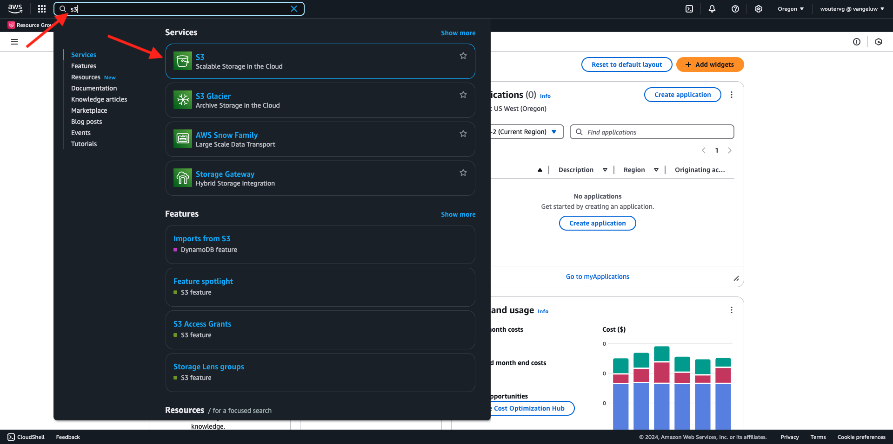
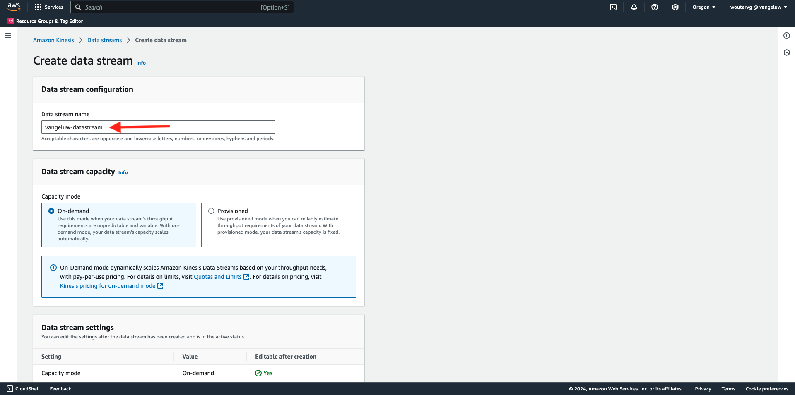
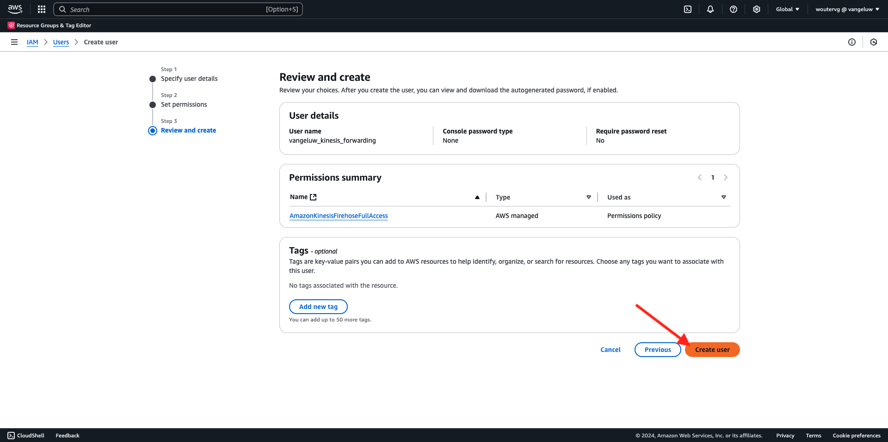

# 2.5.5 Transfert d’événements vers AWS Kinesis et AWS S3

>[!IMPORTANT]
>
>L’exécution de cet exercice est facultative et l’utilisation d’AWS Kinesis engendre des frais. Bien qu’AWS fournisse un compte de niveau gratuit qui vous permet de tester et de configurer de nombreux services sans frais, AWS Kinesis ne fait pas partie de ce compte de niveau libre. Ainsi, pour mettre en oeuvre et tester cet exercice, l’utilisation d’AWS Kinesis implique un coût.

## Bon à savoir

Adobe Experience Platform prend en charge divers services Amazon en tant que destination.
Kinesis et S3 sont toutes deux [des destinations d’exportation de profil](https://experienceleague.adobe.com/docs/experience-platform/destinations/destination-types.html?lang=en) et peuvent être utilisées dans le cadre de Adobe Experience Platform Real-Time CDP.
Vous pouvez facilement alimenter vos systèmes de choix en événements de segment à valeur élevée et en attributs de profil associés.

Au cours de cet exercice, vous allez apprendre à configurer votre propre flux Amazon Kinesis pour diffuser en continu des données d’événement provenant de l’écosystème Adobe Experience Platform Edge vers une destination de stockage dans le cloud, telle qu’Amazon S3. Cela s’avère utile si vous souhaitez collecter des événements d’expérience à partir de propriétés web et mobiles et les envoyer dans votre lac de données pour analyse et création de rapports opérationnels. En règle générale, les jeux de données ingèrent les données par lots avec de grands imports de fichiers quotidiens. Ils n’exposent pas le point de terminaison http public qui peut être utilisé avec le transfert d’événement.

La prise en charge des cas d’utilisation ci-dessus implique que les données en flux continu doivent être mises en mémoire tampon ou placées dans une file d’attente avant d’être écrites dans un fichier. Il faut prendre soin de ne pas ouvrir le fichier pour l’accès en écriture sur plusieurs processus. Déléguer cette tâche à un système dédié est idéal pour une bonne mise à l’échelle tout en assurant un niveau de service optimal, c’est là que Kinesis vient à la rescousse.

Les flux de données Kinesis d’Amazon se concentrent sur l’ingestion et le stockage des flux de données. Kinesis Data Firehose se concentre sur la diffusion de flux de données vers des destinations sélectionnées, telles que des compartiments S3.

Dans le cadre de cet exercice, vous allez...

- Exécution d’une configuration de base d’un flux de données Kinesis
- Créer un flux de diffusion Firehose et utiliser le compartiment S3 comme destination
- Configurer la passerelle API Amazon comme point d’entrée de l’api REST pour recevoir vos données d’événement
- Transfert des données d’événement brutes d’Edge vers votre flux Kinesis

## Configuration du compartiment AWS S3

Accédez à [https://console.aws.amazon.com](https://console.aws.amazon.com) et connectez-vous avec votre compte Amazon.

Une fois connecté, vous serez redirigé vers la **console de gestion AWS**.

Dans le menu **Find Services**, recherchez **s3**. Cliquez sur le premier résultat de la recherche : **S3 - Stockage évolutif dans le cloud**.

Vous verrez ensuite la page d’accueil **Amazon S3**. Cliquez sur **Créer un compartiment**.

Dans l&#39;écran **Créer un compartiment**, vous devez configurer deux éléments :

- Nom : utilisez le nom `eventforwarding---aepUserLdap--`.

Conservez tous les autres paramètres par défaut tels quels. Faites défiler l’écran vers le bas et cliquez sur **Créer un compartiment**.

Votre compartiment sera alors créé et redirigé vers la page d’accueil d’Amazon S3.

## Configuration de votre flux de données Kinesis AWS

Dans le menu **Find Services**, recherchez **kinesis**. Cliquez sur le premier résultat de la recherche : **Kinesis - Work with Real-Time Streaming Data**.

Sélectionnez **Flux de données Kinesis**. Cliquez sur **Créer un flux de données**.

Pour le **nom du flux de données**, utilisez `--aepUserLdap---datastream`.

Il n’est pas nécessaire de modifier les autres paramètres. Faites défiler l’écran vers le bas et cliquez sur **Créer un flux de données**.

Vous verrez alors ceci. Une fois votre flux de données créé, vous pouvez passer à l’exercice suivant.

## Configuration du flux de diffusion AWS Firehose

Dans le menu **Find Services**, recherchez **kinesis**. Cliquez sur **Kinesis Data Firehose**.

Cliquez sur **Créer un flux Firehose**.

Pour **Source**, sélectionnez **Flux de données Amazon Kinesis**. Pour **Destination**, sélectionnez **Amazon S3**. Cliquez sur **Parcourir** pour sélectionner votre flux de données.

Sélectionnez votre flux de données. Cliquez sur **Choose**.

Vous verrez alors ceci. Souvenez-vous du **nom de flux Firehose**, car vous en aurez besoin plus tard.

Faites défiler l’écran vers le bas jusqu’à ce que vous voyiez **Paramètres de destination**. Cliquez sur **Parcourir** pour sélectionner votre compartiment S3.

Sélectionnez votre compartiment S3 et cliquez sur **Choose**.

Vous verrez alors quelque chose comme ça. Mettez à jour les paramètres suivants :

- Nouveau délimiteur de ligne : défini sur **Enabled**
- Partitionnement dynamique : défini sur **Non activé**

Faites défiler un peu plus vers le bas et cliquez sur **Créer un flux Firehose**

Au bout de quelques minutes, votre flux Firehose sera créé et **Active**.

## Créer un utilisateur IAM

Dans le menu AWS IAM de gauche, cliquez sur **Users**. L’écran **Utilisateurs** s’affiche alors. Cliquez sur **Créer un utilisateur**.

Configurez ensuite votre utilisateur :

- Nom d’utilisateur : utilisez `--aepUserLdap--_kinesis_forwarding`

Cliquez sur **Suivant**.

Cet écran des autorisations s’affiche alors. Cliquez sur **Joindre directement des stratégies**.

Saisissez le terme de recherche **kinesisfirehose** pour afficher toutes les stratégies associées. Sélectionnez la stratégie **AmazonKinesisFirehoseFullAccess**. Faites défiler l’écran vers le bas et cliquez sur **Suivant**.

Vérifiez votre configuration. Cliquez sur **Créer un utilisateur**.

Vous verrez alors ceci. Cliquez sur **Afficher l’utilisateur**.

Cliquez sur **Ajouter des autorisations** et cliquez sur **Créer une stratégie intégrée**.

Vous verrez alors ceci. Sélectionnez le service **Kinesis**.

Accédez à **Write** et cochez la case **PutRecord**.

Faites défiler l’écran jusqu’à **Resources** et sélectionnez **All**. Cliquez sur **Suivant**.

Nommez votre clé de stratégie comme suit : **Kinesis_PutRecord** et cliquez sur **Créer une stratégie**.

Vous verrez alors ceci. Cliquez sur **Informations d’identification de sécurité**.

Cliquez sur **Créer une clé d’accès**.

Sélectionnez **Application s’exécutant en dehors d’AWS**. Faites défiler l’écran vers le bas et cliquez sur **Suivant**.

Cliquez sur **Créer une clé d’accès**

Vous verrez alors ceci. Cliquez sur **Afficher** pour afficher votre clé d’accès secrète :

Votre **clé d’accès secrète** s’affiche maintenant.

>[!IMPORTANT]
>
>Stockez vos informations d’identification dans un fichier texte sur votre ordinateur.
>
> - Accéder à l’ID de clé : ...
> - Clé d’accès secrète : ...
>
> Une fois que vous avez cliqué sur **Terminé**, vous ne verrez plus jamais vos informations d’identification !

Cliquez sur **Terminé**.

Vous avez maintenant créé un utilisateur IAM avec les autorisations appropriées, que vous devrez spécifier lors de la configuration de l’extension AWS dans votre propriété Event Forwarding.

## Mettez à jour la propriété Event Forwarting : Extension

Une fois votre secret et votre élément de données configurés, vous pouvez configurer l’extension pour Google Cloud Platform dans votre propriété Event Forwarding.

Accédez à [https://experience.adobe.com/#/data-collection/](https://experience.adobe.com/#/data-collection/), accédez à **Event Forwarding** et ouvrez votre propriété Event Forwarding.

Ensuite, accédez à **Extensions**, à **Catalogue**. Cliquez sur l’extension **AWS** et cliquez sur **Installer**.

Saisissez les informations d’identification d’utilisateur IAM que vous avez générées lors de l’exercice précédent. Cliquez sur **Enregistrer**.

Ensuite, vous devez configurer une règle qui commence à transférer les données d’événement vers Kinesis.

## Mettez à jour la propriété Event Forwarting : Rule

Dans le menu de gauche, accédez à **Règles**. Cliquez pour ouvrir la règle **Toutes les pages** que vous avez créée dans l’un des exercices précédents.

Vous verrez alors ceci. Cliquez sur l’icône **+** pour ajouter une nouvelle action.

Vous verrez alors ceci. Effectuez la sélection suivante :

- Sélectionnez l’ **extension** : **AWS**
- Sélectionnez le **type d’action** : **envoyer des données au flux de données Kinesis**
- Nom : **AWS - Send Data to Kinesis Data Stream**

Vous devriez maintenant voir ceci :

Configurez ensuite les éléments suivants :

- Nom du flux : `--aepUserLdap---datastream`
- Région AWS : vérifiez votre région dans la configuration du flux de données AWS
- Clé de partition : **0**

Vous pouvez voir votre région AWS ici :

Vous devriez maintenant avoir ceci. Cliquez ensuite sur l’icône de l’élément de données pour le champ **Data** .

Sélectionnez **XDM Event** et cliquez sur **Select**.

Vous aurez alors ceci. Cliquez sur **Conserver les modifications**.

Vous verrez alors ceci. Cliquez sur **Enregistrer**.

Accédez à **Flux de publication** pour publier vos modifications.
Ouvrez votre bibliothèque de développement en cliquant sur **Main**.

Cliquez sur le bouton **Ajouter toutes les ressources modifiées**, après lequel vos modifications de règle et d’élément de données apparaîtront dans cette bibliothèque. Cliquez ensuite sur **Enregistrer et créer pour le développement**. Vos modifications sont en cours de déploiement.

Au bout de quelques minutes, vous verrez que le déploiement est terminé et prêt à être testé.

## Tester votre configuration

Accédez à [https://dsn.adobe.com](https://dsn.adobe.com). Une fois connecté avec votre Adobe ID, vous verrez ceci. Cliquez sur les 3 points **...** dans le projet de votre site web, puis cliquez sur **Exécuter** pour l’ouvrir.

Vous verrez alors votre site web de démonstration ouvert. Sélectionnez l’URL et copiez-la dans le presse-papiers.

Ouvrez une nouvelle fenêtre de navigateur incognito.

Collez l’URL de votre site web de démonstration, que vous avez copiée à l’étape précédente. Vous serez alors invité à vous connecter à l’aide de votre Adobe ID.

Sélectionnez le type de compte et procédez à la connexion.

Votre site web est alors chargé dans une fenêtre de navigateur incognito. Pour chaque exercice, vous devrez utiliser une fenêtre de navigateur incognito actualisée pour charger l’URL de votre site web de démonstration.

Passez votre vue en **AWS**. En ouvrant votre flux de données et en accédant à l’onglet **Surveillance**, vous verrez désormais le trafic entrant.

Lorsque vous ouvrez ensuite votre flux de Data Firehose et accédez à l’onglet **Surveillance** , vous verrez également le trafic entrant.

Enfin, lorsque vous examinez votre compartiment S3, vous remarquerez désormais que des fichiers y sont créés en raison de votre ingestion de données.

Lorsque vous téléchargez un tel fichier et l’ouvrez à l’aide d’un éditeur de texte, vous verrez qu’il contient la charge utile XDM des événements qui ont été transférés.

>[!IMPORTANT]
>
>Une fois que votre configuration fonctionne comme prévu, n’oubliez pas d’activer vos AWS Kinesis Data Stream et Data Firehose pour éviter d’être chargés.

Étape suivante : [Résumé et avantages](./summary.md)

[Revenir au module 2.5](./aep-data-collection-ssf.md)

[Revenir à tous les modules](./../../../overview.md)
