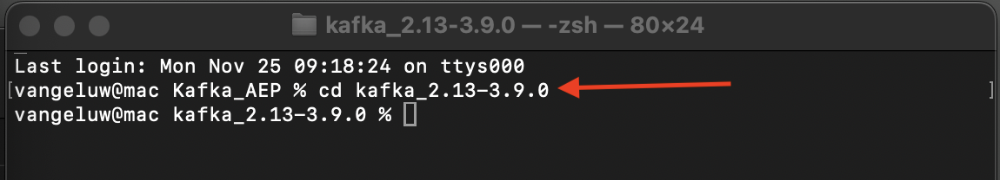
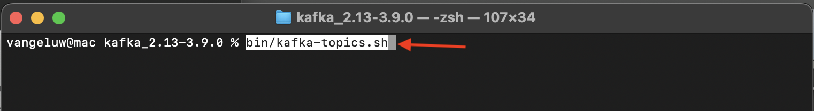
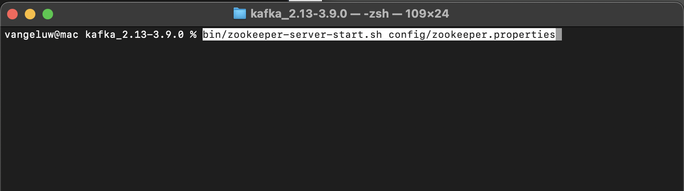
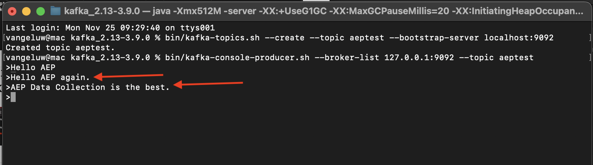

# 2.6.2 Installation et configuration de votre grappe Kafka

## 2.6.2.1 Téléchargement d’Apache Kafka

Accédez à [https://kafka.apache.org/downloads](https://kafka.apache.org/downloads) et téléchargez la dernière version publiée. Sélectionnez la dernière version binaire, ici **Scala 2.13**.

Vous êtes alors amené sur un site miroir. Cliquez sur le lien proposé pour télécharger Kafka.

Créez un dossier nommé **Kafka_AEP** sur votre bureau et placez le fichier téléchargé dans ce répertoire.

Ouvrez une fenêtre **Terminal** en cliquant avec le bouton droit de la souris sur votre dossier et en cliquant sur **Nouveau terminal dans le dossier**.

Exécutez cette commande dans la fenêtre Terminal pour décompresser le fichier téléchargé :

`tar -xvf kafka_2.13-3.1.0.tgz`

>[!NOTE]
>
>Vérifiez que la commande ci-dessus correspond à la version du fichier que vous avez téléchargé. Si votre version est plus récente, vous devrez mettre à jour la commande ci-dessus pour qu’elle corresponde à cette version.

Vous verrez alors :

Après avoir décompressé ce fichier, vous disposez désormais d’un répertoire comme celui-ci :

Et dans ce répertoire, vous verrez ces sous-répertoires :

Revenez à la fenêtre de votre terminal. Saisissez la commande suivante :

`cd kafka_2.13-3.1.0`

>[!NOTE]
>
>Vérifiez que la commande ci-dessus correspond à la version du fichier que vous avez téléchargé. Si votre version est plus récente, vous devrez mettre à jour la commande ci-dessus pour qu’elle corresponde à cette version.

Saisissez ensuite la commande `bin/kafka-topics.sh`.

Vous devriez alors voir cette réponse. Cela signifie que Kafka est correctement installé et que Java fonctionne correctement. (Rappel : pour que cela fonctionne, Java 8 JDK ou Java 11 JDK doit être installé. Vous pouvez voir quelle version Java vous avez installée à l’aide de la commande `java -version`.)

## 2.6.2.2 Kafka de démarrage

Pour démarrer Kafka, vous devez démarrer Kafka Zookeeper et Kafka, dans cet ordre.

Ouvrez une fenêtre **Terminal** en cliquant avec le bouton droit de la souris sur votre dossier **kafka_2.13-3.1.0** et en cliquant sur **Nouveau terminal dans le dossier**.

Saisissez la commande suivante :

`bin/zookeeper-server-start.sh config/zookeeper.properties`

Vous verrez alors :

Gardez cette fenêtre ouverte pendant que vous passez par ces exercices !

Ouvrez une autre nouvelle fenêtre **Terminal** en cliquant avec le bouton droit de la souris sur votre dossier **kafka_2.13-3.1.0** et en cliquant sur **Nouveau terminal dans le dossier**.

Saisissez la commande suivante :

`bin/kafka-server-start.sh config/server.properties`

Vous verrez alors :

Gardez cette fenêtre ouverte pendant que vous passez par ces exercices !

## 2.6.2.3 Création d’une rubrique Kafka

Ouvrez une fenêtre **Terminal** en cliquant avec le bouton droit de la souris sur votre dossier **kafka_2.13-3.1.0** et en cliquant sur **Nouveau terminal dans le dossier**.

Saisissez cette commande pour créer une nouvelle rubrique Kafka nommée **aeptest**. Cette rubrique sera utilisée à des fins de test dans cet exercice.

`bin/kafka-topics.sh --create --topic aeptest --bootstrap-server localhost:9092`

Une confirmation similaire s’affiche alors :

Saisissez cette commande pour créer une nouvelle rubrique Kafka nommée **aep**. Cette rubrique sera utilisée par le connecteur Adobe Experience Platform Sink que vous allez configurer dans les exercices suivants.

`bin/kafka-topics.sh --create --topic aep --bootstrap-server localhost:9092`

Une confirmation similaire s’affiche alors :

## 2.6.2.4 Générer des événements

Revenez à la fenêtre Terminal dans laquelle vous avez créé votre première rubrique Kafka et saisissez la commande suivante :

`bin/kafka-console-producer.sh --broker-list 127.0.0.1:9092 --topic aeptest`

Vous verrez alors ceci. Chaque nouvelle ligne suivie d’un bouton Entrée entraîne l’envoi d’un nouveau message dans la rubrique **aeptest**.

Saisissez `Hello AEP` et appuyez sur Entrée. Votre premier événement a maintenant été envoyé dans votre instance Kafka locale, dans la rubrique **aeptest**.

Saisissez `Hello AEP again.` et appuyez sur Entrée.

Saisissez `AEP Data Collection is the best.` et appuyez sur Entrée.

Vous avez maintenant généré 3 événements dans la rubrique **aeptest**. Ces événements peuvent désormais être utilisés par une application qui peut avoir besoin de ces données.

Sur votre clavier, cliquez simultanément sur `Control` et `C` pour fermer votre producteur.

## 2.6.2.4 Consommer des événements

Dans la fenêtre Terminal que vous utilisiez pour générer des événements, saisissez la commande suivante :

`bin/kafka-console-consumer.sh --bootstrap-server 127.0.0.1:9092 --topic aeptest --from-beginning`

Vous verrez alors tous les messages qui ont été générés dans l’exercice précédent pour la rubrique **aeptest**, apparaître dans le consommateur. Voici comment fonctionne Apache Kafka : un producteur crée des événements dans un pipeline, et un consommateur consomme ces événements.

Sur votre clavier, cliquez simultanément sur `Control` et `C` pour fermer votre producteur.

Dans cet exercice, vous avez passé en revue tous les principes de base pour configurer une grappe Kafka locale, créer un sujet Kafka, produire des événements et consommer des événements.

L’objectif de ce module est de simuler ce qui se passerait si une véritable organisation avait déjà mis en oeuvre une grappe Apache Kafka et souhaitait diffuser des données de sa grappe Kafka vers Adobe Experience Platform.

Pour faciliter une telle mise en oeuvre, un connecteur Adobe Experience Platform Sink a été créé et peut être mis en oeuvre à l’aide de Kafka Connect. Vous trouverez la documentation de ce connecteur Adobe Experience Platform Sink ici : [https://github.com/adobe/experience-platform-streaming-connect](https://github.com/adobe/experience-platform-streaming-connect).

Dans les exercices suivants, vous allez mettre en oeuvre tout ce dont vous avez besoin pour utiliser ce connecteur Adobe Experience Platform Sink depuis votre propre grappe Kafka locale.

Fermez la fenêtre de votre terminal.

Vous avez terminé cet exercice.

Étape suivante : [2.6.3 Configuration du point d’entrée de l’API HTTP dans Adobe Experience Platform](./ex3.md)

[Revenir au module 2.6](./aep-apache-kafka.md)

[Revenir à tous les modules](../../../overview.md)
