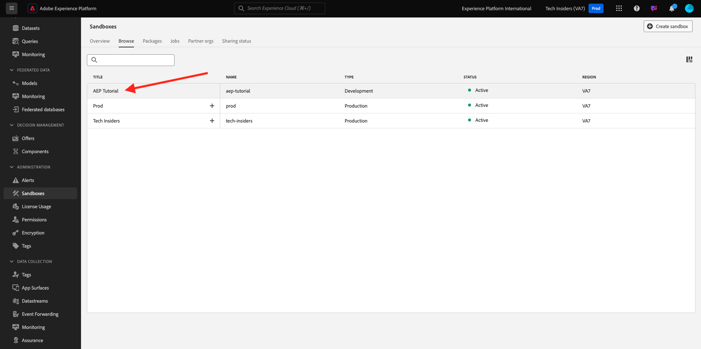
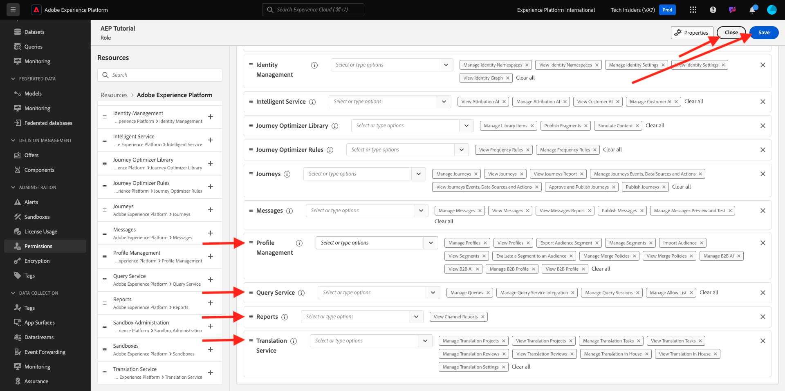
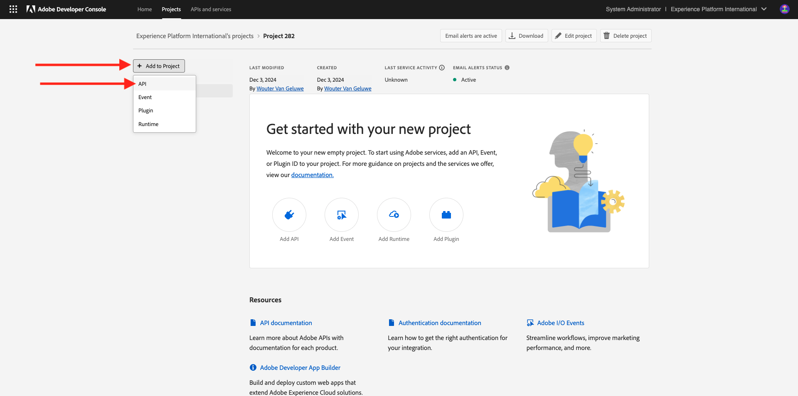
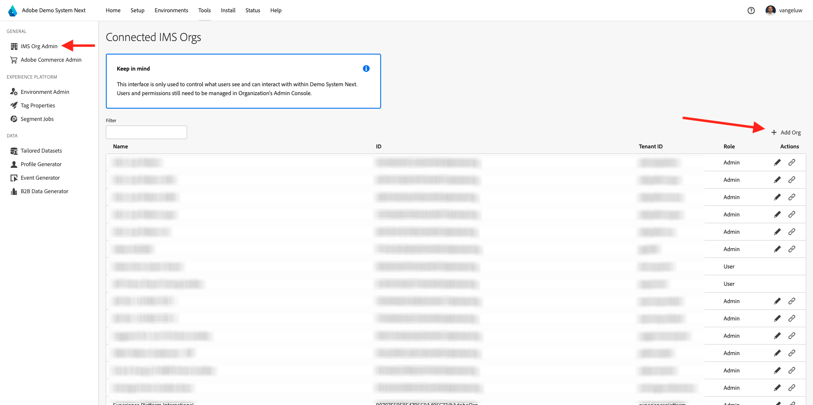

# Configuration

>[!IMPORTANT]
>
>Cette page est destinée uniquement aux rôles d’administrateur système. Vous avez besoin des droits d’accès Administrateur système pour que votre instance spécifique puisse suivre les étapes ci-dessous. Si vous n’êtes pas administrateur système de votre organisation Adobe Experience Cloud, contactez votre administrateur système et demandez-lui d’approuver et d’aider avant de passer à l’une des étapes ci-dessous.

## Vue d’ensemble

Pour mettre en pratique tous ces tutoriels, les applications Adobe Experience Cloud suivantes doivent être configurées dans votre organisation IMS :

- Adobe de la plateforme CDP en temps réel
- Collecte de données dʼAdobe Experience Platform
- Adobe Journey Optimizer
- Customer Journey Analytics
- Data Distiller
- Composition d’audiences fédérées

Si un service d’application spécifique n’est pas configuré pour votre organisation IMS, vous ne pourrez pas effectuer cet exercice pratique.

## Créer un environnement de test

Pour passer en revue le tutoriel dans votre propre instance AEP, il est conseillé de commencer par configurer un nouvel environnement de test de développement. Pour créer un nouvel environnement de test, accédez à [https://experience.adobe.com/platform](https://experience.adobe.com/platform), aux environnements de test, puis à **Parcourir**. Cliquez sur **Créer un environnement de test**.

Créez votre environnement de test comme suit :

- Type : **Développement**
- Nom : **aep-tutorial**
- Titre : **Tutoriel AEP**

Cliquez sur **Créer**.

Votre environnement de test va maintenant être créé. Au bout de quelques minutes, vous verrez ceci.

## Configuration des autorisations

Accédez à **Permissions**, puis à **Roles**.

Cliquez pour ouvrir le **rôle** spécifique qui sera utilisé par les apprenants qui suivront ce tutoriel. Cliquez sur **Créer un rôle**.

Donnez un nom à votre rôle, par exemple **Tutoriel AEP**, cliquez sur **Confirmer**.

Dans le menu déroulant **Sandbox**, sélectionnez l’environnement de test que vous venez de créer et assurez-vous de supprimer tout autre environnement de test (supprimez également **Prod**).

Ajoutez les différentes ressources et définissez les autorisations. Veillez à ne pas ajouter d’autorisations pour **Sandbox Administration**.

Ajoutez d’autres ressources comme indiqué et définissez les autorisations.

Ajoutez d’autres ressources comme indiqué et définissez les autorisations. Cliquez sur **Enregistrer**. Cliquez ensuite sur **Fermer**.

## Configuration de l’Adobe I/O

Accédez à
[https://developer.adobe.com/console/integrations](https://developer.adobe.com/console/integrations). Vérifiez que vous vous trouvez dans la bonne instance. Cliquez sur **Créer un projet**.

Cliquez sur **+ Ajouter au projet**, puis sur **API**.

Cliquez sur **Adobe Experience Platform**, puis activez **API Experience Platform**. Cliquez sur **Suivant**.

Pour le **nom d’identification**, utilisez le **tutoriel DSN AEP**. Cliquez sur **Suivant**.

Sélectionnez l’un des profils de produit disponibles. Ce profil de produit ne détermine pas les autorisations pour ce projet d’Adobe I/O. Cette opération sera effectuée à l’étape suivante. Cliquez sur **Enregistrer l’API configurée**.

Cliquez sur **+ Ajouter au projet**, puis de nouveau sur **API**.

Cliquez sur **Adobe Experience Platform**, puis activez **API Experience Platform Launch**. Cliquez sur **Suivant**.

Cliquez sur **Suivant**.

Sélectionnez un profil de produit qui permet de créer et de gérer des propriétés de collecte de données. Cliquez sur **Enregistrer l’API configurée**.

Vous verrez alors ceci. Cliquez sur le nom actuel du **Projet XXX**.

Cliquez sur **Modifier le projet**.

Saisissez un nouveau **Titre du projet**, tel que **Tutoriel AEP DSN**. Cliquez sur **Enregistrer**.

Votre projet d’Adobe I/O est maintenant prêt.

## Lier le projet Adobe I/O au rôle

Accédez à **Permissions**, à **Roles**, puis cliquez sur le nouveau rôle que vous avez créé précédemment.

Accédez à **Informations d’identification de l’API**. Cliquez sur **+ Ajouter les informations d’identification d’API**.

Vous verrez ensuite les informations d’identification d’Adobe I/O que vous avez créées à l’étape précédente. Sélectionnez-le et cliquez sur **Enregistrer**.

Votre projet Adobe I/O est maintenant configuré avec les autorisations requises pour accéder aux API Adobe Experience Platform.

>[!IMPORTANT]
>
>Vous devez attendre au moins 10 minutes avant de poursuivre les étapes suivantes dans Demo System Next.

## Configuration de votre environnement dans Demo System Next

Accédez à [https://dsn.adobe.com/tools/org-admin](https://dsn.adobe.com/tools/org-admin). Cliquez sur **+ Ajouter une organisation**.

Renseignez les champs requis :

- Identifiant de l’organisation IMS
- Nom
- ID de tenant (n’incluez pas de **trait de soulignement**)
- Région

Votre administrateur système doit pouvoir vous aider à définir les valeurs de ces champs.

Cliquez sur **Enregistrer**.

Votre environnement fera désormais partie de la liste. Recherchez-le dans la liste et cliquez sur l&#39;icône **link** .

Vous devez maintenant saisir les valeurs que vous avez créées dans le cadre des informations d’identification de votre projet Adobe I/O. Vous trouverez **Client ID**, **Client Secret** et **Portées** ici :

**ID du compte technique** :

Copiez-collez-les ici, cliquez sur **Enregistrer**.

Votre environnement DSN est maintenant configuré correctement.

## Configuration de votre accès à l’environnement du DSN

Accédez à [https://dsn.adobe.com/tools/environment-admin](https://dsn.adobe.com/tools/environment-admin). Sélectionnez l’organisation IMS que vous venez de créer, sélectionnez votre utilisateur, puis cliquez sur **+ Attribuer** sous **Environnements de test**.

Saisissez le **nom sandbox** que vous avez défini à la première étape ci-dessus. Il doit ressembler à ceci :

- Nom : **aep-tutorial**

Cliquez sur **Confirmer**.

Votre environnement de test est désormais disponible pour l’utilisateur que vous avez sélectionné.

## Configuration rapide du DSN

Accédez à [https://dsn.adobe.com/quick-setup](https://dsn.adobe.com/quick-setup). Ouvrez le menu déroulant **Environnement** et sélectionnez votre organisation IMS/sandbox.

Pour **Configuration**, sélectionnez **Global v2.0**.

Faites défiler l’écran jusqu’à **Industry - Telco** et sélectionnez **Citi Signal - Advanced**.

Faites défiler l’écran vers le haut et cliquez sur **Démarrer**.

Saisissez un **Titre** et cliquez sur **Démarrer**.

>[!NOTE]
>
>Vous pouvez obtenir des erreurs si aucune stratégie de fusion par défaut n’a été créée dans l’environnement de test. Si tel est le cas, attendez un peu plus que la stratégie de fusion soit créée automatiquement ou accédez manuellement à Adobe Experience Platform, à Profils > Stratégies de fusion et créez une nouvelle stratégie de fusion par défaut.

Vous verrez ensuite la progression de l’installation en cours, qui prendra quelques minutes.

Une fois que tout a été terminé, votre instance AEP est correctement configurée et prête pour que les apprenants puissent suivre le tutoriel.

>[!NOTE]
>
>L’étape Importation de données n’est pas utilisée par le tutoriel. Par conséquent, si cette étape échoue, ne vous inquiétez pas et continuez.

Accédez à [https://experience.adobe.com/platform](https://experience.adobe.com/platform), à **Jeux de données**. Vous devriez maintenant voir une liste similaire de jeux de données, qui ont tous été créés par la configuration rapide du DSN.

>[!NOTE]
>
>Merci d’investir votre temps à apprendre tout ce qu’il y a à savoir sur Adobe Experience Platform et ses applications. Si vous avez des questions, si vous souhaitez partager les commentaires généraux d’avoir des suggestions sur le contenu futur, contactez directement les initiés de technologie, en envoyant un email à **techinsiders@adobe.com**.

[Revenir à tous les modules](./overview.md)