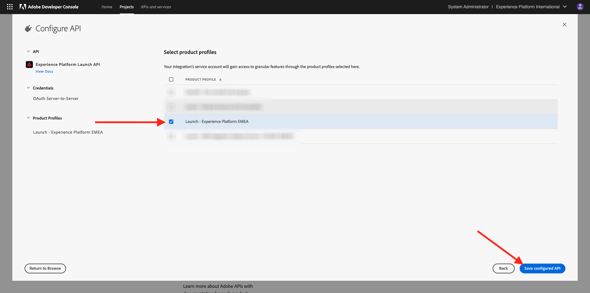
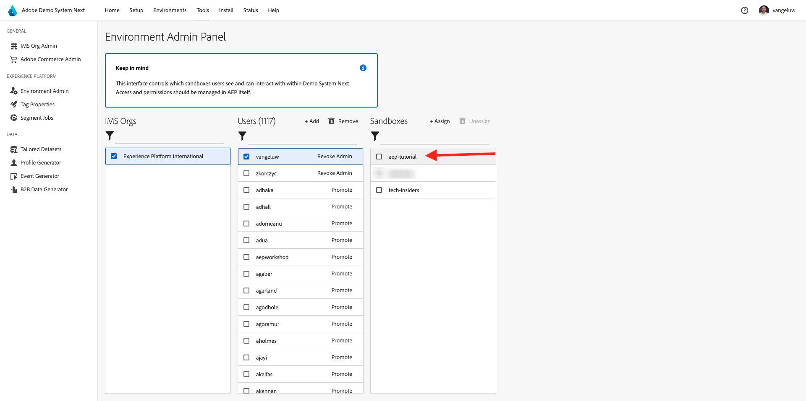

# Configurer votre instance Adobe Experience Platform

>[!IMPORTANT]
>
>Cette page est réservée aux rôles d&#39;administrateur système. Vous avez besoin de droits d’accès d’administrateur système pour votre instance spécifique afin de pouvoir suivre les étapes ci-dessous. Si vous n’êtes pas administrateur système dans votre organisation Adobe Experience Cloud, contactez votre administrateur système et demandez-lui son approbation et son aide avant de suivre l’une des étapes ci-dessous.

## Vue d’ensemble

Pour suivre tous ces tutoriels de manière pratique, les applications Adobe Experience Cloud suivantes doivent être configurées dans votre organisation IMS :

- Adobe Real-Time CDP
- Collecte de données dʼAdobe Experience Platform
- Adobe Journey Optimizer
- Customer Journey Analytics
- Data Distiller
- Composition d’audiences fédérées

Si un service d’application spécifique n’est pas configuré pour votre organisation IMS, vous ne pourrez pas mener cet exercice spécifique de manière pratique.

## Créer un sandbox

Pour parcourir le tutoriel dans votre propre instance de Adobe Experience Platform, il est conseillé de configurer d’abord un nouveau sandbox de développement. Pour créer un nouveau sandbox, accédez à [https://experience.adobe.com/platform](https://experience.adobe.com/platform) à Sandbox , puis à **Parcourir**. Cliquez sur **Créer un sandbox**.

Créez votre sandbox comme suit :

- Type : **Développement**
- Nom : **aep-tutorial**
- Titre : **Tutoriel Adobe Experience Platform**

Cliquez sur **Créer**.

Votre sandbox sera maintenant créé. Au bout de quelques minutes, vous verrez ceci.

## Autorisations de configuration

Accédez à **Autorisations**, puis à **Rôles**.

Cliquez pour ouvrir le **Rôle** spécifique qui sera utilisé par les élèves qui suivront ce tutoriel. Cliquez sur **Créer un rôle**.

Donnez à votre rôle un nom du type **Tutoriel Adobe Experience Platform**, puis cliquez sur **Confirmer**.

Dans le menu déroulant **Sandbox**, sélectionnez le sandbox que vous venez de créer et assurez-vous de supprimer tout autre sandbox (supprimez également **Prod**).

Ajoutez les différentes ressources et définissez les autorisations. Veillez à ne pas ajouter d’autorisations pour **Sandbox Administration**.

Ajoutez d’autres ressources comme indiqué et définissez des autorisations.

Ajoutez d’autres ressources comme indiqué et définissez des autorisations. Cliquez sur **Enregistrer**. Cliquez ensuite sur **Fermer**.

## Configurer l’Adobe I/O

Accéder à
[https://developer.adobe.com/console/integrations](https://developer.adobe.com/console/integrations). Vérifiez que vous vous trouvez dans la bonne instance. Cliquez sur **Créer un projet**.

Cliquez sur **Ajouter au projet** puis sur **API**.

Cliquez sur **Adobe Experience Platform** puis activez **l’API Experience Platform**. Cliquez sur **Suivant**.

Pour le **Nom d’identification**, utilisez **Tutoriel DSN AEP**. Cliquez sur **Suivant**.

Sélectionnez l’un des profils de produit disponibles. Ce profil de produit ne détermine pas les autorisations pour ce projet d’Adobe I/O. Cette opération sera effectuée à l’étape suivante. Cliquez sur **Enregistrer l’API configurée**.

Cliquez sur **Ajouter au projet** puis de nouveau sur **API**.

Cliquez sur **Adobe Experience Platform** puis activez **l’API Experience Platform Launch**. Cliquez sur **Suivant**.

Cliquez sur **Suivant**.

Sélectionnez un profil de produit qui permet de créer et de gérer des propriétés de collecte de données. Cliquez sur **Enregistrer l’API configurée**.

Tu verras ça. Cliquez sur le nom actuel **Projet XXX**.

Cliquez sur **Modifier le projet**.

Saisissez un nouveau **Titre du projet**, tel que **Tutoriel DSN Adobe Experience Platform**. Cliquez sur **Enregistrer**.

Votre projet d’Adobe I/O est maintenant prêt.

## Lier le projet d&#39;Adobe I/O au rôle

Accédez à **Autorisations**, à **Rôles** puis cliquez sur le nouveau rôle que vous avez créé précédemment.

Accédez à **Informations d’identification de l’API**. Cliquez sur **+ Ajouter des informations d’identification d’API**.

Vous verrez ensuite les informations d’identification d’Adobe I/O que vous avez créées à l’étape précédente. Sélectionnez-le et cliquez sur **Enregistrer**.

Votre projet d’Adobe I/O est maintenant configuré avec les autorisations requises pour accéder aux API de Adobe Experience Platform.

>[!IMPORTANT]
>
>Vous devez attendre un minimum de 10 minutes avant de passer aux étapes suivantes dans Système de démonstration Suivant.

## Configuration de votre environnement dans le système de démonstration Suivant

Accédez à [https://dsn.adobe.com/tools/org-admin](https://dsn.adobe.com/tools/org-admin). Cliquez sur **+ Ajouter une organisation**.

Renseignez les champs requis :

- Identifiant de l’organisation IMS
- Nom
- ID de client (n’incluez aucun **trait de soulignement**)
- Région

Votre administrateur système doit pouvoir vous aider à définir les valeurs de ces champs.

Cliquez sur **Enregistrer**.

Votre environnement fait désormais partie de la liste. Recherchez-le dans la liste et cliquez sur l’icône **lien**.

Vous devez maintenant saisir les valeurs que vous avez créées dans le cadre des informations d’identification de votre projet d’Adobe I/O. Vous trouverez **ID client**, **Secret client** et **Portées** ici :

**Identifiant de compte technique** :

Copiez et collez-les ici, puis cliquez sur **Enregistrer**.

Votre environnement DSN est maintenant correctement configuré.

## Configurer votre accès à l’environnement DSN

Accédez à [https://dsn.adobe.com/tools/environment-admin](https://dsn.adobe.com/tools/environment-admin). Sélectionnez l’organisation IMS que vous venez de créer, sélectionnez votre utilisateur, puis cliquez sur **+ Attribuer** sous **Sandbox**.

Saisissez le **Nom du sandbox** que vous avez défini à la première étape ci-dessus. Il doit ressembler à ceci :

- Nom : **aep-tutorial**

Cliquez sur **Confirmer**.

Votre sandbox est maintenant disponible pour l’utilisateur que vous avez sélectionné.

## Configuration rapide DSN

Accédez à [https://dsn.adobe.com/quick-setup](https://dsn.adobe.com/quick-setup). Ouvrez le menu déroulant **Environnement** et sélectionnez votre organisation IMS/sandbox.

Pour **Configuration**, sélectionnez **Global v2.0**.

Faites défiler jusqu’à **Industry - Telco** et sélectionnez **Citi Signal - Advanced**.

Faites défiler vers le haut et cliquez sur **Démarrer**.

Saisissez un **Titre** et cliquez sur **Démarrer**.

>[!NOTE]
>
>Vous risquez d’obtenir des erreurs si aucune politique de fusion par défaut n’a été créée dans le sandbox. Si c’est le cas, attendez un peu plus longtemps que la politique de fusion soit créée automatiquement ou accédez manuellement à Profils > Politiques de fusion dans Adobe Experience Platform et créez une politique de fusion par défaut.

Vous verrez ensuite la progression de l’installation en cours, ce qui prendra quelques minutes.

Une fois que tout est terminé, votre instance Adobe Experience Platform est configurée avec succès et prête pour que les élèves suivent le tutoriel.

>[!NOTE]
>
>L’étape d’importation des données n’est pas utilisée par le tutoriel. Par conséquent, si cette étape échoue, ne vous inquiétez pas et continuez.

Accédez à [https://experience.adobe.com/platform](https://experience.adobe.com/platform), à **Jeux de données**. Vous devriez maintenant voir une liste similaire de jeux de données, qui ont tous été créés par la configuration rapide de DSN.

>[!NOTE]
>
>Merci d’avoir consacré votre temps à apprendre tout ce qu’il y a à savoir sur Adobe Experience Platform et ses applications. Si vous avez des questions, si vous souhaitez partager des commentaires généraux ou si vous avez des suggestions sur le contenu futur, veuillez contacter directement les initiés techniques, en envoyant un e-mail à **techinsiders@adobe.com**.

{width="50px" align="left"}

>[!NOTE]
>
>Si vous avez des questions, si vous souhaitez partager des commentaires généraux ou si vous avez des suggestions sur le contenu futur, veuillez contacter directement les initiés techniques, en envoyant un e-mail à **techinsiders@adobe.com**.

[Revenir à tous les modules](./overview.md)
