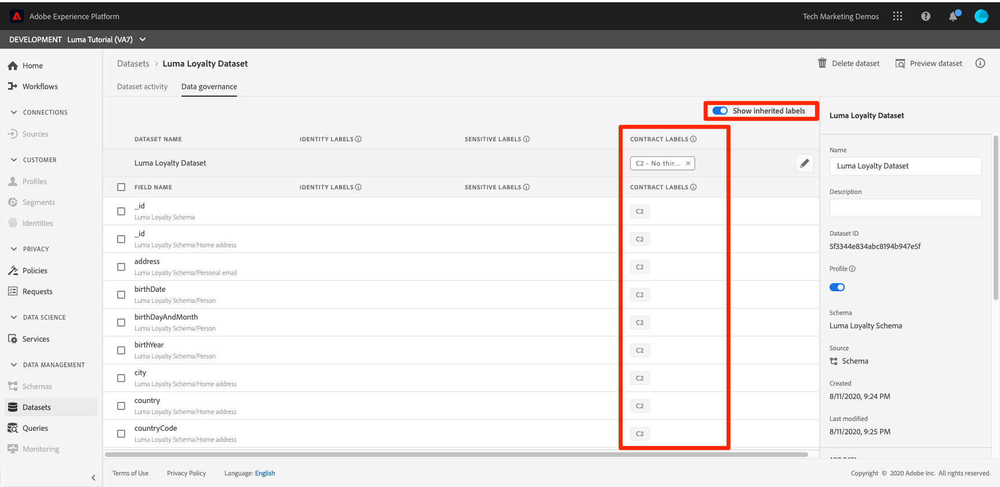

# Application de la structure de gouvernance des données

<!--15min-->

Dans cette leçon, vous appliquerez le cadre de gouvernance des données aux données que vous avez ingérées dans votre environnement de test.

La gouvernance des données d’Adobe Experience Platform vous permet de gérer les données clients et de garantir la conformité aux réglementations, aux restrictions et aux politiques applicables à l’utilisation des données. Il joue un rôle clé dans Experience Platform à différents niveaux, notamment en contrôlant l’utilisation des données.

Avant de commencer les exercices, regardez ces courtes vidéos sur la gouvernance des données :
>[!VIDEO](https://video.tv.adobe.com/v/36653?learn=on)

>[!VIDEO](https://video.tv.adobe.com/v/29708?learn=on)

<!--
## Permissions required

In the [Configure Permissions](configure-permissions.md) lesson, you set up all the access controls required to complete this lesson, specifically:

* Permission items **[!UICONTROL Data Governance]** > **[!UICONTROL Manage Usage Labels]**, **[!UICONTROL Manage Data Usage Policies]** and **[!UICONTROL View Data Usage Policies]**
* Permission items **[!UICONTROL Data Management]** > **[!UICONTROL View Datasets]** and **[!UICONTROL Manage Datasets]**
* Permission item **[!UICONTROL Sandboxes]** > `Luma Tutorial`
* User-role access to the `Luma Tutorial Platform` Product Profile
-->

## Scénario d’entreprise

Luma promet aux membres de son programme de fidélité que les données de fidélité ne seront partagées avec aucun tiers. Nous mettrons ce scénario en oeuvre dans le reste de la leçon.

## Application des étiquettes de gouvernance des données

La première étape du processus de gouvernance des données consiste à appliquer des étiquettes de gouvernance à vos données. Avant de procéder, examinons rapidement les étiquettes disponibles :

1. Dans l’interface utilisateur de Platform, sélectionnez **[!UICONTROL Stratégies]** dans le volet de navigation de gauche.
1. Accédez à l’onglet **[!UICONTROL Étiquettes]** pour afficher tous les libellés du compte.

Il existe de nombreuses étiquettes prêtes à l’emploi, et vous pouvez créer les vôtres à l’aide du bouton [!UICONTROL Créer une étiquette] . Il existe trois types principaux : [!UICONTROL Étiquettes Contrat], [!UICONTROL Étiquettes Identité] et [!UICONTROL Étiquettes Sensibles] qui correspondent à des raisons courantes pour lesquelles les données peuvent être restreintes. Chacune des étiquettes a un [!UICONTROL nom convivial] et un [!UICONTROL nom] court qui est simplement une abréviation du type et un nombre. Par exemple, l’étiquette [!DNL C1] est destinée à &quot;Aucun export tiers&quot;, ce dont nous avons besoin pour notre politique de fidélité.

Il est maintenant temps d&#39;étiqueter les données dont nous voulons restreindre l&#39;utilisation :

1. Dans l’interface utilisateur de Platform, sélectionnez **[!UICONTROL Jeux de données]** dans le volet de navigation de gauche.
1. Ouvrez le `Luma Loyalty Dataset`
1. Accédez à l’onglet **[!UICONTROL Gouvernance des données]**
1. Vous pouvez appliquer des libellés à des champs individuels ou à l’ensemble du jeu de données. Nous appliquerons le libellé au jeu de données entier. Cliquez sur l’icône en forme de crayon. Si vous ne voyez pas l’icône, essayez d’élargir votre navigateur ou faites défiler le panneau du milieu vers la droite.
   
1. Dans le modal, développez la section **[!UICONTROL Étiquettes Contrat]** et vérifiez l’étiquette **[!UICONTROL C2]**
1. Sélectionnez le bouton **[!UICONTROL Enregistrer les modifications]**
   
1. De retour à l’écran principal [!UICONTROL Gouvernance des données], avec l’option **[!UICONTROL Afficher les libellés hérités]** activée, vous pouvez voir comment l’étiquette a été appliquée à tous les champs du jeu de données.
   

<!--adding extra, unnecessary fields from field groups makes it harder to see which fields really need labels-->
<!--Are there any best practices for applying governance labels-->

## Création de stratégies de gouvernance des données

Maintenant que nos données sont étiquetées, nous pouvons créer une stratégie.

1. Dans l’interface utilisateur de Platform, sélectionnez **[!UICONTROL Stratégies]** dans le volet de navigation de gauche.
1. Dans l’onglet Parcourir, il existe déjà une stratégie d’usine appelée &quot;restriction d’exportation tierce&quot; qui associe l’étiquette C2 à l’action marketing [!UICONTROL Exporter vers un tiers], exactement ce dont nous avons besoin !
1. Sélectionnez la stratégie, puis activez-la via le bouton d’activation **[!UICONTROL État de la stratégie]** .
   

Vous pouvez créer vos propres stratégies en sélectionnant le bouton **[!UICONTROL Créer une stratégie]** . Un assistant s’ouvre, vous permettant de combiner plusieurs libellés et restrictions des actions marketing.

## Application des stratégies de gouvernance

L&#39;application des politiques de gouvernance est évidemment un élément clé du cadre. L’application se produit en aval lorsque les données sont activées et envoyées hors de Platform, en particulier avec Real-Time Customer Data Platform, que vous pouvez accorder ou non une licence. Quoi qu’il en soit, ce tutoriel n’a pas sa portée. Mais vous n&#39;êtes pas en reste, vous pouvez en apprendre plus sur la façon dont les politiques sont appliquées dans cette vidéo, que j&#39;ai mise en file d&#39;attente jusqu&#39;à la partie appropriée. Il vous indique également ce qui se passe lorsqu’une stratégie est enfreinte.

>[!VIDEO](https://video.tv.adobe.com/v/33631/?t=151&quality=12&learn=on)

## Ressources supplémentaires

* [Documentation sur la gouvernance des données](https://experienceleague.adobe.com/docs/experience-platform/data-governance/home.html?lang=fr)
* [Référence de l’API du service de jeux de données](https://www.adobe.io/experience-platform-apis/references/dataset-service/)
* [Référence de l’API Governance Policy Service](https://www.adobe.io/experience-platform-apis/references/policy-service/)

Passons maintenant à [service de requête](run-queries.md).
