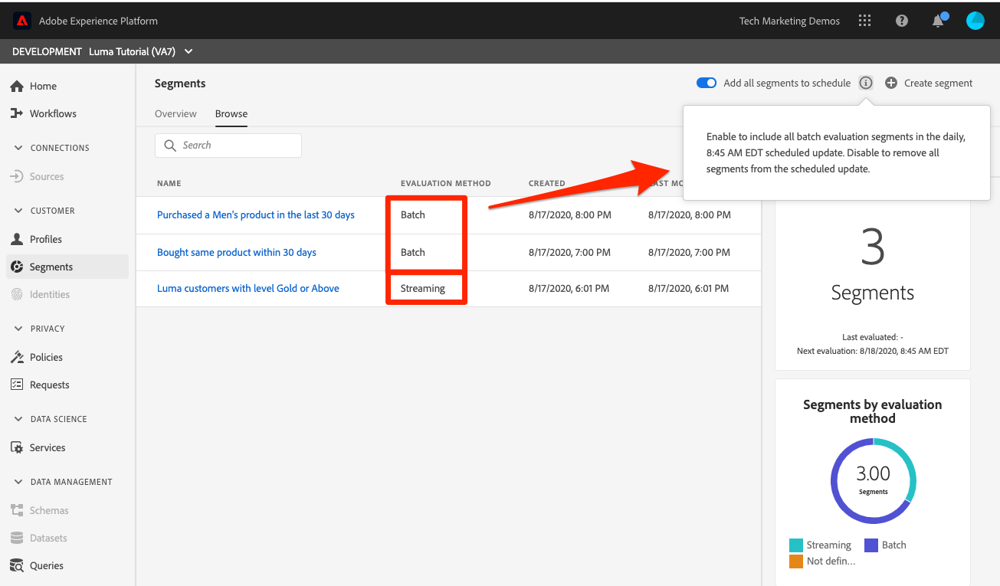

# Créer des segments

<!-- 30 min-->
Dans cette leçon, nous allons créer des segments en fonction des données de profil que nous avons ingérées dans les leçons précédentes.

Une fois que vous disposez de profils clients en temps réel, vous pouvez créer des segments d’individus qui partagent des caractéristiques similaires et qui peuvent réagir de la même manière aux stratégies marketing. Les blocs de création de ces segments sont les champs XDM que vous avez créés précédemment.

Les **architectes des données** devront créer des segments en dehors de ce tutoriel et aider leurs collègues dans cette tâche.

Avant de commencer les exercices, regardez cette courte vidéo pour en savoir plus sur la création de segments :
>[!VIDEO](https://video.tv.adobe.com/v/31638?learn=on&enablevpops&captions=fre_fr)

## Autorisations requises

Dans la leçon [ Configurer les autorisations ](configure-permissions.md), vous avez configuré tous les contrôles d’accès requis pour suivre cette leçon, notamment :

* Éléments d’autorisation **[!UICONTROL Gestion des profils]** > **[!UICONTROL Gérer les segments]**, **[!UICONTROL Afficher les segments]** et **[!UICONTROL Exporter le segment d’audience]**
* Éléments d’autorisation **[!UICONTROL Gestion des profils]** > **[!UICONTROL Afficher les profils]** et **[!UICONTROL Gérer les profils]**
* Élément d’autorisation **[!UICONTROL Sandbox]** > `Luma Tutorial`
* Accès du rôle d’utilisateur au profil de produit `Luma Tutorial Platform`
* Accès du rôle de développeur au profil de produit `Luma Tutorial Platform` (pour l’API)

## Créer un segment de base

Créons un segment simple pour les clients du programme de fidélité avec un statut Gold ou Platinum

1. Dans l’interface utilisateur de Platform, accédez à **[!UICONTROL Segments]** dans le volet de navigation de gauche
1. Sélectionnez le bouton **[!UICONTROL Créer un segment]**
1. Sur le côté gauche du créateur de schémas se trouvent trois onglets pour Attributs (données d’enregistrement), Événements (données de série temporelle) et Audiences
1. Sélectionnez l’icône d’engrenage pour noter que le créateur de segments affiche uniquement les champs contenant des données par défaut et vous permet de modifier la politique de fusion
1. Dans l’onglet Attributs , accédez au dossier **Profil individuel XDM > Fidélité** (vous pouvez également rechercher « fidélité »)
1. Effectuez un glisser-déposer, `Tier` du menu Champs d’attribut vers la zone de travail du créateur de segments.
1. Sélectionner `Tier` est égal à `Gold` ou `Platinum`
1. Sélectionnez **[!UICONTROL Actualiser l’estimation]** pour voir combien de profils remplissent les critères de votre segment
1. Dans le champ **[!UICONTROL Nom]**, saisissez `Luma customers with level Gold or Above`
1. Sélectionnez **[!UICONTROL Enregistrer]**
   

<!--## Build a sequential segment-->

## Création d’un segment dynamique

Dans cet exercice, nous allons créer un segment pour les clients qui ont acheté le même produit deux fois en 30 jours. Les segments dynamiques vous permettent de mettre à l’échelle votre segmentation en utilisant des champs comme variables.

1. Accédez à **[!UICONTROL Segments]** dans le volet de navigation de gauche
1. Sélectionnez le bouton **[!UICONTROL Créer un segment]**
1. Sélectionnez l’onglet **[!UICONTROL Événements]**
1. Filtrer la liste à `purchases`
1. Faites glisser le type d’événement **[!UICONTROL Achats]** sur la zone de travail _deux fois_
1. Sélectionnez l’icône d’horloge entre les deux événements **[!UICONTROL Achats]** et choisissez « dans les 30 jours ».
1. Confirmez que votre définition de segment à ce stade se lit comme suit **« Inclure l’audience qui possède au moins 1 événement d’achat puis qui, dans les 30 jours, possède au moins 1 événement d’achat »**
   
1. Définissez maintenant le filtre d’événement sur `sku`
1. Faites glisser le champ SKU vers le deuxième événement d’achat
   
1. Effacez maintenant le filtre d’événement
1. Comme vous devriez le voir dans la section **[!UICONTROL Parcourir les variables]**, il existe des dossiers pour les deux événements d’achat. Cliquez pour explorer **[!UICONTROL Achats 1]**\
   
1. Accédez au dossier **[!UICONTROL Éléments de liste de produits]**, sélectionnez le champ **[!UICONTROL SKU]** et faites-le glisser vers la droite de l’opérande **[!UICONTROL égal]**. Lorsque vous pointez sur la zone, déposez-la dans la section « Ajouter pour comparer des opérandes »
1. Nommez votre segment `Bought same product within 30 days`
1. Confirmez que la définition de votre audience est **« Incluez l’audience qui comporte au moins 1 événement d’achat, puis qui, dans les 30 jours, comporte au moins 1 événement d’achat où (SKU est égal à Achats1 SKU) »**
1. Sélectionnez le bouton **[!UICONTROL Enregistrer]**

   

## Création d’un segment d’entités multiples

Vous souvenez-vous comment nous avons créé la relation entre le `Luma Offline Purchase Events Schema` et le `Luma Product Catalog Schema` dans les leçons précédentes ? Nous l’avons fait pour pouvoir utiliser la relation dans notre schéma à l’aide de la segmentation d’entités multiples.

Grâce à la fonction de segmentation d’entités multiples avancée, vous pouvez créer des segments à l’aide de plusieurs classes XDM pour étendre vos schémas. Par conséquent, le créateur de segments peut accéder à d’autres champs comme s’ils étaient natifs de la banque de données de profils

Vous allez créer le segment suivant en appliquant la relation que vous avez créée entre votre `Luma Product Catalog Schema` et votre `Luma Offline Purchase Events Schema`.

1. Accédez à **[!UICONTROL Segments]** dans le volet de navigation de gauche
1. Sélectionnez le bouton **[!UICONTROL Créer un segment]**
1. Sélectionnez l’onglet **[!UICONTROL Événements]**
1. Filtrer la liste à `purchases`
1. Faites glisser le type d’événement **[!UICONTROL Achats]** sur la zone de travail
1. Sélectionnez la liste déroulante d’horloge au-dessus de l’événement et choisissez **[!UICONTROL dans les 30 derniers jours]**
1. Filtrez la liste **[!UICONTROL Événements]** à `category`, puis faites glisser le champ **[!UICONTROL Catégorie de produits]** sur **[!UICONTROL Achats]**
1. Remplacez l’opérateur par **[!UICONTROL commence par]** et saisissez `men` dans la zone de texte
1. Dans le champ **[!UICONTROL Nom]**, saisissez `Purchased a Men's product in the last 30 days`
1. Confirmer la définition de l’audience `(Include audience who have at least 1 Purchases event where ((Product Category starts with men)) ) and occurs in last 30 day(s)`
1. Sélectionnez le bouton **[!UICONTROL Enregistrer]**

   

## Segmentation par lots et par flux

Cliquez sur **[!UICONTROL Segments]** dans le volet de navigation de gauche et prenons un moment pour passer en revue nos trois segments :

* Deux de nos segments sont des segments par lots et l’un est un segment en flux continu.
* Platform utilise par défaut la segmentation en flux continu chaque fois que possible, qualifiant le client pour un segment dès qu’il répond aux critères. Lorsque les définitions de segment sont trop complexes pour la diffusion en continu, elles sont automatiquement converties en lots. Dans ce cas, les deux segments étaient traités par lot par défaut, car l’intervalle de recherche en amont des événements d’achat était supérieur à sept jours. Pour obtenir la liste complète et actuelle des limitations de diffusion en continu, consultez [la documentation](https://experienceleague.adobe.com/docs/experience-platform/segmentation/ui/streaming-segmentation.html?lang=fr).
* Les traitements par lots s’exécutent selon une planification quotidienne, qui peut être désactivée.

## Ressources supplémentaires

* [Documentation de Segmentation Service](https://experienceleague.adobe.com/docs/experience-platform/segmentation/home.html?lang=fr)
* [Référence de l’API Segmentation Service](https://www.adobe.io/experience-platform-apis/references/segmentation/)

La segmentation offre plus de possibilités, en particulier avec l’activation des segments. Ces sujets seront abordés dans un autre tutoriel.

Vous avez réussi tous les exercices ! Veuillez procéder à la [conclusion](conclusion.md).
