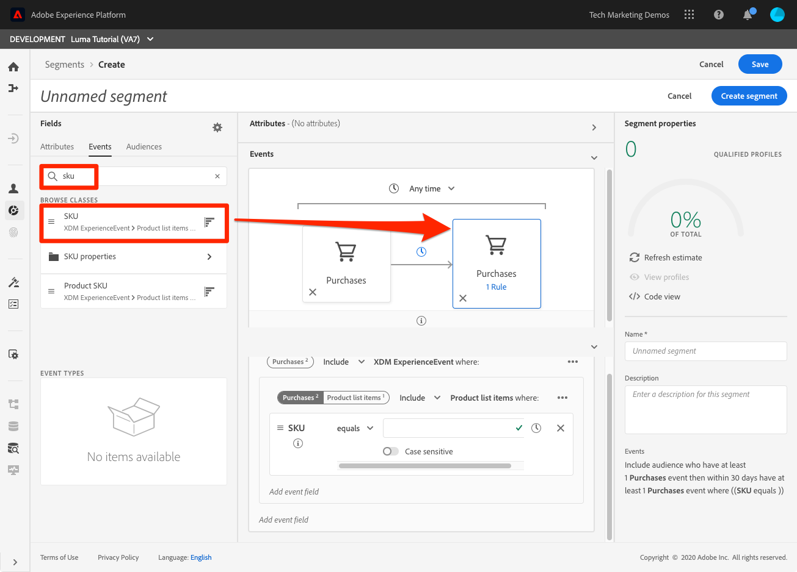

# Créer des segments

<!-- 30 min-->
Dans cette leçon, nous allons créer certains segments en fonction des données de profil que nous avons ingérées dans les leçons précédentes.

Une fois que vous disposez de profils clients en temps réel, vous pouvez créer des segments d’individus qui partagent des caractéristiques similaires et qui peuvent répondre de la même manière aux stratégies marketing. Les blocs de création de ces segments sont les champs XDM que vous avez créés précédemment.

**Les architectes de données** devront créer des segments en dehors de ce tutoriel et prendre en charge leurs collègues avec cette tâche.

Avant de commencer les exercices, regardez cette courte vidéo pour en savoir plus sur la création de segments :
>[!VIDEO](https://video.tv.adobe.com/v/27254?learn=on)

## Autorisations requises

Dans la leçon [Configurer les autorisations](configure-permissions.md) , vous configurez tous les contrôles d’accès requis pour terminer cette leçon, en particulier :

* Éléments d’autorisation **[!UICONTROL Gestion des profils]** > **[!UICONTROL Gérer les segments]**, **[!UICONTROL Afficher les segments]** et **[!UICONTROL Exporter le segment d’audience]**
* Éléments d’autorisation **[!UICONTROL Gestion des profils]** > **[!UICONTROL Afficher les profils]** et **[!UICONTROL Gérer les profils]**
* Élément d’autorisation **[!UICONTROL Sandbox]** > `Luma Tutorial`
* Accès des rôles utilisateur au profil de produit `Luma Tutorial Platform`
* Accès des développeurs au profil de produit `Luma Tutorial Platform` (pour l’API)

## Création d’un segment de base

Créons un segment simple pour les clients du programme de fidélité ayant un statut Gold ou Platine.

1. Dans l’interface utilisateur de Platform, accédez à **[!UICONTROL Segments]** dans le volet de navigation de gauche.
1. Sélectionnez le bouton **[!UICONTROL Créer un segment]**
1. À gauche du créateur de schémas se trouvent trois onglets pour les attributs (données d’enregistrement), les événements (données de série temporelle) et les audiences.
1. Sélectionnez l’icône d’engrenage pour noter que le créateur de segments affiche par défaut uniquement les champs contenant des données et vous permet de modifier la stratégie de fusion.
1. Dans l’onglet Attributs, accédez au dossier **XDM Individual Profile > Loyalty** (vous pouvez également rechercher &quot;loyalty&quot;)
1. Faites glisser `Tier` depuis le menu des champs d’attribut vers le canevas du créateur de segments.
1. Sélectionnez `Tier` égal à `Gold` ou `Platinum`
1. Sélectionnez **[!UICONTROL Actualiser l’estimation]** pour déterminer le nombre de profils qualifiés pour votre segment.
1. En tant que **[!UICONTROL Name]**, saisissez `Luma customers with level Gold or Above`
1. Sélectionnez **[!UICONTROL Save]**
   

<!--## Build a sequential segment-->

## Création d’un segment dynamique

Au cours de cet exercice, nous allons créer un segment pour les clients qui ont acheté le même produit deux fois dans les 30 jours. Les segments dynamiques vous permettent de mettre à l’échelle votre segmentation à l’aide de champs en tant que variables.

1. Accédez à **[!UICONTROL Segments]** dans le volet de navigation de gauche
1. Sélectionnez le bouton **[!UICONTROL Créer un segment]**
1. Sélectionnez l’onglet **[!UICONTROL Events]**
1. Filtrez la liste sur `purchases`
1. Faites glisser le type d’événement **[!UICONTROL Achats]** sur la zone de travail _deux fois_
1. Sélectionnez l’icône de l’horloge entre les deux événements **[!UICONTROL Achats]** et choisissez &quot;dans les 30 jours&quot;.
1. Confirmez que votre définition de segment à ce stade indique **&quot;Inclure l’audience qui a au moins 1 événement Achats puis, dans les 30 jours, au moins 1 événement Achats&quot;**
   
1. Maintenant, remplacez le filtre d’événement par `sku`.
1. Faites glisser le champ SKU vers le deuxième événement d’achat
   
1. Désormais, effacez le filtre d’événement.
1. Dans la section **[!UICONTROL Variables de navigation]**, il y a des dossiers pour les deux événements d’achat. Cliquez pour explorer **[!UICONTROL Achats 1]**\
   
1. Explorez le dossier **[!UICONTROL Éléments de liste de produits]**, sélectionnez le champ **[!UICONTROL SKU]** et faites-le glisser à droite de l’opérande **[!UICONTROL equals]**. Lorsque vous survolez la zone, déposez-la dans la section &quot;Ajouter pour comparer les opérandes&quot;.
1. Nommez votre segment `Bought same product within 30 days`
1. Vérifiez que la définition de votre audience est **&quot;Inclure l’audience qui a au moins 1 événement Achats puis dans les 30 jours avoir au moins 1 événement Achats où ((SKU est égal à la référence Achats1))&quot;**
1. Sélectionnez le bouton **[!UICONTROL Enregistrer]**

   

## Création d’un segment d’entités multiples

Vous vous rappelez comment nous avons créé la relation entre `Luma Offline Purchase Events Schema` et `Luma Product Catalog Schema` dans les leçons précédentes ? Nous l’avons fait pour pouvoir utiliser la relation dans notre schéma à l’aide de la segmentation d’entités multiples.

Grâce à la fonction de segmentation d’entités multiples avancée, vous pouvez créer des segments à l’aide de plusieurs classes XDM pour étendre vos schémas. Par conséquent, le créateur de segments peut accéder à des champs supplémentaires comme s’ils étaient natifs de l’entrepôt de données de profil.

Vous allez créer le segment suivant en appliquant la relation que vous avez créée entre votre `Luma Product Catalog Schema` et votre `Luma Offline Purchase Events Schema`.

1. Accédez à **[!UICONTROL Segments]** dans le volet de navigation de gauche
1. Sélectionnez le bouton **[!UICONTROL Créer un segment]**
1. Sélectionnez l’onglet **[!UICONTROL Events]**
1. Filtrez la liste sur `purchases`
1. Faites glisser le type d’événement **[!UICONTROL Achats]** sur la zone de travail
1. Sélectionnez la liste déroulante de l’horloge au-dessus de l’événement et choisissez **[!UICONTROL dans les 30 derniers jours]**
1. Filtrez la liste **[!UICONTROL Événements]** sur `category`, puis faites glisser le champ **[!UICONTROL Catégorie de produits]** sur **[!UICONTROL Achats]**
1. Remplacez l’opérateur par **[!UICONTROL commence par]** et saisissez `men` dans la zone de texte.
1. En tant que **[!UICONTROL Name]**, saisissez `Purchased a Men's product in the last 30 days`
1. Confirmez la définition de l&#39;audience `(Include audience who have at least 1 Purchases event where ((Product Category starts with men)) ) and occurs in last 30 day(s)`
1. Sélectionnez le bouton **[!UICONTROL Enregistrer]**

   

## Segmentation par lots et par flux

Cliquez sur **[!UICONTROL Segments]** dans le volet de navigation de gauche et prenons quelques instants pour revoir nos trois segments :

* Deux de nos segments sont des segments par lot et l’autre est un segment par flux.
* Platform opte par défaut pour la segmentation par flux chaque fois que cela est possible, ce qui qualifie le client pour un segment dès qu’il répond aux critères. Lorsque les définitions de segment sont trop complexes pour la diffusion en continu, elles sont automatiquement converties en lot. Dans ce cas, les deux segments étaient par défaut par lot, car la période d’analyse des événements d’achat était supérieure à sept jours. Pour obtenir une liste complète et actuelle des limites de diffusion en continu, consultez la [documentation](https://experienceleague.adobe.com/docs/experience-platform/segmentation/ui/streaming-segmentation.html?lang=fr).
* Les tâches par lots s’exécutent selon un calendrier quotidien, qui peut être désactivé.

## Ressources supplémentaires

* [Documentation de Segmentation Service](https://experienceleague.adobe.com/docs/experience-platform/segmentation/home.html?lang=fr)
* [ Référence de l’API Segmentation Service](https://www.adobe.io/experience-platform-apis/references/segmentation/)

La segmentation comporte d’autres avantages, en particulier l’activation des segments. Ces sujets seront abordés dans un autre tutoriel.

Vous avez réussi à travers tous les exercices ! Veuillez passer à la [conclusion](conclusion.md).
