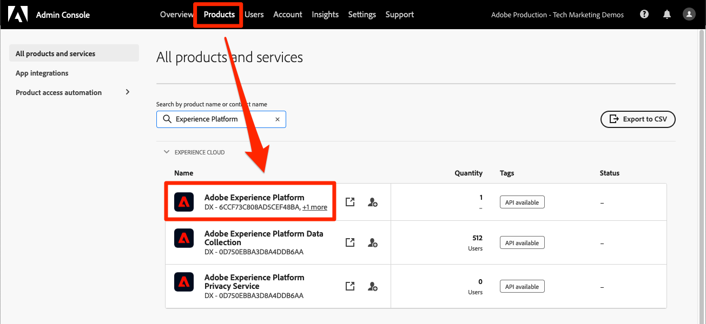

# Configuration des autorisations

<!--30min-->

Dans cette leçon, vous allez configurer les autorisations utilisateur de Adobe Experience Platform à l’aide de [!DNL Adobe's Admin Console] et de l’écran [!UICONTROL Autorisations] de l’interface de Platform.

Le contrôle d’accès est une fonctionnalité clé de confidentialité dans Experience Platform. Nous vous recommandons de limiter les autorisations au minimum requis pour que les personnes puissent exécuter leurs fonctions. Pour plus d’informations, consultez la [documentation sur le contrôle d’accès](https://experienceleague.adobe.com/docs/experience-platform/access-control/home.html?lang=fr) .

Les architectes de données et les ingénieurs de données sont des utilisateurs experts de Adobe Experience Platform. Vous aurez besoin de nombreuses autorisations pour suivre ce tutoriel et plus tard dans votre travail quotidien. Les architectes de données sont susceptibles d’être impliqués dans l’administration de *autres utilisateurs de Platform* dans leur entreprise tels que les spécialistes du marketing, les analystes et les spécialistes des données. À mesure que vous terminez cette leçon, réfléchissez à la manière dont vous pourriez utiliser ces fonctionnalités pour gérer d’autres utilisateurs de votre entreprise.

**Les architectes de données** configurent souvent des autorisations pour d’autres utilisateurs en dehors de ce tutoriel.

>[!IMPORTANT]
>
>Un administrateur système des produits Adobe Experience Cloud doit effectuer certaines des étapes de cette leçon, comme indiqué dans les en-têtes de section. Si vous n’êtes pas administrateur système, contactez un administrateur de votre entreprise et demandez-lui d’effectuer ces tâches. Il y a également une tâche qu’ils doivent accomplir lors de la leçon [Configuration de Developer Console et de Postman](set-up-developer-console-and-postman.md).

## À propos d’Admin Console

[!DNL Admin Console] est l’interface utilisée pour administrer l’accès utilisateur à tous les produits Adobe Experience Cloud. Pour l’accès à Platform, un utilisateur ou doit être ajouté à l’Admin Console, puis tous ses éléments d’autorisation granulaires sont gérés dans l’écran Autorisations de Adobe Experience Platform.

Voici un résumé rapide des rôles existant pour Platform :

* **Les utilisateurs** d’un profil de produit peuvent effectuer des tâches dans l’interface utilisateur de Platform en fonction des autorisations attribuées dans le profil de produit.
* **Les développeurs** peuvent créer des informations d’identification d’API et des projets dans Adobe Developer Console afin de commencer à utiliser l’API Experience Platform.
* **Les administrateurs de produit** peuvent ajouter des utilisateurs et des développeurs au produit Adobe Experience Platform dans Adobe Admin Console, ainsi que gérer un accès utilisateur granulaire dans l’écran Autorisations de l’interface de Platform.
* **Les administrateurs système** peuvent ajouter des administrateurs de produit et administrer pratiquement toutes les autorisations pour tous les produits Adobe Experience Cloud.

## Ajoutez un utilisateur et un développeur au profil de produit `AEP-Default-All-Users` (nécessite un administrateur système ou un administrateur de produit)

Dans cet exercice, vous ou un administrateur système ou produit vous ajouterez en tant qu’utilisateur et développeur dans le produit Adobe Experience Platform de Adobe Admin Console.

>[!NOTE]
>
>Si vous êtes administrateur système et que vous aidez un collègue à suivre ce tutoriel, pensez à ajouter votre collègue en tant qu’ *administrateur produit* pour Adobe Experience Platform. En tant qu’administrateur de produit, ils pourront effectuer ces étapes par eux-mêmes et administrer d’autres utilisateurs Experience Platform à l’avenir.

Pour ajouter le participant au tutoriel en tant que [!UICONTROL Utilisateur] et [!UICONTROL Développeur] :

1. Connectez-vous à [Adobe Admin Console](https://adminconsole.adobe.com)
1. Sélectionnez **[!UICONTROL Produits]** dans la navigation supérieure.
1. Sélectionnez **Adobe Experience Platform**
   
1. Vous disposez peut-être déjà de plusieurs profils dans votre instance d’Experience Platform. Sélectionnez le profil `AEP-Default-All-Users`
   

1. Accédez à l’onglet **[!UICONTROL Utilisateurs]**
1. Sélectionnez le bouton **[!UICONTROL Ajouter un utilisateur]**
   
1. Exécutez le workflow pour ajouter le participant au tutoriel en tant qu’utilisateur au profil de produit.

1. Accédez à l’onglet **[!UICONTROL Développeurs]**
1. Sélectionnez le bouton **[!UICONTROL Ajouter un développeur]**
   
1. Exécutez le workflow pour ajouter le participant au tutoriel en tant que développeur au profil de produit.

## Ajout d’un rôle dans Adobe Experience Platform (nécessite un administrateur système ou un administrateur de produit)

Les autorisations granulaires d’Experience Platform sont gérées dans l’écran Autorisations de l’interface de Platform. Seuls les administrateurs système et produit ont accès à cet écran. Par conséquent, si vous ne disposez pas des privilèges d’administrateur, vous aurez besoin de l’aide d’une personne qui le fait.

Les autorisations sont gérées dans les rôles . Créer un rôle pour le tutoriel :

1. Connectez-vous à [Adobe Experience Platform](https://platform.adobe.com)
1. Sélectionnez **[!UICONTROL Autorisations]** dans le volet de navigation de gauche qui vous mènera à l’écran [!UICONTROL Rôles]
1. Sélectionnez **[!UICONTROL Créer un rôle]**

   
1. Nommez le rôle `Luma Tutorial Platform` (ajoutez le nom du participant au tutoriel à la fin, si plusieurs personnes de votre entreprise suivent ce tutoriel) et sélectionnez **[!UICONTROL Confirmer]**

   

1. Ajoutez tous les éléments d’autorisation pour les ressources suivantes à l’aide de **[!UICONTROL +]** et **[!UICONTROL Ajoutez tout]** :

   1. Modélisation des données
   1. Gestion des données
   1. Gestion des profils
   1. Identity Management
   1. Sandbox Administration
   1. Query Service
   1. Collecte de données
   1. Gouvernance des données
   1. Tableaux de bord
   1. Alertes

      

1. Sous Data Ingestion, ajoutez les éléments d’autorisation Gérer les sources et Afficher les sources .

1. Après avoir ajouté tous les éléments d’autorisation, veillez à sélectionner le bouton Enregistrer .
   

Vous apporterez quelques petites mises à jour à ce rôle après les leçons [Create a sandbox](create-a-sandbox.md) et [Set up Developer Console and Postman](set-up-developer-console-and-postman.md) .

## Création d’un profil de produit de collecte de données (nécessite un administrateur système ou un administrateur de produit)

Dans cet exercice, vous ou un administrateur système de votre entreprise allez créer un profil de produit pour la collecte de données (anciennement appelé Adobe Experience Platform Launch) et vous ajouter en tant qu’administrateur de profil de produit.

>[!NOTE]
>
>Si vous êtes administrateur système et que vous aidez un collègue dans ce tutoriel, pensez à les ajouter en tant qu’ *administrateur de produit* pour la collecte de données. En tant qu’administrateur de produit, ils pourront effectuer ces étapes par eux-mêmes et administrer d’autres utilisateurs de la collecte de données à l’avenir.

Pour créer le profil de produit :

1. Dans le [!DNL Adobe Admin Console], accédez au produit de collecte de données Adobe Experience Platform
1. Ajoutez un nouveau profil nommé `Luma Tutorial Data Collection` (ajoutez le nom du participant au tutoriel à la fin, si plusieurs personnes de votre société suivent ce tutoriel).
1. Désactivez le paramètre **[!UICONTROL Propriétés]** > **[!UICONTROL Inclusion automatique]**
1. À ce stade, n’affectez aucune propriété ou autorisation
1. Ajouter le participant au tutoriel en tant qu’administrateur de ce profil

Une fois ces étapes terminées, vous devriez constater que le profil `Luma Tutorial Data Collection` est configuré avec un administrateur.

## Configuration du profil de produit Data Collection

Maintenant que vous êtes administrateur du profil de produit `Luma Tutorial Data Collection`, vous pouvez configurer les autorisations et les rôles dont vous aurez besoin pour suivre le tutoriel.

### Ajout d’autorisations

Vous allez maintenant ajouter les éléments d’autorisation individuels au profil :

1. Dans [Adobe Admin Console](https://adminconsole.adobe.com), accédez à **[!UICONTROL Produits]** > **[!UICONTROL Collecte de données]**
1. Ouvrez le profil `Luma Tutorial Data Collection`
1. Accédez à l’onglet **[!UICONTROL Autorisations]**
1. Ouvrez **[!UICONTROL Platforms]**
1. Assurez-vous que toutes les plateformes disponibles sont sélectionnées (vous pouvez voir différentes options en fonction de votre licence).
1. **[!UICONTROL Enregistrer]** toutes les modifications
   
1. Ouvrez **[!UICONTROL Properties]**
1. Assurez-vous que le bouton **[!UICONTROL Auto-Include]** est désactivé afin que vous n’ayez accès à aucune propriété (nous en ajouterons une ultérieurement).
1. **[!UICONTROL Enregistrer]** toutes les modifications
   
1. Ouvrez **[!UICONTROL Droits de propriété]**
1. Sélectionnez **[!UICONTROL Ajouter tout]** pour ajouter toutes les autorisations de propriété.
1. **[!UICONTROL Enregistrer]**
   
1. Ouvrez **[!UICONTROL Droits d’entreprise]**
1. Ajouter **[!UICONTROL Gérer les propriétés]**
1. Sélectionnez **[!UICONTROL Save]**
   

### Ajout en tant qu’utilisateur

Maintenant, ajoutez-vous en tant qu’utilisateur au profil de collecte de données :

1. Accédez à l’onglet **[!UICONTROL Utilisateurs]**
1. Sélectionnez le bouton **[!UICONTROL Ajouter un utilisateur]**
   
1. Exécutez le workflow pour vous ajouter en tant qu’utilisateur au profil de produit.

Vous n’avez pas besoin de vous ajouter en tant que développeur pour la collecte de données.

Vous disposez maintenant de presque toutes les autorisations requises pour suivre le tutoriel ! Il y aura deux autres ajustements à effectuer dans [!DNL Adobe Admin Console], dont un après avoir [créé un environnement de test](create-a-sandbox.md) !
