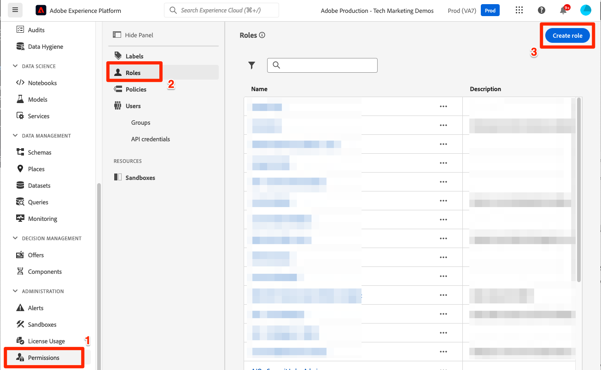

# Configuration des autorisations

<!--30min-->

Dans cette leçon, vous allez configurer les autorisations utilisateur de Adobe Experience Platform à l’aide de [!DNL Adobe's Admin Console] et le [!UICONTROL Autorisations] dans l’interface de Platform.

Le contrôle d’accès est une fonctionnalité clé de confidentialité dans Experience Platform. Nous vous recommandons de limiter les autorisations au minimum requis pour que les personnes puissent exécuter leurs fonctions. Voir [Documentation du contrôle d’accès](https://experienceleague.adobe.com/docs/experience-platform/access-control/home.html?lang=fr) pour plus d’informations.

Les architectes de données et les ingénieurs de données sont des utilisateurs experts de Adobe Experience Platform. Vous aurez besoin de nombreuses autorisations pour suivre ce tutoriel et plus tard dans votre travail quotidien. Les architectes de données sont susceptibles d’être impliqués dans l’administration de *autres utilisateurs de Platform* au sein de leur entreprise, tels que les spécialistes du marketing, les analystes et les spécialistes des données. À mesure que vous terminez cette leçon, réfléchissez à la manière dont vous pourriez utiliser ces fonctionnalités pour gérer d’autres utilisateurs de votre entreprise.

**Architectes de données** configurer souvent des autorisations pour d’autres utilisateurs en dehors de ce tutoriel ;

>[!IMPORTANT]
>
>Un administrateur système des produits Adobe Experience Cloud doit effectuer certaines des étapes de cette leçon, comme indiqué dans les en-têtes de section. Si vous n’êtes pas administrateur système, contactez un administrateur de votre entreprise et demandez-lui d’effectuer ces tâches. Il y a également une tâche qu’il doit effectuer pendant la [Configuration de Developer Console et de Postman](set-up-developer-console-and-postman.md) leçon.

## À propos d’Admin Console

Le [!DNL Admin Console] est l’interface utilisée pour administrer l’accès des utilisateurs à tous les produits Adobe Experience Cloud. Pour l’accès à Platform, un utilisateur ou doit être ajouté dans le Admin Console, puis tous ses éléments d’autorisation granulaires sont gérés dans l’écran Autorisations de Adobe Experience Platform.

Voici un résumé rapide des rôles existant pour Platform :

* **Utilisateurs** d’un profil de produit peut effectuer des tâches dans l’interface utilisateur de Platform en fonction des autorisations attribuées au profil de produit.
* **Développeurs** Vous pouvez créer des informations d’identification d’API et des projets dans la console Adobe Developer afin de commencer à utiliser l’API Experience Platform.
* **Administrateurs de produit** Vous pouvez ajouter des utilisateurs et des développeurs au produit Adobe Experience Platform dans Adobe Admin Console, ainsi que gérer un accès utilisateur granulaire dans l’écran Autorisations de l’interface de Platform.
* **Administrateurs système** peuvent ajouter des administrateurs de produit et administrer pratiquement n’importe quelle autorisation pour tous les produits Adobe Experience Cloud.

## Ajout d’un utilisateur et d’un développeur au `AEP-Default-All-Users` profil de produit (nécessite un administrateur système ou un administrateur de produit)

Dans cet exercice, vous ou un administrateur système ou produit vous ajouterez en tant qu’utilisateur et développeur dans le produit Adobe Experience Platform de Adobe Admin Console.

>[!NOTE]
>
>Si vous êtes administrateur système et que vous aidez un collègue à suivre ce tutoriel, pensez à ajouter votre collègue en tant qu’administrateur système. *Administrateur de produit* pour Adobe Experience Platform. En tant qu’administrateur de produit, ils pourront effectuer ces étapes par eux-mêmes et administrer d’autres utilisateurs Experience Platform à l’avenir.

Ajout du participant au tutoriel en tant que [!UICONTROL Utilisateur] et [!UICONTROL Développeur]:

1. Connectez-vous au [Adobe Admin Console](https://adminconsole.adobe.com)
1. Sélectionner **[!UICONTROL Produits]** dans la navigation supérieure ;
1. Sélectionner **Adobe Experience Platform**
   
1. Vous disposez peut-être déjà de plusieurs profils dans votre instance d’Experience Platform. Sélectionnez la `AEP-Default-All-Users` profile
   

1. Accédez au **[!UICONTROL Utilisateurs]** tab
1. Sélectionnez la **[!UICONTROL Ajouter un utilisateur]** button
   
1. Exécutez le workflow pour ajouter le participant au tutoriel en tant qu’utilisateur au profil de produit.

1. Accédez au **[!UICONTROL Développeurs]** tab
1. Sélectionnez la **[!UICONTROL Ajouter un développeur]** button
   
1. Exécutez le workflow pour ajouter le participant au tutoriel en tant que développeur au profil de produit.

## Ajout d’un rôle dans Adobe Experience Platform (nécessite un administrateur système ou un administrateur de produit)

Les autorisations granulaires d’Experience Platform sont gérées dans l’écran Autorisations de l’interface de Platform. Seuls les administrateurs système et produit ont accès à cet écran. Par conséquent, si vous ne disposez pas des privilèges d’administrateur, vous aurez besoin de l’aide d’une personne qui le fait.

Les autorisations sont gérées dans les rôles . Création d’un rôle pour le tutoriel :

1. Se connecter [Adobe Experience Platform](https://platform.adobe.com)
1. Sélectionner **[!UICONTROL Autorisations]** dans le volet de navigation de gauche qui vous mènera au [!UICONTROL Rôles] écran
1. Sélectionner **[!UICONTROL Création d’un rôle]**

   
1. Attribution d’un nom au rôle `Luma Tutorial Platform` (ajoutez le nom du participant au tutoriel à la fin, si plusieurs personnes de votre société suivent ce tutoriel) et sélectionnez **[!UICONTROL Confirmer]**

   

1. Ajoutez tous les éléments d’autorisation pour les ressources suivantes à l’aide de  **[!UICONTROL +]** et **[!UICONTROL Tout ajouter]**:

   1. Modélisation des données
   1. Gestion des données
   1. Gestion des profils
   1. Identity Management
   1. Sandbox Administration
   1. Query Service
   1. Collecte de données
   1. Gouvernance des données
   1. Tableaux de bord
   1. Alertes

      

1. Sous Data Ingestion, ajoutez les éléments d’autorisation Gérer les sources et Afficher les sources .

1. Après avoir ajouté tous les éléments d’autorisation, veillez à sélectionner le bouton Enregistrer .
   

Vous apporterez quelques petites mises à jour à ce rôle après l’événement [Création d’un environnement de test](create-a-sandbox.md) et [Configuration de Developer Console et de Postman](set-up-developer-console-and-postman.md) leçons.

## Création d’un profil de produit de collecte de données (nécessite un administrateur système ou un administrateur de produit)

Dans cet exercice, vous ou un administrateur système de votre entreprise allez créer un profil de produit pour la collecte de données (anciennement appelé Adobe Experience Platform Launch) et vous ajouter en tant qu’administrateur de profil de produit.

>[!NOTE]
>
>Si vous êtes administrateur système et que vous aidez un collègue dans ce tutoriel, envisagez de l’ajouter en tant qu’administrateur système. *Administrateur de produit* pour la collecte de données. En tant qu’administrateur de produit, ils pourront effectuer ces étapes par eux-mêmes et administrer d’autres utilisateurs de la collecte de données à l’avenir.

Pour créer le profil de produit :

1. Dans le [!DNL Adobe Admin Console] accéder au produit Collecte de données Adobe Experience Platform ;
1. Ajouter un nouveau profil nommé `Luma Tutorial Data Collection` (ajoutez le nom du participant au tutoriel à la fin, si plusieurs personnes de votre société suivent ce tutoriel)
1. Désactivez la fonction **[!UICONTROL Propriétés]** > **[!UICONTROL Inclusion automatique]** paramètre
1. À ce stade, n’affectez aucune propriété ou autorisation
1. Ajouter le participant au tutoriel en tant qu’administrateur de ce profil

Une fois ces étapes terminées, vous devriez constater que la variable `Luma Tutorial Data Collection` est configuré avec un administrateur.

## Configuration du profil de produit Data Collection

Maintenant que vous êtes un administrateur de la `Luma Tutorial Data Collection` profil de produit, vous pouvez configurer les autorisations et les rôles dont vous aurez besoin pour suivre le tutoriel.

### Ajout d’autorisations

Vous allez maintenant ajouter les éléments d’autorisation individuels au profil :

1. Dans le [Adobe Admin Console](https://adminconsole.adobe.com), accédez à **[!UICONTROL Produits]** > **[!UICONTROL Collecte de données]**
1. Ouvrez le `Luma Tutorial Data Collection` profile
1. Accédez au **[!UICONTROL Autorisations]** tab
1. Ouvrir **[!UICONTROL Plateformes]**
1. Assurez-vous que toutes les plateformes disponibles sont sélectionnées (vous pouvez voir différentes options en fonction de votre licence).
1. **[!UICONTROL Enregistrez]** les modifications
   
1. Ouvrir **[!UICONTROL Propriétés]**
1. Assurez-vous que la variable **[!UICONTROL Inclure automatiquement]** La bascule est désactivée afin que vous n’ayez accès à aucune propriété (nous l’ajouterons ultérieurement).
1. **[!UICONTROL Enregistrez]** les modifications
   
1. Ouvrir **[!UICONTROL Droits de propriété]**
1. Sélectionner **[!UICONTROL Tout ajouter]** pour ajouter toutes les autorisations de propriété
1. **[!UICONTROL Enregistrez]**
   
1. Ouvrir **[!UICONTROL Droits d’entreprise]**
1. Ajouter **[!UICONTROL Gestion des propriétés]**
1. Sélectionnez **[!UICONTROL Enregistrer]**
   

### Ajout en tant qu’utilisateur

Maintenant, ajoutez-vous en tant qu’utilisateur au profil de collecte de données :

1. Accédez au **[!UICONTROL Utilisateurs]** tab
1. Sélectionnez la **[!UICONTROL Ajouter un utilisateur]** button
   
1. Exécutez le workflow pour vous ajouter en tant qu’utilisateur au profil de produit.

Vous n’avez pas besoin de vous ajouter en tant que développeur pour la collecte de données.

Vous disposez maintenant de presque toutes les autorisations requises pour suivre le tutoriel ! Il n’y aura que deux autres ajustements à effectuer dans la variable [!DNL Adobe Admin Console], y compris une après vous [création d’un environnement de test](create-a-sandbox.md)!
