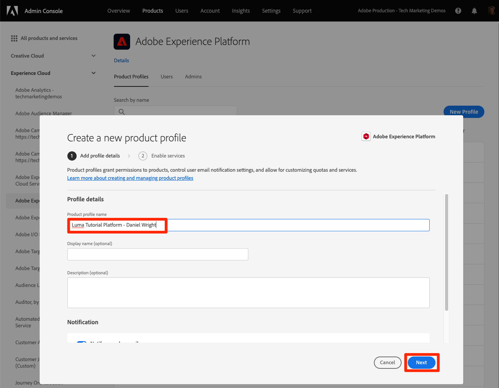

# Configuration des autorisations

<!--30min-->

Dans cette leçon, vous allez configurer les autorisations utilisateur de Adobe Experience Platform à l’aide de [!DNL Adobe's Admin Console].

Le contrôle d’accès est une fonctionnalité clé de confidentialité dans Experience Platform. Nous vous recommandons de limiter les autorisations au minimum requis pour que les personnes puissent exécuter leurs fonctions. Voir [Documentation du contrôle d’accès](https://experienceleague.adobe.com/docs/experience-platform/access-control/home.html?lang=fr) pour plus d’informations.

Les architectes de données et les ingénieurs de données sont des utilisateurs experts de Adobe Experience Platform. Vous aurez besoin de nombreuses autorisations pour suivre ce tutoriel et plus tard dans votre travail quotidien. Les architectes de données sont susceptibles d’être impliqués dans l’administration de *autres utilisateurs de Platform* au sein de leur entreprise, tels que les spécialistes du marketing, les analystes et les spécialistes des données. À mesure que vous terminez cette leçon, réfléchissez à la manière dont vous pourriez utiliser ces fonctionnalités pour gérer d’autres utilisateurs de votre entreprise.

**Architectes de données** configurer souvent des autorisations pour d’autres utilisateurs en dehors de ce tutoriel ;

>[!IMPORTANT]
>
>Un administrateur système des produits Adobe Experience Cloud doit effectuer certaines des étapes de cette leçon, comme indiqué dans les en-têtes de section. Si vous n’êtes pas administrateur système, contactez un administrateur de votre entreprise et demandez-lui d’effectuer ces tâches.

## À propos du Admin Console

Le [!DNL Admin Console] est l’interface utilisée pour administrer l’accès des utilisateurs à tous les produits Adobe Experience Cloud. Voir [Documentation Adobe Admin Console](https://helpx.adobe.com/fr/enterprise/using/admin-console.html) pour plus d’informations. Voici quelques clés : [!DNL Admin Console] concepts :

* A **profil de produits** est une combinaison d’autorisations, de rôles et d’environnements Sandbox liés à un produit Adobe spécifique. Plusieurs profils de produit peuvent être créés pour un seul produit Adobe. Par exemple, un profil &quot;marketeur&quot; peut limiter les autorisations à ce qu’un marketeur type doit généralement effectuer des tâches clés dans l’environnement de Platform de production, tandis qu’un profil &quot;architecte des données&quot; peut être utilisé pour accorder des autorisations différentes dans plusieurs environnements Platform. Dans cette leçon, vous allez créer un profil de produit &quot;Luma Tutorial&quot; avec toutes les autorisations dont un architecte de données et un ingénieur de données auront besoin pour terminer ce tutoriel dans un environnement de test.
* Un **integration** est une connexion à un *project* dans la console Adobe Developer. La console Adobe Developer est au coeur de l’authentification et de la configuration des API Adobe. Vous allez configurer une intégration dans Developer Console et [!DNL Postman] leçon.

Voici un résumé rapide des rôles existant pour Platform :

* **Utilisateurs** d’un profil de produit peut effectuer des tâches dans l’interface utilisateur de Platform en fonction des autorisations attribuées au profil de produit.
* **Développeurs** d’un profil de produit peut effectuer des tâches à l’aide de l’API de Platform en fonction des autorisations du profil de produit.
* **Administrateurs de profil de produit** can edit *du profil spécifique* autorisations et ajouter des utilisateurs, des développeurs et des administrateurs de profil supplémentaires.
* **Administrateurs de produit** peut administrer *tous les profils de produit* pour Platform et ajoutez de nouveaux profils de produit.
* **Administrateurs système** peuvent ajouter des administrateurs de produit et administrer pratiquement n’importe quelle autorisation pour tous les produits Adobe Experience Cloud.

## Création d’un profil de produit Experience Platform (nécessite un administrateur système ou un administrateur de produit)

Dans cet exercice, vous ou un administrateur système de votre entreprise allez créer un profil de produit pour Adobe Experience Platform et vous ajouter en tant qu’administrateur pour ce profil de produit.

>[!NOTE]
>
>Si vous êtes administrateur système et que vous aidez un collègue à suivre ce tutoriel, pensez à ajouter votre collègue en tant qu’administrateur système. *Administrateur de produit* pour Adobe Experience Platform. En tant qu’administrateur de produit, ils pourront effectuer ces étapes par eux-mêmes et administrer d’autres utilisateurs Experience Platform à l’avenir.

Pour créer le profil de produit :

1. Connectez-vous au [Adobe Admin Console](https://adminconsole.adobe.com)
1. Sélectionner **[!UICONTROL Produits]** dans la navigation supérieure ;
1. Sélectionner **[!UICONTROL Adobe Experience Platform]** dans le volet de navigation de gauche (vous devrez peut-être développer la variable **[!UICONTROL Experience Cloud]** section)
1. Vous disposez peut-être déjà de plusieurs profils dans votre instance d’Experience Platform. Sélectionnez la **[!UICONTROL Nouveau profil]** pour ajouter un autre bouton
   
1. Nommer le profil `Luma Tutorial Platform` (ajoutez le nom du participant au tutoriel à la fin, si plusieurs personnes de votre société suivent ce tutoriel) et sélectionnez l’option **[!UICONTROL Suivant]** button
   
1. Selon les détails de votre licence de produit, cette seconde **[!UICONTROL Services]** écran. Nous n’utiliserons aucun de ces services dans ce tutoriel, désélectionnez donc **[!UICONTROL Activer tous les services]** to *remove* tous les services et sélectionnez **[!UICONTROL Enregistrer]**.
   

Maintenant, ajoutez le participant au tutoriel en tant qu’administrateur du profil de produit nouvellement créé. If *you* sont les participants au tutoriel, passez directement à [Configuration du profil de produit Experience Platform](#configure-experience-platform-product-profile):

1. Sélectionnez la `Luma Tutorial Platform` profil de produit :

   

1. Sélectionnez la **[!UICONTROL Administrateurs]** , puis sélectionnez la variable **[!UICONTROL Ajouter un administrateur]** button :

   

1. Exécutez le workflow pour ajouter le participant au tutoriel en tant qu’administrateur.

Une fois ces étapes terminées, vous devriez constater que la variable `Luma Tutorial Platform` est configuré avec un administrateur.

## Configuration du profil de produit Experience Platform

Maintenant que vous êtes un administrateur de la `Luma Tutorial Platform` profil de produit, vous pouvez configurer les autorisations et les rôles dont vous aurez besoin pour suivre le tutoriel.

### Ajout d’autorisations

Vous allez maintenant ajouter les éléments d’autorisation individuels au profil :

1. Ouvrez le `Luma Tutorial Platform` profil de produits
1. Sélectionnez l&#39;onglet **[!UICONTROL Autorisations]**
1. Sous **[!UICONTROL Environnements de test]**, ajoutez le **[!UICONTROL Prod]** environnement de test au profil. Il est nécessaire d’avoir accès au [!DNL Prod] sandbox afin de créer des environnements de test supplémentaires. Une fois que nous avons ajouté le tutoriel sandbox dans la leçon suivante, nous supprimerons la variable [!DNL Prod] environnement de test du profil de produit.
1. Sous [!UICONTROL Ingestion des données], ajoutez le [!UICONTROL Gérer les sources] et [!UICONTROL Afficher les sources] éléments d’autorisation.
1. Ajoutez tous les éléments d’autorisation pour :
   1. [!UICONTROL Modélisation des données]
   1. [!UICONTROL Gestion des données]
   1. [!UICONTROL Gestion des profils]
   1. [!UICONTROL Identity Management]
   1. [!UICONTROL Sandbox Administration]
   1. [!UICONTROL Query Service]
   1. [!UICONTROL Collecte de données]
   1. [!UICONTROL Gouvernance des données]
   1. [!UICONTROL Tableaux de bord]
   1. [!UICONTROL Alertes]

1. Après avoir ajouté tous les éléments d’autorisation, veillez à sélectionner la variable **[!UICONTROL Enregistrer]** button

### Ajout en tant qu’utilisateur

À ce stade, si `Luma Tutorial Platform` était votre *only* Profil de produit Experience Platform, vous ne pourrez toujours pas vous connecter à l’interface utilisateur de l’Experience Platform. Pour ce faire, vous devez être un *user* dans le profil de produit. Heureusement, puisque vous êtes un *admin* d’un profil de produit, vous pouvez vous ajouter vous-même en tant que *user*!

1. Accédez au **[!UICONTROL Utilisateurs]** tab
1. Sélectionnez la **[!UICONTROL Ajouter un utilisateur]** button
   
1. Exécutez le workflow pour vous ajouter en tant qu’utilisateur au profil de produit.

### Ajout en tant que développeur

Pour utiliser l’API Platform, ajoutez-vous en tant que développeur :

1. Accédez au **[!UICONTROL Développeurs]** tab
1. Sélectionnez la **[!UICONTROL Ajouter un développeur]** button
   
1. Exécutez le workflow pour vous ajouter en tant que développeur au profil de produit.

## Création d’un profil de produit de collecte de données (nécessite un administrateur système ou un administrateur de produit)

Dans cet exercice, vous ou un administrateur système de votre entreprise allez créer un profil de produit pour la collecte de données (anciennement appelé Adobe Experience Platform Launch) et vous ajouter en tant qu’administrateur de profil de produit.

>[!NOTE]
>
>Si vous êtes administrateur système et que vous aidez un collègue dans ce tutoriel, envisagez de l’ajouter en tant qu’administrateur système. *Administrateur de produit* pour la collecte de données. En tant qu’administrateur de produit, ils pourront effectuer ces étapes par eux-mêmes et administrer d’autres utilisateurs de la collecte de données à l’avenir.

Pour créer le profil de produit :

1. Dans le [!DNL Adobe Admin Console] accéder au produit Collecte de données Adobe Experience Platform ;
1. Ajouter un nouveau profil nommé `Luma Tutorial Data Collection` (ajoutez le nom du participant au tutoriel à la fin, si plusieurs personnes de votre société suivent ce tutoriel)
1. Désactivez la fonction **[!UICONTROL Propriétés]** > **[!UICONTROL Inclusion automatique]** paramètre
1. À ce stade, n’affectez aucune propriété ou autorisation
1. Ajouter le participant au tutoriel en tant qu’administrateur de ce profil

Une fois ces étapes terminées, vous devriez constater que la variable `Luma Tutorial Data Collection` est configuré avec un administrateur.

## Configuration du profil de produit Data Collection

Maintenant que vous êtes un administrateur de la `Luma Tutorial Data Collection` profil de produit, vous pouvez configurer les autorisations et les rôles dont vous aurez besoin pour suivre le tutoriel.

### Ajout d’autorisations

Vous allez maintenant ajouter les éléments d’autorisation individuels au profil :

1. Dans le [Adobe Admin Console](https://adminconsole.adobe.com), accédez à **[!UICONTROL Produits]** > **[!UICONTROL Collecte de données]**
1. Ouvrez le `Luma Tutorial Data Collection` profile
1. Accédez au **[!UICONTROL Autorisations]** tab
1. Ouvrir **[!UICONTROL Plateformes]**
1. Assurez-vous que toutes les plateformes disponibles sont sélectionnées (vous pouvez voir différentes options en fonction de votre licence).
1. **[!UICONTROL Enregistrez]** les modifications
   
1. Ouvrir **[!UICONTROL Propriétés]**
1. Assurez-vous que la variable **[!UICONTROL Inclure automatiquement]** La bascule est désactivée afin que vous n’ayez accès à aucune propriété (nous l’ajouterons ultérieurement).
1. **[!UICONTROL Enregistrez]** les modifications
   
1. Ouvrir **[!UICONTROL Droits de propriété]**
1. Sélectionner **[!UICONTROL Tout ajouter]** pour ajouter toutes les autorisations de propriété
1. **[!UICONTROL Enregistrez]**
   
1. Ouvrir **[!UICONTROL Droits d’entreprise]**
1. Ajouter **[!UICONTROL Gestion des propriétés]**
1. Sélectionnez **[!UICONTROL Enregistrer]**

   

### Ajout en tant qu’utilisateur

Maintenant, ajoutez-vous en tant qu’utilisateur au profil de collecte de données :

1. Accédez au **[!UICONTROL Utilisateurs]** tab
1. Sélectionnez la **[!UICONTROL Ajouter un utilisateur]** button
   
1. Exécutez le workflow pour vous ajouter en tant qu’utilisateur au profil de produit.

Vous n’avez pas besoin de vous ajouter en tant que développeur pour la collecte de données.

Vous disposez maintenant de presque toutes les autorisations requises pour suivre le tutoriel ! Il n’y aura que deux autres ajustements à effectuer dans la variable [!DNL Adobe Admin Console], y compris une après vous [création d’un environnement de test](create-a-sandbox.md)!
