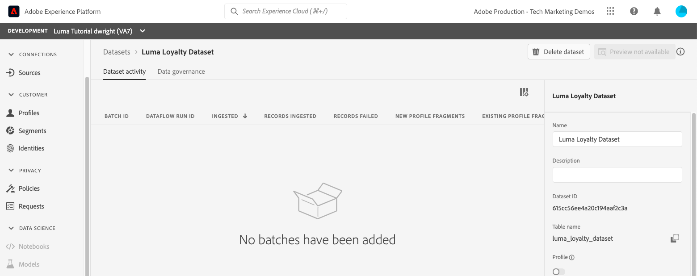

# Création de jeux de données

<!--15min-->

Dans cette leçon, vous allez créer des jeux de données pour recevoir vos données. Vous serez ravi d’apprendre qu’il s’agit de la leçon la plus courte du tutoriel !

Toutes les données correctement ingérées par Adobe Experience Platform sont conservées sous forme de jeux de données dans le lac de données. Un jeu de données est une structure de stockage et de gestion pour la collecte de données, généralement sous la forme d’un tableau, qui contient un schéma (des colonnes) et des champs (des lignes). Les jeux de données contiennent également des métadonnées qui décrivent divers aspects des données stockées.

**Architectes de données** devront créer des jeux de données en dehors de ce tutoriel.

Avant de commencer les exercices, regardez cette courte vidéo pour en savoir plus sur les jeux de données :
>[!VIDEO](https://video.tv.adobe.com/v/34369?learn=on&enablevpops&captions=fre_fr)

## Autorisations requises

Dans la leçon [Configurer les autorisations](configure-permissions.md), vous allez configurer tous les contrôles d’accès requis pour suivre cette leçon.

<!--
* Permission items **[!UICONTROL Data Management]** > **[!UICONTROL View Datasets]** and **[!UICONTROL Manage Datasets]**
* Permission item **[!UICONTROL Sandboxes]** > `Luma Tutorial`
* User-role access to the `Luma Tutorial Platform` product profile
* Developer-role access to the `Luma Tutorial Platform` product profile (for API)
-->

## Créer des jeux de données dans l’interface utilisateur

Dans cet exercice, nous allons créer des jeux de données dans l’interface utilisateur. Commençons par les données de fidélité :

1. Accédez à **[!UICONTROL Jeux de données]** dans le volet de navigation de gauche de l’interface utilisateur de Platform
1. Sélectionnez le bouton **[!UICONTROL Créer un jeu de données]**
   

1. Dans l’écran suivant, sélectionnez **Créer un jeu de données à partir d’un schéma**
1. Dans l’écran suivant, sélectionnez votre `Luma Loyalty Schema`, puis cliquez sur le bouton **[!UICONTROL Suivant]**
   

1. Nommez l’`Luma Loyalty Dataset` du jeu de données et sélectionnez le bouton **[!UICONTROL Terminer]**
   
1. Une fois le jeu de données enregistré, vous accédez à un écran comme celui-ci :
   

Vous avez terminé. Je t&#39;ai dit que ça allait être rapide. Créez ces autres jeux de données en procédant de la même manière :

1. `Luma Offline Purchase Events Dataset` pour votre `Luma Offline Purchase Events Schema`
1. `Luma Web Events Dataset` pour votre `Luma Web Events Schema`
1. `Luma Product Catalog Dataset` pour votre `Luma Product Catalog Schema`


## Créer un jeu de données à l’aide de l’API

Créez maintenant le `Luma CRM Dataset` à l’aide de l’API .

>[!NOTE]
>
>Si vous souhaitez ignorer l’exercice d’API et créer le `Luma CRM Dataset` dans l’interface utilisateur, c’est très bien. Nommez-le `Luma CRM Dataset` et utilisez le `Luma CRM Schema` .

### Obtenez l’identifiant du schéma à utiliser dans le jeu de données

Tout d&#39;abord, nous devons obtenir le `$id` de la `Luma CRM Schema` :

1. Ouvrir le [!DNL Postman]
1. Si vous ne disposez pas d’un jeton d’accès, ouvrez le **[!DNL OAuth: Request Access Token]** de requête et sélectionnez **Envoyer** pour demander un nouveau jeton d’accès, comme vous l’avez fait dans la leçon de [!DNL Postman].
1. Ouvrez le **[!DNL Schema Registry API > Schemas > Retrieve a list of schemas within the specified container.]** de requête .
1. Sélectionnez le bouton **Envoyer**
1. Vous devriez obtenir une réponse 200
1. Recherchez l’élément de `Luma CRM Schema` dans la réponse et copiez la valeur `$id`
   

### Créer le jeu de données

Vous pouvez maintenant créer le jeu de données :

1. Téléchargez [l’API Catalog Service.postman_collection.json](https://raw.githubusercontent.com/adobe/experience-platform-postman-samples/master/apis/experience-platform/Catalog%20Service%20API.postman_collection.json) dans votre dossier `Luma Tutorial Assets`.
1. Importer la collection dans [!DNL Postman]
1. Sélectionner le **[!DNL Catalog Service API > Datasets > Create a new dataset.]** de la requête
1. Collez les éléments suivants en tant que **Body** de la requête, ***en remplaçant la valeur id par la vôtre*** :

   ```json
   {
       "name": "Luma CRM Dataset",
   
       "schemaRef": {
           "id": "REPLACE_WITH_YOUR_OWN_ID",
           "contentType": "application/vnd.adobe.xed-full+json;version=1"
       },
       "fileDescription": {
           "persisted": true,
           "containerFormat": "parquet",
           "format": "parquet"
       }
   }
   ```

1. Sélectionnez le bouton **Envoyer**
1. Vous devriez obtenir une réponse 201 Created contenant l’identifiant de votre nouveau jeu de données !
   

>[!TIP]
>
> Problèmes courants liés à cette requête et correctifs probables :
>
> * `400: There was a problem retrieving xdm schema`. Assurez-vous d’avoir remplacé l’ID dans l’exemple ci-dessus par l’ID de votre propre `Luma CRM Schema`
> * Pas de jeton d’authentification : exécutez la requête **OAuth : Demander un jeton d’accès** pour générer un nouveau jeton.
> * `401: Not Authorized to PUT/POST/PATCH/DELETE for this path : /global/schemas/` : mettez à jour la variable d’environnement **CONTAINER_ID** de `global` vers `tenant`.
> * `403: PALM Access Denied. POST access is denied for this resource from access control` : vérification des autorisations utilisateur dans Admin Console


Vous pouvez revenir à l’écran **[!UICONTROL Jeux de données]** dans l’interface utilisateur de Platform. Vous pouvez ainsi vérifier que la création des cinq jeux de données a réussi.


## Ressources supplémentaires

* [Documentation relative aux jeux de données](https://experienceleague.adobe.com/docs/experience-platform/catalog/datasets/overview.html?lang=fr)
* [Référence de l’API des jeux de données (faisant partie du service de catalogue)](https://www.adobe.io/experience-platform-apis/references/catalog/#tag/Datasets)

Maintenant que tous nos schémas, identités et jeux de données sont en place, nous pouvons [les activer pour le profil client en temps réel](enable-profiles.md).
