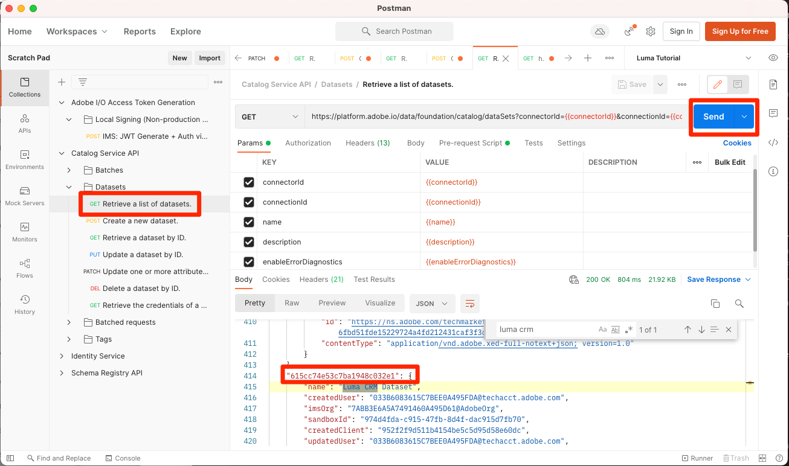
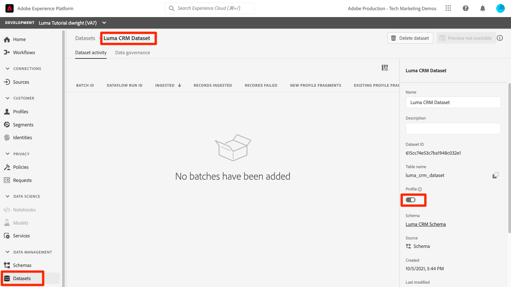

# Activer les profils clients en temps réel

<!-- 15min-->
Dans cette leçon, vous apprendrez à activer vos schémas et jeux de données pour le profil client en temps réel.

D’accord, j’ai menti en disant que la leçon sur les jeux de données était la leçon la plus courte de ce tutoriel - celle-ci devrait prendre encore moins de temps ! Tout ce que vous allez faire, littéralement, c&#39;est retourner un tas de bascules. Mais ce qui se passe quand vous retournez ces bascules est _vraiment_ important donc je voulais lui dédier une page entière.

Le profil client en temps réel offre une vue d’ensemble de chaque client qui combine des données issues de plusieurs canaux, notamment des données en ligne, hors ligne, CRM et tierces. Le profil vous permet de consolider vos diverses données client en une vue unifiée offrant un compte horodaté et exploitable de chaque interaction client.

Aussi incroyable que cela puisse paraître, vous n’avez pas besoin d’activer *toutes vos données* pour le profil. En fait, vous devez activer uniquement les données dont vous avez besoin pour les cas d’utilisation d’activation. Activez les données que vous souhaitez utiliser pour les cas d’utilisation marketing, les intégrations de centres d’appels, etc., où vous avez besoin d’un accès rapide à un profil client robuste. Si vous téléchargez des données uniquement à des fins d’analyse, elles ne devraient probablement pas être activées pour le profil.

Il existe d’importants [mécanismes de sécurisation pour les données du profil client en temps réel](https://experienceleague.adobe.com/docs/experience-platform/profile/guardrails.html?lang=fr) que vous devez consulter lorsque vous décidez laquelle de vos propres données vous devez activer pour le profil.

<!--is this accurate. Are there other considerations to point out? -->

**architectes des données** devront activer le profil client en temps réel en dehors de ce tutoriel.

Avant de commencer les exercices, regardez cette courte vidéo pour en savoir plus sur le profil client en temps réel :
>[!VIDEO](https://video.tv.adobe.com/v/31639?learn=on&enablevpops&captions=fre_fr)

## Autorisations requises

Dans la leçon [Configurer les autorisations](configure-permissions.md), vous allez configurer tous les contrôles d’accès requis pour suivre cette leçon.


<!--* Permission items **[!UICONTROL Data Modeling]** > **[!UICONTROL View Schemas]** and **[!UICONTROL Manage Schemas]**
* Permission items **[!UICONTROL Data Management]** > **[!UICONTROL View Datasets]** and **[!UICONTROL Manage Datasets]**
* Permission item **[!UICONTROL Sandboxes]** > `Luma Tutorial`
* User-role access to the `Luma Tutorial Platform` product profile
* Developer-role access to the `Luma Tutorial Platform` product profile (for API)
-->

## Activer des schémas pour le profil client en temps réel à l’aide de l’interface utilisateur de Platform

Commençons par la tâche simple d’activation d’un schéma :

1. Dans l’interface utilisateur de Platform, ouvrez le **Schéma de fidélité Luma**
1. Dans **[!UICONTROL Propriétés du schéma]**, basculez le bouton (bascule) **Profil**
1. Dans la boîte de dialogue modale de confirmation, appuyez sur le bouton **[!UICONTROL Activer]** pour confirmer
1. Sélectionnez le bouton **[!UICONTROL Enregistrer]** pour enregistrer vos modifications

   >[!IMPORTANT]
   >
   >Une fois qu’un schéma est activé pour Profil, il ne peut pas être désactivé ni supprimé. En outre, les champs ne peuvent pas être supprimés du schéma après ce point. Il est important de garder ces implications à l’esprit ultérieurement, lorsque vous utiliserez vos propres données dans votre environnement de production. Dans ce tutoriel, vous devriez utiliser un sandbox de développement, qui peut être supprimé à tout moment.
   >
   >Dans l’environnement contrôlé de ce tutoriel, vous allez activer vos schémas et vos jeux de données pour le profil, _avant d’ingérer des données_. Lorsque vous utilisez vos propres données, nous vous recommandons d’effectuer les opérations dans l’ordre suivant :
   >
   > 1. Tout d’abord, ingérez des données dans vos jeux de données.
   > 1. Résolvez les problèmes qui se produisent pendant le processus d’ingestion des données (par exemple, les problèmes de validation des données ou de mappage).
   > 1. Activez vos jeux de données et schémas pour Profil
   > 1. Réingérer les données


   

Facile, non ? Répétez les étapes ci-dessus pour ces autres schémas :

1. Schéma de catalogue de produits Luma
1. Schéma d’événements d’achat hors ligne de Luma
1. Schéma d’événements web Luma (dans la boîte de dialogue modale de confirmation, cochez la case « Les données de ce schéma contiendront une identité principale dans le champ identityMap »).

## Activer des schémas pour le profil client en temps réel à l’aide de l’API Platform

Il est maintenant temps d’activer le `Luma CRM Schema` avec l’API . Si vous souhaitez ignorer cet exercice et simplement l’activer dans l’interface utilisateur, allez-y.

### Récupère le meta:altId du schéma

Tout d’abord, `meta:altId` la `Luma CRM Schema` :

1. Ouvrir le [!DNL Postman]
1. Si vous ne disposez pas d’un jeton d’accès, ouvrez le **[!DNL OAuth: Request Access Token]** de requête et sélectionnez **Envoyer** pour demander un nouveau jeton d’accès, comme vous l’avez fait dans la leçon de [!DNL Postman].
1. Ouvrez le **[!DNL Schema Registry API > Schemas > Retrieve a list of schemas within the specified container.]** de requête .
1. Sélectionnez le bouton **Envoyer**
1. Vous devriez obtenir une réponse 200
1. Recherchez l’élément de `Luma CRM Schema` dans la réponse et copiez la valeur `meta:altId`
   

### Activer le schéma

Maintenant que nous disposons du meta:altId du schéma, nous pouvons l’activer pour le profil :

1. Ouvrez le **[!DNL Schema Registry API > Schemas > Update one or more attributes of a custom schema specified by ID.]** de requête .
1. Dans le **Params** collez votre valeur de `meta:altId` en tant que valeur de paramètre `SCHEMA_ID`
1. Dans l&#39;onglet **Corps**, collez le code suivant :

   ```json
   [{
       "op": "add",
       "path": "/meta:immutableTags",
       "value": ["union"]
   }]
   ```

1. Sélectionnez le bouton **Envoyer**
1. Vous devriez obtenir une réponse 200

   

Vous devriez être en mesure de voir dans l&#39;interface utilisateur que les cinq schémas sont activés pour Profile (vous devrez peut-être Maj-Recharger pour voir que `Luma CRM Schema` est activé) :


## Activer des jeux de données pour le profil client en temps réel à l’aide de l’interface utilisateur de Platform

Les jeux de données doivent également être activés pour Profile, et le processus est encore plus simple :

1. Ouvrez le `Luma Loyalty Dataset` dans l’interface utilisateur de Platform
1. Activez/désactivez le commutateur **[!UICONTROL Profil]**.
1. Dans la boîte de dialogue modale de confirmation, appuyez sur le bouton **[!UICONTROL Activer]** pour confirmer

   

Répétez les étapes ci-dessus pour ces autres jeux de données :

1. Jeu de données de catalogue de produits Luma
1. Jeu De Données D’Événements D’Achat Hors Ligne Luma
1. Jeu de données d’événements web Luma

>[!NOTE]
>
>Contrairement aux schémas, vous pouvez désactiver les jeux de données du profil, mais toutes les données précédemment ingérées resteront dans le profil.

## Activer des jeux de données pour le profil client en temps réel à l’aide de l’API Platform

Vous allez maintenant activer un jeu de données pour Profil à l’aide de l’API. Encore une fois, si vous voulez l’activer via l’interface utilisateur en utilisant la méthode ci-dessus, c’est très bien, aussi.

### Obtenir l’identifiant du jeu de données

Tout d&#39;abord, nous devons obtenir le `id` de la `Luma CRM Dataset` :

1. Ouvrir le [!DNL Postman]
1. Si vous ne disposez pas d’un jeton d’accès, ouvrez le **[!DNL OAuth: Request Access Token]** de requête et sélectionnez **Envoyer** pour demander un nouveau jeton d’accès, comme vous l’avez fait dans la leçon de [!DNL Postman].
1. Ouvrez le **[!DNL Catalog Service API > Datasets > Retrieve a list of datasets.]** de requête .
1. Sélectionnez le bouton **Envoyer**
1. Vous devriez obtenir une réponse 200
1. Recherchez l’élément de `Luma CRM Dataset` dans la réponse et copiez l’identifiant :
   

### Activer le jeu de données

Maintenant que nous disposons de l’identifiant du jeu de données, nous pouvons l’activer pour le profil :

1. Ouvrez le **[!DNL Catalog Service API > Datasets > Update one or more attributes of a dataset specified by ID.]** de requête .
1. Dans le **Params** mettez à jour la valeur `DATASET_ID` sur la vôtre
1. Dans l’onglet **Corps**, collez le code suivant. Notez que les deux premières valeurs sont des balises préexistantes qui sont visibles dans la réponse précédente. Ils doivent être inclus dans le corps, en plus des deux nouvelles balises que nous ajoutons :

   ```json
   {
       "tags":{
           "adobe/pqs/table":["luma_crm_dataset"],
           "adobe/siphon/table/format":["parquet"],
           "unifiedProfile":["enabled:true"],
           "unifiedIdentity":["enabled:true"]
           }
   }
   ```

1. Sélectionnez le bouton **Envoyer**
1. Vous devriez obtenir une réponse 200

   

Vous pouvez également vérifier que l’interface utilisateur affiche le jeu de données activé :


>[!IMPORTANT]
>
> Si vous ingérez des données avant d’activer le schéma et le jeu de données pour le profil, vous devrez les réingérer par la suite.

## Ressources supplémentaires

* [Documentation sur le profil client en temps réel](https://experienceleague.adobe.com/docs/experience-platform/profile/home.html?lang=fr)
* [&#x200B; Référence de l’API Real-Time Customer Profile &#x200B;](https://www.adobe.io/experience-platform-apis/references/profile/)


**Ingénieurs de données** devez continuer à lire la leçon [S’abonner aux événements d’ingestion de données](subscribe-to-data-ingestion-events.md).
**Architectes de données** _pouvez passer directement_ et passer à la [leçon d’ingestion par lots](ingest-batch-data.md).
