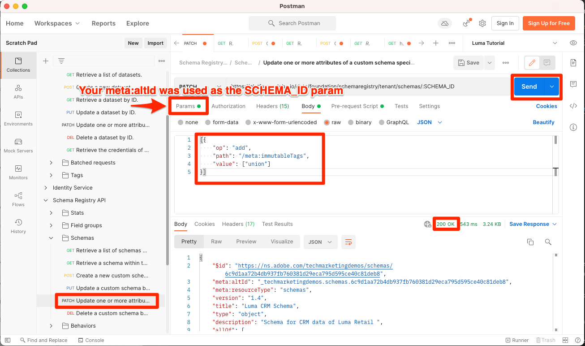

# Activation des profils client en temps réel

<!-- 15min-->
Dans cette leçon, vous allez activer vos schémas et jeux de données pour Real-time Customer Profile.

Bon, j&#39;ai menti en disant que la leçon sur les jeux de données était la plus courte de ce tutoriel - celle-ci devrait prendre encore moins de temps ! Littéralement tout ce que vous allez faire c&#39;est retourner un tas de baskets. Mais ce qui se passe quand vous retournez ces bascules c&#39;est que _vraiment_ important donc je voulais lui dédier une page entière.

Real-time Customer Profile offre une vue d’ensemble de chaque client qui combine des données issues de plusieurs canaux, notamment des données en ligne, hors ligne, CRM et tierces. Le profil vous permet de consolider vos diverses données client en une vue unifiée offrant un compte horodaté et exploitable de chaque interaction client.

Aussi incroyable que cela paraisse, vous n&#39;avez pas besoin d&#39;activer *toutes vos données* pour profile. En fait, vous ne devez activer que les données dont vous avez besoin pour les cas d’utilisation de l’activation. Activez les données que vous souhaitez utiliser pour les cas d’utilisation marketing, les intégrations du centre d’appels, etc., où vous avez besoin d’un accès rapide à un profil client robuste. Si vous chargez des données uniquement à des fins d’analyse, elles ne doivent probablement pas être activées pour le profil.

Il y a de l&#39;importance [Barrières de sécurité pour les données Real-time Customer Profile](https://experienceleague.adobe.com/docs/experience-platform/profile/guardrails.html?lang=en) que vous devez examiner lors du choix de vos propres données à activer pour profile.

<!--is this accurate. Are there other considerations to point out? -->

**Architectes de données** Vous devrez activer Real-time Customer Profile en dehors de ce tutoriel.

Avant de commencer les exercices, regardez cette courte vidéo pour en savoir plus sur Real-time Customer Profile :
>[!VIDEO](https://video.tv.adobe.com/v/27251?quality=12&learn=on)

## Autorisations requises

Dans le [Configuration des autorisations](configure-permissions.md) leçon, vous configurez tous les contrôles d’accès requis pour terminer cette leçon.


<!--* Permission items **[!UICONTROL Data Modeling]** > **[!UICONTROL View Schemas]** and **[!UICONTROL Manage Schemas]**
* Permission items **[!UICONTROL Data Management]** > **[!UICONTROL View Datasets]** and **[!UICONTROL Manage Datasets]**
* Permission item **[!UICONTROL Sandboxes]** > `Luma Tutorial`
* User-role access to the `Luma Tutorial Platform` product profile
* Developer-role access to the `Luma Tutorial Platform` product profile (for API)
-->

## Activation des schémas pour Real-time Customer Profile à l’aide de l’interface utilisateur de Platform

Commençons par la tâche simple d’activation d’un schéma :

1. Dans l’interface utilisateur de Platform, ouvrez le **Schéma de fidélité Luma**
1. Dans **[!UICONTROL Propriétés du schéma]**, faites basculer le **Profil** switch
1. Dans le modal de confirmation, appuyez sur la touche **[!UICONTROL Activer]** pour confirmer
1. Sélectionnez la **[!UICONTROL Enregistrer]** pour enregistrer vos modifications.

   >[!IMPORTANT]
   >
   >Une fois qu’un schéma est activé pour Profile, il ne peut pas être désactivé ni supprimé. De plus, les champs ne peuvent plus être supprimés du schéma après ce point. Il est important de tenir compte de ces implications ultérieurement lorsque vous travaillez avec vos propres données dans votre environnement de production. Vous devriez utiliser un environnement de test de développement dans ce tutoriel, qui peut être supprimé à tout moment.
   >
   >Dans l’environnement contrôlé de ce tutoriel, vous activerez vos schémas et jeux de données pour les profils, _avant d’ingérer des données_. Lorsque vous utilisez vos propres données, nous vous recommandons de procéder dans l’ordre suivant :
   >
   > 1. Tout d’abord, ingérez des données dans vos jeux de données.
   > 1. Résolvez tous les problèmes qui se produisent pendant le processus d’ingestion des données (par exemple, les problèmes de validation des données ou de mappage).
   > 1. Activation des jeux de données et des schémas pour Profile
   > 1. Réingérer les données


   

Facile, n&#39;est-ce pas ? Répétez les étapes ci-dessus pour ces autres schémas :

1. Schéma du catalogue de produits Luma
1. Schéma d’événements d’achat hors ligne Luma
1. Schéma des événements web Luma (dans le modal de confirmation, cochez la case &quot;Les données de ce schéma contiendront une identité Principale dans le champ identityMap&quot;.

## Activation des schémas pour Real-time Customer Profile à l’aide de l’API Platform

Il est maintenant temps d’activer la variable `Luma CRM Schema` avec l’API . Si vous souhaitez ignorer cet exercice et l’activer simplement dans l’interface utilisateur, allez-y.

### Obtention du meta:altId du schéma

Commençons par obtenir le `meta:altId` de `Luma CRM Schema`:

1. Ouvrir [!DNL Postman]
1. Si vous n’avez pas fait de demande au cours des dernières 24 heures, vos jetons d’autorisation ont probablement expiré. Ouvrir la requête **[!DNL Adobe I/O Access Token Generation > Local Signing (Non-production use-only) > IMS: JWT Generate + Auth via User Token]** et sélectionnez **Envoyer** pour demander de nouveaux jetons JWT et d’accès, comme vous l’avez fait dans la variable [!DNL Postman] leçon.
1. Ouvrir la requête **[!DNL Schema Registry API > Schemas > Retrieve a list of schemas within the specified container.]**
1. Sélectionnez la **Envoyer** button
1. Vous devriez obtenir une réponse 200
1. Recherchez dans la réponse pour la variable `Luma CRM Schema` et copiez l’élément `meta:altId` value
   

### Activation du schéma

Maintenant que nous avons le meta:altId du schéma, nous pouvons l&#39;activer pour le profil :

1. Ouvrir la requête **[!DNL Schema Registry API > Schemas > Update one or more attributes of a custom schema specified by ID.]**
1. Dans le **Paramètres** collez votre `meta:altId` comme valeur de `SCHEMA_ID` valeur param
1. Dans le **Corps** , collez le code suivant

   ```json
   [{
       "op": "add",
       "path": "/meta:immutableTags",
       "value": ["union"]
   }]
   ```

1. Sélectionnez la **Envoyer** button
1. Vous devriez obtenir une réponse 200

   

Vous devriez être en mesure de voir dans l’interface utilisateur que les cinq schémas sont activés pour Profile (vous devrez peut-être MAJ-Recharger pour voir que `Luma CRM Schema` est activé) :


## Activation des jeux de données pour Real-time Customer Profile à l’aide de l’interface utilisateur de Platform

Les jeux de données doivent également être activés pour Profile, et le processus est encore plus simple :

1. Dans l’interface utilisateur de Platform, ouvrez le `Luma Loyalty Dataset`
1. Activez/désactivez la variable **[!UICONTROL Profil]** switch
1. Dans le modal de confirmation, appuyez sur la touche **[!UICONTROL Activer]** pour confirmer

   

Répétez les étapes ci-dessus pour ces autres jeux de données :

1. Jeu de données du catalogue de produits Luma
1. Jeu de données des événements d’achat hors ligne Luma
1. Jeu de données des événements web Luma

>[!NOTE]
>
>Contrairement aux schémas, vous pouvez désactiver les jeux de données de Profile, mais toutes les données précédemment ingérées resteront dans Profile.

## Activation des jeux de données pour Real-time Customer Profile à l’aide de l’API Platform

Vous allez maintenant activer un jeu de données pour Profile à l’aide de l’API. Encore une fois, si vous souhaitez l’activer via l’interface utilisateur à l’aide de la méthode ci-dessus, c’est également très bien.

### Obtention de l’identifiant du jeu de données

Tout d’abord, nous devons obtenir le `id` de `Luma CRM Dataset`:

1. Ouvrir [!DNL Postman]
1. Si vous n’avez pas fait de demande au cours des dernières 24 heures, vos jetons d’autorisation ont probablement expiré. Ouvrir la requête **[!DNL Adobe I/O Access Token Generation > Local Signing (Non-production use-only) > IMS: JWT Generate + Auth via User Token]** et sélectionnez **Envoyer** pour demander de nouveaux jetons JWT et d’accès, comme vous l’avez fait dans la variable [!DNL Postman] leçon.
1. Ouvrir la requête **[!DNL Catalog Service API > Datasets > Retrieve a list of datasets.]**
1. Sélectionnez la **Envoyer** button
1. Vous devriez obtenir une réponse 200
1. Recherchez dans la réponse pour la variable `Luma CRM Dataset` et copiez l’identifiant :
   

### Activation du jeu de données

Maintenant que nous disposons de l’identifiant du jeu de données, nous pouvons l’activer pour le profil :

1. Ouvrir la requête **[!DNL Catalog Service API > Datasets > Update one or more attributes of a dataset specified by ID.]**
1. Dans le **Paramètres** mettre à jour la variable `DATASET_ID` à vous-même
1. Dans le **Corps** , collez le code suivant. Notez que les deux premières valeurs sont des balises préexistantes qui sont visibles dans la réponse précédente. Ils doivent être inclus dans le corps, en plus des deux nouvelles balises que nous ajoutons :

   ```json
   {
       "tags":{
           "adobe/pqs/table":["luma_crm_dataset"],
           "adobe/siphon/table/format":["parquet"],
           "unifiedProfile":["enabled:true"],
           "unifiedIdentity":["enabled:true"]
           }
   }
   ```

1. Sélectionnez la **Envoyer** button
1. Vous devriez obtenir une réponse 200

   

Vous pouvez également confirmer que l’interface utilisateur affiche le jeu de données activé :


>[!IMPORTANT]
>
> Si vous ingérez des données avant d’activer le schéma et le jeu de données pour le profil, vous devrez réingérer ces données par la suite.

## Ressources supplémentaires

* [Documentation sur le profil client en temps réel](https://experienceleague.adobe.com/docs/experience-platform/profile/home.html?lang=fr)
* [Référence de l’API Real-time Customer Profile](https://www.adobe.io/experience-platform-apis/references/profile/)


**Ingénieurs de données** doit continuer à [Abonnement aux événements d’ingestion de données](subscribe-to-data-ingestion-events.md) leçon.
**Architectes de données** _peuvent ignorer_ et accédez au [leçon sur l’ingestion par lots](ingest-batch-data.md).
