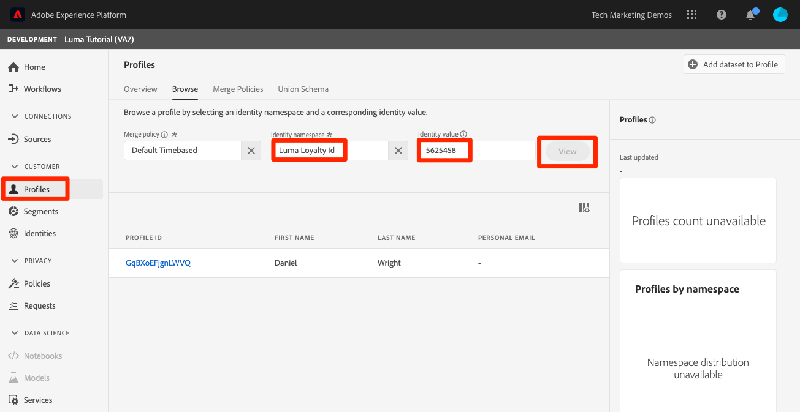
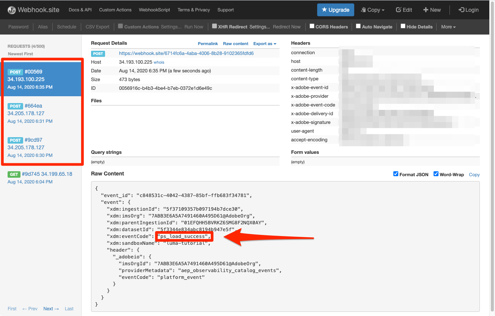

# Ingestion de données par lots

<!-- 1hr-->
Dans cette leçon, vous ingérerez des données de lot dans Experience Platform à l’aide de diverses méthodes.

L’ingestion de données par lots vous permet d’ingérer simultanément une grande quantité de données dans Adobe Experience Platform. Vous pouvez ingérer des données par lots lors d’un chargement unique dans l’interface de Platform ou à l’aide de l’API. Vous pouvez également configurer des téléchargements par lots régulièrement programmés à partir de services tiers tels que les services de stockage dans le cloud à l’aide des connecteurs source.

**Ingénieurs de données** Vous devrez ingérer des données de lot en dehors de ce tutoriel.

Avant de commencer les exercices, regardez cette courte vidéo pour en savoir plus sur l’ingestion de données :
>[!VIDEO](https://video.tv.adobe.com/v/27106?quality=12&learn=on)


## Autorisations requises

Dans le [Configuration des autorisations](configure-permissions.md) leçon, vous configurez tous les contrôles d’accès requis pour terminer cette leçon.

<!--
* Permission item **[!UICONTROL Data Management]** > **[!UICONTROL View Datasets]**, **[!UICONTROL Manage Datasets]** and **[!UICONTROL Data Monitoring]**
* Permission items **[!UICONTROL Data Ingestion]** > **[!UICONTROL View Sources]** and **[!UICONTROL Manage Sources]**
* Permission item **[!UICONTROL Profile Management]** > **[!UICONTROL View Profiles]**
* Permission item **[!UICONTROL Sandboxes]** > `Luma Tutorial`
* User-role access to the `Luma Tutorial Platform` product profile
* Developer-role access to the `Luma Tutorial Platform` product profile (for API)
-->

Vous devez accéder à un serveur FTP (S) ou à une solution de stockage dans le cloud pour l’exercice Sources . Il existe une solution de contournement si vous n&#39;en avez pas.

## Ingestion de données par lots avec l’interface utilisateur de Platform

Les données peuvent être chargées directement dans un jeu de données sur l’écran des jeux de données aux formats JSON et parquet. Il s’agit d’un excellent moyen de tester l’ingestion de certaines de vos données après avoir créé une

### Télécharger et préparer les données

Commencez par obtenir les exemples de données et personnalisez-les pour votre client :

>[!NOTE]
>
>Données contenues dans la variable [luma-data.zip](assets/luma-data.zip) est fictif et doit être utilisé à des fins de démonstration uniquement.

1. Télécharger [luma-data.zip](assets/luma-data.zip) à **Tutoriel Luma Assets** dossier.
1. Décompressez le fichier, créant un dossier appelé `luma-data` qui contient les quatre fichiers de données que nous utiliserons dans cette leçon
1. Ouvrir `luma-loyalty.json` dans un éditeur de texte et remplacez toutes les instances de `_techmarketingdemos` avec votre propre identifiant de client de trait de soulignement, comme indiqué dans vos propres schémas :
   

1. Enregistrer le fichier mis à jour

### Ingestion des données

1. Dans l’interface utilisateur de Platform, sélectionnez **[!UICONTROL Jeux de données]** dans le volet de navigation de gauche
1. Ouvrez votre `Luma Loyalty Dataset`
1. Faites défiler l’écran vers le bas jusqu’à ce que vous voyiez **[!UICONTROL Ajouter des données]** dans la colonne de droite
1. Téléchargez le `luma-loyalty.json` fichier .
1. Une fois le fichier chargé, une ligne pour le lot s’affiche.
1. Si vous rechargez la page au bout de quelques minutes, vous devriez constater que le lot a bien été transféré avec 1 000 enregistrements et 1 000 fragments de profil.

   
   <!--do i need to explain error diagnostics and partial ingestion-->

>[!NOTE]
>
>Il existe quelques options, **[!UICONTROL Diagnostics d’erreur]** et **[!UICONTROL Ingestion partielle]**, que vous verrez sur divers écrans de cette leçon. Ces options ne sont pas abordées dans le tutoriel. Quelques informations rapides :
>
>* L’activation des diagnostics d’erreur génère des données sur l’ingestion de vos données, que vous pouvez ensuite examiner à l’aide de l’API Data Access. En savoir plus à ce sujet dans [la documentation](https://experienceleague.adobe.com/docs/experience-platform/data-access/home.html).
>* L’ingestion partielle vous permet d’ingérer des données contenant des erreurs, jusqu’à un certain seuil que vous pouvez spécifier. En savoir plus à ce sujet dans [la documentation](https://experienceleague.adobe.com/docs/experience-platform/ingestion/batch/partial.html)

### Validation des données

Il existe plusieurs façons de confirmer que les données ont bien été ingérées.

#### Validation dans l’interface utilisateur de Platform

Pour confirmer que les données ont été ingérées dans le jeu de données :

1. Sur la même page que celle où vous avez ingéré les données, sélectionnez la variable **[!UICONTROL Prévisualisation d’un jeu de données]** bouton en haut à droite
1. Sélectionnez la **Aperçu** et vous devriez pouvoir voir certaines des données ingérées.

   


Pour confirmer que les données ont atterri dans Profile (cela peut prendre quelques minutes pour que les données arrivent) :

1. Accédez à **[!UICONTROL Profils]** dans le volet de navigation de gauche
1. Cliquez sur l’icône située en regard de l’icône **[!UICONTROL Sélectionner un espace de noms d’identité]** pour ouvrir le modal.
1. Sélectionnez votre `Luma Loyalty Id` namespace
1. Ensuite, saisissez l’une des options suivantes : `loyaltyId` des valeurs de votre jeu de données,  `5625458`
1. Sélectionner **[!UICONTROL Affichage]**
   

#### Validation avec des événements d’ingestion de données

Si vous vous êtes abonné aux événements d’ingestion de données de la leçon précédente, vérifiez l’URL unique de webhook.site. Vous devriez constater que trois requêtes s’affichent dans l’ordre suivant, avec un certain temps entre elles, avec ce qui suit : `eventCode` values :

1. `ing_load_success`: le lot comme ingéré
1. `ig_load_success`: le lot a été ingéré dans le graphique d’identités.
1. `ps_load_success`: le lot a été ingéré dans le service de profil.



Voir [documentation](https://experienceleague.adobe.com/docs/experience-platform/ingestion/quality/subscribe-events.html#available-status-notification-events) pour plus d’informations sur les notifications.

## Ingestion de données par lots avec l’API Platform

Maintenant, téléchargeons les données à l’aide de l’API.

>[!NOTE]
>
>Les architectes de données, n’hésitez pas à charger les données CRM via la méthode de l’interface utilisateur.

### Télécharger et préparer les données

1. Vous devez avoir déjà téléchargé et décompressé. [luma-data.zip](assets/luma-data.zip) dans `Luma Tutorial Assets` dossier.
2. Ouvrir `luma-crm.json` dans un éditeur de texte et remplacez toutes les instances de `_techmarketingdemos` avec votre propre identifiant de client de trait de soulignement, comme indiqué dans vos schémas
3. Enregistrer le fichier mis à jour

### Obtention de l’identifiant du jeu de données

Tout d’abord, obtenons l’identifiant du jeu de données dans lequel nous voulons ingérer des données :

1. Ouvrir [!DNL Postman]
1. Si vous ne disposez pas d’un jeton d’accès, ouvrez la requête . **[!DNL OAuth: Request Access Token]** et sélectionnez **Envoyer** pour demander un nouveau jeton d’accès, comme vous l’avez fait dans la variable [!DNL Postman] leçon.
1. Ouvrez vos variables d’environnement et assurez-vous que la valeur de **CONTAINER_ID** est toujours `tenant`
1. Ouvrir la requête **[!DNL Catalog Service API > Datasets > Retrieve a list of datasets.]** et sélectionnez **Envoyer**
1. Vous devriez avoir une `200 OK` response
1. Copiez l’identifiant de la variable `Luma CRM Dataset` du corps de la réponse
   

### Création du lot

Nous pouvons maintenant créer un lot dans le jeu de données :

1. Télécharger [Data Ingestion API.postman_collection.json](https://raw.githubusercontent.com/adobe/experience-platform-postman-samples/master/apis/experience-platform/Data%20Ingestion%20API.postman_collection.json) à `Luma Tutorial Assets` folder
1. Importez la collection dans [!DNL Postman]
1. Sélectionner la requête **[!DNL Data Ingestion API > Batch Ingestion > Create a new batch in Catalog Service.]**
1. Collez les éléments suivants en tant que **Corps** de la requête, ***Remplacement de la valeur datasetId par la vôtre***:

   ```json
   {
       "datasetId":"REPLACE_WITH_YOUR_OWN_DATASETID",
       "inputFormat": {
           "format": "json"
       }
   }
   ```

1. Sélectionnez la **Envoyer** button
1. Vous devriez obtenir une réponse 201 Créée contenant l’identifiant de votre nouveau lot !
1. Copiez le `id` du nouveau lot
   

### Ingestion des données

Nous pouvons maintenant transférer les données dans le lot :

1. Sélectionner la requête **[!DNL Data Ingestion API > Batch Ingestion > Upload a file to a dataset in a batch.]**
1. Dans le **Paramètres** , saisissez l’identifiant du jeu de données et l’identifiant du lot dans leurs champs respectifs.
1. Dans le **Paramètres** , saisissez `luma-crm.json` comme la propriété **filePath**
1. Dans le **Corps** , sélectionnez la variable **binaire** option
1. Sélectionner le téléchargé `luma-crm.json` de votre local `Luma Tutorial Assets` folder
1. Sélectionner **Envoyer** et vous devriez obtenir une réponse 200 OK avec &quot;1&quot; dans le corps de la réponse.

   

À ce stade, si vous examinez votre lot dans l’interface utilisateur de Platform, vous verrez qu’il se trouve dans un &quot;[!UICONTROL Chargement]&quot; status :


Comme l’API de lot est souvent utilisée pour charger plusieurs fichiers, vous devez indiquer à Platform lorsqu’un lot est terminé, ce que nous ferons à l’étape suivante.

### Fin du lot

Pour terminer le lot :

1. Sélectionner la requête **[!DNL Data Ingestion API > Batch Ingestion > Finish uploading a file to a dataset in a batch.]**
1. Dans le **Paramètres** , saisissez `COMPLETE` comme la propriété **action**
1. Dans le **Paramètres** , saisissez votre identifiant de lot. Ne vous inquiétez pas de l’identifiant du jeu de données ou de filePath, s’ils sont présents.
1. Assurez-vous que l’URL du POST est `https://platform.adobe.io/data/foundation/import/batches/:batchId?action=COMPLETE` et qu’il n’y a pas de références inutiles au `datasetId` ou `filePath`
1. Sélectionner **Envoyer** et vous devriez obtenir une réponse 200 OK avec &quot;1&quot; dans le corps de la réponse.

   

### Validation des données

#### Validation dans l’interface utilisateur de Platform

Validez que les données ont atterri dans l’interface utilisateur de Platform comme vous l’avez fait pour le jeu de données Loyalty.

Tout d’abord, vérifiez que le lot indique que 1 000 enregistrements ont été ingérés :


Ensuite, confirmez le lot à l’aide du jeu de données de prévisualisation :


Enfin, vérifiez que l’un de vos profils a été créé en recherchant l’un d’eux par la fonction `Luma CRM Id` namespace, par exemple `112ca06ed53d3db37e4cea49cc45b71e`


Il y a une chose intéressante qui vient de se produire que je veux souligner. Ouvrez-le. `Danny Wright` profile. Le profil comporte à la fois une `Lumacrmid` et un `Lumaloyaltyid`. Mémoriser `Luma Loyalty Schema` contenait deux champs d’identité, l’identifiant de fidélité Luma et l’identifiant CRM. Maintenant que nous avons téléchargé les deux jeux de données, ils ont fusionné en un seul profil. Les données de fidélité comportaient `Daniel` comme prénom et &quot;New York City&quot; comme adresse d’accueil, alors que les données de gestion de la relation client avaient `Danny` comme prénom et `Portland` comme adresse d’accueil du client avec le même identifiant de fidélité. Nous reviendrons à la raison pour laquelle le prénom s’affiche. `Danny` dans la leçon sur les stratégies de fusion.

Félicitations, vous venez de fusionner les profils !


#### Validation avec des événements d’ingestion de données

Si vous vous êtes abonné aux événements d’ingestion de données de la leçon précédente, vérifiez l’URL unique de webhook.site. Vous devriez constater que trois demandes entrent en jeu, tout comme avec les données de fidélité :


Voir [documentation](https://experienceleague.adobe.com/docs/experience-platform/ingestion/quality/subscribe-events.html#available-status-notification-events) pour plus d’informations sur les notifications.

## Ingestion de données avec des workflows

Examinons une autre manière de transférer des données. La fonctionnalité de workflows vous permet d’ingérer des données CSV qui ne sont pas déjà modélisées dans XDM.

### Télécharger et préparer les données

1. Vous devez avoir déjà téléchargé et décompressé. [luma-data.zip](assets/luma-data.zip) dans `Luma Tutorial Assets` dossier.
1. Confirmez que vous avez`luma-products.csv`

### Créer un workflow

Maintenant, configurez le workflow :

1. Accédez à **[!UICONTROL Workflows]** dans le volet de navigation de gauche
1. Sélectionner **[!UICONTROL Mappage du fichier CSV au schéma XDM]** et sélectionnez la variable **[!UICONTROL Launch]** button
   
1. Sélectionnez votre `Luma Product Catalog Dataset` et sélectionnez la variable **[!UICONTROL Suivant]** button
   
1. Ajoutez la variable `luma-products.csv` le fichier que vous avez téléchargé et sélectionnez **[!UICONTROL Suivant]** button
   
1. Vous vous trouvez maintenant dans l’interface du mappeur, dans laquelle vous pouvez mapper un champ à partir des données source (l’un des noms de colonne dans la variable `luma-products.csv` ) vers les champs XDM dans le schéma cible. Dans notre exemple, les noms des colonnes sont suffisamment proches des noms des champs de schéma pour que le mappeur puisse détecter automatiquement le mappage approprié. Si le mappeur n’a pas pu détecter automatiquement le champ de droite, sélectionnez l’icône située à droite du champ cible pour sélectionner le champ XDM correct. En outre, si vous ne souhaitez pas ingérer l’une des colonnes du fichier CSV, vous pouvez supprimer la ligne du mappeur. N’hésitez pas à lire et à modifier les en-têtes de colonne dans la variable `luma-products.csv` pour vous familiariser avec le fonctionnement du mappeur.
1. Sélectionnez la **[!UICONTROL Terminer]** button
   

### Validation des données

Une fois le lot transféré, vérifiez le chargement en prévisualisant le jeu de données.

Depuis la variable `Luma Product SKU` est un espace de noms d’utilisateurs qui ne sont pas des personnes, nous ne verrons aucun profil pour le SKU du produit.

Vous devriez voir les trois accès à votre webhook.

## Ingestion de données avec des sources

OK, vous avez fait les choses à la dure. Maintenant, allons dans la terre promise de _automatisé_ ingestion par lots Quand je dis, &quot;DÉPOSEZ-LE !&quot; vous dites : &quot;OUBLIE-LE !&quot; &quot;DÉFINISSEZ-LE !&quot; &quot;OUBLIE-LE !&quot; &quot;DÉFINISSEZ-LE !&quot; &quot;OUBLIE-LE !&quot; En plaisantant, vous ne feriez jamais une telle chose ! Ok, retourne au travail. Vous avez presque fini.

Accédez à **[!UICONTROL Sources]** dans le volet de navigation de gauche pour ouvrir le catalogue des sources. Vous y trouverez diverses intégrations prêtes à l’emploi avec les fournisseurs de données et de stockage de pointe.


D&#39;accord, ingérons des données à l&#39;aide d&#39;un connecteur source.

Cet exercice sera le style de votre propre aventure. Je vais afficher le workflow à l’aide du connecteur source FTP. Vous pouvez soit utiliser un autre connecteur source Cloud Storage que vous utilisez dans votre entreprise, soit charger le fichier json à l’aide de l’interface utilisateur du jeu de données, comme nous l’avons fait avec les données de fidélité.

La plupart des sources ont un processus de configuration similaire, dans lequel vous :

1. Saisissez les informations d’authentification
1. Sélectionner les données à ingérer
1. Sélectionnez le jeu de données Platform dans lequel vous souhaitez l’ingérer.
1. Faire correspondre les champs à votre schéma XDM
1. Choisissez la fréquence à laquelle vous souhaitez ingérer les données à partir de cet emplacement.

>[!NOTE]
>
>Les données d’achat hors ligne que nous utiliserons dans cet exercice contiennent des données datetime. Les données Datetime doivent se trouver dans [Chaînes formatées ISO 8061](https://www.iso.org/fr/iso-8601-date-and-time-format.html) (&quot;2018-07-10T15:05:59.000-08:00&quot;) ou heure Unix formatée en millisecondes (1531263959000) et convertie au moment de l’ingestion vers le type XDM cible. Pour plus d’informations sur la conversion de données et d’autres contraintes, voir [la documentation de l’API Batch Ingestion ;](https://experienceleague.adobe.com/docs/experience-platform/ingestion/batch/api-overview.html#types).

### Téléchargez, préparez et chargez les données vers votre fournisseur de stockage dans le cloud de votre choix.

1. Vous devez avoir déjà téléchargé et décompressé. [luma-data.zip](assets/luma-data.zip) dans `Luma Tutorial Assets` dossier.
1. Ouvrir `luma-offline-purchases.json` dans un éditeur de texte et remplacez toutes les instances de `_techmarketingdemos` avec votre propre identifiant de client de trait de soulignement, comme indiqué dans vos schémas
1. Mettez à jour tous les horodatages afin que les événements se produisent le dernier mois (par exemple, recherchez `"timestamp":"2022-06` et remplacer l’année et le mois)
1. Choisissez le fournisseur de stockage dans le cloud de votre choix, en veillant à ce qu’il soit disponible dans [!UICONTROL Sources] catalogue
1. Télécharger `luma-offline-purchases.json` à un emplacement de votre fournisseur de stockage dans le cloud préféré ;

### Ingérez les données vers l’emplacement de stockage dans le cloud de votre choix.

1. Dans l’interface utilisateur de Platform, filtrez la variable [!UICONTROL Sources] catalogue à **[!UICONTROL Stockage dans le cloud]**
1. Notez qu’il existe des liens pratiques vers la documentation sous le `...`
1. Dans la zone de votre fournisseur de stockage dans le cloud préféré, sélectionnez la variable **[!UICONTROL Configurer]** button
   
1. **[!UICONTROL Authentification]** est la première étape. Saisissez le nom de votre compte, par exemple `Luma's FTP Account` et vos détails d’authentification. Cette étape doit être assez similaire pour toutes les sources de stockage dans le cloud, bien que les champs puissent légèrement varier. Une fois que vous avez saisi les détails d’authentification d’un compte, vous pouvez les réutiliser pour d’autres connexions source qui peuvent envoyer des données différentes sur des plannings différents des autres fichiers du même compte.
1. Sélectionnez la **[!UICONTROL Bouton Se connecter à la source]**
1. Une fois que Platform s’est connecté à la source, sélectionnez la variable **[!UICONTROL Suivant]** button
   

1. Sur le **[!UICONTROL Sélectionner des données]** , l’interface utilisateur utilisera vos informations d’identification pour ouvrir le dossier sur votre solution de stockage dans le cloud.
1. Sélectionnez les fichiers que vous souhaitez ingérer, par exemple `luma-offline-purchases.json`
1. Comme la variable **[!UICONTROL Format des données]**, sélectionnez `XDM JSON`
1. Vous pouvez ensuite prévisualiser la structure json et des exemples de données dans votre fichier .
1. Sélectionnez la **[!UICONTROL Suivant]** button
   

1. Sur le **[!UICONTROL Mappage]** , sélectionnez votre `Luma Offline Purchase Events Dataset` et sélectionnez la variable **[!UICONTROL Suivant]** bouton . Dans le message, notez que puisque les données que nous ingérons sont un fichier JSON, il n’existe aucune étape de mappage où nous mappez le champ source au champ cible. Les données JSON doivent déjà être dans XDM. Si vous ingérez un fichier CSV, l’interface utilisateur de mappage complète s’affiche à cette étape :
   
1. Sur le **[!UICONTROL Planification]** vous choisissez la fréquence à laquelle vous souhaitez ingérer les données à partir de la source. Prenez quelques instants pour examiner les options. Nous allons juste faire une ingestion ponctuelle, alors laissez le **[!UICONTROL Fréquence]** on **[!UICONTROL Une fois]** et sélectionnez la variable **[!UICONTROL Suivant]** button :
   
1. Sur le **[!UICONTROL Détails du flux de données]** , vous pouvez choisir un nom pour votre flux de données, saisir une description facultative, activer les diagnostics d’erreur et l’ingestion partielle. Conservez les paramètres tels quels et sélectionnez l’option **[!UICONTROL Suivant]** button :
   
1. Sur le **[!UICONTROL Réviser]** vous pouvez passer en revue tous vos paramètres ensemble et les modifier ou sélectionner l’option **[!UICONTROL Terminer]** button
1. Après l’enregistrement, vous accédez à un écran comme celui-ci :
   

### Validation des données

Une fois le lot transféré, vérifiez le chargement en prévisualisant le jeu de données.

Vous devriez voir les trois accès à votre webhook.

Recherche du profil avec la valeur `5625458` dans le `loyaltyId` pour voir à nouveau s’il existe des événements d’achat dans leur profil. Vous devriez voir un achat. Vous pouvez consulter les détails de l’achat en sélectionnant **[!UICONTROL Afficher JSON]**:


## Outils ETL

Adobe des partenaires avec plusieurs fournisseurs ETL pour la prise en charge de l’ingestion de données dans Experience Platform. En raison de la variété des fournisseurs tiers, ETL n’est pas pris en compte dans ce tutoriel, bien que vous soyez le bienvenu pour consulter certaines de ces ressources :

* [Développement d’intégrations ETL pour Adobe Experience Platform](https://experienceleague.adobe.com/docs/experience-platform/etl/home.html)
* [Page Connecteur Adobe Experience Platform Informatica sur Adobe Exchange](https://exchange.adobe.com/experiencecloud.details.101570.informatica-adobe-experience-cloud-connector.html)
* [Documentation d’Information sur Adobe Experience Platform Connector.](https://docs.informatica.com/integration-cloud/cloud-data-integration-connectors/current-version/adobe-experience-platform-connector/preface.html)
* [[!DNL Snaplogic] Adobe Experience Platform Snappack](https://www.snaplogic.com/resources/videos/august-2020-aep)

## Ressources supplémentaires

* [Documentation sur l’ingestion par lots](https://experienceleague.adobe.com/docs/experience-platform/ingestion/batch/overview.html)
* [Référence de l’API d’ingestion par lots](https://www.adobe.io/experience-platform-apis/references/data-ingestion/#tag/Batch-Ingestion)

Maintenant, allons [données de diffusion en continu à l’aide du SDK Web](ingest-streaming-data.md)
