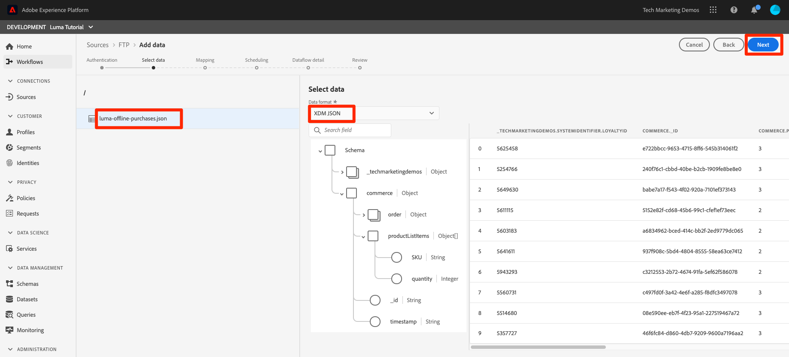

# Ingestion de données par lots

<!-- 1hr-->
Dans cette leçon, vous allez ingérer des données par lot dans Experience Platform à l’aide de différentes méthodes.

L’ingestion de données par lots vous permet d’ingérer une grande quantité de données dans Adobe Experience Platform à la fois. Vous pouvez ingérer des données par lots lors d’un seul chargement dans l’interface de Platform ou à l’aide de l’API . Vous pouvez également configurer des chargements par lots régulièrement planifiés à partir de services tiers tels que les services de stockage dans le cloud à l’aide des connecteurs Source.

**Ingénieurs de données** devront ingérer des données par lot en dehors de ce tutoriel.

Avant de commencer les exercices, regardez cette courte vidéo pour en savoir plus sur l’ingestion de données :

>[!VIDEO](https://video.tv.adobe.com/v/27106?learn=on&enablevpops)


## Autorisations requises

Dans la leçon [Configurer les autorisations](configure-permissions.md), vous allez configurer tous les contrôles d’accès requis pour suivre cette leçon.

<!--
* Permission item **[!UICONTROL Data Management]** > **[!UICONTROL View Datasets]**, **[!UICONTROL Manage Datasets]** and **[!UICONTROL Data Monitoring]**
* Permission items **[!UICONTROL Data Ingestion]** > **[!UICONTROL View Sources]** and **[!UICONTROL Manage Sources]**
* Permission item **[!UICONTROL Profile Management]** > **[!UICONTROL View Profiles]**
* Permission item **[!UICONTROL Sandboxes]** > `Luma Tutorial`
* User-role access to the `Luma Tutorial Platform` product profile
* Developer-role access to the `Luma Tutorial Platform` product profile (for API)
-->

Vous devrez accéder à un serveur FTP ou à une solution de stockage dans le cloud pour l’exercice Sources . Il existe une solution si vous n’en avez pas.

## Ingestion de données par lots avec l’interface utilisateur de Platform

Les données peuvent être chargées directement dans un jeu de données à l’écran des jeux de données aux formats JSON et parquet. Il s’agit d’une excellente manière de tester l’ingestion de certaines de vos données après la création d’un

### Télécharger et préparer les données

Tout d’abord, obtenez les données d’exemple et personnalisez-les pour votre client :

>[!NOTE]
>
>Les données contenues dans le fichier [luma-data.zip](assets/luma-data.zip) sont fictives et ne doivent être utilisées qu’à des fins de démonstration.

1. Téléchargez [luma-data.zip](assets/luma-data.zip) dans votre dossier **Assets de tutoriel Luma**.
1. Décompressez le fichier , créant un dossier appelé `luma-data` qui contient les quatre fichiers de données que nous utiliserons dans cette leçon
1. Ouvrez `luma-loyalty.json` dans un éditeur de texte et remplacez toutes les instances de `_techmarketingdemos` par votre propre identifiant de client Underscore, comme illustré dans vos propres schémas :
   

1. Enregistrer le fichier mis à jour

### Ingestion des données

1. Dans l’interface utilisateur de Platform, sélectionnez **[!UICONTROL Jeux de données]** dans le volet de navigation de gauche
1. Ouvrez votre `Luma Loyalty Dataset`
1. Faites défiler l’écran vers le bas jusqu’à afficher la section **[!UICONTROL Ajouter des données]** dans la colonne de droite
1. Chargez le fichier `luma-loyalty.json`.
1. Une fois le fichier chargé, une ligne pour le lot s’affiche
1. Si vous rechargez la page au bout de quelques minutes, vous devriez constater que le lot a été chargé avec succès avec 1 000 enregistrements et 1 000 fragments de profil.

   
   <!--do i need to explain error diagnostics and partial ingestion-->

>[!NOTE]
>
>Plusieurs options, **[!UICONTROL Diagnostics d’erreur]** et **[!UICONTROL Ingestion partielle]**, s’affichent sur différents écrans dans cette leçon. Ces options ne sont pas abordées dans le tutoriel. Quelques infos rapides :
>
>* L’activation des diagnostics d’erreur génère des données sur l’ingestion de vos données, que vous pouvez ensuite consulter à l’aide de l’API Data Access. En savoir plus dans [la documentation](https://experienceleague.adobe.com/docs/experience-platform/data-access/home.html).
>* L’ingestion partielle vous permet d’ingérer des données contenant des erreurs, jusqu’à un certain seuil que vous pouvez spécifier. En savoir plus dans [la documentation](https://experienceleague.adobe.com/docs/experience-platform/ingestion/batch/partial.html)

### Valider les données

Il existe plusieurs façons de confirmer que les données ont bien été ingérées.

#### Validation dans l’interface utilisateur de Platform

Pour confirmer que les données ont été ingérées dans le jeu de données :

1. Sur la page où vous avez ingéré les données, sélectionnez le bouton **[!UICONTROL Prévisualiser le jeu de données]** en haut à droite
1. Sélectionnez le bouton **Prévisualisation** pour que vous puissiez voir certaines des données ingérées.

   


Pour confirmer que les données ont atterri dans Profile (l’atterrissage des données peut prendre quelques minutes) :

1. Accédez à **[!UICONTROL Profils]** dans le volet de navigation de gauche
1. Sélectionnez l’icône en regard du champ **[!UICONTROL Sélectionner un espace de noms d’identité]** pour ouvrir la boîte de dialogue modale
1. Sélectionner l’espace de noms `Luma Loyalty Id`
1. Saisissez ensuite l’une des valeurs `loyaltyId` de votre jeu de données, `5625458`
1. Sélectionnez **[!UICONTROL Affichage]**
   

#### Validation avec des événements d’ingestion de données

Si vous vous êtes abonné aux événements d’ingestion de données dans la leçon précédente, vérifiez votre URL webhook.site unique. Vous devriez voir trois requêtes s’afficher dans l’ordre suivant, avec un certain temps entre les deux, avec les valeurs de `eventCode` suivantes :

1. `ing_load_success` : le lot tel qu’ingéré
1. `ig_load_success` : le lot a été ingéré dans le graphique d’identité
1. `ps_load_success` : le lot a été ingéré dans le service profile


Voir la [documentation](https://experienceleague.adobe.com/docs/experience-platform/ingestion/quality/subscribe-events.html#available-status-notification-events) pour plus d’informations sur les notifications.

## Ingestion de données par lots avec l’API Platform

Maintenant, chargeons des données à l’aide de l’API .

>[!NOTE]
>
>Architectes de données, n’hésitez pas à télécharger les données du CRM via la méthode de l’interface utilisateur.

### Télécharger et préparer les données

1. Vous devriez avoir déjà téléchargé et décompressé [luma-data.zip](assets/luma-data.zip) dans votre dossier `Luma Tutorial Assets`.
2. Ouvrez `luma-crm.json` dans un éditeur de texte et remplacez toutes les instances de `_techmarketingdemos` par votre propre identifiant de client Underscore, comme le montrent vos schémas
3. Enregistrer le fichier mis à jour

### Obtenir l’identifiant du jeu de données

Tout d’abord, nous allons obtenir l’identifiant du jeu de données dans lequel nous voulons ingérer des données :

1. Ouvrir le [!DNL Postman]
1. Si vous ne disposez pas d’un jeton d’accès, ouvrez le **[!DNL OAuth: Request Access Token]** de requête et sélectionnez **Envoyer** pour demander un nouveau jeton d’accès, comme vous l’avez fait dans la leçon de [!DNL Postman].
1. Ouvrez vos variables d’environnement et assurez-vous que la valeur de **CONTAINER_ID** est toujours `tenant`
1. Ouvrez le **[!DNL Catalog Service API > Datasets > Retrieve a list of datasets.]** de requête et sélectionnez **Envoyer**
1. Vous devriez obtenir une réponse `200 OK`
1. Copiez l’identifiant du `Luma CRM Dataset` à partir du corps de la réponse
   

### Création du lot

Nous pouvons maintenant créer un lot dans le jeu de données :

1. Téléchargez [API Data Ingestion.postman_collection.json](https://raw.githubusercontent.com/adobe/experience-platform-postman-samples/master/apis/experience-platform/Data%20Ingestion%20API.postman_collection.json) dans votre dossier `Luma Tutorial Assets`
1. Importer la collection dans [!DNL Postman]
1. Sélectionner le **[!DNL Data Ingestion API > Batch Ingestion > Create a new batch in Catalog Service.]** de la requête
1. Collez les éléments suivants en tant que **Corps** de la requête, ***en remplaçant la valeur datasetId par la vôtre*** :

   ```json
   {
       "datasetId":"REPLACE_WITH_YOUR_OWN_DATASETID",
       "inputFormat": {
           "format": "json"
       }
   }
   ```

1. Sélectionnez le bouton **Envoyer**
1. Vous devriez obtenir une réponse 201 créée contenant l’identifiant de votre nouveau lot.
1. Copiez le `id` du nouveau lot
   

### Ingestion des données

Nous pouvons maintenant charger les données dans le lot :

1. Sélectionner le **[!DNL Data Ingestion API > Batch Ingestion > Upload a file to a dataset in a batch.]** de la requête
1. Dans l’onglet **Paramètres**, saisissez votre ID de jeu de données et votre ID de lot dans leurs champs respectifs
1. Dans l’onglet **Params**, saisissez `luma-crm.json` comme **filePath**
1. Dans l’onglet **Corps**, sélectionnez l’option **binaire**
1. Sélectionnez le `luma-crm.json` téléchargé dans votre dossier de `Luma Tutorial Assets` local
1. Sélectionnez **Envoyer** pour obtenir une réponse 200 OK avec « 1 » dans le corps de la réponse

   

À ce stade, si vous examinez votre lot dans l’interface utilisateur de Platform, vous verrez qu’il se trouve dans un statut « [!UICONTROL  Chargement ] :


Comme l’API Batch est souvent utilisée pour charger plusieurs fichiers, vous devez informer Platform lorsqu’un lot est terminé, ce que nous ferons à l’étape suivante.

### Terminer le lot

Pour terminer le lot :

1. Sélectionner le **[!DNL Data Ingestion API > Batch Ingestion > Finish uploading a file to a dataset in a batch.]** de la requête
1. Dans l’onglet **Params**, saisissez `COMPLETE` comme **action**
1. Dans l’onglet **Params**, saisissez votre ID de lot. Ne vous inquiétez pas au sujet de l’ID de jeu de données ou du chemin de fichier, s’ils sont présents.
1. Assurez-vous que l’URL de la requête POST est `https://platform.adobe.io/data/foundation/import/batches/:batchId?action=COMPLETE` et qu’il n’y a aucune référence inutile à la `datasetId` ou à la `filePath`
1. Sélectionnez **Envoyer** pour obtenir une réponse 200 OK avec « 1 » dans le corps de la réponse

   

### Valider les données

#### Validation dans l’interface utilisateur de Platform

Vérifiez que les données ont atterri dans l’interface utilisateur de Platform comme vous l’avez fait pour le jeu de données Fidélité.

Tout d’abord, vérifiez que le lot indique que 1 000 enregistrements ont été ingérés :


Confirmez ensuite le lot à l’aide du jeu de données Aperçu :


Enfin, confirmez que l’un de vos profils a été créé en recherchant l’un des profils par l’espace de noms `Luma CRM Id`, par exemple `112ca06ed53d3db37e4cea49cc45b71e`


Il y a une chose intéressante qui vient de se produire et que je tiens à souligner. Ouvrez ce profil de `Danny Wright`. Le profil possède à la fois un `Lumacrmid` et un `Lumaloyaltyid`. Rappelez-vous que le `Luma Loyalty Schema` contenait deux champs d’identité, Identifiant de fidélité Luma et Identifiant CRM. Maintenant que nous avons chargé les deux jeux de données, ils ont fusionné en un seul profil. Les données de fidélité avaient `Daniel` comme prénom et « New York City » comme adresse du domicile, tandis que les données CRM avaient `Danny` comme prénom et `Portland` comme adresse du domicile du client avec le même Loyalty Id. Nous reviendrons sur la raison pour laquelle le prénom affiche `Danny` dans la leçon sur les politiques de fusion.

Félicitations, vous venez de fusionner des profils.


#### Validation avec des événements d’ingestion de données

Si vous vous êtes abonné aux événements d’ingestion de données dans la leçon précédente, vérifiez votre URL webhook.site unique. Vous devriez voir trois requêtes s’afficher, tout comme avec les données de fidélité :


Voir la [documentation](https://experienceleague.adobe.com/docs/experience-platform/ingestion/quality/subscribe-events.html#available-status-notification-events) pour plus d’informations sur les notifications.

## Ingestion de données avec les workflows

Examinons une autre manière de charger des données. La fonctionnalité de workflows vous permet d’ingérer des données CSV qui ne sont pas déjà modélisées dans XDM.

### Télécharger et préparer les données

1. Vous devriez avoir déjà téléchargé et décompressé [luma-data.zip](assets/luma-data.zip) dans votre dossier `Luma Tutorial Assets`.
1. Confirmez que vous avez `luma-products.csv`

### Créer un workflow

Maintenant, nous allons configurer le workflow :

1. Accédez à **[!UICONTROL Workflows]** dans le volet de navigation de gauche
1. Sélectionnez **[!UICONTROL Mapper CSV à un schéma XDM]** et sélectionnez le bouton **[!UICONTROL Lancer]**
   
1. Sélectionnez votre `Luma Product Catalog Dataset` et cliquez sur le bouton **[!UICONTROL Suivant]**
   
1. Ajoutez le fichier `luma-products.csv` téléchargé et cliquez sur le bouton **[!UICONTROL Suivant]**
   
1. Vous êtes maintenant dans l’interface du mappeur, dans laquelle vous pouvez mapper un champ des données sources (l’un des noms de colonne dans le fichier `luma-products.csv`) aux champs XDM dans le schéma cible. Dans notre exemple, les noms des colonnes sont suffisamment proches des noms des champs de schéma pour que le mappeur puisse détecter automatiquement le mappage approprié. Si le mappeur ne parvenait pas à détecter automatiquement le champ droit, vous sélectionneriez l’icône à droite du champ cible pour sélectionner le champ XDM correct. En outre, si vous ne souhaitez pas ingérer l’une des colonnes du fichier CSV, vous pouvez supprimer la ligne du mappeur. N’hésitez pas à faire le tour de la table et à modifier les en-têtes de colonne dans le `luma-products.csv` pour vous familiariser avec le fonctionnement du mappeur.
1. Sélectionnez le bouton **[!UICONTROL Terminer]**
   

### Valider les données

Une fois le lot chargé, vérifiez le chargement en prévisualisant le jeu de données.

Puisque l’`Luma Product SKU` est un espace de noms non personnel, nous ne verrons aucun profil pour les sku de produit.

Vous devriez voir les trois accès à votre webhook.

## Ingestion de données avec des sources

Ok, tu as fait les choses à la dure. Passons maintenant à la terre promise de l&#39;ingestion par lots _automatisée_ ! Quand je dis, « METTEZ-LE ! » vous dites, « OUBLIE ÇA ! » « DÉFINISSEZ-LE ! » « OUBLIE ÇA ! » « DÉFINISSEZ-LE ! » « OUBLIE ÇA ! » Je plaisante, vous ne feriez jamais une telle chose ! Ok, au boulot. Vous avez presque fini.

Accédez à **[!UICONTROL Sources]** dans le volet de navigation de gauche pour ouvrir le catalogue Sources. Vous y trouverez diverses intégrations prêtes à l’emploi avec des fournisseurs de données et de stockage de pointe.


D’accord, ingérons des données à l’aide d’un connecteur source.

Cet exercice sera de choisir le style de votre propre aventure. Je vais afficher le workflow à l’aide du connecteur source FTP. Vous pouvez utiliser un autre connecteur source de stockage dans le cloud que vous utilisez dans votre entreprise ou charger le fichier json à l’aide de l’interface utilisateur du jeu de données comme nous l’avons fait avec les données de fidélité.

De nombreuses sources ont un workflow de configuration similaire, dans lequel vous :

1. Saisissez vos informations d’authentification
1. Sélectionnez les données à ingérer
1. Sélectionnez le jeu de données Platform dans lequel vous souhaitez l’ingérer
1. Mapper les champs à votre schéma XDM
1. Sélectionnez la fréquence à laquelle vous souhaitez réingérer les données à partir de cet emplacement

>[!NOTE]
>
>Les données d’achat hors ligne que nous utiliserons dans cet exercice contiennent des données datetime. Les données Datetime doivent être au format [Chaînes au format ISO 8061](https://www.iso.org/fr/iso-8601-date-and-time-format.html) (« 2018-07-10T15:05:59.000-08:00 ») ou Unix Time au format millisecondes (1531263959000) et sont converties au moment de l’ingestion en type XDM cible. Pour plus d’informations sur la conversion des données et d’autres contraintes, consultez [documentation de l’API Batch Ingestion](https://experienceleague.adobe.com/docs/experience-platform/ingestion/batch/api-overview.html#types).

### Téléchargez, préparez et chargez les données vers le fournisseur d’espace de stockage de votre choix

1. Vous devriez avoir déjà téléchargé et décompressé [luma-data.zip](assets/luma-data.zip) dans votre dossier `Luma Tutorial Assets`.
1. Ouvrez `luma-offline-purchases.json` dans un éditeur de texte et remplacez toutes les instances de `_techmarketingdemos` par votre propre identifiant de client Underscore, comme le montrent vos schémas
1. Mettez à jour toutes les dates et heures afin que les événements se produisent au cours du dernier mois (par exemple, recherchez `"timestamp":"2022-06` et remplacez l’année et le mois)
1. Choisissez votre fournisseur de stockage dans le cloud préféré, en vous assurant qu’il est disponible dans le catalogue [!UICONTROL Sources]
1. Chargez le `luma-offline-purchases.json` vers un emplacement de votre fournisseur d’espace de stockage préféré

### Ingérer les données vers l’emplacement d’espace de stockage de votre choix

1. Dans l’interface utilisateur de Platform, filtrez le catalogue [!UICONTROL Sources] vers **[!UICONTROL Espace de stockage]**
1. Notez qu’il existe des liens pratiques vers la documentation sous la `...` .
1. Dans la zone du fournisseur d’espace de stockage de votre choix, sélectionnez le bouton **[!UICONTROL Configurer]**
   
1. **[!UICONTROL Authentification]** est la première étape. Saisissez le nom de votre compte, par exemple `Luma's FTP Account` et vos informations d’authentification. Cette étape doit être assez similaire pour toutes les sources d’espace de stockage dans le cloud, bien que les champs puissent varier légèrement. Une fois que vous avez saisi les informations d’authentification d’un compte, vous pouvez les réutiliser pour d’autres connexions source susceptibles d’envoyer des données différentes selon des planifications différentes à partir d’autres fichiers du même compte
1. Sélectionnez le bouton **[!UICONTROL Se connecter à la source]**
1. Une fois Platform connecté au Source, cliquez sur le bouton **[!UICONTROL Suivant]**
   

1. À l’étape **[!UICONTROL Sélectionner des données]**, l’interface utilisateur utilisera vos informations d’identification pour ouvrir le dossier sur votre solution de stockage dans le cloud
1. Sélectionnez les fichiers à ingérer, par exemple `luma-offline-purchases.json`
1. Sélectionnez `XDM JSON` comme **[!UICONTROL Format des données]**
1. Vous pouvez ensuite prévisualiser la structure json et les exemples de données dans votre fichier
1. Sélectionnez le bouton **[!UICONTROL Suivant]**
   

1. À l’étape **[!UICONTROL Mappage]**, sélectionnez votre `Luma Offline Purchase Events Dataset` et cliquez sur le bouton **[!UICONTROL Suivant]**. Notez dans le message que puisque les données que nous ingérons sont un fichier JSON, il n’existe aucune étape de mappage où nous mappons le champ source au champ cible. Les données JSON doivent déjà se trouver dans XDM. Si vous ingérez un fichier CSV, l’interface utilisateur de mappage complète s’affiche à cette étape :
   
1. À l’étape **[!UICONTROL Planification]**, choisissez la fréquence à laquelle vous souhaitez réingérer les données du Source. Prenez le temps d’examiner les différentes options. Nous allons simplement effectuer une ingestion unique. Par conséquent, laissez le bouton **[!UICONTROL Fréquence]** sur **[!UICONTROL Une fois]** et sélectionnez le bouton **[!UICONTROL Suivant]** :
   
1. À l’étape **[!UICONTROL Détails du flux de données]** vous pouvez choisir un nom pour votre flux de données, saisir une description facultative, activer les diagnostics d’erreur et l’ingestion partielle. Ne modifiez pas les paramètres et cliquez sur le bouton **[!UICONTROL Suivant]** :
   
1. À l’étape **[!UICONTROL Réviser]**, vous pouvez réviser tous vos paramètres ensemble et les modifier ou sélectionner le bouton **[!UICONTROL Terminer]**
1. Après l’enregistrement, vous accédez à un écran comme celui-ci :
   

### Valider les données

Une fois le lot chargé, vérifiez le chargement en prévisualisant le jeu de données.

Vous devriez voir les trois accès à votre webhook.

Recherchez à nouveau le profil avec la valeur `5625458` dans l’espace de noms `loyaltyId` pour voir s’il existe des événements d’achat dans son profil. Vous devriez voir un achat. Vous pouvez consulter les détails de l’achat en sélectionnant **[!UICONTROL Afficher JSON]** :


## Outils ETL

Adobe s’associe à plusieurs fournisseurs ETL pour prendre en charge l’ingestion de données dans Experience Platform. En raison de la variété des fournisseurs tiers, ETL n’est pas traité dans ce tutoriel, bien que vous puissiez consulter certaines de ces ressources :

* [Développement d’intégrations ETL pour Adobe Experience Platform](https://experienceleague.adobe.com/docs/experience-platform/etl/home.html)
* [[!DNL Snaplogic] Pack Snap Adobe Experience Platform](https://www.snaplogic.com/resources/videos/august-2020-aep)

## Ressources supplémentaires

* [Documentation sur l’ingestion par lots](https://experienceleague.adobe.com/docs/experience-platform/ingestion/batch/overview.html)
* [Référence de l’API d’ingestion par lots](https://developer.adobe.com/experience-platform-apis/references/batch-ingestion/)

Maintenant, nous allons [diffuser des données à l’aide de la SDK web](ingest-streaming-data.md)
