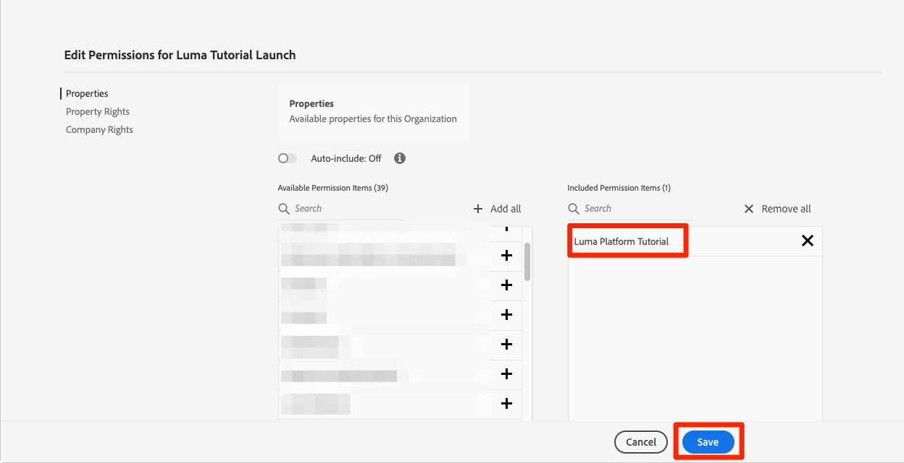
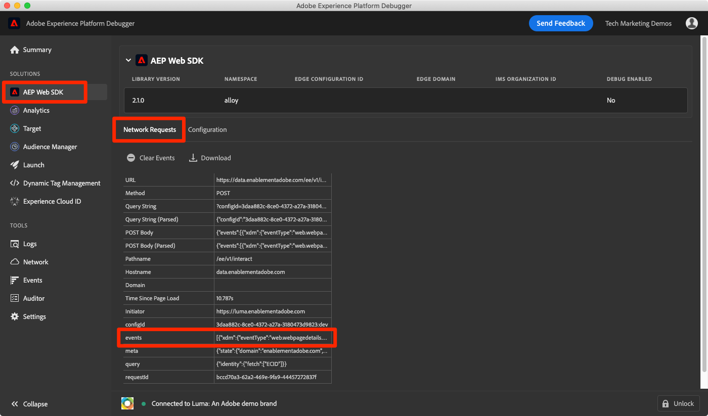

# Ingérer des données de flux

<!--1hr-->

Dans cette leçon, vous allez diffuser des données à l’aide de Adobe Experience Platform Web SDK.

Dans l’interface de collecte de données, nous devons effectuer deux tâches principales :

* Nous devons mettre en œuvre Web SDK sur le site Web Luma pour envoyer des données sur l’activité des visiteurs et visiteuses du site Web au réseau Adobe Edge. Nous allons effectuer une implémentation simple à l’aide de balises (anciennement Launch)

* Nous devons configurer un flux de données, qui indique au réseau Edge où transférer les données. Nous la configurerons pour envoyer les données à notre jeu de données `Luma Web Events` dans notre sandbox Platform.

**Ingénieurs de données** devront ingérer des données de flux en dehors de ce tutoriel. Lors de l’implémentation des SDK web ou mobile de Adobe Experience Platform, un développeur web ou mobile est généralement impliqué dans la création de la couche de données et la configuration des propriétés de balise.

Avant de commencer les exercices, regardez ces deux courtes vidéos pour en savoir plus sur l’ingestion des données en flux continu et sur le SDK web :

>[!VIDEO](https://video.tv.adobe.com/v/31636?learn=on&enablevpops&captions=fre_fr)

>[!VIDEO](https://video.tv.adobe.com/v/37259?learn=on&enablevpops&captions=fre_fr)

>[!NOTE]
>
>Bien que ce tutoriel porte sur l’ingestion en flux continu à partir de sites web avec Web SDK, vous pouvez également diffuser des données à l’aide des mécanismes [Adobe Mobile SDK](https://developer.adobe.com/client-sdks/documentation/), [Apache Kafka Connect](https://github.com/adobe/experience-platform-streaming-connect) et autres.

## Autorisations requises

Dans la leçon [Configurer les autorisations](configure-permissions.md), vous allez configurer tous les contrôles d’accès requis pour suivre cette leçon.

<!--
* Permission items **[!UICONTROL Launch]** > **[!UICONTROL Property Rights]** > **[!UICONTROL Approve]**, **[!UICONTROL Develop]**, **[!UICONTROL Manage Environments]**, **[!UICONTROL Manage Extensions]**, and **[!UICONTROL Publish]**
* Permission item **[!UICONTROL Launch]** > **[!UICONTROL Company Rights]** > **[!UICONTROL Manage Properties]**
* User-role access to the `Luma Tutorial Launch` product profile
* Admin-role access to the `Luma Tutorial Launch` product profile
* Permission items **[!UICONTROL Platform]** > **[!UICONTROL Data Ingestion]** > **[!UICONTROL View Sources]** and **[!UICONTROL Manage Sources]**
* Permission items **[!UICONTROL Platform]** > **[!UICONTROL Data Management]** > **[!UICONTROL View Datasets]** and **[!UICONTROL Manage Datasets]**
* Permission items **[!UICONTROL Platform]** > **[!UICONTROL Profiles]** > **[!UICONTROL View Profiles]**, **[!UICONTROL Manage Profiles]** and **[!UICONTROL Export Audience Segment]**
* Permission item **[!UICONTROL Platform]** > **[!UICONTROL Sandbox Administration]** > **[!UICONTROL View Sandboxes]**
* Permission item **[!UICONTROL Platform]** > **[!UICONTROL Sandboxes]** > `Luma Tutorial`
* User-role access to the `Luma Tutorial Platform` product profile
-->

<!--## Create a streaming source

1. Log into the [Experience Platform  user interface](https://experience.adobe.com/platform/)
1. Go to **[!UICONTROL Sources]** in the left navigation
1. Filter the list by selecting **[!UICONTROL Streaming]**
1. In the **[!UICONTROL HTTP API]** section, select the **[!UICONTROL Configure]** button
    
1. On the **[!UICONTROL Authentication]** step, enter `Luma Web Events Source` as the **[!UICONTROL Account name]** and select the **[!UICONTROL Connect to source]** button (we don't need to enable authentication since the data will be originating from website visitors)
    
1. Once connected, select the **[!UICONTROL Next]** button to proceed to the next step in the workflow
1. On the **[!UICONTROL Select data]** step, choose **[!UICONTROL Existing Dataset]**, select your `Luma Web Events Dataset`, and then select the **[!UICONTROL Next]** button
    
1. On the **[!UICONTROL Dataflow detail]** step, select the **[!UICONTROL Next]** button:
    
    <!--What is a good practice for naming the data flow vs the source-->
<!--
1. On the **[!UICONTROL Review]** step, review your source details and select the **[!UICONTROL Finish]** button:
    
-->

## Configurer le flux de données

Tout d’abord, nous allons configurer le flux de données. Un flux de données indique au réseau Edge d’Adobe où envoyer les données après les avoir reçues de l’appel Web SDK. Par exemple, souhaitez-vous envoyer les données à Experience Platform, Adobe Analytics ou Adobe Target ? Les flux de données sont gérés dans l’interface utilisateur de la collecte de données (anciennement Launch) et sont essentiels à la collecte de données avec Web SDK.

Pour créer votre [!UICONTROL flux de données] :

1. Connectez-vous à l’interface utilisateur de la collecte de données [Experience Platform](https://experience.adobe.com/launch/)
   <!--when will the edge config go live?-->

1. Sélectionnez **[!UICONTROL Flux de données]** dans le volet de navigation de gauche
1. Sélectionnez le bouton **[!UICONTROL Nouveau flux de données]** dans le coin supérieur droit

   

1. Pour le **[!UICONTROL Nom convivial]**, saisissez `Luma Platform Tutorial` (ajoutez votre nom à la fin, si plusieurs personnes de votre entreprise suivent ce tutoriel)
1. Sélectionnez le bouton **[!UICONTROL Enregistrer]**

   

Dans l’écran suivant, indiquez où vous souhaitez envoyer des données. Pour envoyer des données à Experience Platform :

1. Activer/désactiver **[!UICONTROL Adobe Experience Platform]** pour afficher des champs supplémentaires
1. Pour **[!UICONTROL Sandbox]**, sélectionnez `Luma Tutorial`
1. Pour **[!UICONTROL Jeu de données d’événement]**, sélectionnez `Luma Web Events Dataset`
1. Si vous utilisez d’autres applications Adobe, n’hésitez pas à explorer les autres sections pour voir quelles informations sont requises dans la configuration Edge de ces autres solutions. Souvenez-vous que Web SDK a été développé non seulement pour diffuser des données dans Experience Platform, mais également pour remplacer toutes les bibliothèques JavaScript précédentes utilisées par d’autres applications Adobe. La configuration d’Edge permet de spécifier les détails du compte de chaque application à laquelle vous souhaitez envoyer les données.
1. Sélectionnez **[!UICONTROL Enregistrer]**
   

Une fois la configuration Edge enregistrée, l’écran qui en résulte affiche trois environnements qui ont été créés pour le développement, l’évaluation et la production. D’autres environnements de développement peuvent être ajoutés :

Les trois environnements contiennent les détails de Platform que vous venez de saisir. Cependant, ces détails peuvent être configurés différemment par environnement. Par exemple, vous pouvez faire en sorte que chaque environnement envoie des données à un sandbox Platform différent. Dans ce tutoriel, nous n’apporterons aucune personnalisation supplémentaire à notre flux de données.

## Installation de l’extension Web SDK

### Ajouter une propriété

Tout d’abord, nous devons créer une propriété de balise (anciennement, une propriété de balise). Une propriété est un conteneur de toutes les fonctionnalités, JavaScript, règles et autres, nécessaires pour collecter des détails dans une page web et l’envoyer à différents emplacements.

Pour créer une propriété :

1. Accédez à **[!UICONTROL Propriétés]** dans le volet de navigation de gauche
1. Sélectionnez le bouton **[!UICONTROL Nouvelle propriété]**
   
1. Dans le champ **[!UICONTROL Nom]**, saisissez `Luma Platform Tutorial` (ajoutez votre nom à la fin, si plusieurs personnes de votre entreprise suivent ce tutoriel)
1. Pour le **[!UICONTROL Domaines]**, saisissez `enablementadobe.com` (expliqué plus loin)
1. Sélectionnez **[!UICONTROL Enregistrer]**
   

<!--
After saving the property, you might see an error message like the one below. If so, this is because you don't actually have access to the property you just created. To fix this, we need to go to the Admin Console to give yourself access:
    

To give yourself access to the property:

1. In a separate browser tab, log into the [Admin Console](https://adminconsole.adobe.com/)
1. Go to **[!UICONTROL Products]** from the top navigation
1. Select **[!UICONTROL Adobe Experience Platform Launch]** on the left navigation
1. Go to your `Luma Tutorial Launch` product profile
1. Go to the **[!UICONTROL Permissions]** tab
1. On the **[!UICONTROL Properties]** row, select **[!UICONTROL Edit]**
    
1. Select the "+" icon to move your `Luma Platform Tutorial` property to the right-hand side and select the **[!UICONTROL Save]** button to update the permissions
   
    

Now switch back to your browser tab with the Data Collection interface still open. Reload the page and the `Luma Platform Tutorial` property should display in the list. Select to open the property:

-->

## Ajouter l’extension Web SDK

Maintenant que vous disposez d’une propriété , vous pouvez ajouter le SDK Web à l’aide d’une extension. Une extension est un package de code qui étend l’interface et la fonctionnalité de collecte de données. Pour ajouter l’extension :

1. Ouvrir la propriété de balise
1. Accédez à **[!UICONTROL Extensions]** dans le volet de navigation de gauche
1. Accédez à l’onglet **[!UICONTROL Catalogue]**
1. De nombreuses extensions sont disponibles pour les balises. Filtrer le catalogue avec le terme `Web SDK`
1. Dans l’extension **[!UICONTROL Adobe Experience Platform Web SDK]**, cliquez sur le bouton **[!UICONTROL Installer]**
   
1. Plusieurs configurations sont disponibles pour l’extension Web SDK, mais nous n’en configurerons que deux pour ce tutoriel. Mettez à jour le domaine **[!UICONTROL Edge]** en `data.enablementadobe.com`. Ce paramètre vous permet de définir des cookies propriétaires avec votre implémentation de Web SDK, ce qui est recommandé. Plus loin dans cette leçon, vous allez mapper un site web sur le domaine `enablementadobe.com` à votre propriété de balise. Le CNAME pour le domaine `enablementadobe.com` a déjà été configuré afin de `data.enablementadobe.com` transférer vers les serveurs Adobe. Lorsque vous implémentez Web SDK sur votre propre site Web, vous devez créer un CNAME à des fins de collecte de données, par exemple, `data.YOUR_DOMAIN.com`
1. Dans la liste déroulante **[!UICONTROL Flux de données]**, sélectionnez votre flux de données `Luma Platform Tutorial`.
1. N’hésitez pas à consulter les autres options de configuration (mais ne les modifiez pas), puis sélectionnez **[!UICONTROL Enregistrer]**
   <!--is edge domain required for first party? when will it break?-->
   <!--any other fields that should be highlighted-->
   

## Créer une règle pour envoyer des données

Nous allons maintenant créer une règle pour envoyer des données à Platform. Une règle est une combinaison d’événements, de conditions et d’actions indiquant aux balises d’effectuer une opération. Pour créer une règle :

1. Accédez à **[!UICONTROL Règles]** dans le volet de navigation de gauche
1. Sélectionnez le bouton **[!UICONTROL Créer une règle]**
   
1. Donnez à la règle le nom `All Pages - Library Loaded`.
1. Sous **[!UICONTROL Événements]**, sélectionnez le bouton **[!UICONTROL Ajouter]**
   
1. Utilisez l’**[!UICONTROL Core]** **[!UICONTROL Extension]** et sélectionnez **[!UICONTROL Bibliothèque chargée (haut de page)]** comme **[!UICONTROL Type d’événement]**. Ce paramètre signifie que notre règle se déclenche chaque fois que la bibliothèque Launch se charge sur une page.
1. Sélectionnez **[!UICONTROL Conserver les modifications]** pour revenir à l’écran principal des règles
   
1. Laissez **[!UICONTROL Conditions]** vide, car nous voulons que cette règle se déclenche sur toutes les pages, en fonction du nom que nous lui avons donné
1. Sous **[!UICONTROL Actions]**, sélectionnez le bouton **[!UICONTROL Ajouter]**
1. Utilisez le **[!UICONTROL SDK Web Adobe Experience Platform]** **[!UICONTROL Extension]** et sélectionnez **[!UICONTROL Envoyer l’événement]** comme **[!UICONTROL Type d’action]**
1. Sur la droite, sélectionnez **[!UICONTROL web.webpagedetails.pageViews]** dans la liste déroulante **[!UICONTROL Type]**. Il s’agit de l’un des champs XDM de notre `Luma Web Events Schema`
1. Sélectionnez **[!UICONTROL Conserver les modifications]** pour revenir à l’écran principal des règles
   
1. Sélectionnez **[!UICONTROL Enregistrer]** pour enregistrer la règle\
   

## Publication de la règle dans une bibliothèque

Ensuite, nous publierons la règle dans notre environnement de développement afin de vérifier qu’elle fonctionne.

<!--
There are a few quick steps we must take in the **[!UICONTROL Publishing]** section of Launch.

### Create a host

Launch libraries can be hosted on Adobe's Content Delivery Network (CDN) or on your own servers. In this tutorial, we will use Adobe's CDN since it is faster to set up:

1. Go to **[!UICONTROL Hosts]** in the left navigation
1. Select the **[!UICONTROL Create New Host]** button
       
1. For the **[!UICONTROL Name]**, enter `Adobe CDN`
1. For the **[!UICONTROL Type]**, select **[!UICONTROL Managed by Adobe]**
1. Select the **[!UICONTROL Save]** button to complete the setup of the host
       

### Create an environment

Environments allow you to have different versions of a library in different publishing environments to accommodate your publishing workflow. For example, the fully tested version of your library can be published to a Production environment, while new changes are being created in a Development environment. You can also use different hosts for each environment. To create an environment:

1. Go to **[!UICONTROL Environments]** in the left navigation
1. Select the **[!UICONTROL Create New Environment]** button
     
1. Under **[!UICONTROL Development]** select **[!UICONTROL Select]**   
     
1. For the **[!UICONTROL Name]**, enter `Development`
1. For the **[!UICONTROL Select Host]** dropdown, select `Adobe CDN`
1. Select the **[!UICONTROL Save]** button to complete the setup of the environment
    
1. You will see a modal with URL and other implementation details of this library. These are critical for a real Launch implementation, but we don't need to worry about them for this tutorial. Select the **[!UICONTROL Close]** button to exit the modal.

### Create and publish the library

Now let's bundle the contents of our property&mdash;currently an extension and a rule&mdash;into a library. 
-->

Pour créer une bibliothèque, procédez comme suit :

1. Accédez à **[!UICONTROL Flux de publication]** dans le volet de navigation de gauche
1. Sélectionnez **[!UICONTROL Ajouter une bibliothèque]**
   
1. Pour le **[!UICONTROL Nom]**, saisissez `Luma Platform Tutorial`
1. Pour le **[!UICONTROL Environnement]**, sélectionnez `Development`
1. Sélectionnez le bouton **[!UICONTROL Ajouter toutes les ressources modifiées]**. (Outre l’extension [!UICONTROL Adobe Experience Platform Web SDK] et la règle `All Pages - Library Loaded`, vous verrez également l’extension [!UICONTROL Core] ajoutée, qui contient le JavaScript de base requis par toutes les propriétés web de Launch.)
1. Sélectionnez le bouton **[!UICONTROL Enregistrer et créer pour développement]**
   

La création de la bibliothèque peut prendre quelques minutes et, lorsqu’elle est terminée, un point vert s’affiche à gauche du nom de la bibliothèque :

Comme vous pouvez le voir sur l’écran [!UICONTROL Flux de publication], le processus de publication ne se limite pas au contenu de ce tutoriel. Nous allons simplement utiliser une seule bibliothèque dans notre environnement de développement.

## Valider les données de la requête

### Ajout d’Adobe Experience Platform Debugger

Experience Platform Debugger est une extension disponible pour les navigateurs Chrome et Firefox qui vous permet de voir la technologie Adobe mise en œuvre dans vos pages web. Téléchargez la version correspondant au navigateur de votre choix :

* [Extension Firefox ](https://addons.mozilla.org/fr/firefox/addon/adobe-experience-platform-dbg/)
* [Extension Chrome](https://chrome.google.com/webstore/detail/adobe-experience-platform/bfnnokhpnncpkdmbokanobigaccjkpob)

Si vous n’avez jamais utilisé le débogueur auparavant (et que celui-ci est différent de l’ancien débogueur Adobe Experience Cloud), vous pouvez regarder cette vidéo de présentation de cinq minutes :

>[!VIDEO](https://video.tv.adobe.com/v/36025?learn=on&enablevpops&captions=fre_fr)

### Ouvrir le site web Luma

Pour ce tutoriel, nous utilisons une version hébergée publiquement du site web de démonstration de Luma. Ouvrons-le et mettons-le en signet :

1. Dans un nouvel onglet du navigateur, ouvrez le [site web Luma](https://luma.enablementadobe.com/content/luma/us/en.html).
1. Ajoutez un signet à la page à utiliser tout au long du tutoriel.

C’est pour cette raison que nous avons utilisé `enablementadobe.com` dans le champ [!UICONTROL Domaines] de notre configuration initiale de propriété de balise et que nous avons utilisé `data.enablementadobe.com` comme domaine propriétaire dans l’extension [!UICONTROL Adobe Experience Platform Web SDK]. J&#39;avais un plan !

### Utiliser Experience Platform Debugger pour mapper à votre propriété de balise

Experience Platform Debugger dispose d’une fonctionnalité pratique qui vous permet de remplacer une propriété de balise existante par une autre. Cela s’avère utile pour la validation et nous permet d’ignorer de nombreuses étapes d’implémentation dans ce tutoriel.

1. Vérifiez que le site Luma est ouvert et sélectionnez l’icône de l’extension Experience Platform Debugger .
1. Le débogueur s’ouvre et affiche certains détails de l’implémentation en codage en dur, sans rapport avec ce tutoriel (vous devrez peut-être recharger le site Luma après l’ouverture du débogueur)
1. Vérifiez que le débogueur est « **[!UICONTROL connecté à Luma]** » comme illustré ci-dessous, puis sélectionnez l’icône « **[!UICONTROL verrouiller]** » pour le verrouiller sur le site Luma.
1. Sélectionnez le bouton **[!UICONTROL Se connecter]** en haut à droite pour vous authentifier.
1. Accédez maintenant à **[!UICONTROL Launch]** dans le volet de navigation de gauche
1. Sélectionnez l’onglet Configuration .
1. À droite de l’emplacement où s’affiche le **[!UICONTROL Codes incorporés de la page]**, ouvrez le menu déroulant **[!UICONTROL Actions]** et sélectionnez **[!UICONTROL Remplacer]**
   
1. Puisque vous êtes authentifié, le débogueur va extraire vos propriétés et environnements Launch disponibles. Sélectionnez votre propriété `Luma Platform Tutorial`
1. Sélectionner votre environnement `Development`
1. Sélectionnez le bouton **[!UICONTROL Appliquer]**
   
1. Le site web Luma va maintenant se recharger _avec votre propriété de balise_. Au secours, j&#39;ai été piraté ! Je plaisante.
   
1. Accédez à **[!UICONTROL Résumé]** dans le volet de navigation de gauche pour afficher les détails de votre propriété [!UICONTROL Launch]
   
1. Accédez maintenant à **[!UICONTROL AEP Web SDK]** dans le volet de navigation de gauche pour afficher les **[!UICONTROL Demandes réseau]**
1. Ouvrez la ligne **[!UICONTROL events]**

   
1. Notez comment nous pouvons voir le type d’événement `web.webpagedetails.pageView` que nous avons spécifié dans notre action [!UICONTROL Envoyer l’événement] et d’autres variables prêtes à l’emploi respectant le format `AEP Web SDK ExperienceEvent Mixin`
   
1. Ces types de détails de requête sont également visibles dans l’onglet Outils de développement web **Réseau** du navigateur. Ouvrez-la et rechargez la page. Filtrez les appels avec des `interact` pour localiser l’appel, sélectionnez-le, puis recherchez dans la zone **En-têtes** **Payload de requête**.
   
1. Accédez à l’onglet **Réponse** et notez comment la valeur ECID est incluse dans la réponse. Copiez cette valeur, car vous l’utiliserez pour valider les informations de profil dans l’exercice suivant.
   

## Valider les données dans Experience Platform

Vous pouvez vérifier que les données arrivent dans Platform en examinant les lots de données arrivant dans le `Luma Web Events Dataset`. (Je sais, cela s’appelle l’ingestion de données par flux, mais je dis maintenant qu’elle arrive par lots ! Il diffuse en temps réel vers le profil, afin qu’il puisse être utilisé pour la segmentation et l’activation en temps réel, mais il est envoyé par lots toutes les 15 minutes au lac de données.)

Pour valider les données :

1. Dans l’interface utilisateur de Platform, accédez à **[!UICONTROL Jeux de données]** dans le volet de navigation de gauche
1. Ouvrez le `Luma Web Events Dataset` et vérifiez qu’un lot est arrivé. N’oubliez pas qu’ils sont envoyés toutes les 15 minutes. Vous devrez peut-être donc attendre que le lot s’affiche.
1. Sélectionnez le bouton **[!UICONTROL Prévisualiser le jeu de données]**
   
1. Dans la boîte de dialogue modale de prévisualisation, notez que vous pouvez sélectionner différents champs du schéma à gauche pour prévisualiser ces points de données spécifiques :
   

Vous pouvez également vérifier que le nouveau profil s’affiche :

1. Dans l’interface utilisateur de Platform, accédez à **[!UICONTROL Profils]** dans le volet de navigation de gauche
1. Sélectionnez l’espace de noms **[!UICONTROL ECID]** et recherchez votre valeur ECID (copiez-la à partir de la réponse). Le profil possède son propre identifiant, distinct de l’ECID.
1. Sélectionnez l’**[!UICONTROL Identifiant de profil]** pour ouvrir le profil
   
1. Sélectionnez l’onglet **[!UICONTROL Événements]** pour afficher les pages que vous avez consultées
   \
   <!---->

## Ajouter des données personnalisées à l’événement

### Créer un élément de données pour le nom de page

1. Dans l’interface Balises de la collecte de données, dans le coin supérieur droit de votre propriété `Luma Platform Tutorial`, ouvrez le menu déroulant **[!UICONTROL Sélectionner une bibliothèque de travail]** et sélectionnez votre bibliothèque de `Luma Platform Tutorial`. Ce paramètre facilite la publication de mises à jour supplémentaires dans notre bibliothèque.
1. Accédez maintenant à **[!UICONTROL Éléments de données]** dans le volet de navigation de gauche
1. Sélectionnez le bouton **[!UICONTROL Créer un élément de données]**

   
1. Dans le champ **[!UICONTROL Nom]**, saisissez `Page Name`
1. Sélectionnez `JavaScript Variable` comme **[!UICONTROL Type d’élément de données]**
1. Comme nom de variable **[!UICONTROL JavaScript]**, saisissez `digitalData.page.pageInfo.pageName`
1. Pour normaliser le format des valeurs, cochez les cases **[!UICONTROL Forcer les valeurs en minuscules]** et **[!UICONTROL Nettoyer le texte]**
1. Vérifiez que `Luma Platform Tutorial` est sélectionné comme bibliothèque de travail
1. Sélectionnez **[!UICONTROL Enregistrer dans la bibliothèque]**
   

### Mappez le nom de la page à l’élément de données de l’objet XDM

Nous allons maintenant mapper le nom de notre page au Web SDK.

>[!IMPORTANT]
>
>Pour effectuer cette tâche, nous devons d’abord nous assurer que votre utilisateur a accès au sandbox Prod. Si vous n’avez pas déjà accès au sandbox de production à partir d’un autre profil de produit, ouvrez rapidement votre profil de `Luma Tutorial Platform` et ajoutez l’élément d’autorisation **[!UICONTROL Sandbox]** > **[!UICONTROL Prod]**. Ensuite, effectuez une opération MAJ-Rechargement sur la page Éléments de données pour effacer votre cache
>

Sur la page **[!UICONTROL Éléments de données]** :

1. Créer un nouvel élément de données
1. Dans le champ **[!UICONTROL Nom]**, saisissez `XDM Object`
1. Sélectionnez **[!UICONTROL Extension]**, puis `Adobe Experience Platform Web SDK`
1. Sélectionnez `XDM object` comme **[!UICONTROL Type d’élément de données]**
1. En tant que **[!UICONTROL Sandbox]**, sélectionnez votre sandbox `Luma Tutorial`
1. Sélectionnez votre `Luma Web Events Schema` en tant que **[!UICONTROL Schéma]**
1. Sélectionner le champ `web.webPageDetails.name`
1. En tant que **[!UICONTROL Valeur]**, sélectionnez l’icône pour ouvrir la boîte de dialogue modale de sélection de l’élément de données et choisissez votre `Page Name` élément de données
1. Sélectionnez **[!UICONTROL Enregistrer dans la bibliothèque]**
   

Ce même processus est utilisé pour mapper des données personnalisées supplémentaires sur votre site web aux champs XDM.

### Ajoutez les données XDM à votre action Envoyer l’événement

Maintenant que vous avez mappé les données aux champs XDM, vous pouvez les inclure dans votre action Envoyer l’événement :

1. Accéder à l’écran **[!UICONTROL Règles]**
1. Ouvrez votre règle de `All Pages - Library Loaded`
1. Ouvrir l’action `Adobe Experience Platform Web SDK - Send Event`
1. En tant que **[!UICONTROL données XDM]**, sélectionnez l’icône pour ouvrir la boîte de dialogue modale de sélection des éléments de données et choisissez votre `XDM Object` élément de données
1. Sélectionnez le bouton **[!UICONTROL Conserver les modifications]**
   
1. Maintenant, puisque `Luma Platform Tutorial` a été sélectionné comme votre bibliothèque de travail pour les derniers exercices, vos modifications récentes ont été enregistrées directement dans la bibliothèque. Au lieu de devoir publier vos modifications via l’écran Flux de publication, vous pouvez simplement ouvrir la liste déroulante sur le bouton bleu et sélectionner **[!UICONTROL Enregistrer dans la bibliothèque et créer]**
   

Cette action lance la création d’une bibliothèque de balises avec les trois modifications que vous venez d’apporter.

### Valider les données XDM

Vous devriez maintenant pouvoir recharger la page d’accueil Luma, tout en étant mappé à votre propriété de balise à l’aide du débogueur, comme vous l’avez appris précédemment, et voir que le champ du nom de page est renseigné dans la requête.

Vous pouvez également valider le nom de page pour lequel les données ont été reçues dans Platform, en prévisualisant le jeu de données et le profil.

## Envoyer des identités supplémentaires

Votre implémentation de Web SDK envoie désormais des événements avec l’Experience Cloud ID (ECID) comme identifiant principal. L’ECID est généré automatiquement par le SDK Web et est unique par appareil et navigateur. Un seul client peut avoir plusieurs ECID en fonction de l’appareil et du navigateur qu’il utilise. Comment pouvons-nous obtenir une vue unifiée de ce client et lier son activité en ligne à nos données de gestion de la relation client, de fidélité et d’achat hors ligne ? Nous le faisons en collectant des identités supplémentaires au cours de leur session et en liant leur profil de manière déterministe via l’assemblage des identités.

Si vous vous souvenez, j’ai mentionné que nous utiliserions l’ECID et l’ID de gestion de la relation client comme identités pour nos données web dans la leçon [Mappage d’identités](map-identities.md). Collectons donc l’identifiant CRM avec le Web SDK !

### Ajouter un élément de données pour l’identifiant CRM

Tout d’abord, nous allons stocker l’identifiant CRM dans un élément de données :

1. Dans l’interface des balises, ajoutez un élément de données nommé `CRM Id`
1. Sélectionnez **[!UICONTROL Variable JavaScript comme**&#x200B;[!UICONTROL &#x200B; Type d’élément de données &#x200B;]&#x200B;**]**
1. Comme nom de variable **[!UICONTROL JavaScript]**, saisissez `digitalData.user.0.profile.0.attributes.username`
1. Sélectionnez le bouton **[!UICONTROL Enregistrer dans la bibliothèque]** (`Luma Platform Tutorial` doit toujours être votre bibliothèque de travail)
   

### Ajout de l’identifiant CRM à l’élément de données Identity Map

Maintenant que nous avons capturé la valeur de l’ID CRM, nous devons l’associer à un type d’élément de données spécial appelé l’élément de données [!UICONTROL Identity Map] :

1. Ajoutez un élément de données nommé `Identities`
1. Sélectionnez **[!UICONTROL Adobe Experience Platform Web SDK en tant qu’extension**&#x200B;**]**
1. Sélectionnez **[!UICONTROL Type d’élément de données]**, **[!UICONTROL Mappage d’identités]**
1. En tant que **[!UICONTROL Espace de noms]**, saisissez `Luma CRM Id`, qui est l’[!UICONTROL espace de noms] que nous avons créé dans une leçon précédente

   >[!WARNING]
   >
   >La version 2.2 de l’extension Adobe Experience Platform Web SDK vous permet de sélectionner Espace de noms dans une liste déroulante pré-renseignée à l’aide des valeurs réelles de votre compte Platform. Malheureusement, cette fonctionnalité n’est pas encore « compatible avec le sandbox » et, par conséquent, la valeur `Luma CRM Id` peut ne pas apparaître dans la liste déroulante. Cela peut vous empêcher de terminer cet exercice. Nous publierons une solution de contournement une fois confirmée.

1. En tant qu’**[!UICONTROL ID]**, sélectionnez l’icône pour ouvrir la boîte de dialogue modale de sélection de l’élément de données et choisissez votre `CRM Id` élément de données
1. Dans le champ **[!UICONTROL État authentifié]**, sélectionnez **[!UICONTROL Authentifié]**
1. Vérifier **[!UICONTROL Principal]**

   >[!TIP]
   >
   > Adobe recommande d’envoyer les identités qui représentent une personne, telles que `Luma CRM Id`, comme identité [!UICONTROL &#x200B; principale].
   >
   > Si la carte des identités contient l’identifiant de personne (par exemple, `Luma CRM Id`), l’identifiant de personne devient l’identité [!UICONTROL principale]. Dans le cas contraire, `ECID` devient l’identité [!UICONTROL &#x200B; principale &#x200B;].

1. Sélectionnez le bouton **[!UICONTROL Enregistrer dans la bibliothèque]** (`Luma Platform Tutorial` doit toujours être votre bibliothèque de travail)
   

>[!NOTE]
>
>Vous pouvez transmettre plusieurs identifiants à l’aide du type de données [!UICONTROL Mappage d’identités].

### Ajouter l’élément de données Mappage d’identités à l’objet XDM

Il existe un autre élément de données que nous devons mettre à jour : l’élément de données Objet XDM . Cela peut sembler bizarre de devoir mettre à jour trois éléments de données distincts pour transmettre cette identité unique, mais ce processus est conçu pour prendre en compte plusieurs identités. Ne vous inquiétez pas, nous avons presque fini cette leçon !

1. Ouvrez l’élément de données de l’objet XDM
1. Ouvrez le champ XDM IdentityMap .
1. En tant que **[!UICONTROL Élément de données]**, sélectionnez l’icône pour ouvrir la boîte de dialogue modale de sélection de l’élément de données et choisissez votre `Identities` élément de données
1. Maintenant, puisque `Luma Platform Tutorial` a été sélectionné comme votre bibliothèque de travail pour les derniers exercices, vos modifications récentes ont été enregistrées directement dans la bibliothèque. Au lieu d’avoir à publier vos modifications via l’écran Flux de publication , vous pouvez ouvrir la liste déroulante sur le bouton bleu et sélectionner **[!UICONTROL Enregistrer dans la bibliothèque et créer]**
   

### Validation de l’identité

Pour vérifier que l’identifiant CRM est maintenant envoyé par le SDK Web :

1. Ouvrez le site web [Luma](https://luma.enablementadobe.com/content/luma/us/en.html)
1. Mappez-le à votre propriété de balise à l’aide du débogueur, conformément aux instructions précédentes
1. Sélectionnez le lien **Connexion** en haut à droite du site web Luma
1. Connectez-vous à l’aide des informations d’identification `test@adobe.com`/`test`
1. Une fois authentifié, examinez l’appel Experience Platform Web SDK dans Debugger (**[!UICONTROL Adobe Experience Platform Web SDK]** > **[!UICONTROL Requêtes réseau]** > **[!UICONTROL événements]** de la requête la plus récente) et vous devriez voir les `lumaCrmId` :
   
1. Recherchez à nouveau le profil utilisateur à l’aide de l’espace de noms ECID et de la valeur . Dans le profil, vous verrez l’identifiant CRM, ainsi que l’identifiant de fidélité et les détails du profil, tels que le nom et le numéro de téléphone. Toutes les identités et les données ont été regroupées en un seul profil client en temps réel.
   

## Ressources supplémentaires

* [Implémenter dʼAdobe Experience Cloud avec le SDK web](/help/tutorial-web-sdk/overview.md)
* [Documentation sur l’ingestion en flux continu](https://experienceleague.adobe.com/docs/experience-platform/ingestion/streaming/overview.html?lang=fr)
* [Référence de l’API d’ingestion en flux continu](https://developer.adobe.com/experience-platform-apis/references/streaming-ingestion/)

Très bon travail ! C’était beaucoup d’informations sur Web SDK et Launch. Une implémentation complète implique beaucoup plus d’éléments, mais ce sont les principes de base qui vous aideront à commencer et à voir les résultats dans Platform.

>[!NOTE]
>
>Maintenant que vous avez terminé la leçon d’ingestion en flux continu, vous pouvez supprimer le sandbox [!UICONTROL Prod] de votre profil de produit `Luma Tutorial Platform`

Ingénieurs de données, si vous le souhaitez, vous pouvez passer à la leçon [exécuter des requêtes](run-queries.md).

Architectes de données, vous pouvez passer aux [ politiques de fusion ](create-merge-policies.md)
