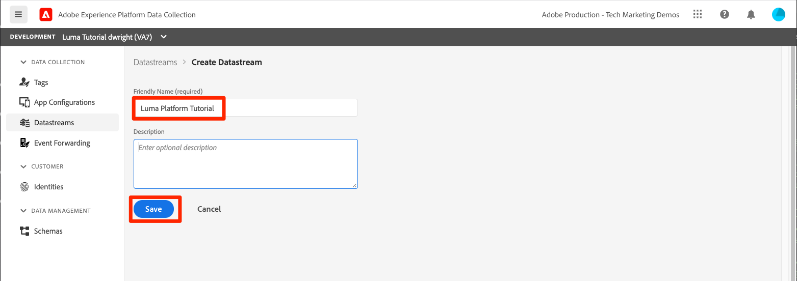
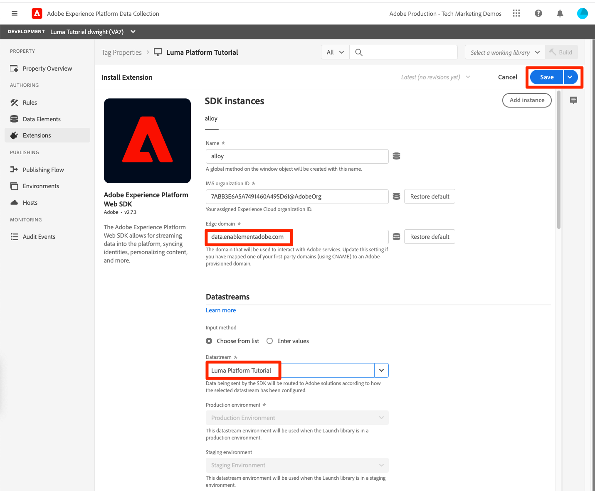
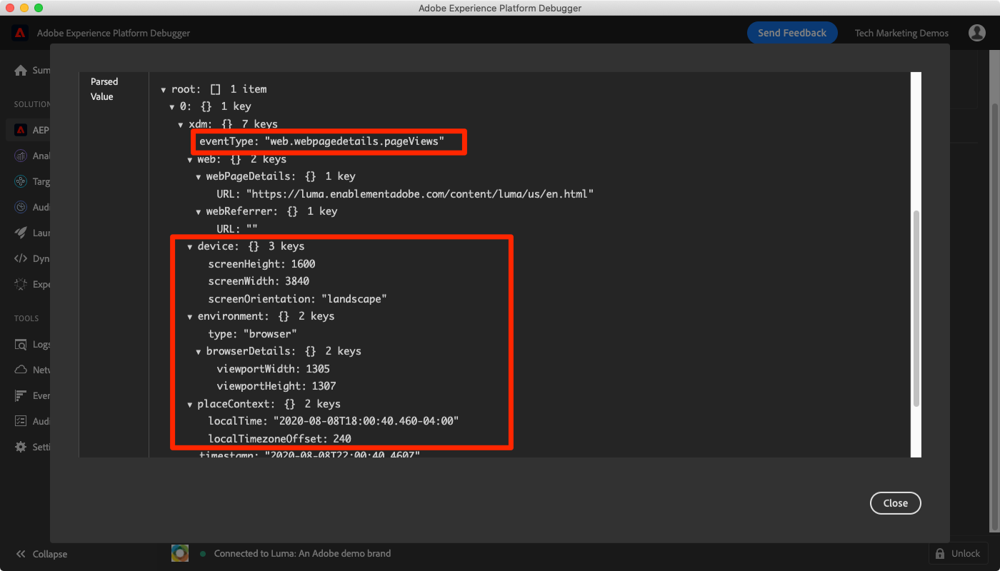

# Ingestion de données en flux continu

<!--1hr-->

Dans cette leçon, vous allez diffuser des données à l’aide du SDK Web de Adobe Experience Platform.

Nous devons effectuer deux tâches principales dans l’interface Collecte de données :

* Nous devons mettre en oeuvre le SDK Web sur le site web de Luma pour envoyer des données sur l’activité des visiteurs du site web vers le réseau Adobe Edge. Nous allons procéder à une mise en oeuvre simple à l’aide de balises (anciennement Launch).

* Nous devons configurer un flux de données, qui indique au réseau Edge où transférer les données. Nous le configurerons pour envoyer les données à notre `Luma Web Events` jeu de données dans notre environnement de test Platform.

**Ingénieurs de données** Vous devrez ingérer des données en continu en dehors de ce tutoriel. Lors de la mise en oeuvre des SDK web ou mobiles Adobe Experience Platform, un développeur web ou mobile est généralement impliqué dans la création de couche de données et la configuration des propriétés de balise.

Avant de commencer les exercices, regardez ces deux courtes vidéos pour en savoir plus sur l’ingestion de données par flux et le SDK Web :

>[!VIDEO](https://video.tv.adobe.com/v/28425?quality=12&learn=on)

>[!VIDEO](https://video.tv.adobe.com/v/34141?quality=12&learn=on)

>[!NOTE]
>
>Bien que ce tutoriel se concentre sur l’ingestion par flux à partir de sites web avec SDK Web, vous pouvez également diffuser des données à l’aide de la fonction [Adobe du SDK Mobile](https://developer.adobe.com/client-sdks/documentation/), [Apache Kafka Connect](https://github.com/adobe/experience-platform-streaming-connect), et d’autres mécanismes.

## Autorisations requises

Dans le [Configuration des autorisations](configure-permissions.md) leçon, vous configurez tous les contrôles d’accès requis pour terminer cette leçon.

<!--
* Permission items **[!UICONTROL Launch]** > **[!UICONTROL Property Rights]** > **[!UICONTROL Approve]**, **[!UICONTROL Develop]**, **[!UICONTROL Manage Environments]**, **[!UICONTROL Manage Extensions]**, and **[!UICONTROL Publish]**
* Permission item **[!UICONTROL Launch]** > **[!UICONTROL Company Rights]** > **[!UICONTROL Manage Properties]**
* User-role access to the `Luma Tutorial Launch` product profile
* Admin-role access to the `Luma Tutorial Launch` product profile
* Permission items **[!UICONTROL Platform]** > **[!UICONTROL Data Ingestion]** > **[!UICONTROL View Sources]** and **[!UICONTROL Manage Sources]**
* Permission items **[!UICONTROL Platform]** > **[!UICONTROL Data Management]** > **[!UICONTROL View Datasets]** and **[!UICONTROL Manage Datasets]**
* Permission items **[!UICONTROL Platform]** > **[!UICONTROL Profiles]** > **[!UICONTROL View Profiles]**, **[!UICONTROL Manage Profiles]** and **[!UICONTROL Export Audience Segment]**
* Permission item **[!UICONTROL Platform]** > **[!UICONTROL Sandbox Administration]** > **[!UICONTROL View Sandboxes]**
* Permission item **[!UICONTROL Platform]** > **[!UICONTROL Sandboxes]** > `Luma Tutorial`
* User-role access to the `Luma Tutorial Platform` product profile
-->

<!--## Create a streaming source

1. Log into the [Experience Platform  user interface](https://experience.adobe.com/platform/)
1. Go to **[!UICONTROL Sources]** in the left navigation
1. Filter the list by selecting **[!UICONTROL Streaming]**
1. In the **[!UICONTROL HTTP API]** section, select the **[!UICONTROL Configure]** button
    
1. On the **[!UICONTROL Authentication]** step, enter `Luma Web Events Source` as the **[!UICONTROL Account name]** and select the **[!UICONTROL Connect to source]** button (we don't need to enable authentication since the data will be originating from website visitors)
    
1. Once connected, select the **[!UICONTROL Next]** button to proceed to the next step in the workflow
1. On the **[!UICONTROL Select data]** step, choose **[!UICONTROL Existing Dataset]**, select your `Luma Web Events Dataset`, and then select the **[!UICONTROL Next]** button
    
1. On the **[!UICONTROL Dataflow detail]** step, select the **[!UICONTROL Next]** button:
    
    <!--What is a good practice for naming the data flow vs the source-->
<!--
1. On the **[!UICONTROL Review]** step, review your source details and select the **[!UICONTROL Finish]** button:
    
-->

## Configuration du flux de données

Tout d’abord, nous allons configurer le flux de données. Un flux de données indique au réseau Adobe Edge où envoyer les données après les avoir reçues de l’appel du SDK Web. Par exemple, souhaitez-vous envoyer les données à Experience Platform, Adobe Analytics ou Adobe Target ? Les flux de données sont gérés dans l’interface utilisateur de la collecte de données (anciennement Launch) et sont essentiels à la collecte de données à l’aide du SDK Web.

Pour créer votre [!UICONTROL datastream]:

1. Connectez-vous au [Interface utilisateur de la collecte de données Experience Platform](https://experience.adobe.com/launch/)
   <!--when will the edge config go live?-->

1. Sélectionner **[!UICONTROL Datastreams]** dans le volet de navigation de gauche
1. Sélectionnez la **[!UICONTROL Nouvelle structure de données]** dans le coin supérieur droit

   

1. Pour le **[!UICONTROL Nom convivial]**, saisissez `Luma Platform Tutorial` (ajoutez votre nom à la fin, si plusieurs personnes de votre société suivent ce tutoriel)
1. Sélectionnez la **[!UICONTROL Enregistrer]** button

   

Dans l’écran suivant, vous spécifiez l’emplacement d’envoi des données. Pour envoyer des données à l’Experience Platform :

1. Activation **[!UICONTROL Adobe Experience Platform]** pour exposer des champs supplémentaires
1. Pour **[!UICONTROL Sandbox]**, sélectionnez `Luma Tutorial`
1. Pour **[!UICONTROL Jeu de données d’événement]**, sélectionnez `Luma Web Events Dataset`
1. Si vous utilisez d’autres applications Adobe, n’hésitez pas à explorer les autres sections pour déterminer les informations requises dans la configuration Edge de ces autres solutions. N’oubliez pas que le SDK Web a été développé non seulement pour diffuser des données en continu dans Experience Platform, mais également pour remplacer toutes les bibliothèques JavaScript précédentes utilisées par d’autres applications Adobe. La configuration Edge permet de spécifier les détails du compte de chaque application à laquelle vous souhaitez envoyer les données.
1. Sélectionnez **[!UICONTROL Enregistrer]**
   

Une fois la configuration Edge enregistrée, l’écran qui en résulte affiche trois environnements créés pour le développement, l’évaluation et la production. D’autres environnements de développement peuvent être ajoutés :

Les trois environnements contiennent les détails de Platform que vous venez de saisir. Toutefois, ces détails peuvent être configurés différemment selon l’environnement. Par exemple, chaque environnement peut envoyer des données à un environnement de test Platform différent. Dans ce tutoriel, nous n’apporterons aucune personnalisation supplémentaire à notre flux de données.

## Installation de l’extension SDK Web

### Ajout d’une propriété

Tout d’abord, nous devons créer une propriété de balise (anciennement une propriété de balise). Une propriété est un conteneur pour l’ensemble du code JavaScript, des règles et d’autres fonctionnalités nécessaires pour collecter des détails à partir d’une page web et les envoyer à différents emplacements.

Pour créer une propriété :

1. Accédez à **[!UICONTROL Propriétés]** dans le volet de navigation de gauche
1. Sélectionnez la **[!UICONTROL Nouvelle propriété]** button
   
1. Comme la variable **[!UICONTROL Nom]**, saisissez `Luma Platform Tutorial` (ajoutez votre nom à la fin, si plusieurs personnes de votre société suivent ce tutoriel)
1. Comme la variable **[!UICONTROL Domaines]**, saisissez `enablementadobe.com` (expliqué ultérieurement)
1. Sélectionnez **[!UICONTROL Enregistrer]**
   

<!--
After saving the property, you might see an error message like the one below. If so, this is because you don't actually have access to the property you just created. To fix this, we need to go to the Admin Console to give yourself access:
    

To give yourself access to the property:

1. In a separate browser tab, log into the [Admin Console](https://adminconsole.adobe.com/)
1. Go to **[!UICONTROL Products]** from the top navigation
1. Select **[!UICONTROL Adobe Experience Platform Launch]** on the left navigation
1. Go to your `Luma Tutorial Launch` product profile
1. Go to the **[!UICONTROL Permissions]** tab
1. On the **[!UICONTROL Properties]** row, select **[!UICONTROL Edit]**
    
1. Select the "+" icon to move your `Luma Platform Tutorial` property to the right-hand side and select the **[!UICONTROL Save]** button to update the permissions
   
    

Now switch back to your browser tab with the Data Collection interface still open. Reload the page and the `Luma Platform Tutorial` property should display in the list. Select to open the property:

-->

## Ajout de l’extension SDK Web

Maintenant que vous disposez d’une propriété, vous pouvez ajouter le SDK Web à l’aide d’une extension . Une extension est un module de code qui étend l’interface et les fonctionnalités de la collecte de données. Ajout de l’extension:

1. Ouvrir la propriété de balise
1. Accédez à **[!UICONTROL Extensions]** dans le volet de navigation de gauche
1. Accédez au **[!UICONTROL Catalogue]** tab
1. De nombreuses extensions sont disponibles pour les balises. Filtrage du catalogue avec le terme `Web SDK`
1. Dans le **[!UICONTROL SDK Web Adobe Experience Platform]** , sélectionnez la variable **[!UICONTROL Installer]** button
   
1. Plusieurs configurations sont disponibles pour l’extension SDK Web, mais deux d’entre elles seulement seront configurées pour ce tutoriel. Mettez à jour le **[!UICONTROL Domaine Edge]** to `data.enablementadobe.com`. Ce paramètre vous permet de définir des cookies propriétaires avec votre implémentation du SDK Web, ce qui est recommandé. Plus loin dans cette leçon, vous allez mapper un site web sur la `enablementadobe.com` domaine à la propriété de balise. Le CNAME de la variable `enablementadobe.com` a déjà été configuré de sorte que `data.enablementadobe.com` sera transféré vers les serveurs Adobe. Lorsque vous implémentez un SDK Web sur votre propre site Web, vous devez créer un CNAME à des fins de collecte de données, par exemple : `data.YOUR_DOMAIN.com`
1. Dans la **[!UICONTROL Datastream]** dans la liste déroulante, sélectionnez votre `Luma Platform Tutorial` datastream.
1. N’hésitez pas à consulter les autres options de configuration (mais ne les modifiez pas). puis sélectionnez **[!UICONTROL Enregistrer]**
   <!--is edge domain required for first party? when will it break?-->
   <!--any other fields that should be highlighted-->
   

## Créer une règle pour envoyer des données

Nous allons maintenant créer une règle pour envoyer des données à Platform. Une règle est une combinaison d’événements, de conditions et d’actions qui indiquent aux balises de faire quelque chose. Création d’une règle:

1. Accédez à **[!UICONTROL Règles]** dans le volet de navigation de gauche
1. Sélectionnez la **[!UICONTROL Créer une règle]** button
   
1. Donnez à la règle le nom `All Pages - Library Loaded`.
1. Sous **[!UICONTROL Événements]**, sélectionnez la variable **[!UICONTROL Ajouter]** button
   
1. Utilisez la variable **[!UICONTROL Core]** **[!UICONTROL Extension]** et sélectionnez **[!UICONTROL Bibliothèque chargée (Haut de page)]** comme la propriété **[!UICONTROL Type d’événement]**. Ce paramètre signifie que notre règle se déclenche chaque fois que la bibliothèque Launch se charge sur une page.
1. Sélectionner **[!UICONTROL Conserver les modifications]** pour revenir à l’écran de la règle principale
   
1. Laissez tomber **[!UICONTROL Conditions]** vide, car nous voulons que cette règle se déclenche sur toutes les pages, selon le nom que nous lui avons donné.
1. Sous **[!UICONTROL Actions]**, sélectionnez la variable **[!UICONTROL Ajouter]** button
1. Utilisez la variable **[!UICONTROL SDK Web Adobe Experience Platform]** **[!UICONTROL Extension]** et sélectionnez **[!UICONTROL Envoyer un événement]** comme la propriété **[!UICONTROL Type d’action]**
1. À droite, sélectionnez **[!UICONTROL web.webpagedetails.pageViews]** de la **[!UICONTROL Type]** menu déroulant. Il s’agit de l’un des champs XDM de notre `Luma Web Events Schema`
1. Sélectionner **[!UICONTROL Conserver les modifications]** pour revenir à l’écran de la règle principale
   
1. Sélectionner **[!UICONTROL Enregistrer]** pour enregistrer la règle\
   

## Publier la règle dans une bibliothèque

Ensuite, nous publierons la règle dans notre environnement de développement afin que nous puissions vérifier qu’elle fonctionne.

<!--
There are a few quick steps we must take in the **[!UICONTROL Publishing]** section of Launch.

### Create a host

Launch libraries can be hosted on Adobe's Content Delivery Network (CDN) or on your own servers. In this tutorial, we will use Adobe's CDN since it is faster to set up:

1. Go to **[!UICONTROL Hosts]** in the left navigation
1. Select the **[!UICONTROL Create New Host]** button
       
1. For the **[!UICONTROL Name]**, enter `Adobe CDN`
1. For the **[!UICONTROL Type]**, select **[!UICONTROL Managed by Adobe]**
1. Select the **[!UICONTROL Save]** button to complete the setup of the host
       

### Create an environment

Environments allow you to have different versions of a library in different publishing environments to accommodate your publishing workflow. For example, the fully tested version of your library can be published to a Production environment, while new changes are being created in a Development environment. You can also use different hosts for each environment. To create an environment:

1. Go to **[!UICONTROL Environments]** in the left navigation
1. Select the **[!UICONTROL Create New Environment]** button
     
1. Under **[!UICONTROL Development]** select **[!UICONTROL Select]**   
     
1. For the **[!UICONTROL Name]**, enter `Development`
1. For the **[!UICONTROL Select Host]** dropdown, select `Adobe CDN`
1. Select the **[!UICONTROL Save]** button to complete the setup of the environment
    
1. You will see a modal with URL and other implementation details of this library. These are critical for a real Launch implementation, but we don't need to worry about them for this tutorial. Select the **[!UICONTROL Close]** button to exit the modal.

### Create and publish the library

Now let's bundle the contents of our property&mdash;currently an extension and a rule&mdash;into a library. 
-->

Pour créer une bibliothèque :

1. Accédez à **[!UICONTROL Flux de publication]** dans le volet de navigation de gauche
1. Sélectionner **[!UICONTROL Ajouter une bibliothèque]**
   
1. Pour le **[!UICONTROL Nom]**, saisissez `Luma Platform Tutorial`
1. Pour le **[!UICONTROL Environnement]**, sélectionnez `Development`
1. Sélectionnez la **[!UICONTROL Ajouter toutes les ressources modifiées]** bouton . (En plus de la variable [!UICONTROL SDK Web Adobe Experience Platform] et l’extension `All Pages - Library Loaded` , vous verrez également la variable [!UICONTROL Core] extension ajoutée contenant le code JavaScript de base requis par toutes les propriétés web de Launch.)
1. Sélectionnez la **[!UICONTROL Enregistrement et création pour le développement]** button
   

La création de la bibliothèque peut prendre quelques minutes. Une fois l’opération terminée, un point vert s’affiche à gauche du nom de la bibliothèque :

Comme vous pouvez le voir sur la [!UICONTROL Flux de publication] le processus de publication, qui dépasse le cadre de ce tutoriel, contient beaucoup d’autres éléments. Nous allons juste utiliser une seule bibliothèque dans notre environnement de développement.

## Valider les données de la requête

### Ajout du débogueur Adobe Experience Platform

Le débogueur Experience Platform est une extension disponible pour les navigateurs Chrome et Firefox qui vous permet de voir la technologie d’Adobe mise en oeuvre dans vos pages web. Téléchargez la version de votre navigateur préféré :

* [Extension Firefox](https://addons.mozilla.org/fr/firefox/addon/adobe-experience-platform-dbg/)
* [Extension Chrome](https://chrome.google.com/webstore/detail/adobe-experience-platform/bfnnokhpnncpkdmbokanobigaccjkpob)

Si vous n’avez jamais utilisé le débogueur auparavant (et que celui-ci est différent de l’ancien débogueur Adobe Experience Cloud), vous pouvez regarder cette vidéo de présentation de cinq minutes :

>[!VIDEO](https://video.tv.adobe.com/v/32156?quality=12&learn=on)

### Ouvrez le site web Luma .

Pour ce tutoriel, nous utilisons une version hébergée publiquement du site web de démonstration de Luma. Ouvrons-le et marquons-le :

1. Dans un nouvel onglet du navigateur, ouvrez le [Site web Luma](https://luma.enablementadobe.com/content/luma/us/en.html).
1. Mettre la page en signet à utiliser dans le reste du tutoriel

Ce site Web hébergé est la raison pour laquelle nous avons utilisé `enablementadobe.com` dans le [!UICONTROL Domaines] champ de notre configuration initiale de la propriété de balise et pourquoi nous avons utilisé `data.enablementadobe.com` comme domaine propriétaire dans le [!UICONTROL SDK Web Adobe Experience Platform] extension . Vous voyez, j&#39;avais un plan !

### Utilisez l’Experience Platform Debugger pour mapper la propriété à votre balise.

Le débogueur Experience Platform dispose d’une fonctionnalité intéressante qui vous permet de remplacer une propriété de balise existante par une autre. Cela s’avère utile pour la validation et nous permet d’ignorer de nombreuses étapes de mise en oeuvre dans ce tutoriel.

1. Assurez-vous que le site Luma est ouvert et sélectionnez l’icône de l’extension Debugger Experience Platform.
1. Le débogueur s’ouvre et affiche quelques détails sur l’implémentation codée en dur, qui n’est pas liée à ce tutoriel (vous devrez peut-être recharger le site Luma après avoir ouvert le débogueur).
1. Vérifiez que le débogueur est &quot;**[!UICONTROL Connexion à Luma]**&quot; comme illustré ci-dessous, puis sélectionnez &quot;**[!UICONTROL lock]**&quot; pour verrouiller le débogueur sur le site Luma.
1. Sélectionnez la **[!UICONTROL Se connecter]** en haut à droite pour vous authentifier.
1. Maintenant, accédez à **[!UICONTROL Launch]** dans le volet de navigation de gauche
1. Sélectionnez l’onglet Configuration .
1. À droite de l’emplacement où il vous montre la variable **[!UICONTROL Codes d’intégration de page]**, ouvrez le **[!UICONTROL Actions]** , puis sélectionnez **[!UICONTROL Remplacer]**
   
1. Puisque vous êtes authentifié, le débogueur va extraire vos propriétés et environnements Launch disponibles. Sélectionnez votre `Luma Platform Tutorial` property
1. Sélectionnez votre `Development` environnement
1. Sélectionnez la **[!UICONTROL Appliquer]** button
   
1. Le site web Luma est maintenant rechargé. _avec votre propriété de balise_. À l&#39;aide, j&#39;ai été piraté ! Je plaisante.
   
1. Accédez à **[!UICONTROL Résumé]** dans le volet de navigation de gauche, pour afficher les détails de votre [!UICONTROL Launch] property
   
1. Maintenant, accédez à **[!UICONTROL SDK Web AEP]** dans le volet de navigation de gauche pour afficher la variable **[!UICONTROL Requêtes réseau]**
1. Ouvrez le **[!UICONTROL events]** row

   
1. Notez comment nous pouvons voir la variable `web.webpagedetails.pageView` type d’événement que nous avons spécifié dans notre [!UICONTROL Envoyer un événement] , ainsi que d’autres variables prêtes à l’emploi conformes à la `AEP Web SDK ExperienceEvent Mixin` format
   
1. Ces types de détails de requête sont également visibles dans les outils de développement web du navigateur. **Réseau** . Ouvrez-le et rechargez la page. Filtrer les appels avec `interact` pour localiser l’appel, sélectionnez-le, puis recherchez dans le **En-têtes** onglet, **Charge utile de requête** zone.
   
1. Accédez au **Réponse** et notez comment la valeur ECID est incluse dans la réponse. Copiez cette valeur car vous l’utiliserez pour valider les informations de profil lors de l’exercice suivant.
   

## Validation des données dans Experience Platform

Vous pouvez vérifier que les données arrivent dans Platform en examinant les lots de données qui arrivent dans le `Luma Web Events Dataset`. (Je sais, ça s&#39;appelle l&#39;ingestion de données par flux, mais maintenant je dis qu&#39;elle arrive par lots ! Elle est diffusée en temps réel vers Profile, de sorte qu’elle peut être utilisée pour la segmentation et l’activation en temps réel, mais elle est envoyée par lots toutes les 15 minutes au lac de données.)

Pour valider les données :

1. Dans l’interface utilisateur de Platform, accédez à **[!UICONTROL Jeux de données]** dans le volet de navigation de gauche
1. Ouvrez le `Luma Web Events Dataset` et vérifiez qu’un lot est arrivé. Souvenez-vous qu’ils sont envoyés toutes les 15 minutes. Vous devrez peut-être donc attendre que le lot s’affiche.
1. Sélectionnez la **[!UICONTROL Prévisualisation d’un jeu de données]** button
   
1. Dans la fenêtre modale d’aperçu, notez comment sélectionner différents champs du schéma sur la gauche pour prévisualiser ces points de données spécifiques :
   

Vous pouvez également confirmer que le nouveau profil s’affiche :

1. Dans l’interface utilisateur de Platform, accédez à **[!UICONTROL Profils]** dans le volet de navigation de gauche
1. Sélectionnez la **[!UICONTROL ECID]** et recherchez votre valeur ECID (copiez-la depuis la réponse ). Le profil aura son propre identifiant, distinct de l’ECID.
1. Sélectionnez la **[!UICONTROL Identifiant de profil]** pour ouvrir le profil
   
1. Sélectionnez la **[!UICONTROL Événements]** pour afficher les pages que vous avez consultées.
   \
   <!---->

## Ajout de données personnalisées à l’événement

### Création d’un élément de données pour le nom de page

1. Dans l’interface des balises de collecte de données, dans le coin supérieur droit de votre `Luma Platform Tutorial` , ouvrez la propriété **[!UICONTROL Sélectionner une bibliothèque de travail]** dans la liste déroulante, puis sélectionnez votre `Luma Platform Tutorial` bibliothèque . Ce paramètre facilite la publication de mises à jour supplémentaires dans notre bibliothèque.
1. Maintenant, accédez à **[!UICONTROL Éléments de données]** dans le volet de navigation de gauche
1. Sélectionnez la **[!UICONTROL Créer un élément de données]** button

   
1. Comme la variable **[!UICONTROL Nom]**, saisissez `Page Name`
1. Comme la variable **[!UICONTROL Type d’élément de données]**, sélectionnez `JavaScript Variable`
1. Comme la variable **[!UICONTROL Nom de variable JavaScript]**, saisissez `digitalData.page.pageInfo.pageName`
1. Pour vous aider à normaliser le format des valeurs, cochez les cases correspondant à **[!UICONTROL Forcer la valeur en minuscules]** et **[!UICONTROL Texte clair]**
1. Assurez-vous que `Luma Platform Tutorial` est sélectionné comme bibliothèque de travail.
1. Sélectionner **[!UICONTROL Enregistrer dans la bibliothèque]**
   

### Faire correspondre le nom de page à l’élément de données de l’objet XDM

Nous allons maintenant mapper le nom de notre page au SDK Web.

>[!IMPORTANT]
>
>Pour terminer cette tâche, nous devons nous assurer que votre utilisateur a d’abord accès à l’environnement de test de production. Si vous n’avez pas encore accès à l’environnement de test de production à partir d’un autre profil de produit, ouvrez rapidement votre `Luma Tutorial Platform` profil et ajout de l’élément d’autorisation **[!UICONTROL Environnements de test]** > **[!UICONTROL Prod]**. Ensuite, effectuez une actualisation MAJ sur la page Éléments de données pour effacer le cache.
>

Sur le **[!UICONTROL Éléments de données]** page :

1. Création d’un élément de données
1. Comme la variable **[!UICONTROL Nom]**, saisissez `XDM Object`
1. Comme la variable **[!UICONTROL Extension]**, sélectionnez `Adobe Experience Platform Web SDK`
1. Comme la variable **[!UICONTROL Type d’élément de données]**, sélectionnez `XDM object`
1. Comme la variable **[!UICONTROL Sandbox]**, sélectionnez votre `Luma Tutorial` sandbox
1. Comme la variable **[!UICONTROL Schéma]**, sélectionnez votre `Luma Web Events Schema`
1. Sélectionnez la `web.webPageDetails.name` field
1. Comme la variable **[!UICONTROL Valeur]**, sélectionnez l’icône pour ouvrir le modal de sélection de l’élément de données et choisissez votre `Page Name` élément de données
1. Sélectionner **[!UICONTROL Enregistrer dans la bibliothèque]**
   

Ce même processus est utilisé pour mapper des données personnalisées supplémentaires sur votre site web aux champs XDM.

### Ajout des données XDM à votre action Envoyer l’événement

Maintenant que les données sont mappées aux champs XDM, vous pouvez les inclure dans votre action Envoyer l’événement :

1. Accédez au **[!UICONTROL Règles]** écran
1. Ouvrez votre `All Pages - Library Loaded` règle
1. Ouvrez le `Adobe Experience Platform Web SDK - Send Event` action
1. Comme la variable **[!UICONTROL Données XDM]**, sélectionnez l’icône pour ouvrir le modal de sélection de l’élément de données et choisissez votre `XDM Object` élément de données
1. Sélectionnez la **[!UICONTROL Conserver les modifications]** button
   
1. Maintenant, puisque vous avez eu `Luma Platform Tutorial` sélectionné comme bibliothèque de travail pour les derniers exercices, vos modifications récentes ont été enregistrées directement dans la bibliothèque . Au lieu d’avoir à publier nos modifications via l’écran Flux de publication , vous pouvez simplement ouvrir la liste déroulante sur le bouton bleu et sélectionner **[!UICONTROL Enregistrer dans la bibliothèque et créer]**
   

Cela commence à créer une bibliothèque de balises avec les trois modifications que vous venez d’effectuer.

### Validation des données XDM

Vous devriez maintenant pouvoir recharger la page d’accueil de Luma, tout en la mappant à votre propriété de balise à l’aide du débogueur, comme vous l’avez appris précédemment, et voir que le champ du nom de page est renseigné dans la requête !

Vous pouvez également valider les données de nom de page reçues dans Platform, en prévisualisant le jeu de données et le profil.

## Envoi d’identités supplémentaires

L’implémentation de votre SDK Web envoie désormais des événements avec l’identifiant Experience Cloud (ECID) comme identifiant Principal. L’ECID est généré automatiquement par le SDK Web et est unique par appareil et navigateur. Un seul client peut avoir plusieurs ECID en fonction de l’appareil et du navigateur qu’il utilise. Comment obtenir une vue unifiée de ce client et lier son activité en ligne à nos données CRM, fidélité et achat hors ligne ? Pour ce faire, nous collectons des identités supplémentaires au cours de leur session et relions déterministiquement leur profil par le biais de la combinaison d’identités.

Si vous vous souvenez, j’ai mentionné que nous utiliserions l’identifiant ECID et le CRM comme identités pour nos données web dans la variable [Mapper les identités](map-identities.md) leçon. Alors, collectons l’identifiant CRM avec le SDK Web !

### Ajouter un élément de données pour l’identifiant CRM

Tout d’abord, nous stockons l’identifiant CRM dans un élément de données :

1. Dans l’interface des balises, ajoutez un élément de données nommé `CRM Id`
1. Comme la variable **[!UICONTROL Type d’élément de données]**, sélectionnez **[!UICONTROL Variable JavaScript]**
1. Comme la variable **[!UICONTROL Nom de variable JavaScript]**, saisissez `digitalData.user.0.profile.0.attributes.username`
1. Sélectionnez la **[!UICONTROL Enregistrer dans la bibliothèque]** bouton (`Luma Platform Tutorial` devrait toujours être votre bibliothèque de travail)
   

### Ajout de l’ID CRM à l’élément de données de carte des identités

Maintenant que nous avons capturé la valeur d’identifiant CRM, nous devons l’associer à un type d’élément de données spécial appelé [!UICONTROL Mappage d’identités] élément de données :

1. Ajouter un élément de données nommé `Identities`
1. Comme la variable **[!UICONTROL Extension]**, sélectionnez **[!UICONTROL SDK Web Adobe Experience Platform]**
1. Comme la variable **[!UICONTROL Type d’élément de données]**, sélectionnez **[!UICONTROL Mappage d’identités]**
1. Comme la variable **[!UICONTROL Espace de noms]**, saisissez `Luma CRM Id`, qui est la variable [!UICONTROL namespace] nous avons créé une leçon précédente

   >[!WARNING]
   >
   >L’extension SDK Web Adobe Experience Platform version 2.2 vous permet de sélectionner Espace de noms dans une liste déroulante prérenseignée à l’aide des valeurs réelles de votre compte Platform. Malheureusement, cette fonctionnalité n’est pas encore &quot;compatible avec les environnements de test&quot; et, par conséquent, la variable `Luma CRM Id` peut ne pas apparaître dans la liste déroulante. Cela peut vous empêcher de terminer cet exercice. Nous publierons une solution une fois confirmée.

1. Comme la variable **[!UICONTROL ID]**, sélectionnez l’icône pour ouvrir le modal de sélection de l’élément de données et choisissez votre `CRM Id` élément de données
1. Comme la variable **[!UICONTROL État authentifié]**, sélectionnez **[!UICONTROL Authentifié]**
1. Laissez tomber **[!UICONTROL Principal]** _unchecked_. Comme l’identifiant CRM n’est pas présent pour la plupart des visiteurs du site web Luma, vous êtes certain que _ne souhaitez pas remplacer l’ECID en tant qu’identifiant Principal._. Il serait rare d’utiliser autre chose que l’ECID comme identifiant Principal. En règle générale, je ne mentionne pas les paramètres par défaut dans ces instructions, mais j’appelle celui-ci pour vous aider à éviter les maux de tête plus tard dans votre propre mise en oeuvre.
1. Sélectionnez la **[!UICONTROL Enregistrer dans la bibliothèque]** bouton (`Luma Platform Tutorial` devrait toujours être votre bibliothèque de travail)
   

>[!NOTE]
>
>Vous pouvez transmettre plusieurs identifiants à l’aide de la variable [!UICONTROL Mappage d’identités] type de données.

### Ajout de l’élément de données Identity Map à l’objet XDM

Il existe un autre élément de données que nous devons mettre à jour : l’élément de données Objet XDM. Il peut sembler étrange d’avoir à mettre à jour trois éléments de données distincts pour transmettre cette identité unique, mais ce processus est conçu pour s’adapter à plusieurs identités. Ne vous inquiétez pas, nous en avons presque fini avec cette leçon !

1. Ouvrez votre élément de données Objet XDM .
1. Ouvrez le champ XDM IdentityMap
1. Comme la variable **[!UICONTROL Élément de données]**, sélectionnez l’icône pour ouvrir le modal de sélection de l’élément de données et choisissez votre `Identities` élément de données
1. Maintenant, puisque vous avez eu `Luma Platform Tutorial` sélectionné comme bibliothèque de travail pour les derniers exercices, vos modifications récentes ont été enregistrées directement dans la bibliothèque . Au lieu d’avoir à publier vos modifications via l’écran Flux de publication , vous pouvez ouvrir la liste déroulante sur le bouton bleu et sélectionner **[!UICONTROL Enregistrer dans la bibliothèque et créer]**
   

### Validation de l’identité

Pour vérifier que l’identifiant CRM est maintenant envoyé par le SDK Web :

1. Ouvrez le [Site web Luma](https://luma.enablementadobe.com/content/luma/us/en.html)
1. Mappez-le à votre propriété de balise à l’aide du débogueur, conformément aux instructions précédentes.
1. Sélectionnez la **Connexion** lien en haut à droite du site web Luma
1. Connexion à l’aide des informations d’identification `test@adobe.com`/`test`
1. Une fois authentifié, examinez l’appel du SDK Web Experience Platform dans le débogueur (**[!UICONTROL SDK Web Adobe Experience Platform]** > **[!UICONTROL Requêtes réseau]** > **[!UICONTROL events]** de la requête la plus récente) et vous devriez voir la variable `lumaCrmId`:
   
1. Recherchez le profil utilisateur à l’aide de l’espace de noms et de la valeur ECID. Dans le profil, vous verrez l’identifiant CRM, ainsi que l’identifiant de fidélité, et les détails du profil tels que le nom et le numéro de téléphone. Toutes les identités et données ont été regroupées dans un profil client unique en temps réel.
   

## Ressources supplémentaires

* [Implémenter dʼAdobe Experience Cloud avec le SDK web](/help/tutorial-web-sdk/overview.md)
* [Documentation sur l’ingestion par flux](https://experienceleague.adobe.com/docs/experience-platform/ingestion/streaming/overview.html?lang=fr)
* [Référence de l’API d’ingestion en flux continu](https://developer.adobe.com/experience-platform-apis/references/streaming-ingestion/)

Très bon travail ! C’était beaucoup d’informations sur le SDK Web et Launch. Il y a beaucoup plus d’implication dans une implémentation complète, mais ce sont les bases pour vous aider à commencer et voir les résultats dans Platform.

>[!NOTE]
>
>Maintenant que vous avez terminé la leçon sur l’ingestion en flux continu, vous pouvez supprimer la variable [!UICONTROL Prod] environnement de test de votre `Luma Tutorial Platform` profil de produits

Les ingénieurs de données, si vous le souhaitez, vous pouvez passer au [leçon sur les requêtes d’exécution](run-queries.md).

Architectes de données, vous pouvez passer à [stratégies de fusion](create-merge-policies.md)!
