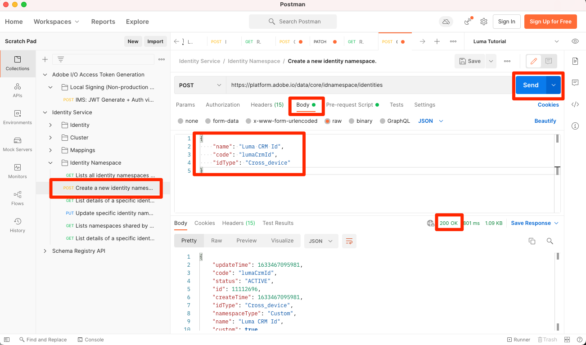

# Mapping d’identités

<!-- 30 min-->

Dans cette leçon, nous allons créer des espaces de noms d’identité et ajouter des champs d’identité à nos schémas. Après cela, nous pourrons également terminer les relations de schéma de la leçon précédente.

Adobe Experience Platform Identity Service vous permet de mieux connaître vos clients et leurs comportements en rapprochant des identités entre appareils et systèmes, ce qui vous permet de proposer des expériences numériques personnelles et percutantes en temps réel. Les champs d’identité et les espaces de noms sont la colle qui relie différentes sources de données pour créer le profil client en temps réel à 360 degrés.

**Les architectes de données** devront mapper des identités en dehors de ce tutoriel.

Avant de commencer les exercices, regardez cette courte vidéo pour en savoir plus sur l’identité dans Adobe Experience Platform :
>[!VIDEO](https://video.tv.adobe.com/v/27841?learn=on)

>[!NOTE]
>
>Les champs d’identité ne sont requis que si vous créez des profils clients en temps réel. Elles ne sont pas requises si vous ingérez uniquement des données dans le lac de données.

<!--explain identity maps-->
<!--explain the strategy behind the identity selection, how these identities will join all the data together-->

## Autorisations requises

Dans la leçon [Configurer les autorisations](configure-permissions.md) , vous configurez tous les contrôles d’accès requis pour terminer cette leçon.

<!--
* Permission items **[!UICONTROL Identity Management]** > **[!UICONTROL View Identity Namespaces]** and **[!UICONTROL Manage Identity Namespaces]**
* Permission item **[!UICONTROL Data Modeling]** > **[!UICONTROL View Schemas]** and **[!UICONTROL Manage Schemas]**
* Permission item **[!UICONTROL Sandboxes]** > `Luma Tutorial`
* User-role access to the `Luma Tutorial Platform` product profile
* Developer-role access to the `Luma Tutorial Platform` product profile (for API)
-->

## Créer un espace de noms identité

Au cours de cet exercice, nous allons créer des espaces de noms d’identité pour les champs d’identité personnalisés de Luma, `loyaltyId`, `crmId` et `productSku`. Les espaces de noms d’identité jouent un rôle essentiel dans la création de profils clients en temps réel, car deux valeurs correspondantes dans le même espace de noms permettent à deux sources de données de former un graphique d’identité.


### Création d’espaces de noms dans l’interface utilisateur

Commençons par créer un espace de noms pour le schéma de fidélité Luma :

1. Dans l’interface utilisateur de Platform, accédez à **[!UICONTROL Identités]** dans le volet de navigation de gauche.
1. Vous remarquerez que plusieurs espaces de noms d’identité d’usine sont disponibles. Sélectionnez le bouton **[!UICONTROL Créer un espace de noms d’identité]**
1. Fournissez les détails suivants :

   | Champ | Valeur |
   |---------------|-----------|
   | Nom d’affichage | Identifiant De Fidélité Luma |
   | Symbole d’identité | lumaLoyaltyId |
   | Type | Multi-appareils |

1. Sélectionnez **[!UICONTROL Créer]**

   

Configurez maintenant un autre espace de noms pour le schéma du catalogue de produits Luma avec les détails suivants :

| Champ | Valeur |
|---------------|-----------|
| Nom d’affichage | SKU du produit Luma |
| Symbole d’identité | lumaProductSKU |
| Type | Identifiant non personnel |


## Création d’un espace de noms d’identité à l’aide de l’API

Nous allons créer notre espace de noms CRM via l&#39;API.

>[!NOTE]
>
>Si vous préférez ignorer les exercices d’API, n’hésitez pas à créer l’espace de noms CRM via la méthode d’interface utilisateur que vous avez utilisée avec les détails suivants :
>
> 1. En tant que **[!UICONTROL nom d&#39;affichage]**, utilisez `Luma CRM Id`
> 1. En tant que **[!UICONTROL symbole d&#39;identité]**, utilisez `lumaCrmId`
> 1. En tant que **[!UICONTROL Type]**, utilisez l’option Cross-Device

Créons l’espace de noms d’identité `Luma CRM Id` :

1. Téléchargez [ Identity Service.postman_collection.json](https://raw.githubusercontent.com/adobe/experience-platform-postman-samples/master/apis/experience-platform/Identity%20Service.postman_collection.json) dans votre dossier `Luma Tutorial Assets`
1. Importez la collection dans [!DNL Postman]
1. Si vous ne disposez pas d’un jeton d’accès, ouvrez la requête **[!DNL OAuth: Request Access Token]** et sélectionnez **Envoyer** pour demander un nouveau jeton d’accès.
1. Sélectionnez la requête **[!UICONTROL Identity Service] > [!UICONTROL Identity Namespace] > [!UICONTROL Créer un espace de noms d’identité].**
1. Collez les éléments suivants en tant que [!DNL Body] de la requête :

   ```json
   {
       "name": "Luma CRM Id",
       "code": "lumaCrmId",
       "idType": "Cross_device"
   }
   ```

1. Appuyez sur le bouton **Send** et vous devriez obtenir une réponse **200 OK** :

   

Si vous revenez à l’interface utilisateur, vos trois nouveaux espaces de noms personnalisés s’affichent désormais :


## Étiquetage des champs d’identité dans les schémas

Maintenant que nous disposons de nos espaces de noms, l’étape suivante consiste à mettre à jour nos schémas pour étiqueter nos champs d’identité.


### Étiquetage Des Champs XDM Pour L’Identité Principal

Chaque schéma utilisé avec Real-time Customer Profile doit comporter une identité principale spécifiée. Et chaque enregistrement ingéré doit avoir une valeur pour ce champ.

Ajoutons une identité principale à `Luma Loyalty Schema` :

1. Ouvrez le `Luma Loyalty Schema`
1. Sélectionnez le `Luma Identity profile field group`
1. Sélectionnez le champ `loyaltyId`
1. Cochez la case **[!UICONTROL Identity]**
1. Cochez également la case **[!UICONTROL Principal Identity]**
1. Sélectionnez l’espace de noms `Luma Loyalty Id` dans la liste déroulante **[!UICONTROL Espaces de noms d’identité]**
1. Sélectionnez **[!UICONTROL Apply]**
1. Sélectionnez **[!UICONTROL Save]**

   

Répétez le processus pour certains de vos autres schémas :

1. Dans `Luma CRM Schema`, étiquetez le champ `crmId` comme identité principale à l’aide de l’espace de noms `Luma CRM Id`.
1. Dans `Luma Offline Purchase Events Schema`, étiquetez le champ `loyaltyId` comme identité principale à l’aide de l’espace de noms `Luma Loyalty Id`.
1. Dans `Luma Product Catalog Schema`, étiquetez le champ `productSku` comme identité principale à l’aide de l’espace de noms `Luma Product SKU`.

>[!NOTE]
>
>Les données collectées avec le SDK Web constituent une exception à la pratique habituelle de l’étiquetage des champs d’identité dans le schéma. Le SDK Web utilise la carte des identités pour étiqueter les identités *du côté de l’implémentation*. Nous allons donc déterminer les identités pour le `Luma Web Events Schema` lors de l’implémentation du SDK Web sur le site web de Luma. Dans cette leçon ultérieure, nous allons collecter l’identifiant visiteur Experience Cloud (ECID) comme identifiant principal et crmId comme identifiant secondaire.

Avec notre sélection des identités primaires, il est clair de voir comment `Luma CRM Schema` peut se connecter à `Luma Offline Purchase Events Schema` puisqu’ils utilisent tous deux `loyaltyId` comme identifiant. Mais comment pouvons-nous connecter nos achats hors ligne au comportement en ligne ? Comment pouvons-nous classer les produits achetés dans notre catalogue de produits ? Nous utiliserons d’autres champs d’identité et relations de schémas.

<!--use a visual-->

### Étiquetage Des Champs XDM Pour L’Identité Secondaire

Plusieurs champs d’identité peuvent être ajoutés à un schéma. Les identités non primaires sont souvent appelées identités secondaires. Pour connecter les achats hors ligne au comportement en ligne, nous ajouterons le crmId en tant qu’identifiant secondaire à notre `Luma Loyalty Schema` et plus tard dans nos données d’événements web. Mettons à jour le `Luma Loyalty Schema` :

1. Ouvrez le `Luma Loyalty Schema`
1. Sélectionner `Luma Identity Profile Field group`
1. Sélectionner le champ `crmId`
1. Cochez la case **[!UICONTROL Identity]**
1. Sélectionnez l’espace de noms `Luma CRM Id` dans la liste déroulante **[!UICONTROL Espaces de noms d’identité]**
1. Sélectionnez **[!UICONTROL Apply]** , puis cliquez sur le bouton **[!UICONTROL Save]** pour enregistrer vos modifications.

   

## Compléter les relations de schéma

Maintenant que nos champs d’identité sont libellés, nous pouvons terminer la configuration des relations de schéma entre le catalogue de produits de Luma et les schémas d’événement :

1. Ouvrez le `Luma Offline Purchase Events Schema`
1. Sélectionnez le groupe de champs **[!UICONTROL Détails du Commerce]**
1. Sélectionnez le champ **[!UICONTROL productListItems]** > **[!UICONTROL SKU]**
1. Cochez la case **[!UICONTROL Relationship]**
1. Sélectionnez `Luma Product Catalog Schema` comme **[!UICONTROL schéma de référence]**
1. `Luma Product SKU` doit automatiquement être renseigné en tant que **[!UICONTROL espace de noms d’identité de référence]**
1. Sélectionnez **[!UICONTROL Apply]**
1. Sélectionnez **[!UICONTROL Save]**

   

Répétez ce processus pour créer une relation entre `Luma Web Events Schema` et `Luma Product Catalog Schema`.

Notez qu’après avoir défini la relation, elle est indiquée dans les sections **[!UICONTROL Composition]** et **[!UICONTROL Structure]** de l’éditeur de schéma.


<!--need to verify that the relationship schema works-->

## Ressources supplémentaires

* [Documentation Identity Service](https://experienceleague.adobe.com/docs/experience-platform/identity/home.html?lang=fr)
* [API Service d’identités](https://www.adobe.io/experience-platform-apis/references/identity-service/)

Maintenant que nos identités sont en place, nous pouvons [créer nos jeux de données](create-datasets.md) !
