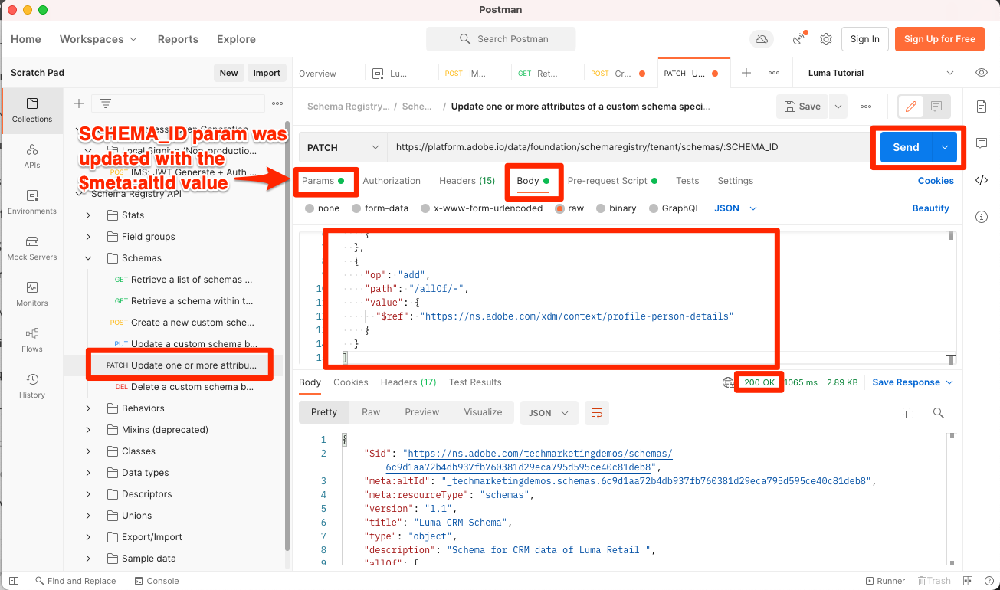

# Données de modèle dans les schémas

<!-- 60min -->
Dans cette leçon, vous allez modéliser les données de Luma en schémas. C&#39;est l&#39;une des leçons les plus longues du tutoriel, alors prenez un verre d&#39;eau et attachez vos ceintures !

La normalisation et l’interopérabilité sont les concepts clés d’Adobe Experience Platform. Le modèle de données d’expérience (XDM) vise à normaliser les données d’expérience client et à définir des schémas pour la gestion de l’expérience client.

XDM est une spécification documentée publiquement conçue pour améliorer la puissance des expériences digitales. Elle fournit des structures et des définitions communes permettant à chaque application de communiquer avec les services Platform. L’adhésion aux normes XDM permet d’intégrer toutes les données d’expérience client dans une représentation commune afin de fournir des informations de manière plus rapide et intégrée. Vous pouvez obtenir des informations précieuses à partir des actions des clients, définir des audiences de clients par le biais de segments et utiliser les attributs du client à des fins de personnalisation.

XDM est le cadre de base qui permet à Adobe Experience Cloud, optimisé par Experience Platform, de transmettre le message approprié à la bonne personne, sur le bon canal et exactement au bon moment. La méthodologie sur laquelle Experience Platform repose, **à savoir le système XDM**, rend les schémas de modèles de données d’expérience opérationnels pour qu’ils soient utilisés par les services Platform.

<!--
This seems too lengthy. The video should suffice

Key terms:

* **Schema**: a representation of your data. A schema is comprised of a class and optional field groups and is used to create datasets. A schema includes behavioral attributes, timestamp, identity, attribute definitions, and relationships.
* **XDM Profile Class**: a common schema class used to represent record data
* **XDM ExperienceEvent Class**: a common schema class used to represent time-series data
* **Field group**: allows users to extend reusable fields that contain variables defining one or more attribute intended to be included in a schema or added to a class.
* **Standard Field group**: an open-source Field group built to conform to common industry standards, used to accelerate implementation and support repeatable services operating on the data
* **Data type**: a reusable object with properties in a hierarchical representation. These can be standard types or custom-defined defined types to describe your own data in your own way (for example, a collection of fields that you use to describe your products). Unlike Field groups, data types can be used in schemas regardless of the class.
* **Field**: a field is the lowest level element of a schema. Each field has a name for referencing and a type to identify the type of data that it contains. Field types can include, integer, number, string, Boolean and schema.
-->

**Architectes de données** devront créer des schémas en dehors de ce tutoriel, mais **Ingénieurs de données** travailleront en étroite collaboration avec les schémas créés par l’architecte de données.

Avant de commencer les exercices, regardez cette courte vidéo pour en savoir plus sur les schémas et le modèle de données d’expérience (XDM) :
>[!VIDEO](https://video.tv.adobe.com/v/27105?learn=on&enablevpops)

>[!TIP]
>
> Pour en apprendre davantage sur la modélisation des données dans Experience Platform, nous vous recommandons de regarder la playlist [Modéliser vos données d’expérience client avec XDM](https://experienceleague.adobe.com/fr/playlists/experience-platform-model-your-customer-experience-data-with-xdm), disponible gratuitement sur Experience League !

## Autorisations requises

Dans la leçon [Configurer les autorisations](configure-permissions.md), vous allez configurer tous les contrôles d’accès requis pour suivre cette leçon.

<!--, specifically:

* Permission items **[!UICONTROL Data Modeling]** > **[!UICONTROL View Schemas]** and **[!UICONTROL Manage Schemas]**
* Permission item **[!UICONTROL Sandboxes]** > `Luma Tutorial`
* User-role access to the `Luma Tutorial Platform` product profile
* Developer-role access to the `Luma Tutorial Platform` product profile (for API)-->


<!--
## Luma's goals
-->

## Créer un schéma de fidélité via l’interface utilisateur

Dans cet exercice, nous allons créer un schéma pour les données de fidélité de Luma.

1. Accédez à l’interface utilisateur de Platform et assurez-vous que votre sandbox est sélectionné.
1. Accédez à **[!UICONTROL Schémas]** dans le volet de navigation de gauche.
1. Sélectionnez le bouton **[!UICONTROL Créer un schéma]** en haut à droite.
   

1. Dans le workflow Créer un schéma , sélectionnez **[!UICONTROL Profil individuel]** comme classe de base pour votre schéma, car nous allons modéliser les attributs d’un client individuel (points, statut, etc.).
1. Sélectionnez **[!UICONTROL Suivant]**.
   

1. Saisissez `Luma Loyalty Schema` dans le champ de texte **[!UICONTROL Nom d’affichage du schéma]**. Dans la zone de travail ci-dessous, vous pouvez également examiner et vérifier la structure du schéma de base fournie par la classe que vous avez choisie.
1. Sélectionnez **[!UICONTROL Terminer]** pour créer le schéma.
   

### Ajout de groupes de champs standard

Une fois le schéma créé, vous êtes redirigé vers l’éditeur de schémas dans lequel vous pouvez ajouter des champs au schéma. Vous pouvez ajouter des champs individuels directement au schéma ou utiliser des groupes de champs. Il est important de noter que tous les champs individuels sont toujours associés à une classe ou à un groupe de champs. Vous pouvez choisir parmi un large ensemble de groupes de champs standard fournis par Adobe ou créer les vôtres. Lorsque vous commencez à modéliser vos propres données dans Experience Platform, il est bon de vous familiariser avec les groupes de champs standard fournis par Adobe. Dans la mesure du possible, il est recommandé de les utiliser, car ils alimentent parfois des services en aval, tels que l’IA dédiée aux clients, l’IA dédiée à l’attribution et Adobe Analytics.

Lorsque vous travaillez avec vos propres données, une étape importante consiste à déterminer laquelle de vos propres données doit être capturée dans Platform et comment elle doit être modélisée. Ce sujet volumineux est abordé plus en détail dans la playlist [Modéliser vos données d’expérience client avec XDM](https://experienceleague.adobe.com/fr/playlists/experience-platform-model-your-customer-experience-data-with-xdm). Dans ce tutoriel, je vais simplement vous guider tout au long de l’implémentation de certains schémas prédéterminés.

Pour ajouter des groupes de champs :

1. Sélectionnez **[!UICONTROL Ajouter]** sous l’en-tête **[!UICONTROL Groupes de champs]**.
   
1. Dans la boîte de dialogue modale **[!UICONTROL Ajouter des groupes de champs]** sélectionnez les groupes de champs suivants :
   1. **[!UICONTROL Détails démographiques]** pour les données client de base telles que le nom et la date de naissance
   1. **[!UICONTROL Coordonnées personnelles]** pour les coordonnées de base, telles que l’adresse e-mail et le numéro de téléphone.
1. Vous pouvez prévisualiser les champs ajoutés dans le groupe de champs en sélectionnant l’icône sur le côté droit de la ligne.
   

1. Cochez la case **[!UICONTROL Secteur]** > **[!UICONTROL Vente au détail]** pour afficher les groupes de champs spécifiques au secteur.
1. Sélectionnez **[!UICONTROL Détails de fidélité]** pour ajouter les champs du programme de fidélité.
1. Sélectionnez **[!UICONTROL Ajouter des groupes de champs]** pour ajouter les trois groupes de champs au schéma.
   


Maintenant, prenez le temps d’explorer l’état actuel du schéma. Les groupes de champs ont ajouté des champs standard liés à une personne, à ses coordonnées et au statut du programme de fidélité. Ces deux groupes de champs peuvent s’avérer utiles lorsque vous créez des schémas pour les données de votre propre société. Sélectionnez une ligne de groupe de champs spécifique ou cochez la case en regard du nom du groupe de champs pour voir comment la visualisation change.

Pour enregistrer le schéma, sélectionnez **[!UICONTROL Enregistrer]**.


>[!NOTE]
>
>Un groupe de champs peut ajouter un champ pour un point de données que vous ne collectez pas. Par exemple, « faxPhone » peut être un champ pour lequel Luma ne collecte pas de données. C&#39;est bon. Ce n’est pas parce qu’un champ est défini dans le schéma que les données le concernant *doivent* doivent être ingérées ultérieurement. Vous pouvez également supprimer le champ du schéma.

### Ajout d’un groupe de champs personnalisé

Créons maintenant un groupe de champs personnalisés.

Bien que le groupe de champs de fidélité contienne un champ `loyaltyID`, Luma souhaite gérer tous ses identifiants système dans un seul groupe pour garantir la cohérence entre les schémas.

Les groupes de champs doivent être créés dans le workflow de schéma. Vous pouvez effectuer l’une des actions suivantes :

* Ajoutez d’abord un nouveau champ personnalisé à votre schéma, puis créez un groupe de champs personnalisés, ou
* Créez d’abord un groupe de champs personnalisés, puis ajoutez-y des champs.

Dans ce tutoriel, nous commençons par créer un groupe de champs personnalisés.

Pour créer le groupe de champs :

1. Sélectionnez **[!UICONTROL Ajouter]** sous l’en-tête **[!UICONTROL Groupes de champs de schéma]**
   
1. Sélectionnez **[!UICONTROL Créer un groupe de champs]**
1. Utilisez `Luma Identity profile field group` comme **[!UICONTROL Nom d’affichage]**
1. Utilisez `system identifiers for XDM Individual Profile class` comme **[!UICONTROL Description]**
1. Sélectionnez **[!UICONTROL Ajouter des groupes de champs]**
   

Le nouveau groupe de champs vide est ajouté à votre schéma. Les boutons **[!UICONTROL +]** peuvent être utilisés pour ajouter de nouveaux champs à n’importe quel emplacement de la hiérarchie. Dans notre cas, nous souhaitons ajouter des champs au niveau racine :

1. Sélectionnez **[!UICONTROL +]** en regard du nom du schéma. Un nouveau champ est ajouté sous l’espace de noms de votre identifiant client pour gérer les conflits entre vos champs personnalisés et les champs standard.
1. Dans la barre latérale **[!UICONTROL Propriétés du champ]** ajoutez les détails du nouveau champ :
   1. **[!UICONTROL Nom du champ]** : `systemIdentifier`
   1. **[!UICONTROL Nom d’affichage]** : `System Identifier`
   1. **[!UICONTROL Type]** : **[!UICONTROL Objet]**
   1. Dans la liste déroulante **[!UICONTROL Groupe de champs]** sélectionnez le **groupe de champs Profil d’identité Luma** que nous avons créé.

      
   1. Sélectionnez **[!UICONTROL Appliquer]**

      

Ajoutez maintenant deux champs sous l’objet `systemIdentifier` :

1. Premier champ
   1. **[!UICONTROL Nom du champ]** : `loyaltyId`
   1. **[!UICONTROL Nom d’affichage :]** `Loyalty Id`
   1. **[!UICONTROL Type]** : **[!UICONTROL String]**
1. Deuxième champ
   1. **[!UICONTROL Nom du champ]** : `crmId`
   1. **[!UICONTROL Nom d’affichage]** : `CRM Id`
   1. **[!UICONTROL Type]** : **[!UICONTROL String]**

Votre nouveau groupe de champs doit ressembler à ceci. Sélectionnez le bouton **[!UICONTROL Enregistrer]** pour enregistrer votre schéma, mais laissez le schéma ouvert pour l’exercice suivant.


## Création d’un type de données

Les groupes de champs, tels que votre nouveau `Luma Identity profile field group`, peuvent être réutilisés dans d’autres schémas, ce qui vous permet d’appliquer des définitions de données standard à plusieurs systèmes. Cependant, ils ne peuvent être réutilisés que _dans les schémas qui partagent une classe_, dans ce cas la classe Profil individuel XDM.

Le type de données est un autre concept à champs multiples qui peut être réutilisé dans les schémas _dans plusieurs classes_. Convertissons notre nouvel objet `systemIdentifier` en un type de données :

Le `Luma Loyalty Schema` étant toujours ouvert, sélectionnez l’objet `systemIdentifier` et sélectionnez **[!UICONTROL Convertir en nouveau type de données]**


Si vous **[!UICONTROL Annuler]** en dehors du schéma et accédez à l’onglet **[!UICONTROL Types de données]**, le type de données que vous venez de créer s’affiche. Nous utiliserons ce type de données plus loin dans la leçon.


## Créer un schéma CRM via l’API

Nous allons maintenant créer un schéma à l’aide de l’API .

>[!TIP]
>
> Si vous préférez ignorer l’exercice d’API, vous pouvez créer le schéma suivant à l’aide de la méthode de l’interface utilisateur :
>
> 1. Utilisation de la classe [!UICONTROL Individual Profile]
> 1. Nommez-le `Luma CRM Schema`
> 1. Utilisez les groupes de champs suivants : Détails démographiques, Coordonnées personnelles et Groupe de champs Profil d’identité Luma .

Nous allons d&#39;abord créer le schéma vide :

1. Ouvrir le [!DNL Postman]
1. Si vous ne disposez pas d’un jeton d’accès, ouvrez le **[!DNL OAuth: Request Access Token]** de requête et sélectionnez **Envoyer** pour demander un nouveau jeton d’accès.
1. Ouvrez vos variables d’environnement et redéfinissez la valeur de **CONTAINER_ID** de `global` sur `tenant`. N’oubliez pas que vous devez utiliser `tenant` chaque fois que vous souhaitez interagir avec vos propres éléments personnalisés dans Platform, par exemple lors de la création d’un schéma.
1. Sélectionnez **Enregistrer**
   
1. Ouvrez le **[!DNL Schema Registry API > Schemas > Create a new custom schema.]** de requête .
1. Ouvrez l’onglet **Corps**, collez le code suivant, puis sélectionnez **Envoyer** pour effectuer l’appel API. Cet appel crée un schéma à l’aide de la même classe de base `XDM Individual Profile` :

   ```json
   {
     "type": "object",
     "title": "Luma CRM Schema",
     "description": "Schema for CRM data of Luma Retail ",
     "allOf": [{
       "$ref": "https://ns.adobe.com/xdm/context/profile"
     }]
   }
   ```

   >[!NOTE]
   >
   >Les références d’espace de noms dans cet exemple de code et dans les suivants (par exemple, `https://ns.adobe.com/xdm/context/profile`) peuvent être obtenues en utilisant des appels d’API de liste avec l’en-tête **[!DNL CONTAINER_ID]** et accept défini sur les valeurs correctes. Certains sont également facilement accessibles dans l’interface utilisateur.

1. Vous devriez obtenir une réponse `201 Created`
1. Copiez `meta:altId` à partir du corps de la réponse. Nous l&#39;utiliserons plus tard dans un autre exercice.
   

1. Le nouveau schéma doit être visible dans l’interface utilisateur, mais sans aucun groupe de champs
   

>[!NOTE]
>
> L’ID de `meta:altId` ou de schéma peut également être obtenu en effectuant la requête API **[!DNL Schema Registry API > Schemas > Retrieve a list of schemas within the specified container.]** avec l’**[!UICONTROL CONTAINER_ID]** défini sur `tenant` et un `application/vnd.adobe.xdm+json` d’en-tête accept .

>[!TIP]
>
> Problèmes courants liés à cet appel et correctifs probables :
>
> * Pas de jeton d’authentification : exécutez la requête **OAuth : Demander un jeton d’accès** pour générer un nouveau jeton.
> * `401: Not Authorized to PUT/POST/PATCH/DELETE for this path : /global/schemas/` : mettez à jour la variable d’environnement **CONTAINER_ID** de `global` vers `tenant`.
> * `403: PALM Access Denied. POST access is denied for this resource from access control` : vérification des autorisations utilisateur dans Admin Console

### Ajout de groupes de champs standard

Il est maintenant temps d’ajouter les groupes de champs au schéma :

1. Dans [!DNL Postman], ouvrez le **[!DNL Schema Registry API > Schemas > Update one or more attributes of a custom schema specified by ID.]** de requête .
1. Dans l’onglet **Params**, collez la valeur `meta:altId` de la réponse précédente en tant que `SCHEMA_ID`
1. Ouvrez l’onglet Corps et collez le code suivant, puis sélectionnez **Envoyer** pour effectuer l’appel API. Cet appel ajoute les groupes de champs standard à votre `Luma CRM Schema` :

   ```json
   [{
       "op": "add",
       "path": "/allOf/-",
       "value": {
         "$ref": "https://ns.adobe.com/xdm/context/profile-personal-details"
       }
     },
     {
       "op": "add",
       "path": "/allOf/-",
       "value": {
         "$ref": "https://ns.adobe.com/xdm/context/profile-person-details"
       }
     }
   ]
   ```

1. Vous devriez obtenir un statut 200 OK pour la réponse et les groupes de champs devraient être visibles dans le cadre de votre schéma dans l’interface utilisateur

   


### Ajouter un groupe de champs personnalisés

Maintenant, ajoutons nos `Luma Identity profile field group` au schéma . Tout d’abord, nous devons trouver l’identifiant de notre nouveau groupe de champs à l’aide d’une API de liste :

1. Ouvrez le **[!DNL Schema Registry API > Field groups > Retrieve a list of field groups within the specified container.]** de requête .
1. Sélectionnez le bouton **Envoyer** pour récupérer une liste de tous les groupes de champs personnalisés de votre compte
1. Saisissez la valeur `$id` du `Luma Identity profile field group` (la vôtre sera différente de la valeur de cette capture d’écran).
   
1. Ouvrez à nouveau le **[!DNL Schema Registry API > Schemas > Update one or more attributes of a custom schema specified by ID.]** de la requête
1. L’onglet **Params** doit toujours avoir la `$id` de votre schéma
1. Ouvrez l’onglet **Body** et collez le code suivant, en remplaçant la valeur `$ref` par la `$id` de votre propre `Luma Identity profile field group` :

   ```json
   [{
     "op": "add",
     "path": "/allOf/-",
     "value": {
       "$ref": "REPLACE_WITH_YOUR_OWN_FIELD_GROUP_ID"
     }
   }]
   ```

1. Sélectionnez **Envoyer**
   

Vérifiez que le groupe de champs a été ajouté au schéma en vérifiant la réponse de l’API et dans l’interface .

## Créer Un Schéma D’Événements D’Achat Hors Ligne

Créons maintenant un schéma basé sur la classe **[!UICONTROL Événement d’expérience]** pour les données d’achat hors ligne de Luma. Puisque vous commencez à vous familiariser avec l’interface utilisateur de l’éditeur de schémas, je vais réduire le nombre de captures d’écran dans les instructions :

1. Créez un schéma avec la classe **[!UICONTROL Événement d’expérience]**.
1. Nommez votre `Luma Offline Purchase Events Schema` de schéma.
1. Ajoutez le groupe de champs standard **[!UICONTROL Détails du Commerce]** pour capturer les détails des commandes courantes. Passez quelques minutes à explorer les objets à l&#39;intérieur.
1. Recherchez `Luma Identity profile field group`. Il n’est pas disponible. N’oubliez pas que les groupes de champs sont liés à une classe et que, puisque nous utilisons une classe différente pour ce schéma, nous ne pouvons pas l’utiliser. Nous devons ajouter un nouveau groupe de champs pour la classe XDM ExperienceEvent contenant les champs d’identité. Notre type de données vous facilitera la tâche !
1. Sélectionnez le bouton radio **[!UICONTROL Créer un groupe de champs]**
1. Saisissez le **[!UICONTROL Nom d’affichage]** tel que `Luma Identity ExperienceEvent field group` et sélectionnez le bouton **[!UICONTROL Ajouter des groupes de champs]**
1. Sélectionnez **[!UICONTROL +]** en regard du nom du schéma.
1. Dans le champ **[!UICONTROL Nom du champ]**, saisissez `systemIdentifier`.
1. Dans le champ **[!UICONTROL Nom d’affichage]**, saisissez `System Identifier`.
1. Dans le champ **[!UICONTROL Type]**, sélectionnez **Identifiant du système** qui correspond au type de données personnalisé que vous avez créé précédemment.
1. Dans le champ **[!UICONTROL Groupe de champs]** sélectionnez **Groupe de champs ExperienceEvent d’identité Luma**.
1. Sélectionnez le bouton **[!UICONTROL Appliquer]**.
1. Sélectionnez le bouton **[!UICONTROL Enregistrer]**.

Notez que le type de données a ajouté tous les champs.


Sélectionnez également **[!UICONTROL XDM ExperienceEvent]** sous l’en-tête **[!UICONTROL Classe]** et inspectez certains des champs fournis par cette classe. Notez que les champs _id et timestamp sont requis lors de l’utilisation de la classe XDM ExperienceEvent ; ces champs doivent être renseignés pour chaque enregistrement que vous ingérez lors de l’utilisation de ce schéma :


## Créer Un Schéma D’Événements Web

Nous allons maintenant créer un schéma supplémentaire pour les données du site web de Luma. À ce stade, vous devriez être un expert de la création de schémas ! Créez le schéma suivant avec ces propriétés.

| Propriété | Valeur |
|---------------|-----------------|
| Classe | Événement d’expérience |
| Nom du schéma | Schéma d’événements web Luma |
| Groupe de champs | ExperienceEvent AEP Web SDK |
| Groupe de champs | Événement d’expérience du consommateur |

Sélectionnez le groupe de champs **[!UICONTROL Événement d’expérience client]**. Ce groupe de champs contient les objets commerce et productListItems qui se trouvaient également dans les [!UICONTROL Détails Commerce]. En effet[!UICONTROL Événement d’expérience client] est une combinaison de plusieurs autres groupes de champs standard également disponibles séparément. Le groupe de champs [!UICONTROL AEP Web SDK ExperienceEvent] contient également d’autres groupes de champs, y compris certains des mêmes groupes dans [!UICONTROL Événement d’expérience client]. Heureusement, ils se fondent parfaitement.

Notez que nous n’avons pas ajouté le `Luma Identity ExperienceEvent field group` à ce schéma. Cela est dû au fait que le SDK web a une manière différente de collecter les identités. Si vous sélectionnez la classe **[!UICONTROL XDM ExperienceEvent]** dans la section **[!UICONTROL Composition]** de l’éditeur de schéma, vous remarquerez que l’un des champs qu’il ajoute par défaut est appelé **[!UICONTROL IdentityMap]**. [!DNL IdentityMap] est utilisé par diverses applications Adobe pour établir une liaison à Platform. Vous découvrirez comment les identités sont envoyées à Platform via identityMap dans la leçon d’ingestion en flux continu.


## Créer un schéma de catalogue de produits

En utilisant les groupes de champs [!UICONTROL Détails du Commerce] et [!UICONTROL Événement d’expérience client], Luma signale certains détails des événements liés au produit via le type de données standard productListItems. Mais ils disposent également de champs de détails de produit supplémentaires qu’ils souhaitent envoyer à Platform. Au lieu de capturer tous ces champs dans leurs systèmes de point de vente et d’e-commerce, Luma préfère ingérer ces champs directement à partir de son système de catalogue de produits. Une « relation de schéma » vous permet de définir une relation entre deux schémas à des fins de classification ou de recherches. Luma utilisera une relation pour classer les détails de son produit. Nous allons commencer le processus maintenant et le terminer à la fin de la prochaine leçon.

>[!NOTE]
>
>Si vous êtes déjà client Analytics ou Target, la classification d’entités avec des relations de schéma est analogue aux classifications SAINT ou au chargement de votre catalogue de produits pour Recommendations

Tout d’abord, nous devons créer un schéma pour le catalogue de produits de Luma à l’aide d’une classe personnalisée :

1. Sélectionnez le bouton **[!UICONTROL Créer un schéma]**.
1. Dans le workflow Créer un schéma , sélectionnez l’option **[!UICONTROL Autre]**.
   
1. Sélectionnez le bouton **[!UICONTROL Créer une classe]**
1. Nommez-le `Luma Product Catalog Class`
1. Laissez le **[!UICONTROL Comportement]** en tant que **[!UICONTROL Enregistrement]**
1. Sélectionnez le bouton **[!UICONTROL Créer]**.
   
1. La **classe de catalogue de produits Luma** que vous avez créée apparaît dans le tableau Classes ci-dessous. Assurez-vous que la classe est sélectionnée, puis sélectionnez **[!UICONTROL Suivant]**.
   
1. Nommez le schéma `Luma Product Catalog Schema`.
1. Créez un nouveau [!UICONTROL groupe de champs] appelé `Luma Product Catalog field group` avec les champs suivants :
   1. productName : nom du produit : chaîne
   1. productCategory : Catégorie de produits : Chaîne
   1. productColor : couleur du produit : chaîne
   1. productSku : SKU du produit : chaîne | Obligatoire
   1. productSize : taille du produit : chaîne
   1. productPrice : Prix du produit : Double
1. **[!UICONTROL Enregistrer]** schéma

Votre nouveau schéma doit ressembler à ceci. Notez comment le champ `productSku` est répertorié dans la section [!UICONTROL Champs obligatoires] :


L’étape suivante consiste à définir la relation entre les deux schémas ExperienceEvent et le `Luma Product Catalog Schema`. Toutefois, nous devrons suivre quelques étapes supplémentaires dans la leçon suivante avant de pouvoir le faire.


## Ressources supplémentaires

* [Documentation du système de modèle de données d’expérience (XDM)](https://experienceleague.adobe.com/docs/experience-platform/xdm/home.html?lang=fr)
* [API Schema Registry](https://www.adobe.io/experience-platform-apis/references/schema-registry/)


Maintenant que vous disposez de vos schémas, vous pouvez [mapper des identités](map-identities.md).
