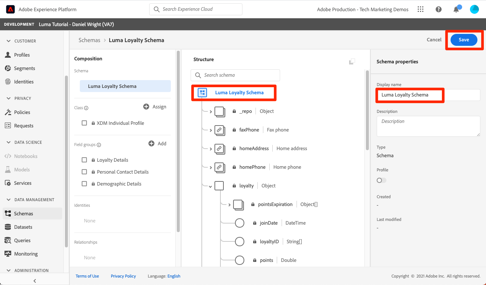
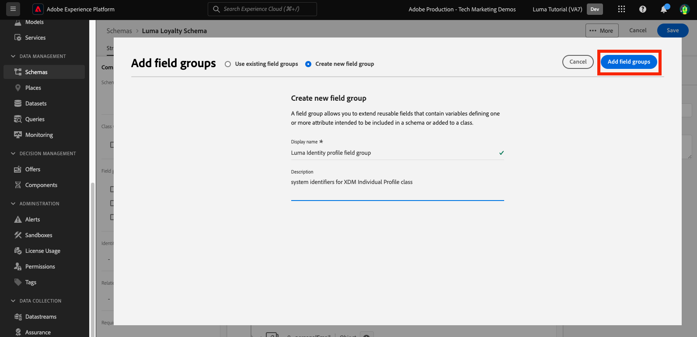
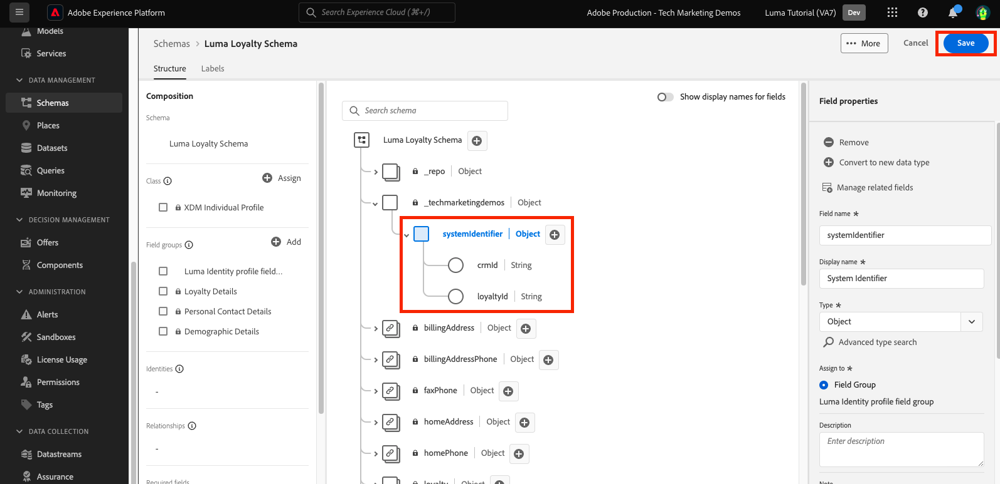
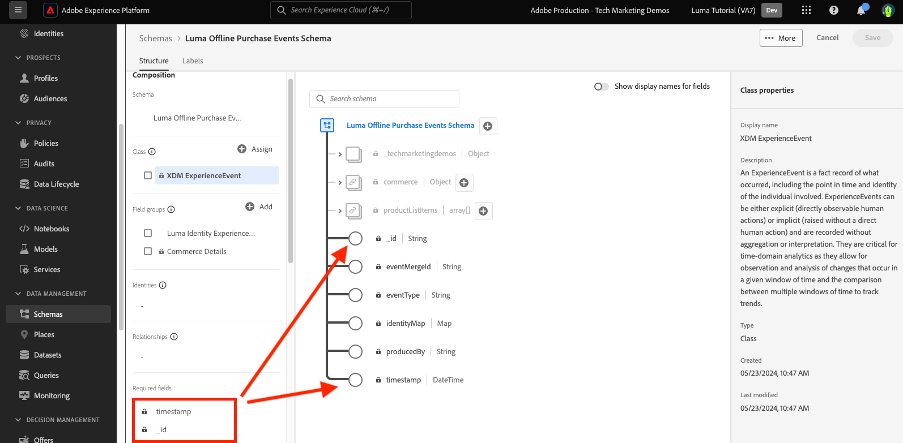

# Données de modèle dans les schémas

<!-- 60min -->
Dans cette leçon, vous allez modéliser les données de Luma en schémas. C&#39;est l&#39;une des plus longues leçons du tutoriel, alors prenez un verre d&#39;eau et bouclez-vous !

La normalisation et l’interopérabilité sont les concepts clés d’Adobe Experience Platform. Le modèle de données d’expérience (XDM) vise à normaliser les données d’expérience client et à définir des schémas pour la gestion de l’expérience client.

XDM est une spécification documentée publiquement conçue pour améliorer la puissance des expériences digitales. Elle fournit des structures et des définitions communes permettant à chaque application de communiquer avec les services Platform. L’adhésion aux normes XDM permet d’intégrer toutes les données d’expérience client dans une représentation commune afin de fournir des informations de manière plus rapide et intégrée. Vous pouvez obtenir des informations précieuses à partir des actions des clients, définir des audiences de clients par le biais de segments et utiliser les attributs du client à des fins de personnalisation.

XDM est le cadre de base qui permet à Adobe Experience Cloud, optimisé par Experience Platform, de transmettre le message approprié à la bonne personne, sur le bon canal et exactement au bon moment. La méthodologie sur laquelle Experience Platform repose, **à savoir le système XDM**, rend les schémas de modèles de données d’expérience opérationnels pour qu’ils soient utilisés par les services Platform.

<!--
This seems too lengthy. The video should suffice

Key terms:

* **Schema**: a representation of your data. A schema is comprised of a class and optional field groups and is used to create datasets. A schema includes behavioral attributes, timestamp, identity, attribute definitions, and relationships.
* **XDM Profile Class**: a common schema class used to represent record data
* **XDM ExperienceEvent Class**: a common schema class used to represent time-series data
* **Field group**: allows users to extend reusable fields that contain variables defining one or more attribute intended to be included in a schema or added to a class.
* **Standard Field group**: an open-source Field group built to conform to common industry standards, used to accelerate implementation and support repeatable services operating on the data
* **Data type**: a reusable object with properties in a hierarchical representation. These can be standard types or custom-defined defined types to describe your own data in your own way (for example, a collection of fields that you use to describe your products). Unlike Field groups, data types can be used in schemas regardless of the class.
* **Field**: a field is the lowest level element of a schema. Each field has a name for referencing and a type to identify the type of data that it contains. Field types can include, integer, number, string, Boolean and schema.
-->

**Architectes de données** Vous devrez créer des schémas en dehors de ce tutoriel, mais **Ingénieurs de données** collaboreront étroitement avec les schémas créés par l’architecte de données.

Avant de commencer les exercices, regardez cette courte vidéo pour en savoir plus sur les schémas et le modèle de données d’expérience (XDM) :
>[!VIDEO](https://video.tv.adobe.com/v/27105?learn=on)

>[!TIP]
>
> Pour approfondir la modélisation des données en Experience Platform, nous vous recommandons de suivre le cours . [Modèle de vos données d’expérience client avec XDM](https://experienceleague.adobe.com/?recommended=ExperiencePlatform-D-1-2021.1.xdm&amp;lang=fr), disponible gratuitement sur Experience League !

## Autorisations requises

Dans le [Configuration des autorisations](configure-permissions.md) leçon, vous configurez tous les contrôles d’accès requis pour terminer cette leçon.

<!--, specifically:

* Permission items **[!UICONTROL Data Modeling]** > **[!UICONTROL View Schemas]** and **[!UICONTROL Manage Schemas]**
* Permission item **[!UICONTROL Sandboxes]** > `Luma Tutorial`
* User-role access to the `Luma Tutorial Platform` product profile
* Developer-role access to the `Luma Tutorial Platform` product profile (for API)-->


<!--
## Luma's goals
-->

## Créer un schéma de fidélité via l’interface utilisateur

Au cours de cet exercice, nous allons créer un schéma pour les données de fidélité de Luma.

1. Accédez à l’interface utilisateur de Platform et vérifiez que votre environnement de test est sélectionné.
1. Accédez à **[!UICONTROL Schémas]** dans la navigation de gauche
1. Sélectionnez le bouton **[!UICONTROL Créer un schéma]** en haut à droite
1. Dans le menu déroulant, sélectionnez **[!UICONTROL XDM Individual Profile]**, puisque nous allons modéliser les attributs d’un client individuel (points, état, etc.).
   

### Ajouter des groupes de champs standard

Vous serez ensuite invité à ajouter des groupes de champs au schéma. Tous les champs doivent être ajoutés aux schémas à l’aide de groupes. Vous pouvez choisir parmi un grand ensemble de groupes de champs standard fournis par Adobe ou créer les vôtres. Lorsque vous commencez à modéliser vos propres données en Experience Platform, il est bon de vous familiariser avec les groupes de champs standard fournis par Adobe. Dans la mesure du possible, il est recommandé de les utiliser, car ils alimentent parfois des services en aval, tels que Customer AI, Attribution AI et Adobe Analytics.

Lorsque vous utilisez vos propres données, une grande étape consiste à déterminer celles qui doivent être capturées dans Platform et comment elles doivent être modélisées. Ce grand sujet est abordé plus en détail dans le cours. [Modèle de vos données d’expérience client avec XDM](https://experienceleague.adobe.com/?recommended=ExperiencePlatform-D-1-2021.1.xdm&amp;lang=fr). Dans ce tutoriel, je vais vous guider tout au long de l’implémentation de certains schémas prédéterminés.

Pour ajouter des groupes de champs :

1. Dans le **[!UICONTROL Ajouter des groupes de champs]** modale, sélectionnez les groupes de champs suivants :
   1. **[!UICONTROL Détails démographiques]** pour les données client de base telles que le nom et la date d’anniversaire
   1. **[!UICONTROL Coordonnées personnelles]** pour les coordonnées de base, telles que l’adresse e-mail et le numéro de téléphone
1. Vous pouvez prévisualiser les champs fournis dans le groupe de champs en sélectionnant l’icône située sur le côté droit de la ligne.
   

1. Vérifiez les **[!UICONTROL Secteur industriel]** > **[!UICONTROL Retail]** pour exposer des groupes de champs spécifiques au secteur.
1. Sélectionner **[!UICONTROL Fidélité]** pour ajouter les champs du programme de fidélité.
1. Sélectionnez **[!UICONTROL Ajouter un groupe de champs]** pour ajouter les trois groupes de champs au schéma.
   


Prenez quelques instants pour explorer l’état actuel du schéma. Les groupes de champs ont ajouté des champs standard liés à une personne, ses coordonnées et l’état du programme de fidélité. Ces deux groupes de champs peuvent s’avérer utiles lorsque vous créez des schémas pour les données de votre propre entreprise. Sélectionnez une ligne de groupe de champs spécifique ou cochez la case en regard du nom du groupe de champs pour voir comment la visualisation change.

Pour enregistrer le schéma :

1. Sélectionnez le nœud supérieur du schéma.
1. Entrée `Luma Loyalty Schema` comme la propriété **[!UICONTROL Nom d’affichage]**.
1. Sélectionnez **[!UICONTROL Enregistrer]**.
   

>[!NOTE]
>
>Cela ne vous dérange pas si un groupe de champs ajoute un champ pour un point de données que vous ne collectez pas. Par exemple, &quot;faxPhone&quot; peut être un champ pour lequel Luma ne collecte pas de données. Ça va. Ce n’est pas parce qu’un champ est défini dans le schéma que les données le concernent. *must* être ingéré ultérieurement.

### Ajouter un groupe de champs personnalisé

Créons maintenant un groupe de champs personnalisé.

Alors que le groupe de champs de fidélité contenait une `loyaltyID` , Luma souhaite gérer tous les identifiants système dans un seul groupe afin d’assurer la cohérence entre leurs schémas.

Les groupes de champs doivent être créés dans le workflow de schéma. Pour créer le groupe de champs :

1. Sélectionner **[!UICONTROL Ajouter]** sous le **[!UICONTROL Groupes de champs de schéma]** titre
   
1. Sélectionnez **[!UICONTROL Créer un groupe de champs]**
1. Utilisation `Luma Identity profile field group` comme la propriété **[!UICONTROL Nom d’affichage]**
1. Utilisation `system identifiers for XDM Individual Profile class` comme la propriété **[!UICONTROL Description]**
1. Sélectionnez **[!UICONTROL Ajouter des groupes de champs]**
   

Le nouveau groupe de champs vide est ajouté à votre schéma. La variable **[!UICONTROL +]** Vous pouvez utiliser les boutons pour ajouter de nouveaux champs à n’importe quel emplacement de la hiérarchie. Dans notre cas, nous souhaitons ajouter des champs au niveau racine :

1. Sélectionnez **[!UICONTROL +]** en regard du nom du schéma. Un nouveau champ est alors ajouté sous l’espace de noms de l’identifiant du client pour gérer les conflits entre vos champs personnalisés et les champs standard.
1. Dans le **[!UICONTROL Propriétés du champ]** sidebar ajoutez les détails du nouveau champ :
   1. **[!UICONTROL Nom du champ]**: `systemIdentifier`
   1. **[!UICONTROL Nom d’affichage]**: `System Identifier`
   1. **[!UICONTROL Type]**: **[!UICONTROL Objet]**
   1. Sélectionnez **[!UICONTROL Appliquer]**

   

Ajoutez maintenant deux champs sous le `systemIdentifier` objet :

1. Premier champ
   1. **[!UICONTROL Nom du champ]**: `loyaltyId`
   1. **[!UICONTROL Nom d’affichage:]** `Loyalty Id`
   1. **[!UICONTROL Type]**: **[!UICONTROL Chaîne]**
1. Second champ
   1. **[!UICONTROL Nom du champ]**: `crmId`
   1. **[!UICONTROL Nom d’affichage]**: `CRM Id`
   1. **[!UICONTROL Type]**: **[!UICONTROL Chaîne]**

Votre nouveau groupe de champs devrait ressembler à ceci. Sélectionnez la variable **[!UICONTROL Enregistrer]** pour enregistrer votre schéma, mais laissez le schéma ouvert pour l’exercice suivant.


## Création d’un type de données

Groupes de champs, tels que votre nouvelle `Luma Identity profile field group`, peut être réutilisé dans d’autres schémas, ce qui vous permet d’appliquer des définitions de données standard sur plusieurs systèmes. Mais ils ne peuvent être réutilisés que _dans les schémas qui partagent une classe_, dans ce cas, la classe XDM Individual Profile.

Le type de données est un autre concept à champs multiples qui peut être réutilisé dans les schémas. _sur plusieurs classes_. Convertissons notre nouveau `systemIdentifier` dans un type de données :

Avec la variable `Luma Loyalty Schema` toujours ouvert, sélectionnez l’option `systemIdentifier` et sélectionnez  **[!UICONTROL Convertir en nouveau type de données]**


Si vous **[!UICONTROL Annuler]** en dehors du schéma et accédez à la **[!UICONTROL Types de données]** vous verrez votre nouveau type de données. Nous utiliserons ce type de données plus loin dans la leçon.


## Création d’un schéma CRM via l’API

Nous allons maintenant créer un schéma à l’aide de l’API.

>[!TIP]
>
> Si vous préférez ignorer l’exercice d’API, vous pouvez créer le schéma suivant à l’aide de la méthode d’interface utilisateur :
>
> 1. Utilisez la variable [!UICONTROL XDM Individual Profile] class
> 1. Nommez-la `Luma CRM Schema`
> 1. Utilisez les groupes de champs suivants : Détails démographiques, Détails des contacts personnels et Groupe de champs Identité Luma

Commencez par créer le schéma vide :

1. Ouvrir [!DNL Postman]
1. Si vous ne disposez pas d’un jeton d’accès, ouvrez la requête . **[!DNL OAuth: Request Access Token]** et sélectionnez **Envoyer** pour demander un nouveau jeton d’accès.
1. Ouvrez vos variables d’environnement et modifiez la valeur de **CONTAINER_ID** de `global` to `tenant`. Souvenez-vous que vous devez utiliser `tenant` lorsque vous souhaitez interagir avec vos propres éléments personnalisés dans Platform, par exemple en créant un schéma.
1. Sélectionnez **Enregistrer**
   
1. Ouvrir la requête **[!DNL Schema Registry API > Schemas > Create a new custom schema.]**
1. Ouvrez le **Corps** et collez le code suivant, puis sélectionnez **Envoyer** pour effectuer l’appel API. Cet appel crée un nouveau schéma utilisant le même `XDM Individual Profile` classe de base :

   ```json
   {
     "type": "object",
     "title": "Luma CRM Schema",
     "description": "Schema for CRM data of Luma Retail ",
     "allOf": [{
       "$ref": "https://ns.adobe.com/xdm/context/profile"
     }]
   }
   ```

   >[!NOTE]
   >
   >L’espace de noms référence dans cet exemple et les exemples de code suivants (par exemple `https://ns.adobe.com/xdm/context/profile`), peut être obtenu à l’aide d’appels d’API de liste avec la variable **[!DNL CONTAINER_ID]** et acceptez que l’en-tête soit défini sur les valeurs correctes. Certaines sont également facilement accessibles dans l’interface utilisateur.

1. Vous devriez avoir une `201 Created` response
1. Copier `meta:altId` du corps de la réponse. Nous l&#39;utiliserons plus tard dans un autre exercice.
   

1. Le nouveau schéma doit être visible dans l’interface utilisateur, mais sans aucun groupe de champs.
   

>[!NOTE]
>
> La variable `meta:altId` Vous pouvez également obtenir l’ID de schéma en effectuant la requête API. **[!DNL Schema Registry API > Schemas > Retrieve a list of schemas within the specified container.]** avec la propriété **[!UICONTROL CONTAINER_ID]** défini sur `tenant` et un en-tête accept `application/vnd.adobe.xdm+json`.

>[!TIP]
>
> Problèmes courants liés à cet appel et correctifs probables :
>
> * Aucun jeton d’authentification : exécutez la **OAuth : Request Access Token** requête de génération d’un nouveau jeton
> * `401: Not Authorized to PUT/POST/PATCH/DELETE for this path : /global/schemas/`: mettez à jour la variable **CONTAINER_ID** Variable d’environnement de `global` to `tenant`
> * `403: PALM Access Denied. POST access is denied for this resource from access control`: Vérification des autorisations utilisateur dans le Admin Console

### Ajouter des groupes de champs standard

Il est maintenant temps d’ajouter les groupes de champs au schéma :

1. Dans [!DNL Postman], Ouvrez la requête. **[!DNL Schema Registry API > Schemas > Update one or more attributes of a custom schema specified by ID.]**
1. Dans le **Paramètres** , collez le `meta:altId` de la réponse précédente en tant que `SCHEMA_ID`
1. Ouvrez l’onglet Corps , collez le code suivant, puis sélectionnez **Envoyer** pour effectuer l’appel API. Cet appel ajoute les groupes de champs standard à votre `Luma CRM Schema`:

   ```json
   [{
       "op": "add",
       "path": "/allOf/-",
       "value": {
         "$ref": "https://ns.adobe.com/xdm/context/profile-personal-details"
       }
     },
     {
       "op": "add",
       "path": "/allOf/-",
       "value": {
         "$ref": "https://ns.adobe.com/xdm/context/profile-person-details"
       }
     }
   ]
   ```

1. Vous devriez obtenir un état 200 OK pour la réponse et les groupes de champs doivent être visibles dans votre schéma dans l’interface utilisateur.

   


### Ajouter un groupe de champs personnalisé

Ajoutons maintenant notre `Luma Identity profile field group` au schéma. Tout d’abord, nous devons trouver l’identifiant de notre nouveau groupe de champs à l’aide d’une API de liste :

1. Ouvrir la requête **[!DNL Schema Registry API > Field groups > Retrieve a list of field groups within the specified container.]**
1. Sélectionnez la variable **Envoyer** pour récupérer une liste de tous les groupes de champs personnalisés de votre compte.
1. Attrapez le `$id` de la variable `Luma Identity profile field group` (la vôtre sera différente de la valeur de cette capture d’écran)
   
1. Ouvrir la requête **[!DNL Schema Registry API > Schemas > Update one or more attributes of a custom schema specified by ID.]** again
1. La variable **Paramètres** L’onglet doit toujours comporter la variable `$id` de votre schéma
1. Ouvrez le **Corps** et collez le code suivant, en remplaçant la fonction `$ref` avec la valeur `$id` de votre propre `Luma Identity profile field group`:

   ```json
   [{
     "op": "add",
     "path": "/allOf/-",
     "value": {
       "$ref": "REPLACE_WITH_YOUR_OWN_FIELD_GROUP_ID"
     }
   }]
   ```

1. Sélectionner **Envoyer**
   

Vérifiez que le groupe de champs a été ajouté au schéma en vérifiant la réponse de l’API et dans l’interface.

## Créer un schéma d’événements d’achat hors ligne

Créons maintenant un schéma basé sur le **[!UICONTROL XDM ExperienceEvent]** pour les données d’achat hors ligne de Luma. Comme vous vous familiarisez maintenant avec l’interface utilisateur de l’éditeur de schémas, je vais réduire le nombre de captures d’écran dans les instructions :

1. Créez un schéma avec le **[!UICONTROL XDM ExperienceEvent]** class
1. Ajouter le groupe de champs standard **[!UICONTROL Détails du commerce]** pour capturer les détails de commande courants. Passez quelques minutes à explorer les objets à l&#39;intérieur.
1. Recherchez `Luma Identity profile field group`. Elle n’est pas disponible ! N’oubliez pas que les groupes de champs sont liés à une classe. Comme nous utilisons une autre classe pour ce schéma, nous ne pouvons pas l’utiliser. Nous devons ajouter un nouveau groupe de champs pour la classe XDM ExperienceEvent contenant les champs d’identité. Notre type de données rendra cela vraiment facile !
1. Sélectionnez la variable **[!UICONTROL Créer un groupe de champs]** bouton radio
1. Saisissez le **[!UICONTROL Nom d’affichage]** as `Luma Identity ExperienceEvent field group` et sélectionnez la variable **[!UICONTROL Ajouter des groupes de champs]** button
1. Assurez-vous que la variable **[!UICONTROL +]** apparaissent dans les **[!UICONTROL Structure]** pour ajouter de nouveaux champs
1. Dans **[!UICONTROL Structure]** , sélectionnez **[!UICONTROL +]** au niveau supérieur du schéma
1. Comme la variable **[!UICONTROL Nom du champ]**, saisissez `systemIdentifier`
1. Comme la variable **[!UICONTROL Nom d’affichage]**, saisissez `System Identifier`
1. Comme la variable **[!UICONTROL Type]**, sélectionnez **Identifiant du système** qui est le type de données personnalisé créé précédemment
1. Sélectionnez la variable **[!UICONTROL Appliquer]** button
1. Nommer le schéma `Luma Offline Purchase Events Schema`
1. Sélectionnez la variable **[!UICONTROL Enregistrer]** button

Notez comment le type de données a ajouté tous les champs.


Sélectionnez également **[!UICONTROL XDM ExperienceEvent]** sous le **[!UICONTROL Classe]** parcourir certains des champs fournis par cette classe. Notez que les champs _id et horodatage sont requis lors de l’utilisation de la classe XDM ExperienceEvent : ces champs doivent être renseignés pour chaque enregistrement que vous ingérez lors de l’utilisation de ce schéma :



## Création d’un schéma d’événements web

Nous allons maintenant créer un schéma supplémentaire pour les données du site web de Luma. A ce stade, vous devriez être un expert en création de schémas ! Créez le schéma suivant avec ces propriétés.

| Propriété | Valeur |
|---------------|-----------------|
| Classe | XDM ExperienceEvent |
| Groupe de champs | Mixin ExperienceEvent du SDK Web AEP |
| Groupe de champs | Événement d’expérience client |
| Nom du schéma | Schéma des événements web Luma |

Sélectionnez la variable **[!UICONTROL Événement d’expérience client]** groupe de champs. Ce groupe de champs contient les objets commerce et productListItems qui se trouvaient également dans [!UICONTROL Détails du commerce]. En effet [!UICONTROL Événement d’expérience client] est une combinaison de plusieurs autres groupes de champs standard, également disponibles séparément. [!UICONTROL Mixin ExperienceEvent du SDK Web AEP] groupe de champs contient également d’autres groupes de champs, y compris certains des mêmes groupes dans [!UICONTROL Événement d’expérience client]. Heureusement, ils se fondent harmonieusement.

Notez que nous n’avons pas ajouté la variable `Luma Identity ExperienceEvent field group` à ce schéma. Cela est dû au fait que le SDK web dispose d’une autre manière de collecter les identités. Si vous sélectionnez l’option **[!UICONTROL XDM ExperienceEvent]** dans la classe **[!UICONTROL Composition]** dans l’éditeur de schéma, vous remarquerez que l’un des champs qu’il ajoute par défaut est appelé **[!UICONTROL IdentityMap]**. [!DNL IdentityMap] est utilisé par différentes applications Adobe pour créer un lien vers Platform. Vous verrez comment les identités sont envoyées à Platform via identityMap dans la leçon sur l’ingestion par flux.


## Création d’un schéma de catalogue de produits

En utilisant la variable  [!UICONTROL Détails du commerce] et [!UICONTROL Événement d’expérience client] groupes de champs, Luma signale des détails sur les événements liés aux produits par le biais du type de données standard productListItems . Mais ils disposent également de champs de détails de produit supplémentaires qu’ils souhaitent envoyer à Platform. Au lieu de capturer tous ces champs dans leurs systèmes de point de vente et de commerce électronique, Luma préférerait ingérer ces champs directement à partir de son système de catalogue de produits. Une &quot;relation de schéma&quot; vous permet de définir une relation entre deux schémas à des fins de classification ou de recherche. Luma utilisera une relation pour classer les détails de son produit. Nous commencerons le processus maintenant et le terminerons à la fin de la prochaine leçon.

>[!NOTE]
>
>Si vous êtes déjà client Analytics ou Target, la classification des entités avec des relations de schéma est analogue aux classifications de SAINT ou le téléchargement de votre catalogue de produits pour Recommendations

Tout d’abord, nous devons créer un schéma pour le catalogue de produits de Luma à l’aide d’une classe personnalisée :

1. Sélectionnez la variable **[!UICONTROL Créer un schéma]** et sélectionnez l’option **[!UICONTROL Parcourir]** dans la liste déroulante
   
1. Sélectionnez la variable **[!UICONTROL Création d’une classe]** bouton radio
1. Nommez-la `Luma Product Catalog Class`
1. Laissez le champ **[!UICONTROL Comportement]** as **[!UICONTROL Enregistrement]**
1. Sélectionnez la variable **[!UICONTROL Attribuer une classe]** button
   
1. Créer [!UICONTROL groupe de champs] appelé `Luma Product Catalog field group` avec les champs suivants :
   1. productName : Nom du produit : chaîne
   1. productCategory : Catégorie de produits : chaîne
   1. productColor : Product Color : String
   1. productSku : SKU du produit : chaîne | Obligatoire
   1. productSize : Taille du produit : chaîne
   1. productPrice : Prix du produit : Double
1. Nommer le schéma `Luma Product Catalog Schema` (veillez à mettre à jour le champ correct et non le nom de classe)
1. **** Enregistrement du schéma

Votre nouveau schéma devrait ressembler à ceci. Notez comment la variable `productSku` est répertorié dans le champ [!UICONTROL Champs obligatoires] section :


L’étape suivante consiste à définir la relation entre les deux schémas ExperienceEvent et la variable `Luma Product Catalog Schema`Cependant, il y a quelques étapes supplémentaires que nous devons prendre dans la leçon suivante avant de pouvoir faire cela.


## Ressources supplémentaires

* [Documentation du système du modèle de données d’expérience (XDM)](https://experienceleague.adobe.com/docs/experience-platform/xdm/home.html?lang=fr)
* [API Schema Registry](https://www.adobe.io/experience-platform-apis/references/schema-registry/)


Maintenant que vous disposez de vos schémas, vous pouvez [identités de mappage](map-identities.md)!
