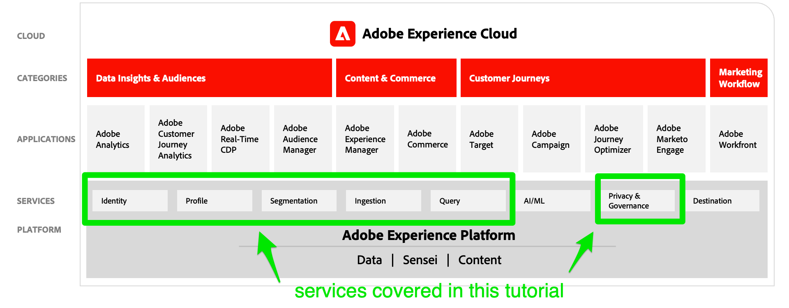

# Prise en main de Adobe Experience Platform pour les architectes de données et les ingénieurs de données

<!--5min-->

_Prise en main de Adobe Experience Platform pour les architectes de données et les ingénieurs de données_ est le point de départ idéal pour prendre contact avec un Experience Platform.

<!--How do we address ETL-->

## Objectifs d’apprentissage

Les architectes de données et les ingénieurs de données doivent collaborer étroitement pour réussir un déploiement Experience Platform. Ce tutoriel pratique vous apprend les tâches clés exécutées par _les deux rôles_ pour que vous sachiez comment commencer à implémenter Platform pour votre propre entreprise. Vous serez guidé par des exercices qui vous présenteront la terminologie, les fonctionnalités, l’interface et les API clés de l’Experience Platform. Les clients d’applications Adobe Experience Cloud telles que Real-time Customer Data Platform, Customer Journey Analytics et Journey Optimizer trouveront également ce contenu utile, car les services Platform sont les fondements essentiels de ces applications.

Les sujets incluent :

* Configuration des autorisations d’utilisateur
* Création d’environnements de test
* Configuration d’un projet Developer Console et utilisation de l’API Platform
* Gestion des données, notamment la création de schémas, de jeux de données, d’identités, de stratégies de fusion et de gouvernance des données
* Ingestion des données à l’aide des modes de lot et de diffusion en continu
* Capture des données web avec le SDK web Adobe Experience Platform
* Création de profils client en temps réel
* Utilisation de Query Service pour valider les données et extraire les données
* Création de segments

## Scénario d’entreprise

Adobe Experience Platform est une plateforme technique conçue pour vous aider à atteindre vos objectifs marketing. Les cas d’utilisation professionnels doivent vous guider dans la conception et la mise en oeuvre de la technologie. Ce tutoriel se concentre sur une marque de vente au détail fictive appelée Luma. Luma gère des magasins classiques dans plusieurs pays et dispose également d’une présence en ligne avec un site web et des applications mobiles. Ils investissent dans Adobe Experience Platform afin de combiner les données d’achat en temps réel, CRM, web et hors ligne dans des profils clients en temps réel et d’activer ces profils pour passer à un niveau de marketing supérieur. Les objectifs commerciaux de Luma peuvent ou non correspondre aux objectifs de votre entreprise, mais vous devriez être en mesure de mettre en relation les étapes pratiques de ce tutoriel avec vos propres objectifs commerciaux.

## Prérequis

* Vous avez terminé la [Présentation du cours Adobe Experience Platform](https://experienceleague.adobe.com/?recommended=ExperiencePlatform-U-1-2020.1&amp;lang=fr) sur Experience League et connaissent les fonctionnalités de Platform
* Vous avez accès à un compte configuré avec Adobe Experience Platform (ou à une application basée sur une plateforme telle que Real-Time CDP ou Journey Optimizer) et la collecte de données (anciennement Launch).
* Vous êtes administrateur système de ce compte ou vous pouvez en avoir un [configuration des autorisations utilisateur](configure-permissions.md) pour vous.

## Utilisation de ce tutoriel

Ce tutoriel combine des tâches pour les ingénieurs de données et les architectes de données. Puisqu’il s’agit d’un tutoriel de niveau introduction, vous devriez être en mesure d’effectuer les tâches pour les deux rôles. Parce que la plupart des leçons se basent sur ce qui a été mis en oeuvre dans les leçons précédentes, vous devriez passer en revue les leçons dans l&#39;ordre. Je vais vous dire quelles leçons peuvent être ignorées.

Lorsque vous créez divers éléments Platform au cours de ce tutoriel, essayez de vous en tenir aux noms que je recommande autant que possible. Cependant, il existe quelques noms d’éléments de haut niveau que vous pouvez personnaliser au cas où plusieurs personnes de votre entreprise suivraient ce tutoriel simultanément. Par exemple, vous pouvez nommer l’environnement de test Platform &quot;Plateforme de tutoriel Luma - Ignatius J Reilly&quot; au lieu de simplement &quot;Plateforme de tutoriel Luma&quot;.

Si vous êtes bloqué, essayez d’abord de relire les instructions, puis utilisez la méthode  lien sur la barre latérale de chaque page pour me contacter.

## Notes techniques

### Environnements Sandbox

Dans le tutoriel, vous allez créer un environnement de test et l’utiliser pour terminer les exercices. L’environnement de test vous permet d’effectuer les exercices et les expériences en toute sécurité sans compromettre vos données de production.

### API

Platform est une API d’abord créée. Bien que des workflows d’interface existent pour tous les workflows Platform principaux et seront utilisés principalement, le tutoriel contient quelques exercices orientés API. Je vous guiderai tout au long de la configuration de base du projet dans la console Adobe Developer et vous fournirai [!DNL Postman] environnements et collections pour commencer à utiliser l’API Platform. Après avoir terminé le tutoriel, il peut s’avérer utile de connaître l’API Platform et de l’utiliser dans votre propre déploiement.

### Technologies tierces

Bien que vous utiliserez plusieurs technologies dans ce tutoriel, vous resterez presque entièrement dans l’écosystème Adobe. Dans votre propre mise en oeuvre de Platform, vous allez probablement intégrer Platform à des technologies tierces spécifiques. Pour que ce tutoriel reste pertinent pour tous les clients, nous utiliserons une mise en oeuvre plus générique.

## Mises à jour des tutoriels

* Juin 2023 : mise à jour afin d’inclure un nouveau workflow d’autorisation et d’utiliser les informations d’identification de l’API OAuth serveur à serveur

Passons maintenant à la première leçon...[configuration des autorisations](configure-permissions.md).
