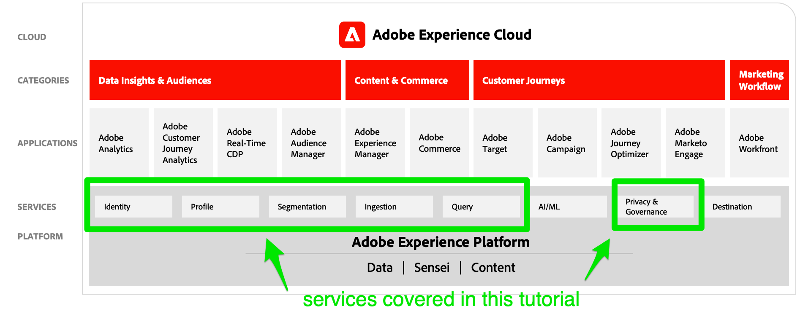

# Prise en main de Adobe Experience Platform pour les architectes et ingénieurs de données

<!--5min-->

_Prise en main de Adobe Experience Platform pour les architectes et ingénieurs de données_ est le point de départ idéal pour se familiariser avec Experience Platform.

<!--How do we address ETL-->

## Objectifs d’apprentissage

Les architectes et ingénieurs de données doivent collaborer étroitement pour réussir le déploiement d’Experience Platform. Ce tutoriel pratique vous apprend les tâches clés exécutées par _les deux rôles_ afin que vous sachiez comment commencer à implémenter Platform pour votre propre entreprise. Vous serez guidé à travers des exercices qui vous présenteront la terminologie, les fonctionnalités, l’interface et les API d’Experience Platform. Les clients des applications Adobe Experience Cloud telles que Real-Time Customer Data Platform, Customer Journey Analytics et Journey Optimizer trouveront également ce contenu utile, car les services Platform sont des bases essentielles de ces applications.

Les sujets couverts sont les suivants :

* Configuration des autorisations utilisateur
* Création de sandbox
* Configuration d’un projet Developer Console et utilisation de l’API Platform
* Gestion des données : notamment la création de schémas, de jeux de données, d’identités, de politiques de fusion et de gouvernance des données
* Ingestion de données en modes batch et streaming
* Capturer des données web avec Adobe Experience Platform Web SDK
* Création de profils clients en temps réel
* Utilisation de Query Service pour valider les données et extraire les données
* Création de segments

## Scénario d’entreprise

Adobe Experience Platform est une plateforme technique conçue pour vous aider à atteindre vos objectifs marketing. Les cas d’utilisation commerciale doivent vous guider dans la conception et la mise en œuvre de la technologie. Ce tutoriel se concentre sur une marque de vente au détail fictive appelée Luma. Luma exploite des magasins physiques dans plusieurs pays et dispose également d’une présence en ligne avec un site web et des applications mobiles. Ils investissent dans Adobe Experience Platform pour combiner des données de fidélité, de gestion de la relation client (CRM), web et d’achat hors ligne dans des profils clients en temps réel et activer ces profils pour faire passer leur marketing au niveau supérieur. Les objectifs commerciaux de Luma peuvent correspondre ou non aux objectifs de votre entreprise, mais vous devriez être en mesure de mettre en relation les étapes pratiques de ce tutoriel avec vos propres objectifs commerciaux.

## Prérequis

* Vous avez regardé la [Présentation de la liste de lecture Adobe Experience Platform](https://experienceleague.adobe.com/fr/playlists/experience-platform-introduction) sur Experience League et vous connaissez les fonctionnalités de Platform
* Vous avez accès à un compte configuré avec Adobe Experience Platform (ou une application basée sur Platform telle que Real-Time CDP ou Journey Optimizer) et la collecte de données (anciennement Launch).
* Vous êtes administrateur système de ce compte ou pouvez disposer d’une autorisation [configurer les utilisateurs](configure-permissions.md) pour vous.

## Utilisation de ce tutoriel

Ce tutoriel combine des tâches pour les ingénieurs de données et les architectes de données. Puisqu’il s’agit d’un tutoriel d’introduction, vous devriez être en mesure d’effectuer les tâches pour les deux rôles. Comme la plupart des leçons s’appuient sur ce qui a été mis en œuvre dans les leçons précédentes, vous devez les parcourir dans l’ordre. Je vais vous indiquer quelles leçons peuvent être ignorées.

Puisque vous créez divers éléments Platform au cours de ce tutoriel, essayez de vous en tenir autant que possible aux noms que je recommande. Cependant, il existe quelques noms d’éléments généraux que vous pouvez personnaliser au cas où plusieurs personnes de votre entreprise suivraient ce tutoriel simultanément. Par exemple, vous pouvez nommer la sandbox Platform « Plateforme de tutoriels Luma - Ignatius J Reilly » au lieu de simplement « Plateforme de tutoriels Luma ».

Si vous êtes bloqué, essayez d’abord de relire les instructions, puis utilisez le lien  sur la barre latérale de chaque page pour me contacter.

## Notes techniques

### Environnements Sandbox

Dans le tutoriel, vous allez créer un environnement sandbox et l’utiliser pour effectuer les exercices. L’environnement sandbox vous permet de terminer les exercices et les expériences en toute sécurité sans avoir à compromettre vos données de production.

### API

Platform est d’abord créée via l’API. Bien que les workflows d’interface existent pour tous les principaux workflows de Platform et soient principalement utilisés, le tutoriel contient quelques exercices orientés API. Je vous guiderai tout au long de la configuration de base du projet dans Adobe Developer Console et vous fournirai des environnements et des collections [!DNL Postman] pour commencer à utiliser l’API Platform. Après avoir suivi le tutoriel, il peut s’avérer utile de vous familiariser avec l’API Platform et de l’utiliser dans votre propre déploiement .

### Technologies tierces

Bien que ce tutoriel vous permette d’utiliser plusieurs technologies, vous resterez presque entièrement intégré à l’écosystème Adobe. Dans votre propre mise en œuvre de Platform, vous intégrerez probablement Platform à des technologies tierces spécifiques. Pour que ce tutoriel reste pertinent pour tous les clients, nous utiliserons une implémentation plus générique.

## Mises à jour des tutoriels

* Juin 2023 : mise à jour pour inclure un nouveau workflow d’autorisation et pour utiliser les informations d’identification d’API de serveur à serveur OAuth.

Passons à présent à la première leçon : [configurer des autorisations](configure-permissions.md).
