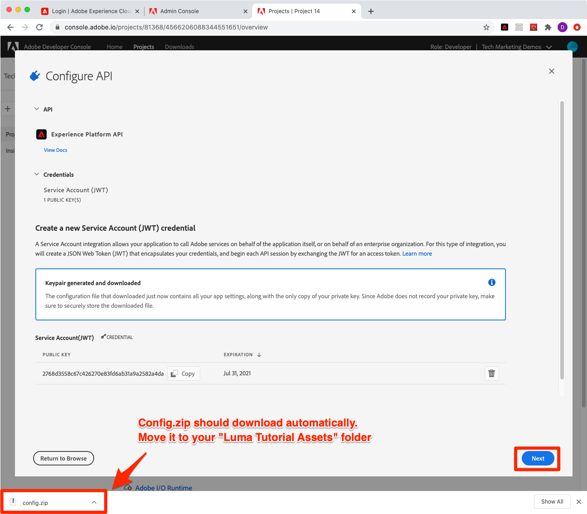

# Configuration de Developer Console et [!DNL Postman]

<!--30min-->

Dans cette leçon, vous allez configurer un projet dans la console Adobe Developer et le télécharger. [!DNL Postman] collections afin que vous puissiez commencer à utiliser les API de Platform.

Pour terminer les exercices d’API dans ce tutoriel, [téléchargez l’application Postman pour votre système d’exploitation.](https://www.postman.com/downloads/) Bien que cela ne soit pas nécessaire pour utiliser les API Experience Platform, Postman facilite les processus d’API et Adobe Experience Platform fournit des dizaines de collections Postman pour vous aider à exécuter des appels API et à découvrir comment ils fonctionnent. Le reste de ce tutoriel suppose des connaissances pratiques de Postman. Pour obtenir de l’aide, reportez-vous à la section [Documentation Postman](https://learning.postman.com/).

Platform est une API d’abord créée. Bien que des options d’interface existent également pour toutes les tâches principales, vous pouvez utiliser l’API Platform à un moment donné. Par exemple, pour ingérer des données, déplacez des éléments entre des environnements de test, automatisez les tâches de routine ou utilisez de nouvelles fonctionnalités de Platform avant la création de l’interface utilisateur.

**Architectes de données** et **Ingénieurs de données** Vous devrez peut-être utiliser l’API Platform en dehors de ce tutoriel.

## Autorisations requises

Dans le [Configuration des autorisations](configure-permissions.md) leçon, vous configurez tous les contrôles d’accès requis pour terminer cette leçon.

<!--
* Permission item Sandboxes > `Luma Tutorial`
* Developer-role access to the `Luma Tutorial Platform` product profile
-->

## Configuration de la console Adobe Developer

La console Adobe Developer est la destination des développeurs pour accéder aux API et SDK d’Adobe, écouter des événements en temps quasi réel, exécuter des fonctions sur Runtime ou créer des modules externes ou des applications App Builder. Vous l’utiliserez pour accéder à l’API Experience Platform. Pour plus d’informations, voir [Documentation de la console Adobe Developer](https://www.adobe.io/apis/experienceplatform/console/docs.html)

1. Créez un dossier sur votre ordinateur local nommé `Luma Tutorial Assets` pour les fichiers utilisés dans le tutoriel.

1. Ouvrez le [Console Adobe Developer](https://console.adobe.io)

1. Connectez-vous et vérifiez que vous vous trouvez dans l’organisation appropriée.

1. Sélectionner **[!UICONTROL Créer un projet]** in [!UICONTROL Démarrage rapide] .

   

1. Dans le projet nouvellement créé, sélectionnez la **[!UICONTROL Ajouter au projet]** puis sélectionnez **[!UICONTROL API]**

   

1. Filtrez la liste en sélectionnant **[!UICONTROL Adobe Experience Platform]**

1. Dans la liste des API disponibles, sélectionnez **[!UICONTROL API Experience Platform]** et sélectionnez **[!UICONTROL Suivant]**.

   

1. Pour l’authentification à partir de systèmes externes tels que [!DNL Postman], nous avons besoin d’une paire de clés publique/privée. Pour générer une nouvelle paire de clés, sélectionnez **[!UICONTROL Option 1]**  et appuyez sur la touche **[!UICONTROL Générer une paire de clés]** button

   

1. Une fois les clés prêtes, vous pouvez être invité à les télécharger sur votre ordinateur local. Enregistrer les clés incluses dans `config.zip` au dossier `Luma Tutorial Assets`. Nous en aurons besoin lors du prochain exercice.

1. Une fois la clé générée, elle est automatiquement ajoutée à votre projet, comme le montre la capture d’écran. Sélectionnez la **[!UICONTROL Suivant]** bouton .

   

1. Sélectionnez la `Luma Tutorial Platform` profil de produit et sélectionnez **[!UICONTROL Enregistrer l’API configurée]** button

   

1. Votre projet Developer Console a maintenant été créé.

1. Dans le **[!UICONTROL Essayez-le]** de la page, sélectionnez **[!UICONTROL Téléchargement pour Postman]** puis sélectionnez **[!UICONTROL Compte de service (JWT)]** pour télécharger le [!DNL Postman] fichier json d’environnement. Enregistrez le `service.postman_environment.json` dans votre `Luma Tutorial Assets` dossier.

   

   >[!NOTE]
   >
   >Les administrateurs système de votre entreprise peuvent voir le projet comme un &quot;identifiant d’API&quot; dans le profil de produit dans le Admin Console.
   >
   >

Vous avez peut-être remarqué que le projet s’est vu attribuer un numéro, par exemple &quot;Projet 12&quot; :

1. Sélectionnez le numéro du projet dans le chemin de navigation.
1. Sélectionnez la **[!UICONTROL Modifier le projet]** button
1. Modifiez la variable **[!UICONTROL Titre du projet]** to `Luma Tutorial API Project` (ajoutez votre nom à la fin, si plusieurs personnes de votre société suivent ce tutoriel)
1. Sélectionnez la **[!UICONTROL Enregistrer]** button

   

## Configuration de Postman

>[!CAUTION]
>
>L’interface de Postman est régulièrement mise à jour. Les captures d’écran de ce tutoriel ont été effectuées avec Postman v9.0.5 pour Mac, mais les options de l’interface ont peut-être changé.

1. Télécharger et installer [[!DNL Postman]](https://www.postman.com/downloads/)
1. Ouvrir [!DNL Postman] et importer le fichier d’environnement json téléchargé, `service.postman_environment.json`
   
1. Dans [!DNL Postman], sélectionnez votre environnement dans la liste déroulante

   
1. Sélectionnez la **oeil** pour afficher les variables d’environnement :

   

### Mise à jour du nom de l’environnement

Comme le nom exporté de l’environnement à partir de Developer Console est généré de manière aléatoire, attribuez-lui un nom plus explicite afin de ne pas confondre les environnements ultérieurement lorsque vous commencez à travailler sur votre implémentation Platform réelle :

1. L’écran des variables d’environnement étant toujours ouvert, sélectionnez **Modifier** en haut à droite
1. Mettez à jour le **Nom de l’environnement** to `Luma Tutorial`
1. Laissez tomber **Gestion des environnements** ouverture modale en mode d’édition, car nous la modifierons à l’étape suivante.

   

### Ajout de la clé privée

Il est maintenant temps d’ajouter la valeur PRIVATE_KEY à l’environnement Postman.

1. Extraire le téléchargé `config.zip` qui a été généré dans l’exercice précédent lors de la création du projet Developer Console. Ce fichier compressé contient deux fichiers :
   * `private.key`
   * `certificate_pub.crt`
1. Ouvrez le `private.key` dans un éditeur de texte et copiez le contenu.
1. Dans Postman, sur la **Gestion des environnements** > **Modifier** modal qui est toujours ouvert à partir du dernier exercice, collez les valeurs copiées devant **PRIVATE_KEY** dans le **Valeur initiale** et **Valeur actuelle** colonnes.
1. Sélectionnez **Enregistrer**

   

### Ajout de JWT et de jetons d’accès

Adobe fournit un riche ensemble de [!DNL Postman] collections pour vous aider à explorer l’API d’Experience Platform. Ces collections se trouvent dans la variable [Adobe Experience Platform Postman Exemples de référentiel GitHub](https://github.com/adobe/experience-platform-postman-samples). Vous devez marquer ce référentiel comme vous l’utiliserez de nombreuses fois tout au long de ce tutoriel et plus tard lorsque vous implémenterez Experience Platform pour votre propre société.

La première collection fonctionne avec les API Adobe Identity Management Service (IMS). Il s’agit d’un moyen pratique de renseigner JWT_TOKEN et ACCESS_TOKEN à partir de Postman. *destiné à des cas d’utilisation hors production* comme suivre ce tutoriel dans votre environnement de test. Vous pouvez également générer le jeton JWT dans la console Adobe Developer. Cependant, comme elle expire régulièrement, l’utilisation de cette collection vous permet de l’actualiser sans avoir à revisiter la console Adobe Developer lors de l’exécution de ce tutoriel.

>[!WARNING]
>
>Comme indiqué dans la section [Adobe les API du service Identity Management LISEZ-MOI](https://github.com/adobe/experience-platform-postman-samples/tree/master/apis/ims), les méthodes de génération signalées sont adaptées à une utilisation hors production. La signature locale charge une bibliothèque JavaScript à partir d’un hôte tiers et la signature à distance envoie la clé privée à un service Web géré et détenu par un Adobe. Bien qu’Adobe ne stocke pas cette clé privée, les clés de production ne doivent jamais être partagées avec personne.

Pour générer les jetons :

1. Téléchargez la [Collection Génération de jetons d’accès Developer Console](https://raw.githubusercontent.com/adobe/experience-platform-postman-samples/master/apis/ims/Identity%20Management%20Service.postman_collection.json) à `Luma Tutorial Assets` folder
1. Importez la collection dans [!DNL Postman]
1. Sélectionner la requête **IMS : JWT Generate + Auth via User Token** et sélectionnez **Envoyer**

   
1. Le **JWT_TOKEN** et **ACCESS_TOKEN** auto-remplissage dans les variables d’environnement de [!DNL Postman].

   

### Ajout du nom de l’environnement de test et de l’identifiant du client

Le `SANDBOX_NAME` et `TENANT_ID` et `CONTAINER_ID` ne sont pas incluses dans l’exportation vers la console Adobe Developer. Nous les ajoutons donc manuellement :

1. Dans [!DNL Postman], ouvrez le **Variables d’environnement**
1. Sélectionnez la **Modifier** lien vers la droite du nom de l&#39;environnement
1. Dans le **Ajouter un nouveau champ de variable**, saisissez `SANDBOX_NAME`
1. Dans les deux champs de valeur, saisissez `luma-tutorial`, le nom que nous avons donné à notre environnement de test dans la leçon précédente. Si vous avez utilisé un nom différent pour votre environnement de test, par exemple luma-tutorial-ignatiusjreilly, veillez à utiliser cette valeur.
1. Dans le **Ajouter un nouveau champ de variable**, saisissez `TENANT_ID`
1. Passez à votre navigateur web et recherchez l’ID de tenant de votre société en accédant à l’interface de l’Experience Platform et en extrayant la partie de l’URL. *après le signe @*. Par exemple, mon identifiant de tenant est `techmarketingdemos` mais la vôtre est différente :

   

1. Copiez cette valeur et revenez à la variable [!DNL Postman] Écran Gestion des environnements
1. Collez votre identifiant de client dans les deux champs de valeur
1. Dans le **Ajouter un nouveau champ de variable**, saisissez `CONTAINER_ID`
1. Entrée `global` dans les deux champs de valeur

   >[!NOTE]
   >
   >`CONTAINER_ID` est un champ dont la valeur est modifiée plusieurs fois au cours du tutoriel. When `global` est utilisée, l’API interagit avec les éléments fournis par Adobe dans votre compte Platform. When `tenant` est utilisée, l’API interagit avec vos propres éléments personnalisés.

1. Sélectionnez **Enregistrer**

   

## Effectuer un appel d’API de Platform

Maintenant, lançons un appel API Platform pour confirmer que nous avons tout correctement configuré.

Ouvrez le [Experience Platform [!DNL Postman] collections dans GitHub](https://github.com/adobe/experience-platform-postman-samples/tree/master/apis/experience-platform). Cette page contient de nombreuses collections, pour diverses API Platform. Je recommande vivement de le mettre en signet.

Faisons maintenant notre premier appel API :

1. Téléchargez la [Collecte de l’API Schema Registry](https://raw.githubusercontent.com/adobe/experience-platform-postman-samples/master/apis/experience-platform/Schema%20Registry%20API.postman_collection.json) à `Luma Tutorial Assets` folder
1. Importez-le dans [!DNL Postman]
1. Ouvrir **API Schema Registry > Classes > Classes de liste**
1. Consultez la **Paramètres** et **En-têtes** et notez comment ils incluent certaines des variables d’environnement que nous avons saisies précédemment.
1. Notez que la variable **En-têtes > Champ de valeur Accepter** est défini sur `application/vnd.adobe.xed-id+json`. Les API Schema Registry nécessitent l’une de ces [valeurs d’en-tête Accept spécifiées](https://experienceleague.adobe.com/docs/experience-platform/xdm/api/getting-started.html?lang=en#accept) qui fournissent différents formats dans la réponse.
1. Sélectionner **Envoyer** pour effectuer votre premier appel API Platform !

Espérons que vous avez réussi `200 OK` réponse contenant une liste des classes XDM standard disponibles dans votre environnement de test, comme illustré ci-dessous.

Si votre appel n’a pas réussi, prenez quelques instants pour déboguer à l’aide des détails de réponse d’erreur de l’appel API et passez en revue les étapes ci-dessus. Si vous êtes bloqué, veuillez demander de l’aide dans la variable [Forum de la communauté](https://experienceleaguecommunities.adobe.com/t5/adobe-experience-platform/ct-p/adobe-experience-platform-community?profile.language=fr) ou utilisez le lien situé dans la partie droite de cette page pour &quot;Signaler un problème&quot;.

Avec vos autorisations Platform, sandbox et [!DNL Postman] configuré, vous êtes prêt à [données de modèle dans les schémas](model-data-in-schemas.md)!
