# Configuration de Developer Console et de [!DNL Postman]

<!--30min-->

Dans cette leçon, vous allez configurer un projet dans Adobe Developer Console et télécharger des collections de [!DNL Postman] afin de commencer à utiliser les API Platform.

Pour effectuer les exercices d’API de ce tutoriel, [téléchargez l’application Postman pour votre système d’exploitation.](https://www.postman.com/downloads/) Bien que cela ne soit pas nécessaire pour utiliser les API Experience Platform, Postman facilite les workflows d’API et Adobe Experience Platform fournit des dizaines de collections Postman pour vous aider à exécuter des appels d’API et à découvrir comment ils fonctionnent. Le reste de ce tutoriel suppose une connaissance pratique de Postman. Pour obtenir de l’aide, consultez la documentation de [Postman](https://learning.postman.com/).

Platform est d’abord créée via l’API. Bien que des options d’interface existent également pour toutes les tâches principales, vous souhaiterez peut-être utiliser l’API Platform à un moment donné. Par exemple, pour ingérer des données, déplacer des éléments entre des sandbox, automatiser des tâches de routine ou utiliser de nouvelles fonctionnalités de Platform avant que l’interface utilisateur n’ait été créée.

**Architectes de données** et **Ingénieurs de données** peuvent avoir besoin d’utiliser l’API Platform en dehors de ce tutoriel.

## Autorisations requises

Dans la leçon [Configurer les autorisations](configure-permissions.md), vous allez configurer tous les contrôles d’accès requis pour suivre cette leçon.

<!--
* Permission item Sandboxes > `Luma Tutorial`
* Developer-role access to the `Luma Tutorial Platform` product profile
-->

## Configuration de Adobe Developer Console

Adobe Developer Console est la destination des développeurs pour accéder aux API et aux SDK d’Adobe, écouter des événements en temps quasi réel, exécuter des fonctions sur Runtime ou créer des modules externes pour les applications App Builder. Vous l’utiliserez pour accéder à l’API Experience Platform. Pour plus d’informations, consultez la documentation de [Adobe Developer Console](https://www.adobe.io/apis/experienceplatform/console/docs.html)

1. Créez un dossier sur votre ordinateur local nommé `Luma Tutorial Assets` pour les fichiers utilisés dans le tutoriel.

1. Ouvrir le [Adobe Developer Console](https://console.adobe.io){target="_blank"}

1. Connectez-vous et vérifiez que vous vous trouvez dans la bonne organisation

1. Sélectionnez **[!UICONTROL Créer un projet]** dans le menu [!UICONTROL Démarrage rapide].

   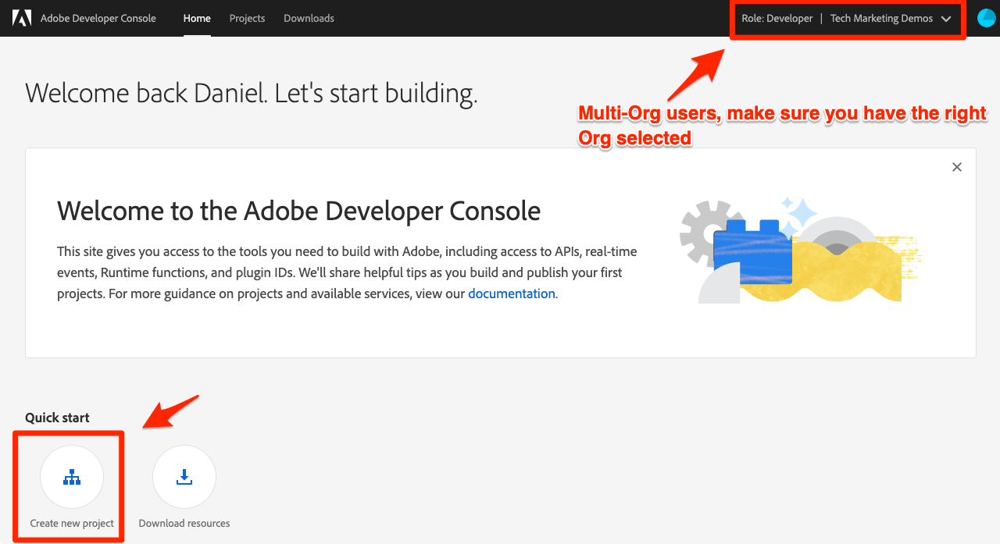

1. Dans le projet nouvellement créé, sélectionnez le bouton **[!UICONTROL Modifier le projet]**
1. Remplacez le **[!UICONTROL Titre du projet]** par `Luma Tutorial API Project` (ajoutez votre nom à la fin, si plusieurs personnes de votre entreprise suivent ce tutoriel)
1. Sélectionnez **[!UICONTROL Enregistrer]**

   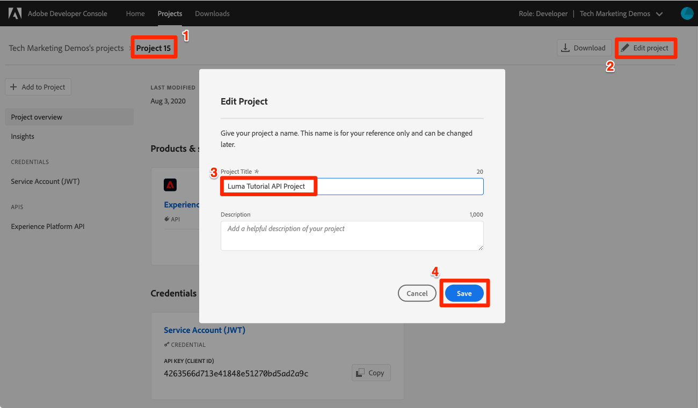

1. Sélectionnez **[!UICONTROL Ajouter une API]**

   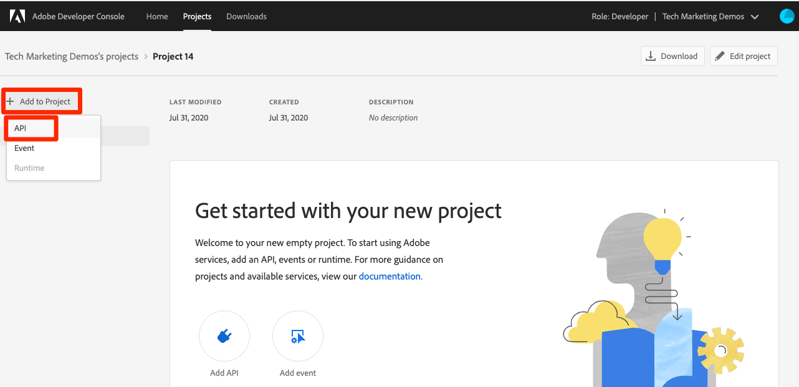

1. Filtrez la liste en sélectionnant **[!UICONTROL Adobe Experience Platform]**

1. Dans la liste des API disponibles, sélectionnez **[!UICONTROL API Experience Platform]** puis **[!UICONTROL Suivant]**.

   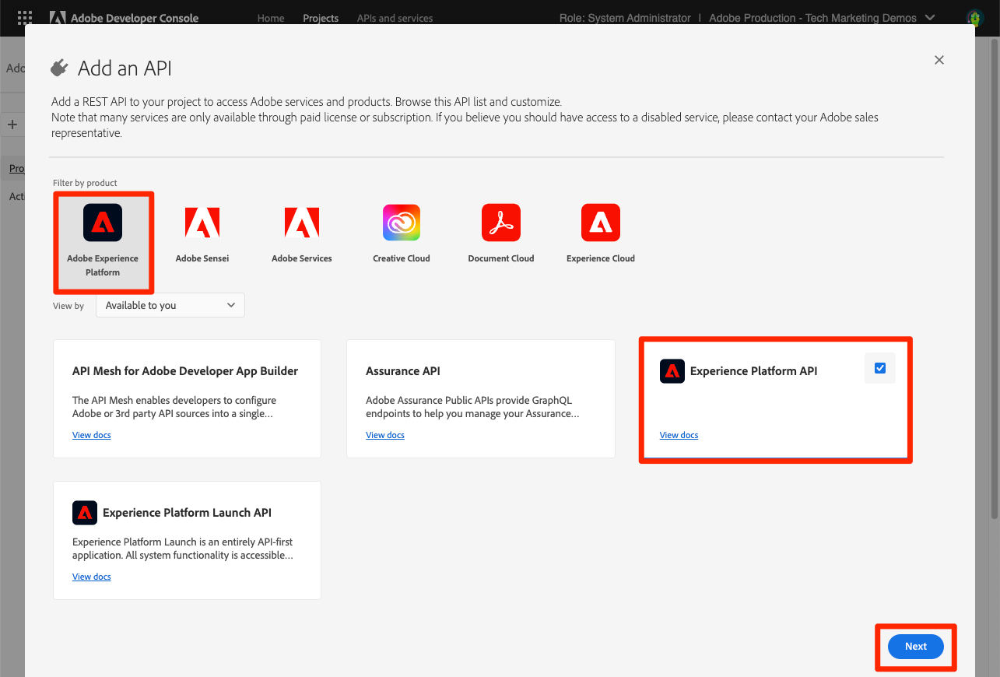

1. Sélectionnez **[!UICONTROL OAuth serveur à serveur]** comme informations d’identification et sélectionnez **[!UICONTROL Suivant]**.
   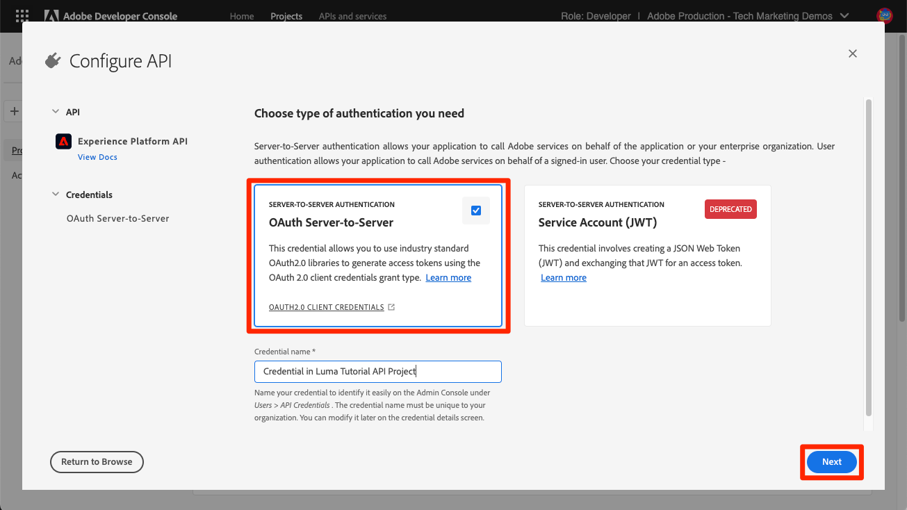

1. Sélectionnez le profil de produit `AEP-Default-All-Users` et sélectionnez **[!UICONTROL Enregistrer l’API configurée]**

   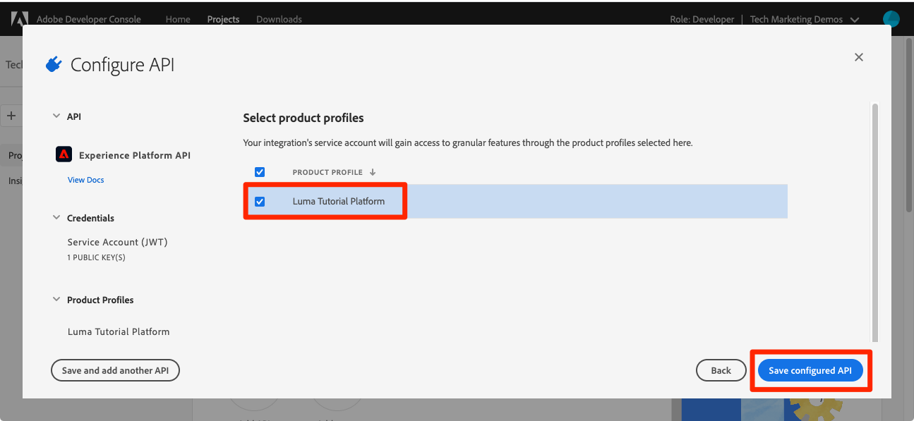

1. Votre projet Developer Console est maintenant créé.

1. Dans la section **[!UICONTROL Essayer]** de la page, sélectionnez **[!UICONTROL Télécharger pour Postman]** puis sélectionnez **[!UICONTROL OAuth de serveur à serveur]** pour télécharger le fichier json de l’environnement [!DNL Postman]. Enregistrez le `oauth_server_to_server.postman_environment.json` dans votre dossier `Luma Tutorial Assets`.

   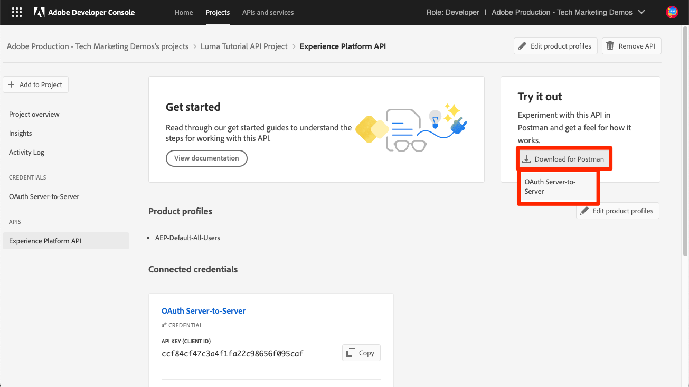

## Demandez à un administrateur système d’ajouter les informations d’identification d’API au rôle

Pour utiliser les informations d’identification d’API afin d’interagir avec Experience Platform, vous devez demander à un administrateur système d’affecter les informations d’identification d’API au rôle créé dans la leçon précédente.  Si vous n’êtes pas administrateur système, envoyez-le :

1. Le [!UICONTROL Nom] de vos informations d’identification API (`Credential in Luma Tutorial API Project`)
1. L’e-mail [!UICONTROL compte technique] de vos informations d’identification (cela aidera l’administrateur système à trouver les informations d’identification)

   ![[!UICONTROL Nom] et [!UICONTROL Adresse électronique du compte technique] de vos informations d’identification](assets/postman-credentialDetails.png)

Voici les instructions destinées à l’administrateur système :

1. Se connecter à [Adobe Experience Platform](https://platform.adobe.com)
1. Sélectionnez **[!UICONTROL Autorisations]** dans le volet de navigation de gauche pour accéder à l’écran [!UICONTROL Rôles]
1. Ouvrir le rôle `Luma Tutorial Platform`
   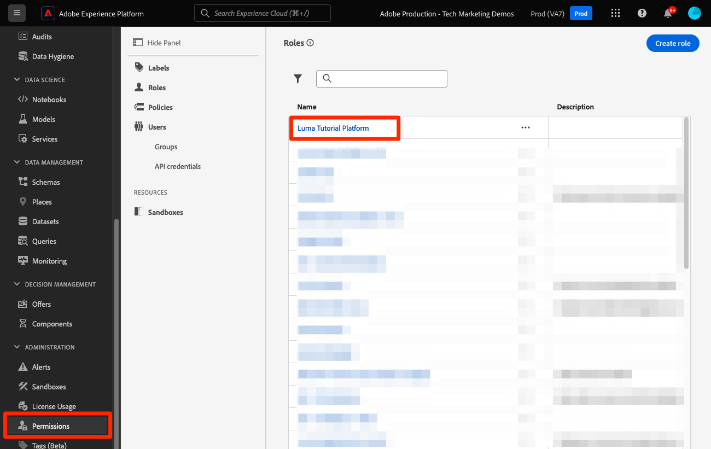
1. Sélectionnez l’onglet **[!UICONTROL Informations d’identification de l’API]**
1. Sélectionnez **[!UICONTROL Ajouter des informations d’identification d’API]**
   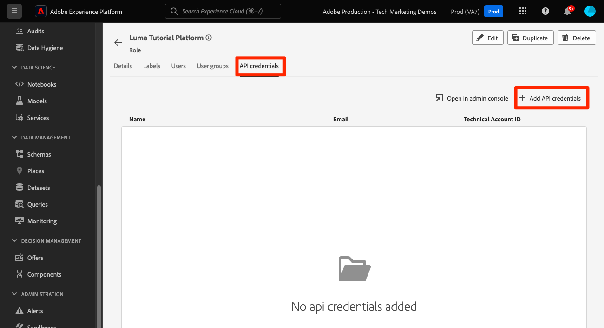
1. Recherchez les informations d’identification du `Credential in Luma Tutorial API Project`, en filtrant avec l’[!UICONTROL adresse électronique du compte technique] fournie par le participant au tutoriel, si la liste est longue
1. Sélectionner les informations d’identification
1. Sélectionnez **[!UICONTROL Enregistrer]**

   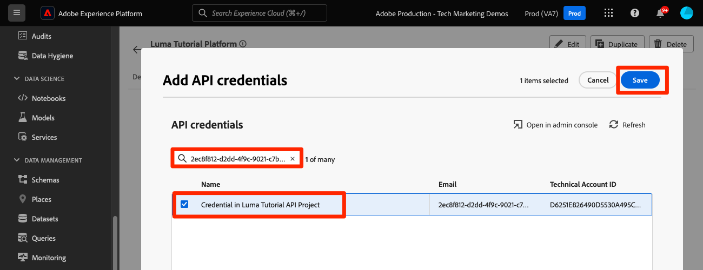

## Configuration de Postman

>[!CAUTION]
>
>L’interface de Postman est régulièrement mise à jour. Les captures d’écran de ce tutoriel ont été effectuées avec Postman v10.15.1 pour Mac, mais les options d’interface peuvent avoir changé.

1. Télécharger et installer [[!DNL Postman]](https://www.postman.com/downloads/)
1. Ouvrir [!DNL Postman] et créer un espace de travail
   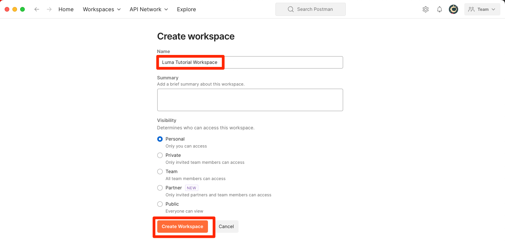

1. Importez le fichier d’environnement json téléchargé, `oauth_server_to_server.postman_environment.json`
   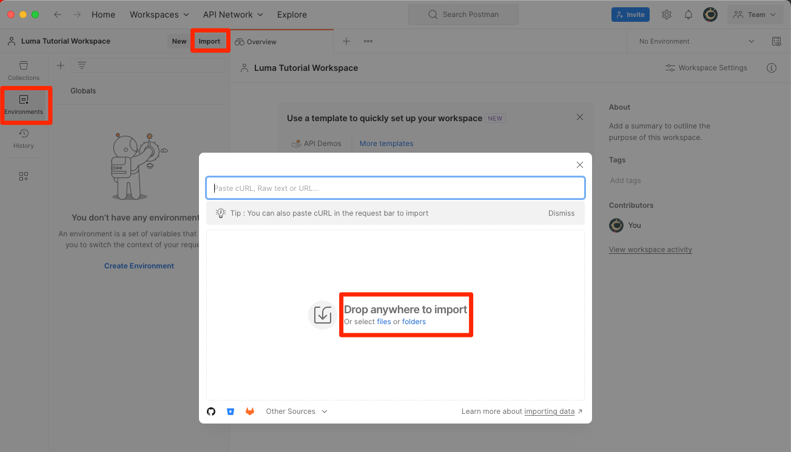
1. Dans [!DNL Postman], sélectionnez votre environnement dans la liste déroulante

1. Sélectionnez l’icône pour afficher les variables d’environnement :

   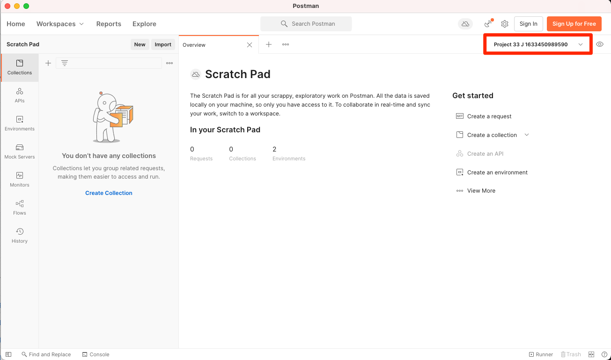

### Ajouter le nom du sandbox et l’ID de client

Les variables `SANDBOX_NAME`, `TENANT_ID` et `CONTAINER_ID` ne sont pas incluses dans l’exportation Adobe Developer Console. Nous les ajoutons donc manuellement :

1. Dans [!DNL Postman], ouvrez le **Variables d’environnement**
1. Sélectionnez le lien **Modifier** à droite du nom de l’environnement
1. Dans le champ **Ajouter une nouvelle variable**, saisissez `SANDBOX_NAME`
1. Dans les deux champs de valeur, saisissez `luma-tutorial`, le nom que nous avons donné à notre sandbox dans la leçon précédente. Si vous avez utilisé un autre nom pour votre sandbox, par exemple luma-tutorial-ignatiusurilly, veillez à utiliser cette valeur.
1. Dans le champ **Ajouter une nouvelle variable**, saisissez `TENANT_ID`
1. Accédez à votre navigateur web et recherchez l’ID client de votre société en accédant à l’interface d’Experience Platform et en extrayant la partie de l’URL *après le signe @*. Par exemple, mon identifiant client est `techmarketingdemos`, mais le vôtre est différent :

   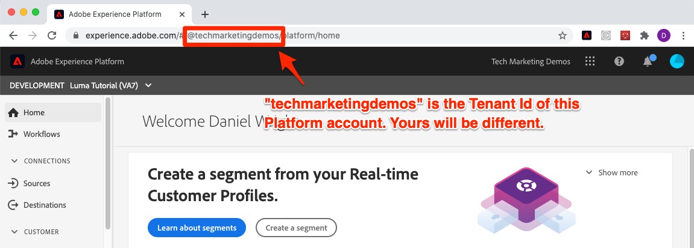

1. Copiez cette valeur et revenez à l’écran [!DNL Postman] Gérer les environnements .
1. Collez votre ID client dans les deux champs de valeur
1. Dans le champ **Ajouter une nouvelle variable**, saisissez `CONTAINER_ID`
1. Saisir des `global` dans les deux champs de valeur

   >[!NOTE]
   >
   >`CONTAINER_ID` est un champ dont la valeur est modifiée plusieurs fois au cours du tutoriel. Lorsque `global` est utilisé, l’API interagit avec les éléments fournis par Adobe dans votre compte Platform. Lorsque `tenant` est utilisé, l’API interagit avec vos propres éléments personnalisés.

1. Sélectionnez **Enregistrer**

   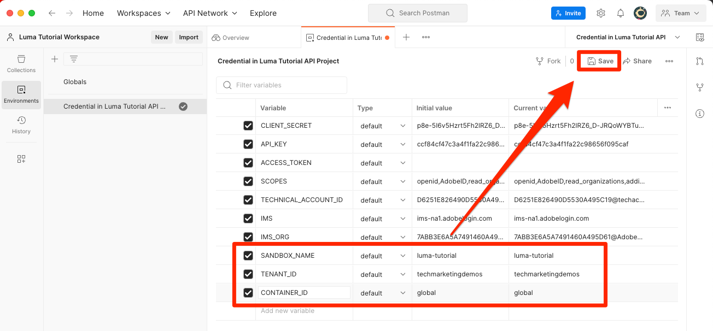

## Effectuer des appels API

### Récupération d’un jeton d’accès

Adobe fournit un ensemble riche de collections de [!DNL Postman] pour vous aider à explorer l’API Experience Platform. Ces collections se trouvent dans le référentiel GitHub d’[exemples de Postman Adobe Experience Platform](https://github.com/adobe/experience-platform-postman-samples). Vous devez ajouter un signet à ce référentiel, car vous l’utiliserez à de nombreuses reprises tout au long de ce tutoriel et ultérieurement, lorsque vous implémenterez Experience Platform pour votre propre société.

La première collection fonctionne avec les API du service Adobe Identity Management (IMS). Il s’agit d’un moyen pratique de récupérer un jeton d’accès dans Postman.

Pour générer le jeton d’accès :

1. Téléchargez la collection [API du service Identity Management](https://github.com/adobe/experience-platform-postman-samples/blob/master/apis/ims/Identity%20Management%20Service.postman_collection.json) dans votre dossier `Luma Tutorial Assets`
1. Importer la collection dans [!DNL Postman]
1. Sélectionnez la requête **oAuth : demande de jeton d’accès** puis sélectionnez **Envoyer**
1. Vous devriez obtenir une réponse `200 OK` avec un jeton d’accès dans la réponse

   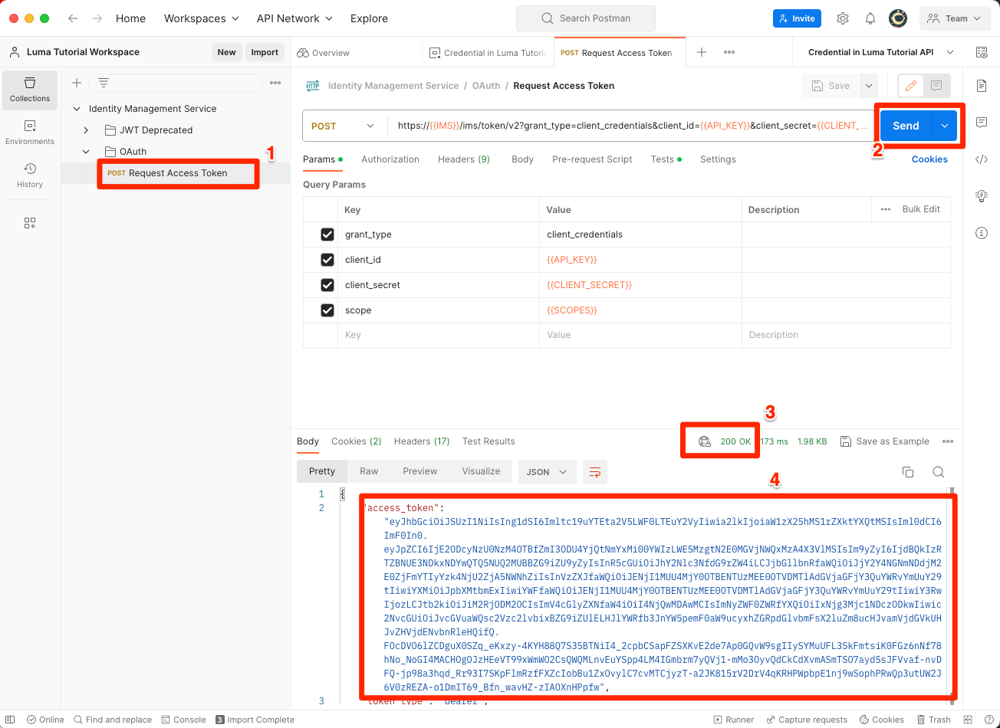

1. Le jeton d’accès doit être automatiquement stocké en tant que variable d’environnement **ACCESS_TOKEN** de votre environnement [!DNL Postman].

   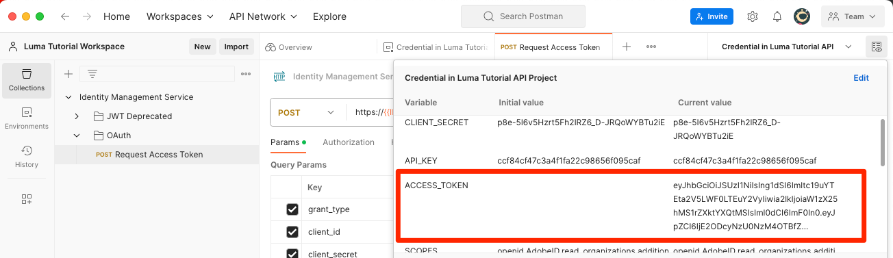

### Interaction avec une API Platform

Effectuons maintenant un appel API Platform pour confirmer que nous avons tout configuré correctement.

Ouvrez les [collections Experience Platform [!DNL Postman] dans GitHub](https://github.com/adobe/experience-platform-postman-samples/tree/master/apis/experience-platform). Il existe de nombreuses collections sur cette page, pour diverses API Platform. Je vous recommande vivement de le marquer d&#39;un signet.

Maintenant, effectuons notre premier appel API :

1. Téléchargez la [collection d’API Schema Registry](https://raw.githubusercontent.com/adobe/experience-platform-postman-samples/master/apis/experience-platform/Schema%20Registry%20API.postman_collection.json) dans votre dossier `Luma Tutorial Assets`
1. L’importer dans [!DNL Postman]
1. Ouvrez **API Schema Registry > Schémas > Liste des schémas**
1. Examinez les onglets **Params** et **En-têtes** et notez qu’ils incluent certaines des variables d’environnement que nous avons saisies précédemment.
1. Notez que le champ **En-têtes > Accepter la valeur** est défini sur `application/vnd.adobe.xed-id+json`. Les API Schema Registry nécessitent l’une de ces valeurs d’en-tête Accept [spécifiées](https://experienceleague.adobe.com/docs/experience-platform/xdm/api/getting-started.html?lang=en#accept) qui fournissent différents formats dans la réponse.
1. Sélectionnez **Envoyer** pour effectuer votre premier appel API Platform.

Nous espérons que vous avez reçu une réponse `200 OK` réussie contenant une liste des schémas XDM fournis par Adobe disponibles dans votre sandbox, comme illustré ci-dessous.

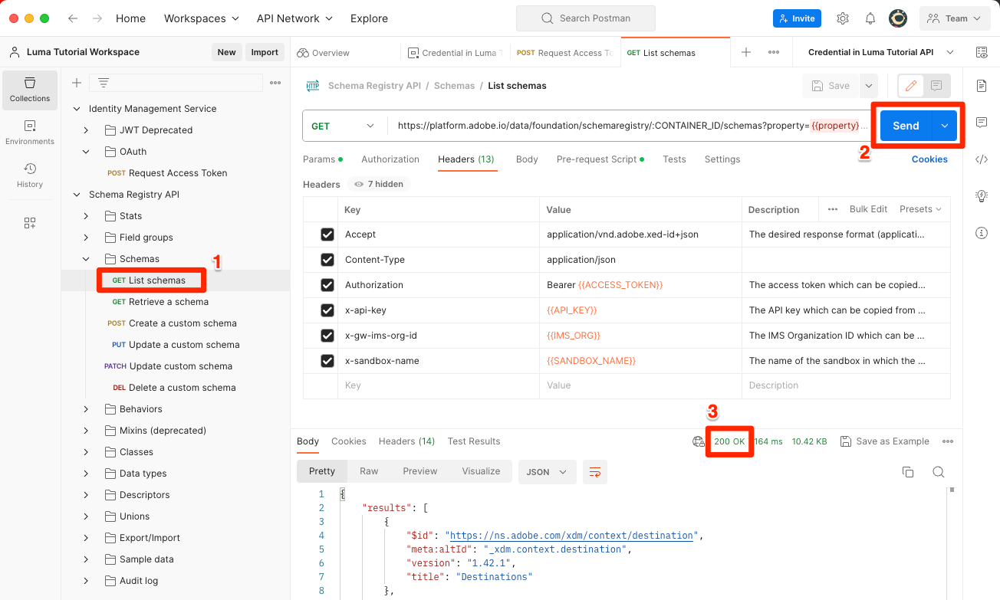

Si votre appel n’a pas réussi, prenez un moment pour déboguer à l’aide des détails de réponse d’erreur de l’appel API et passez en revue les étapes ci-dessus. Si vous êtes bloqué(e), veuillez demander de l’aide dans le [Forum de la communauté](https://experienceleaguecommunities.adobe.com/t5/adobe-experience-platform/ct-p/adobe-experience-platform-community?profile.language=fr) ou utilisez le lien situé sur le côté droit de cette page pour « Signaler un problème ».

Avec vos autorisations Platform, votre sandbox et votre configuration de [!DNL Postman], vous êtes prêt à [modéliser des données dans des schémas](model-data-in-schemas.md) !
