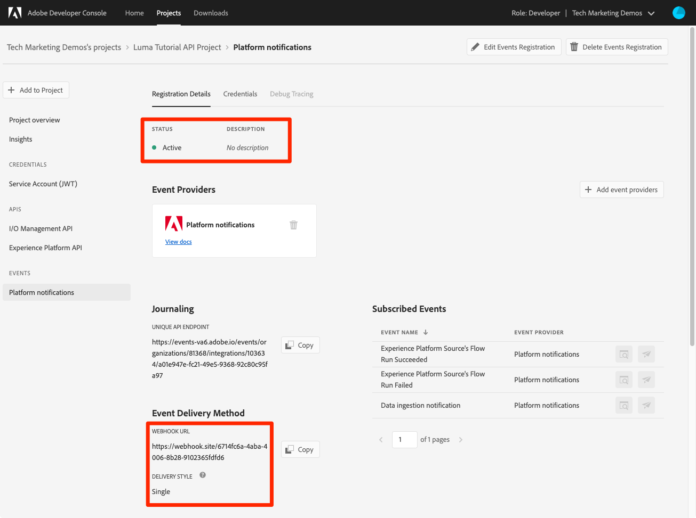

# Abonnement aux événements d’ingestion de données

<!--25min-->

Dans cette leçon, vous vous abonnerez aux événements d’ingestion de données en configurant un webhook avec la console Adobe Developer et un outil de développement webhook en ligne. Vous utiliserez ces événements pour surveiller l’état de vos tâches d’ingestion de données dans les leçons suivantes.

**Ingénieurs de données** souhaite vous abonner aux événements d’ingestion de données en dehors de ce tutoriel.
**Architectes de données** _peut ignorer cette leçon_ et accédez au [leçon sur l’ingestion par lots](ingest-batch-data.md).

## Autorisations requises

Dans le [Configuration des autorisations](configure-permissions.md) leçon, vous configurez tous les contrôles d’accès requis pour terminer cette leçon, en particulier :

<!--* Developer-role access to the `Luma Tutorial Platform` product profile (for API)
-->

>[!IMPORTANT]
>
> Ces notifications déclenchées par les événements d’ingestion de données s’appliqueront à _tous vos environnements de test_, pas seulement votre `Luma Tutorial`. Vous pouvez également voir dans votre compte des notifications provenant d’autres événements d’ingestion de données.

## Configuration d’un webhook

Dans cet exercice, nous allons créer un webhook à l’aide d’un outil en ligne appelé webhook.site (n’hésitez pas à remplacer tout autre outil de développement webhook que vous préférez utiliser) :

1. Dans un autre onglet du navigateur, ouvrez le site web. [https://webhook.site/](https://webhook.site/)
1. Une URL unique vous est attribuée, que vous devez mettre en signet, lorsque vous y reviendrez ultérieurement dans les leçons d’ingestion de données :

   
1. Sélectionnez la **Modifier** dans le volet de navigation supérieur
1. En tant que corps de la réponse, saisissez `$request.query.challenge$`. Les notifications d’événements d’Adobe I/O que nous configurons plus loin dans cette leçon envoient un défi au webhook et exigent qu’il soit inclus dans le corps de la réponse.
1. Sélectionnez la **Enregistrer** button

   

## Configurer

1. Dans un autre onglet du navigateur, ouvrez le [Console Adobe Developer](https://console.adobe.io/)
1. Ouvrez votre `Luma Tutorial API Project`
1. Sélectionnez la **[!UICONTROL Ajouter au projet]** puis sélectionnez **[!UICONTROL Événement]**

   
1. Filtrez la liste en sélectionnant **[!UICONTROL Experience Platform]**
1. Sélectionner **[!UICONTROL Notifications Platform]**
1. Sélectionnez la **[!UICONTROL Suivant]** button
   
1. Sélectionner tous les événements
1. Sélectionnez la **[!UICONTROL Suivant]** button
   
1. Sur l’écran suivant de configuration des informations d’identification, sélectionnez la variable **[!UICONTROL Suivant]** bouton à nouveau
   
1. Comme la variable **[!UICONTROL Nom de l’enregistrement de l’événement]**, saisissez `Platform notifications`
1. Faites défiler la page vers le bas et sélectionnez cette option pour ouvrir la **[!UICONTROL Webhook]** section
1. Comme la variable **[!UICONTROL URL du webhook]**, collez la valeur de la variable **Votre URL unique** champ de webhook.site
1. Sélectionnez la **[!UICONTROL Enregistrement des événements configurés]** button
   
1. Patientez jusqu’à ce que votre configuration soit enregistrée. Vous devriez constater que votre `Platform notifications` est Principal avec les détails de votre webhook et aucun message d’erreur
   
1. Revenez à l’onglet webhook.site et vous devriez voir la première requête envoyée au webhook, suite à la validation de la configuration de Developer Console :
   

Pour l’instant, vous en apprendrez davantage sur ces notifications dans les leçons suivantes lorsque vous ingérerez des données.

## Ressources supplémentaires

* [Webhook.site](https://webhook.site/)
* [Documentation sur les notifications d’ingestion de données](https://experienceleague.adobe.com/docs/experience-platform/ingestion/quality/subscribe-events.html)
* [Documentation Prise en main des événements d’Adobe I/O](https://www.adobe.io/apis/experienceplatform/events/docs.html)

Ok, commençons enfin. [ingestion de données](ingest-batch-data.md)!
