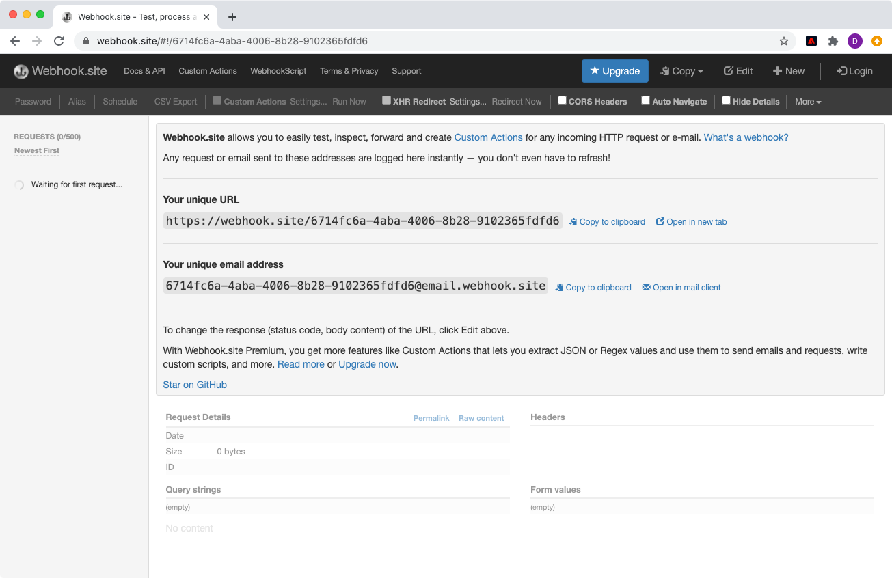
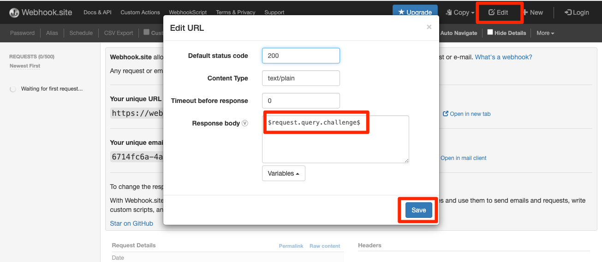
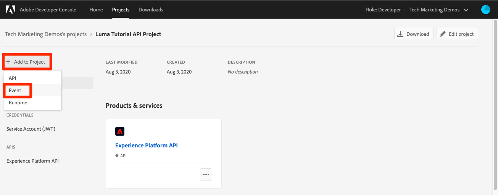
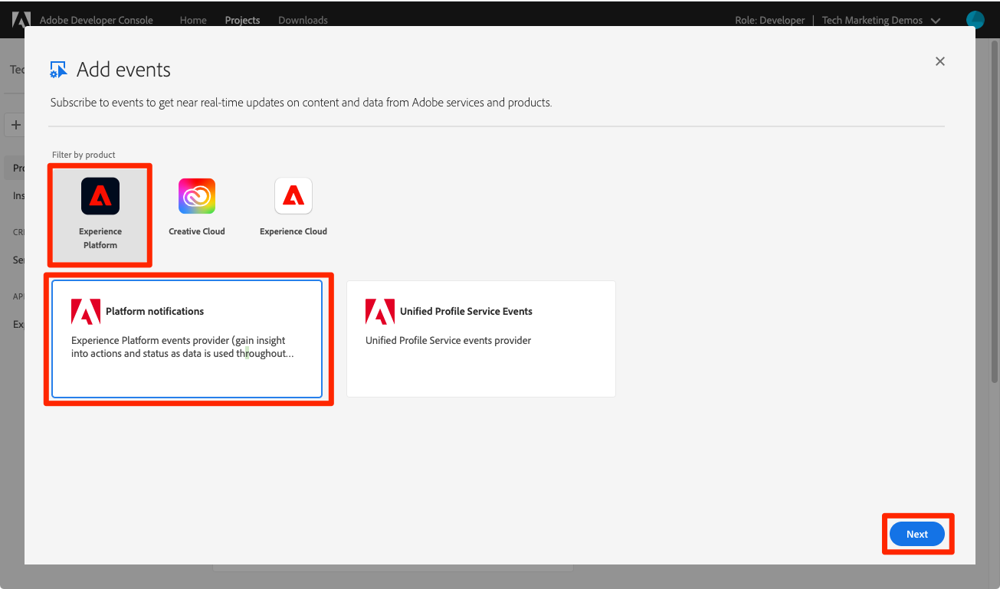
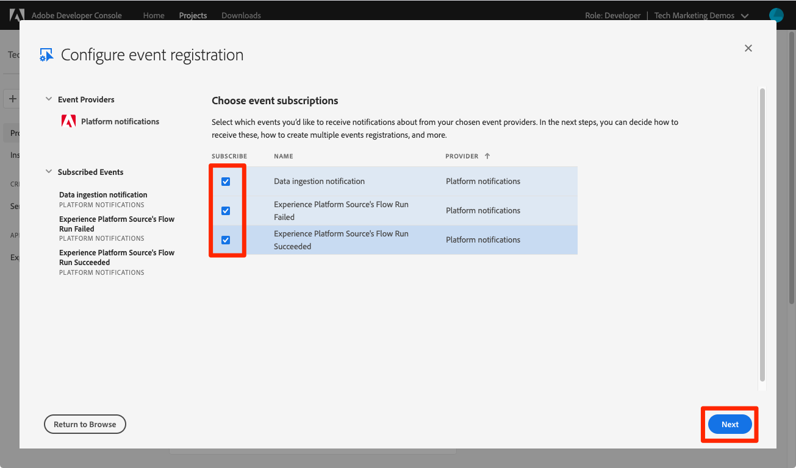
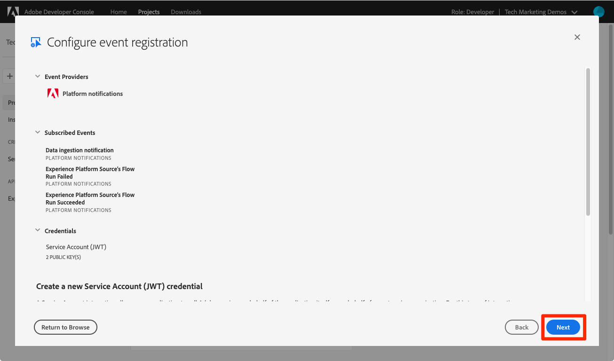
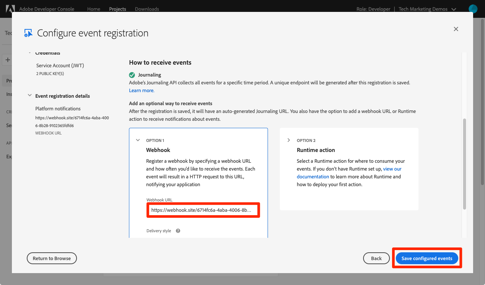
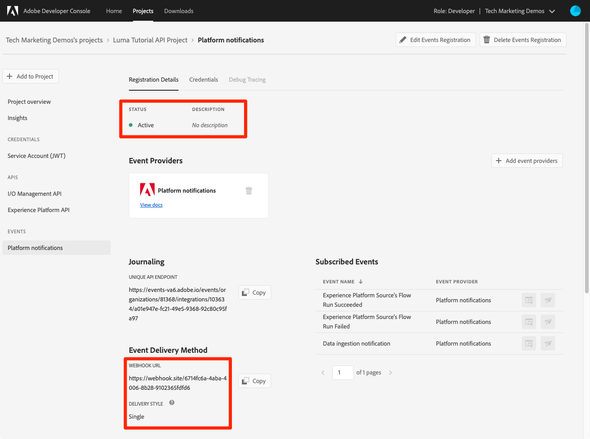
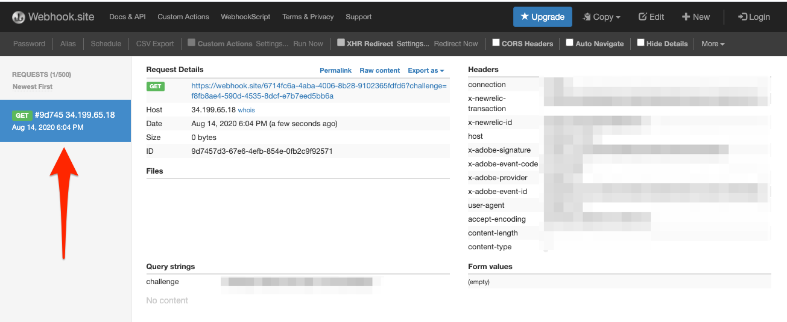

# Abonnement aux événements d’ingestion de données

<!--25min-->

Dans cette leçon, vous allez vous abonner aux événements d’ingestion de données en configurant un webhook avec Adobe Developer Console et un outil de développement webhook en ligne. Vous utiliserez ces événements pour surveiller le statut de vos tâches d’ingestion de données dans les leçons suivantes.

**Ingénieurs de données** souhaiteront vous abonner aux événements d’ingestion de données en dehors de ce tutoriel.
**Architectes de données** _pouvez ignorer cette leçon_ et passer à la [&#x200B; leçon d’ingestion par lots](ingest-batch-data.md).

## Autorisations requises

Dans la leçon [&#x200B; Configurer les autorisations &#x200B;](configure-permissions.md), vous avez configuré tous les contrôles d’accès requis pour suivre cette leçon, notamment :

<!--* Developer-role access to the `Luma Tutorial Platform` product profile (for API)
-->

>[!IMPORTANT]
>
> Ces notifications déclenchées par les événements d’ingestion de données s’appliquent à _tous vos sandbox_ et pas seulement à vos `Luma Tutorial`. Il se peut que des notifications provenant d’autres événements d’ingestion de données s’affichent également dans votre compte.

## Configurer un webhook

Dans cet exercice, nous allons créer un webhook à l’aide d’un outil en ligne appelé webhook.site (n’hésitez pas à remplacer tout autre outil de développement webhook que vous préférez utiliser) :

1. Dans un autre onglet du navigateur, ouvrez le site Web [https://webhook.site/](https://webhook.site/)
1. Une URL unique vous est attribuée, que vous devez mettre en signet, lorsque vous y reviendrez ultérieurement dans les leçons d’ingestion de données :

   
1. Sélectionnez le bouton **Modifier** dans la barre de navigation supérieure.
1. Dans le corps de la réponse, saisissez `$request.query.challenge$`. Les notifications Adobe I/O Events que nous avons configurées plus loin dans cette leçon envoient un défi au webhook et nécessitent qu’il soit inclus dans le corps de la réponse.
1. Sélectionnez le bouton **Enregistrer**

   

## Configurer

1. Dans un autre onglet du navigateur, ouvrez le [Adobe Developer Console](https://console.adobe.io/)
1. Ouvrez votre `Luma Tutorial API Project`
1. Sélectionnez le bouton **[!UICONTROL Ajouter au projet]** puis sélectionnez **[!UICONTROL Événement]**

   
1. Filtrez la liste en sélectionnant **[!UICONTROL Experience Platform]**
1. Sélectionnez **[!UICONTROL Notifications Platform]**
1. Sélectionnez le bouton **[!UICONTROL Suivant]**
   
1. Sélectionner tous les événements
1. Sélectionnez le bouton **[!UICONTROL Suivant]**
   
1. Dans l’écran suivant pour configurer les informations d’identification, sélectionnez à nouveau le bouton **[!UICONTROL Suivant]**
   
1. Dans le champ **[!UICONTROL Nom d’enregistrement de l’événement]**, saisissez `Platform notifications`
1. Faites défiler vers le bas et sélectionnez pour ouvrir la section **[!UICONTROL Webhook]**
1. En tant qu’**[!UICONTROL URL Webhook]**, collez la valeur du champ **Votre URL unique** à partir de webhook.site
1. Sélectionnez le bouton **[!UICONTROL Enregistrer les événements configurés]**
   
1. Attendez que votre configuration soit enregistrée et vous devriez voir que votre événement `Platform notifications` est Actif avec vos détails webhook et aucun message d’erreur
   
1. Revenez à l’onglet webhook.site et vous devriez voir la première requête au webhook, résultant de la validation de votre configuration Developer Console :
   

C’est terminé pour l’instant. Vous en apprendrez plus sur ces notifications dans les prochaines leçons lorsque vous ingérerez des données.

## Ressources supplémentaires

* [Webhook.site](https://webhook.site/)
* [Documentation sur les notifications d’ingestion de données](https://experienceleague.adobe.com/docs/experience-platform/ingestion/quality/subscribe-events.html?lang=fr)
* [Documentation Prise en main de Adobe I/O Events](https://www.adobe.io/apis/experienceplatform/events/docs.html)

Ok, commençons enfin à [ingérer des données](ingest-batch-data.md) !
