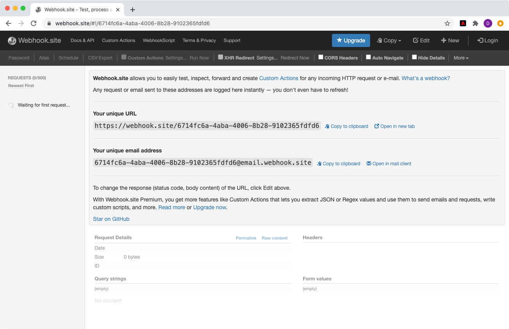

# Abonnement aux événements d’ingestion de données

<!--25min-->

Dans cette leçon, vous vous abonnerez aux événements d’ingestion de données en configurant un webhook avec Adobe Developer Console et un outil de développement webhook en ligne. Vous utiliserez ces événements pour surveiller l’état de vos tâches d’ingestion de données dans les leçons suivantes.

**Les ingénieurs de données** voudront s’abonner aux événements d’ingestion de données en dehors de ce tutoriel.
**Les architectes de données** _peuvent ignorer cette leçon_ et accéder à la [leçon sur l’ingestion par lots](ingest-batch-data.md).

## Autorisations requises

Dans la leçon [Configurer les autorisations](configure-permissions.md) , vous configurez tous les contrôles d’accès requis pour terminer cette leçon, en particulier :

<!--* Developer-role access to the `Luma Tutorial Platform` product profile (for API)
-->

>[!IMPORTANT]
>
> Ces notifications déclenchées par les événements d’ingestion de données s’appliqueront à _tous vos environnements de test_, et pas seulement à votre `Luma Tutorial`. Vous pouvez également voir dans votre compte des notifications provenant d’autres événements d’ingestion de données.

## Configuration d’un webhook

Dans cet exercice, nous allons créer un webhook à l’aide d’un outil en ligne appelé webhook.site (n’hésitez pas à remplacer tout autre outil de développement webhook que vous préférez utiliser) :

1. Dans un autre onglet du navigateur, ouvrez le site web [https://webhook.site/](https://webhook.site/)
1. Une URL unique vous est attribuée, que vous devez mettre en signet, lorsque vous y reviendrez ultérieurement dans les leçons d’ingestion de données :

   
1. Sélectionnez le bouton **Modifier** dans la barre de navigation supérieure.
1. En tant que corps de la réponse, saisissez `$request.query.challenge$`. Les notifications d’événements d’Adobe I/O que nous configurons plus loin dans cette leçon envoient un défi au webhook et exigent qu’il soit inclus dans le corps de la réponse.
1. Sélectionnez le bouton **Enregistrer**

   

## Configurer

1. Dans un autre onglet du navigateur, ouvrez le [Adobe Developer Console](https://console.adobe.io/)
1. Ouvrez votre `Luma Tutorial API Project`
1. Sélectionnez le bouton **[!UICONTROL Ajouter au projet]** , puis sélectionnez **[!UICONTROL Événement]**

   
1. Filtrez la liste en sélectionnant **[!UICONTROL Experience Platform]**
1. Sélectionnez **[!UICONTROL Notifications Platform]**
1. Sélectionnez le bouton **[!UICONTROL Suivant]**
   
1. Sélectionner tous les événements
1. Sélectionnez le bouton **[!UICONTROL Suivant]**
   
1. Sur l’écran suivant pour configurer les informations d’identification, cliquez de nouveau sur le bouton **[!UICONTROL Suivant]**
   
1. En tant que **[!UICONTROL Nom de l&#39;enregistrement de l&#39;événement]**, saisissez `Platform notifications`
1. Faites défiler la page vers le bas et sélectionnez pour ouvrir la section **[!UICONTROL Webhook]** .
1. En tant que **[!UICONTROL URL webhook]**, collez la valeur du champ **Your unique URL** de webhook.site
1. Sélectionnez le bouton **[!UICONTROL Enregistrer les événements configurés]**
   
1. Attendez que votre configuration soit enregistrée et vous devriez constater que votre événement `Platform notifications` est actif avec les détails de votre webhook et qu’il n’y a aucun message d’erreur.
   
1. Revenez à l’onglet webhook.site et vous devriez voir la première requête au webhook, suite à la validation de votre configuration Developer Console :
   

Pour l’instant, vous en apprendrez davantage sur ces notifications dans les leçons suivantes lorsque vous ingérerez des données.

## Ressources supplémentaires

* [Webhook.site](https://webhook.site/)
* [Documentation sur les notifications d’ingestion de données](https://experienceleague.adobe.com/docs/experience-platform/ingestion/quality/subscribe-events.html)
* [Prise en main de la documentation sur les événements d’Adobe I/O](https://www.adobe.io/apis/experienceplatform/events/docs.html)

Ok, commençons enfin [l&#39;ingestion de données](ingest-batch-data.md) !
