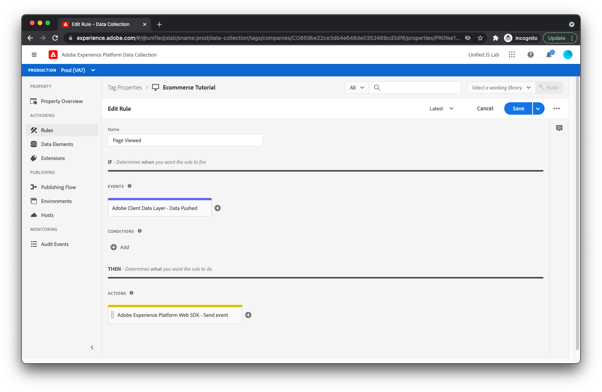

# Création de règles pour le suivi des événements de page vue et de commerce

Pour vérifier que l’utilisateur a consulté la page du produit, créez une règle dans Adobe Experience Platform. [!DNL Tags].

1. Cliquez sur **[!UICONTROL Règles]** dans le volet de navigation de gauche, puis cliquez sur **[!UICONTROL Créer une règle]**.

1. Pour le nom de la règle, saisissez **_Page vue_**.

## Ajout d’un événement

1. Cliquez sur le bouton **[!UICONTROL Ajouter]** sous [!UICONTROL Événements]. Vous affichez maintenant la vue d’événement. Pour le [!UICONTROL Extension] champ, sélectionnez **[!UICONTROL Adobe de la couche de données client]**. Pour le [!UICONTROL Type d’événement] champ, sélectionnez **[!UICONTROL Données transférées]**.
1. Parce que vous souhaitez que cette règle soit déclenchée uniquement lorsque la variable `pageViewed` est transmis à la couche de données, select **[!UICONTROL Evénement spécifique]** under [!UICONTROL Écoute] et type **_pageViewed_** dans la [!UICONTROL Événement/Clé à enregistrer pour] Champ de texte.
1. Cliquez sur **[!UICONTROL Conserver les modifications]**.
   

## Ajouter une action

Maintenant que vous revenez à la vue de règle :

1. Cliquez sur le bouton **[!UICONTROL Ajouter]** sous [!UICONTROL Actions]. Vous devriez maintenant être dans la vue d’action. Pour le [!UICONTROL Extension] champ, sélectionnez **[!UICONTROL SDK Web Adobe Experience Platform]**. Pour le [!UICONTROL Type d’action] champ, sélectionnez **[!UICONTROL Envoyer un événement]**. Cette action vous permet d’envoyer un événement d’expérience à Adobe Experience Platform Edge Network.
1. Au milieu de l’écran, recherchez le [!UICONTROL Type] champ et sélectionnez **`web.webpagedetails.pageViews`**. Il s’agit de l’un des types d’événements d’expérience canoniques fournis par défaut par Adobe Experience Platform. Il représente une page vue.
1. Pour le [!UICONTROL Données XDM] champ, entrer **`%event.fullState%`**. Cela indique que l’état calculé (également appelé état complet) de la couche de données, qui est capturé au moment où la règle a été déclenchée. Cela doit être envoyé dans le cadre de l’événement d’expérience.
1. Cliquez sur le bouton **[!UICONTROL Conserver les modifications]** bouton .
   

Si les données que vous avez transmises à la couche de données à partir de votre site web ne sont pas conformes à votre schéma XDM ou si vous souhaitez uniquement envoyer une partie de l’état calculé de la couche de données, utilisez la variable [!UICONTROL Objet XDM] type d’élément de données (fourni par l’extension SDK Web de Adobe Experience Platform) pour créer un objet approprié qui correspond à votre schéma.

## Enregistrez la règle

1. Enregistrez la règle en cliquant sur **[!UICONTROL Enregistrer]**.
   

## Répétez le processus.

Répétez le processus décrit ci-dessus pour créer des règles pour lorsqu’un produit est affiché, qu’un panier est ouvert et qu’un produit est ajouté au panier. Les seules différences entre les règles sont le nom de la règle, la valeur saisie dans la variable [!UICONTROL Événement/Clé à enregistrer pour] dans le champ [!UICONTROL Données transférées] et la variable [!UICONTROL Type] dans le champ [!UICONTROL Envoyer un événement] action. Voici les valeurs de chaque règle :

Règle de consultation du produit :

* **Nom de la règle**: _Produit consulté_
* **Événement/Clé à enregistrer pour** dans [!UICONTROL Données transférées] event: `productViewed`
* **Type** dans [!UICONTROL Envoyer un événement] action : `commerce.productViews`

Règle d’ouverture de panier :

* **Nom de la règle**: _Panier ouvert_
* **Événement/Clé à enregistrer pour** dans [!UICONTROL Données transférées] event: `cartOpened`
* **Type** dans [!UICONTROL Envoyer un événement] action : `commerce.productListOpens`

Produit ajouté à la règle de panier :

* **Nom de la règle**: _Produit Ajouté Au Panier_
* **Événement/Clé à enregistrer pour** dans [!UICONTROL Données transférées] event: `productAddedToCart`
* **Type** dans [!UICONTROL Envoyer un événement] action : `commerce.productListAdds`

Ensuite, nous gérons les clics de suivi sur le [!UICONTROL Téléchargement de l’application] lien.

[Suivant : ](create-a-data-element-and-rule-for-tracking-app-downloads.md)

>[!NOTE]
>
>Merci d’avoir consacré votre temps à l’apprentissage de la collecte de données. Si vous avez des questions, souhaitez partager des commentaires généraux ou avez des suggestions sur le contenu futur, partagez-les à ce sujet. [Article de discussion de la communauté Experience League](https://experienceleaguecommunities.adobe.com/t5/adobe-experience-platform-launch/tutorial-discussion-use-adobe-experience-platform-data/m-p/543877)
