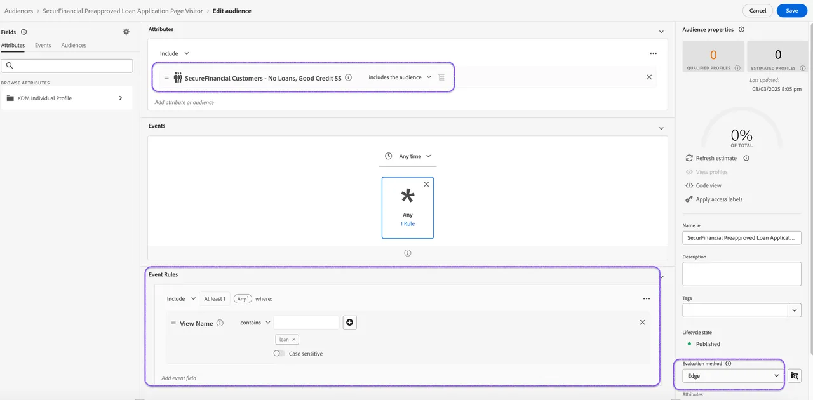

# Enrichissement des audiences Experience Platform avec des données fédérées

La composition de l’audience fédérée vous permet d’enrichir les audiences existantes dans Adobe Experience Platform (AEP) en utilisant les données de l’audience composée qui ont été fédérées à partir de l’entrepôt de données d’entreprise. Ces données ne seront pas conservées dans les profils client Adobe Experience Platform.

## Méthodes d’enrichissement d’une composition d’audience fédérée

Il existe deux méthodes principales pour enrichir une composition d’audience fédérée.

### &#x200B;1. Lecture d’une audience AEP dans une composition fédérée

Dans ce premier exemple, nous allons utiliser l’audience **visiteur de la page de demande de prêt financier** stockée dans le service de profil AEP pour démarrer notre composition fédérée. Nous enrichirons l’audience à l’aide de données fédérées dans Snowflake afin de déterminer la préapprobation en fonction de la cote de crédit et de l’activité de prêt.

1. **Mappez une audience AEP** à la destination de la composition d’audiences fédérées.
2. **Créez votre composition** avec l’audience mappée en tant qu’audience Lecture.
3. **Réconcilier les identités** dans votre audience lue à joindre aux données fédérées.

### &#x200B;2. Enrichissement de la règle d’audience Experience Platform avec une audience fédérée

Dans le deuxième exemple, nous utiliserons l’audience fédérée interrogée avec la cote de crédit et l’activité de prêt pour enrichir l’audience comportementale des visiteurs de la page web de la demande de prêt.

En évaluant cette audience sur Edge, nous pouvons recibler instantanément les visiteurs de la page de demande de prêt préapprouvés avec des offres personnalisées sur le site.

1. **Enregistrer et démarrer** votre composition d’audience fédérée. Une fois la composition exécutée, votre audience fédérée s’affiche sur le portail d’audiences.
2. **Créer une règle d’audience** à l’aide des attributs de profil et des événements d’expérience du service de profil, en incorporant votre audience fédérée.

Résumons cela par un [résumé des enseignements et des points à retenir finaux](conclusion.md) !
