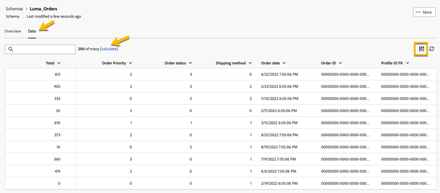

# Connexion Data Warehouse

Dans cette leçon, nous configurons une connexion entre Adobe Experience Platform et votre Data Warehouse d’entreprise pour activer la composition d’audiences fédérées. Vous pouvez ainsi interroger les données directement à partir d’entrepôts pris en charge sans réplication. En outre, nous créons des schémas et des modèles de données basés sur les tables Data Warehouse.

Pour ce Lab, nous nous connectons à un compte Snowflake. La composition de l’audience fédérée prend en charge une liste croissante de connexions d’entrepôt de données cloud. Voir la [liste mise à jour des intégrations](https://experienceleague.adobe.com/fr/docs/federated-audience-composition/using/start/access-prerequisites){target="_blank"}.

## Étapes

1. Accédez à la section **DONNÉES FÉDÉRÉES** sur le rail de gauche.
2. Sur le lien **Bases de données fédérées**, cliquez sur le bouton **Ajouter une base de données fédérée**.
3. Ajoutez un nom et sélectionnez **Snowflake**.
4. Renseignez les détails, cliquez sur le bouton **Tester la connexion**, puis sur le bouton **Déployer les fonctions**.

   

   

   

## Création d’un schéma

Pour créer des schémas dans la composition d’audiences fédérées, procédez comme suit :

1. Dans la section **FEDERATED DATA**, cliquez sur **Modèles**.
2. Parcourez l’onglet **Schéma** et cliquez sur le bouton **Créer un schéma**.
3. Sélectionnez votre base de données source dans la liste et cliquez sur l’onglet **Ajouter des tableaux**.
4. Sélectionnez les tableaux suivants :
   - FSI_CRM
   - FSI_CRM_CONSENT_PREFERENCE

   

   

Après avoir sélectionné vos tableaux, passez en revue les colonnes de chaque tableau et sélectionnez votre clé primaire. Pour cet exercice, nous sélectionnons **EMAIL** comme clé primaire dans les deux tableaux.

## Prévisualiser des données dans un schéma

Pour prévisualiser les données dans la table représentée par votre schéma, accédez à l’onglet **Données**.

Cliquez sur le lien **Calculer** pour prévisualiser le nombre total d’enregistrements.

## Création d’un modèle de données

Les modèles de données permettent de créer un lien entre les tables. Le lien peut être créé entre des tables d&#39;une même base de données (tables de Snowflake, par exemple) ou entre des tables de bases de données différentes (lien entre une table de Snowflake et une table d&#39;Amazon Redshift).

Pour créer un modèle de données dans la composition d’audiences fédérées, procédez comme suit :

1. Dans la section **FEDERATED DATA**, cliquez sur **Modèles** puis sur **Modèle de données**.
2. Cliquez sur le bouton **Créer un modèle de données**.
3. Attribuez un nom à votre modèle de données.
4. Cliquez sur **Ajouter des schémas** et sélectionnez les schémas **FSI_CRM** et **FSI_CRM_CONSENT_PREFERENCE**.
5. Créez un lien entre ces tables en cliquant sur **Créer des liens**.

Lors de la création d&#39;un lien, choisissez la cardinalité applicable :

- **1-N** : à une occurrence de la table source peuvent correspondre plusieurs occurrences de la table cible, mais à une occurrence de la table cible peut correspondre au plus une occurrence de la table source.
- **N-1** : à une occurrence de la table cible peuvent correspondre plusieurs occurrences de la table source, mais à une occurrence de la table source peut correspondre au plus une occurrence de la table cible.
- **1-1** : à une occurrence de la table source peut correspondre au plus une occurrence de la table cible.

Vous trouverez ci-dessous un aperçu du lien créé pour les exercices pratiques. Le lien permet une jointure entre le CRM et les tables de consentement à l&#39;aide de la clé primaire de **EMAIL** pour effectuer une jointure.

Maintenant, nous sommes prêts à [créer et à cibler](audience-creation-exercise.md).
