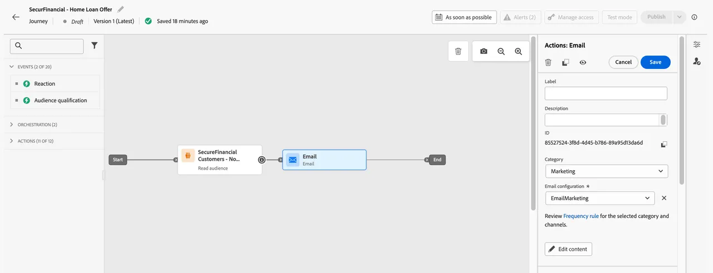

# Création d’un parcours avec une audience fédérée

Les audiences fédérées peuvent être utilisées dans les parcours de Adobe Journey Optimizer (AJO). Cela inclut l’utilisation d’attributs interrogés de la composition d’audiences fédérées pour personnaliser la messagerie.

Pour poursuivre l’histoire de SecurFinancial, en particulier le cas d’utilisation du reciblage et de la personnalisation des clients, nous orchestrons un parcours pour les clients préqualifiés. L&#39;objectif est d&#39;envoyer un e-mail personnalisé basé sur les attributs fédérés depuis l&#39;entrepôt de données de SecurFinancial.

## Étapes

### Création d’un Parcours avec une audience de lecture

1. Accédez au portail **Parcours** et cliquez sur le bouton **Créer un Parcours**.

   

2. Mettez à jour les propriétés du Parcours avec un nouveau nom. Dans notre exemple : **`SecurFinancial - Home Loan Offer`**.

3. Cliquez sur **Orchestration**, puis glissez-déposez la mosaïque **Lecture d’audience** sur la zone de travail.

4. Cliquez sur l’icône **crayon** en regard de la zone Audience sur le côté droit de l’écran.

5. Dans la barre de recherche, recherchez l’audience. Dans notre exemple : **`SecureFinancial Customers - No Loans, Good Credit`**. Cliquez sur **Enregistrer**.

   

6. Laissez tous les paramètres par défaut dans le menu de droite, puis cliquez sur **Enregistrer**.

   

### Personnaliser l’e-mail

1. Cliquez sur **Actions**, puis faites glisser la mosaïque **E-mail** vers la zone de travail.

2. Dans le menu de droite, cliquez sur **Configuration du canal e-mail** et sélectionnez **Marketing par e-mail**. Cliquez ensuite sur **Modifier le contenu**.

3. Ajoutez une ligne d’objet. Dans notre exemple : **`Learn more about SecurFinancial Home Loan`**. Cliquez ensuite sur **Modifier le corps de l’e-mail**.

4. Cliquez sur le bouton **Modèle de contenu** dans le coin supérieur droit. Recherchez et sélectionnez le modèle approprié. Notre exemple utilise le `SecureFinancial Template` . Cliquez ensuite sur **Confirmer**.

   

   

5. Vérifiez le modèle, puis cliquez sur **Utiliser le modèle**.

6. Vous serez désormais dans le Designer Email. Pointez sur la macro `{profile.person.name.firstName}` et cliquez sur l’avatar **personnalisation**.

7. Dans la fenêtre de personnalisation, analysez le chemin d’accès au dossier avec l’audience fédérée chargée. Dans notre exemple : **`[sandbox] > audienceEnrichment > CustomerAudienceUpload`**

8. Cliquez dans le dossier **lecture d’audience**. Les attributs d’enrichissement de votre audience fédérée se trouvent ici.

9. Sélectionnez l’attribut **Prénom** dans le créateur d’expressions. L’e-mail exprime dynamiquement la valeur du prénom du client pour personnaliser l’e-mail.

10. Cliquez sur **Enregistrer**.

11. Maintenant que la personnalisation de prénom a été ajoutée, ajoutez `Hi, ` devant la variable de personnalisation . Cliquez ensuite sur **Enregistrer**.

   

12. Cliquez deux fois sur le bouton **Précédent** pour revenir à la zone de travail de parcours. Ensuite, dans le menu **Action : E-mail** à droite, cliquez sur **Enregistrer**.

   

Nous avons créé un parcours dans AJO à l’aide d’une audience fédérée et d’attributs d’enrichissement fédérés.

Nous allons maintenant examiner comment [enrichir une audience](federated-audience-composition.md) dans Experience Platform avec les données de l’entrepôt de données.
