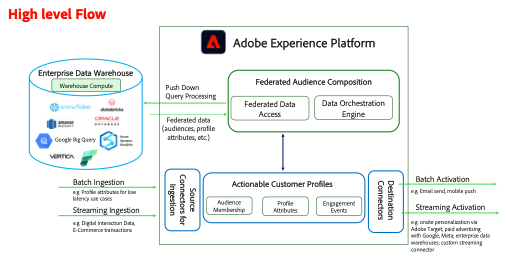

# Architecture et flux de haut niveau de la composition de l’audience fédérée

Avant d’aborder les étapes de prise en charge du scénario commercial pour SecurFinancial, nous allons passer en revue l’architecture et le flux de haut niveau de cette approche de CDP composable.

Le module de composition d’audience fédérée de Adobe Experience Platform étend l’accès aux jeux de données de l’entrepôt de données sans copier les données sous-jacentes, réduisant ainsi le déplacement et la duplication des données.

Cela permet également aux entreprises de disposer de l’architecture Composable requise, car elles ont déjà terminé le travail de gestion des données requis dans leur entrepôt et souhaitent utiliser un modèle de copie à zéro, dans lequel Adobe Experience Platform devient le moteur d’engagement.

Il permet aux entreprises de traiter rapidement les informations stockées dans un ou plusieurs entrepôts de données. Cela supprime la nécessité d’ingérer des données dans Adobe Experience Platform. En outre, il permet d’accéder aux nouveaux jeux de données qui se trouvent dans des entrepôts de données d’entreprise, mais qui étaient jusqu’à présent inaccessibles pour les workflows d’expérience client. Il peut s’agir, par exemple, d’historiques de transactions ou de données personnelles qui seront utiles à une audience agrégée pour l’engagement des clients.

Nous allons maintenant passer à la création d&#39;une [connexion Data Warehouse](data-warehouse-connection.md).
