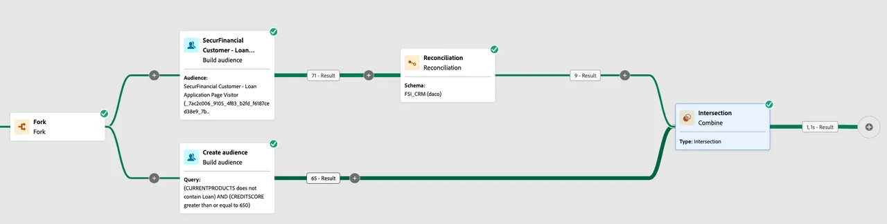

# Enrichissement des audiences avec des données d’entrepôt de données

La composition de l’audience fédérée vous permet d’enrichir les audiences existantes dans Adobe Experience Platform (AEP) en utilisant les données de l’audience composée qui ont été fédérées à partir de l’entrepôt de données d’entreprise. Ces données ne seront pas conservées dans les profils client Adobe Experience Platform.

## Lecture d’une audience dans une composition fédérée

Dans cet exercice, nous utilisons l’audience **visiteur de la page de demande de prêt financier** stockée dans le service de profil Experience Platform pour démarrer notre composition fédérée. Il utilise les données fédérées dans Snowflake pour déterminer la préapprobation en fonction de la cote de crédit et de l’activité de prêt.

### Étapes

1. **Mappez une audience AEP** à la destination de la composition d’audiences fédérées.
2. **Créez votre composition** avec l’audience mappée en tant qu’audience Lecture.
3. **Réconcilier les identités** dans votre audience lue à joindre aux données fédérées.

Nous allons examiner un autre exemple d’utilisation des données fédérées pour [prendre en charge la personnalisation « sur le moment »](deliver-in-the-moment-personalization.md) !
