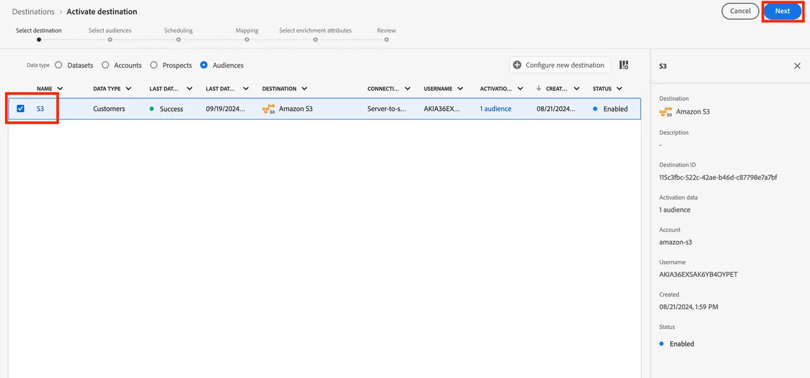

# Mapper l’audience fédérée à S3 pour exploiter les attributs d’audience à des fins d’enrichissement

Vous pouvez exploiter les attributs d’audience dans votre entrepôt de données pour enrichir l’expérience de votre audience dans les workflows d’activation en aval à l’aide des destinations RTCDP. Pour SecurFinancial, ces attributs fédérés peuvent être utilisés pour améliorer l’expérience de personnalisation hors ligne de l’audience du client. Ci-dessous, l’audience fédérée est mappée à une destination Amazon S3 préconfigurée.

## Étapes

1. Accédez au portail **Destinations**.

2. Cliquez sur le bouton **menu en forme de point** en regard de la destination Amazon S3 préconfigurée, puis cliquez sur **Activer les audiences**.

   

3. Sélectionnez la destination **S3**, puis cliquez sur **Suivant**.

   

4. Sélectionnez l’audience appropriée. Dans notre exemple : **SecureFinancial Customers - No Loans, Good Credit** audience.

   

5. Dans la section **Planification**, utilisez les paramètres par défaut et cliquez sur **Suivant**.

6. À l’étape **Mappage**, choisissez la clé de déduplication. Dans notre exemple, `xdm: personalEmail.address` est inclus et sélectionné comme **Clé de déduplication**. Cliquez ensuite sur **Suivant** :

   

7. À l’étape de mappage , sélectionnez des attributs d’enrichissement en fonction des mappages des champs d’audience dans la composition de l’audience fédérée. Cliquez sur l’icône **crayon (modifier)** pour afficher les attributs présélectionnés.

   

   

8. Vérifiez le mappage des audiences et appuyez sur **Terminer**.

>[**!SUMMARY**]
>
> Nous avons créé une audience et l’avons activée facilement vers une destination S3. L’interface conviviale permet aux équipes marketing de créer et d’activer rapidement des audiences sans déplacer les données sous-jacentes.

Maintenant, nous allons [construire un parcours ](build-journey-federated-audience.md).
