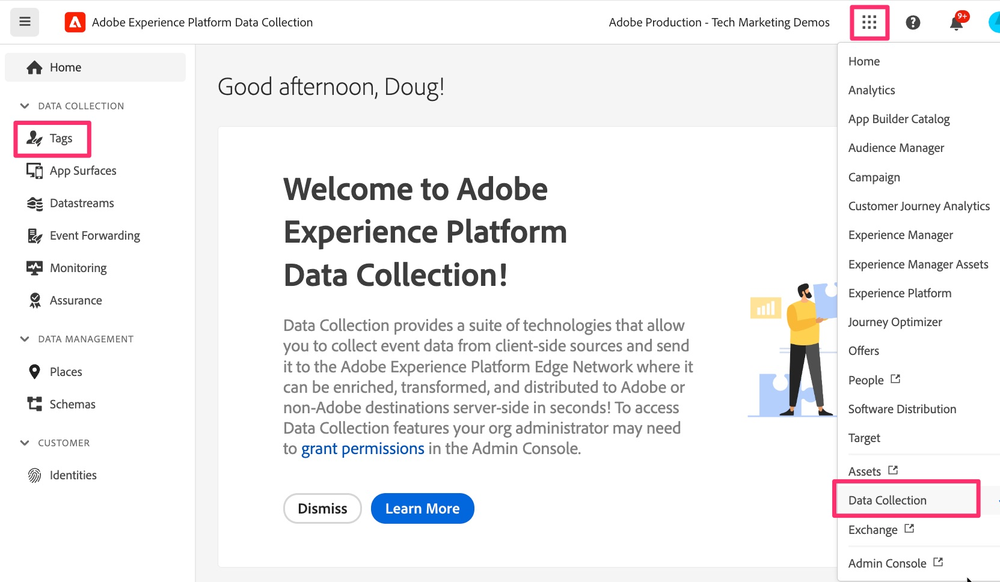

# Ajout et configuration de l’extension Web SDK

Découvrez comment ajouter et configurer l’extension Web SDK dans votre propriété Tags afin de vous donner les fonctionnalités dont vous avez besoin dans d’autres leçons pour terminer la migration.
Pour ajouter et configurer l’extension, procédez comme suit :

1. Accédez à Collecte de données Experience Platform. Vous pouvez le faire de deux façons :
   1. Accédez à l’interface de [Adobe Experience Platform](https://platform.adobe.com/) puis sélectionnez **[!UICONTROL Balises]** près du bas du volet de navigation de gauche.
      
   1. Si vous n’avez pas accès à Platform, vous pouvez utiliser le sélecteur d’applications (9 points) en haut à droite de la fenêtre et sélectionner Collecte de données (après vous être connecté à Experience.Adobe.com).
      
1. Recherchez et sélectionnez la propriété de balise que vous migrez vers le SDK Web.
1. Dans le volet de navigation de gauche de la propriété de balise, sélectionnez **[!UICONTROL Extensions]**.
1. Sélectionnez **[!UICONTROL Catalogue]** en haut pour afficher la liste de toutes les extensions disponibles.
1. Recherchez et sélectionnez l’extension **[!UICONTROL Adobe Experience Platform Web SDK]**, puis cliquez sur **[!UICONTROL Installer]** à droite.

   {style="border:1px solid lightslategray"}

1. Les paramètres de configuration de l’extension s’affichent. Recherchez la section Flux de données et définissez le sandbox Experience Platform à utiliser pour cette migration (listes déroulantes « Environnement » pour les trois environnements). Si vous migrez uniquement Adobe Analytics et n’envoyez pas de données à Adobe Experience Platform, choisissez le sandbox **Production**. Si vous allez envoyer ces données d’analyse comportementale à l’Experience Platform pour les utiliser dans les applications de cet environnement, choisissez le sandbox que vous souhaitez utiliser à cet effet. Vous souhaiterez probablement commencer par sélectionner un sandbox de développement jusqu’à ce que la migration soit terminée et que vous ayez terminé d’ajouter ou de tester votre service Platform.
1. Il est très important de connecter votre code et vos paramètres ici, dans Balises, à Edge en sélectionnant les flux de données que vous avez créés à l’étape précédente pour les environnements de production, d’évaluation et de développement.

   {style="border:1px solid lightslategray"}

1. Faites défiler vers le bas et notez que les paramètres **Identité** sont sélectionnés par défaut. Gardez ces cases à cocher sélectionnées, car elles permettent d’identifier correctement les visiteurs de votre site lorsque vous migrez vers le SDK Web. Vous trouverez plus d’informations dans la documentation, dont le lien figure ci-dessous.

1. Sélectionnez **[!UICONTROL Enregistrer]**.

>[!NOTE]
>
>Votre propriété Tags dispose désormais d’une installation et d’une configuration de base de l’extension Web SDK. Nous utiliserons des parties de l’extension Web SDK lors de la création ou de la modification des éléments de données et des règles au cours de ce tutoriel sur la migration, mais nous ne modifierons plus les éléments de configuration de l’extension dans le tutoriel. D’autres éléments de configuration peuvent et doivent être utilisés pour d’autres cas d’utilisation. Pour obtenir une documentation détaillée sur ces configurations, voir [Configurer l’extension de balise Web SDK](https://experienceleague.adobe.com/en/docs/experience-platform/tags/extensions/client/web-sdk/web-sdk-extension-configuration).
