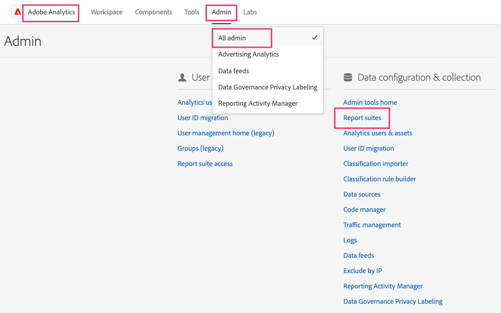

# Création d’une suite de rapports de validation

Créez une suite de rapports dans Adobe Analytics que vous pouvez utiliser pour valider les données de Web SDK lors de la migration de votre ou vos sites à partir de l’ancienne mise en œuvre.

Selon la taille et la complexité de votre implémentation Analytics, la migration vers Web SDK peut prendre un certain temps. Pendant ce temps, vous souhaiterez valider votre travail en vous assurant que les données circulent correctement dans les rapports Adobe Analytics. Au lieu de transmettre ces données à une suite de rapports avec les données de production, ou même avec d’autres données de développement, il est recommandé de créer une nouvelle suite de rapports que vous pouvez utiliser pour cette migration. Dans la leçon suivante, nous allons créer et configurer de nouveaux « flux de données » pour le développement, l’évaluation et la production. Dans ce cas, nous devrons connaître l’identifiant de la suite de rapports pour la configuration.

## Création d’une suite de rapports

1. Ouvrez Adobe Analytics et accédez aux paramètres **suite de rapports** dans l’Admin Console

   .

1. Sélectionnez **[!UICONTROL Ajouter une suite de rapports]**

   

1. Remplissez le formulaire pour créer une suite de rapports. Bien que vous puissiez choisir de créer la nouvelle suite de rapports à partir d’un modèle, même un modèle vierge, il sera probablement préférable de sélectionner l’option **Dupliquer une suite de rapports existante** et de choisir la suite de rapports que vous migrez vers Web SDK. Cela vous permettra d’avoir les mêmes noms et paramètres que vous testez vos données nouvellement migrées, ce qui facilite leur validation au fur et à mesure. Renseignez tous les champs obligatoires et enregistrez votre nouvelle suite de rapports de développement de migration.

   

1. Notez l’identifiant de votre nouvelle suite de rapports, car vous en aurez besoin dans la leçon suivante lorsque vous configurerez des flux de données pour l’implémentation de Web SDK. Le titre du site est également important à retenir, car vous pouvez l’utiliser dans Analysis Workspace pour choisir la suite de rapports de développement de migration dans votre projet Analytics.

>[!TIP]
>
>Pour une présentation vidéo sur la création de suites de rapports, voir [Comprendre et créer des suites de rapports](https://experienceleague.adobe.com/fr/docs/analytics-learn/tutorials/intro-to-analytics/analytics-basics/understanding-and-creating-report-suites){target="_blank"}.

