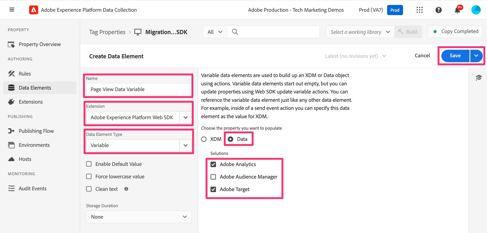

# Créer un élément de données Variable

Ajoutez un élément de données qui sera créé sur plusieurs règles, puis envoyé à l’Edge Network et transféré à Adobe Analytics.

Cet élément de données crée l’objet « Data », qui sera utilisé pour transmettre des variables Adobe Analytics (props, eVars, événements, etc.) à Adobe Analytics et Adobe Target. Ainsi, tout comme pour la création de l’« objet s » dans une implémentation AppMeasurement dans Analytics, nous allons créer l’objet suivant : Objet de variable accessible et mis à jour entre les règles, et qui peut être utilisé pour renseigner les props et les eVars dans Analytics.

1. Dans l’interface de collecte de données, cliquez sur **Éléments de données** dans le volet de navigation de gauche.

   Vous accédez à la page de destination des éléments de données, où vous pouvez voir tous vos éléments de données préexistants. Nous devons créer un nouvel élément de données pour faciliter la migration. Cliquez sur **Ajouter un élément de données**.

   

1. Configurez l’élément de données.
   1. Nommez votre élément de données comme vous le souhaitez - ce qui vous aidera à vous rappeler que cela crée les données sur votre page et que ce sera le type « Variable ». Pour ce tutoriel, nous l’appellerons **Variable de données de page vue**.
   1. Sélectionnez **Adobe Experience Platform Web SDK** dans la liste déroulante Extension .
   1. Sélectionnez **Variable** dans le menu déroulant **Type d’élément de données**.
   1. Dans le panneau de droite, sélectionnez le bouton radio **Données**.
   1. Vérifiez la solution **Adobe Analytics** et l’une des autres solutions que vous migrez également, par exemple **Adobe Target** affichée dans cette capture d’écran.
1. Cliquez sur **Enregistrer**.

   
