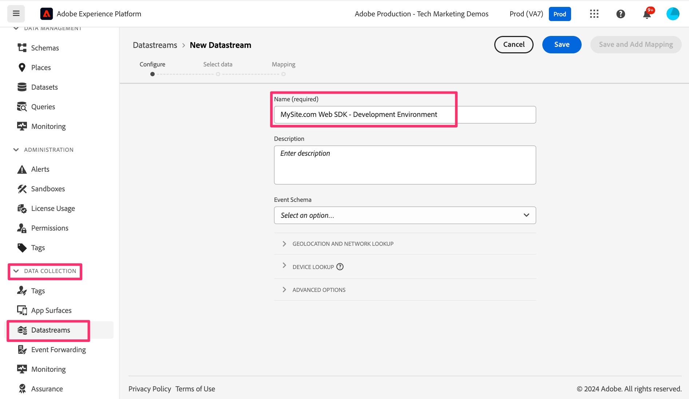

# Créer et configurer un flux de données

Découvrez comment créer et configurer un flux de données afin que les données de votre site web puissent être acheminées vers Adobe Analytics.

Dans cette leçon, vous apprendrez à créer et à configurer le système afin que vos données circulent de votre site web vers Adobe Edge, puis soient acheminées de là vers Adobe Analytics.

## Créer un flux de données de développement

1. Ouvrir l’interface de collecte de données d’Adobe
   1. Accédez à https://experience.adobe.com dans votre navigateur
   1. Assurez-vous que l’organisation appropriée est sélectionnée en haut de la page (par exemple, Production d’Adobe - Démonstrations marketing techniques dans l’image ci-dessous).
   1. Cliquez sur les « neuf points », ou sur le sélecteur d’applications, puis sélectionnez **Collecte de données**

      

1. Accédez à **[!UICONTROL Flux de données]** dans le volet de navigation de gauche
1. Sélectionnez **[!UICONTROL Nouveau flux de données]**
1. Saisissez le **[!UICONTROL Nom]** souhaité et incluez un indicateur indiquant qu’il sera utilisé pour l’environnement de développement Web SDK. Par exemple, vous pouvez lui donner le nom de votre site, comme illustré ci-dessous. Notez-le, car ce nom est référencé ultérieurement lorsque vous configurez l’extension Web SDK dans votre propriété de balise. Saisissez une description, le cas échéant.

   >[!NOTE]
   >
   >Il vous suffit de sélectionner un schéma si vous utilisez la fonctionnalité [Préparation des données pour la collecte de données](https://experienceleague.adobe.com/fr/docs/platform-learn/data-collection/edge-network/data-prep), ce que nous ne ferons pas dans ce tutoriel. Consultez le lien pour en savoir plus.

1. Sélectionnez **[!UICONTROL Enregistrer]**

   

1. Une fois le flux de données enregistré, un nouvel écran s’affiche, vous informant que vous n’avez pas encore configuré de services. En d’autres termes, vos données seront transmises aux serveurs Edge, mais ne seront envoyées à aucune application tant que nous n’aurons pas ajouté un service. Nous allons maintenant configurer le flux de données pour envoyer les données à Adobe Analytics. Cliquez sur **[!UICONTROL Ajouter un service]**.
   
1. Dans le menu déroulant Service, sélectionnez **[!UICONTROL Adobe Analytics]**.
1. Dans le champ Identifiant de suite de rapports , saisissez l’identifiant (non pas le titre, mais l’identifiant de suite de rapports) de la suite de rapports de validation que vous avez créée dans l’activité [Créer une suite de rapports de validation](create-a-validation-report-suite.md). Cliquez sur **[!UICONTROL Enregistrer]**.

## Flux de données d’évaluation et de production

Vous devez maintenant **repasser par les mêmes étapes** deux fois de plus : une fois pour votre environnement d’évaluation et une fois pour votre environnement de production. Vous trouverez ci-dessous quelques notes lorsque vous configurez ces deux flux de données supplémentaires.

### Le flux de données d’évaluation

* Lors de l’attribution d’un nom au flux de données (et lors de l’ajout de la description), vous pouvez/devez porter le même nom, à la différence que vous ajoutez « évaluation » au lieu de « développement ».
* Ajoutez le service Adobe Analytics, comme vous l’avez fait précédemment, et définissez la suite de rapports sur la même suite de rapports de développement.
* Si vous souhaitez un environnement plus épuré pour examiner les chiffres intermédiaires dans vos rapports Adobe Analytics, vous pouvez créer une nouvelle suite de rapports uniquement pour l’évaluation, puis vous assurer que vous pointez vers cette suite de rapports dans le service Analytics de ce flux de données.

### Le flux de données de production

* Lors du nommage du flux de données (et de l’ajout de la description), vous pouvez/devez porter le même nom, à la différence que vous ajoutez « production » au lieu de « développement ».
* En choisissant la suite de rapports à laquelle mapper les données, plutôt que de choisir la suite de rapports de développement ou même une nouvelle suite de rapports, vous pouvez mapper ce flux de données à votre suite de rapports de production **actuelle** alimentée par l’implémentation de l’AppMeasurement. Ainsi, une fois la migration terminée et testée, vous pouvez supprimer l’ancien code d’AppMeasurement et envoyer les bibliothèques de balises en production. Les nouvelles données de production seront alors transmises à la même suite de rapports de production, ce qui garantit la continuité entre l’ancienne et la nouvelle implémentation.
