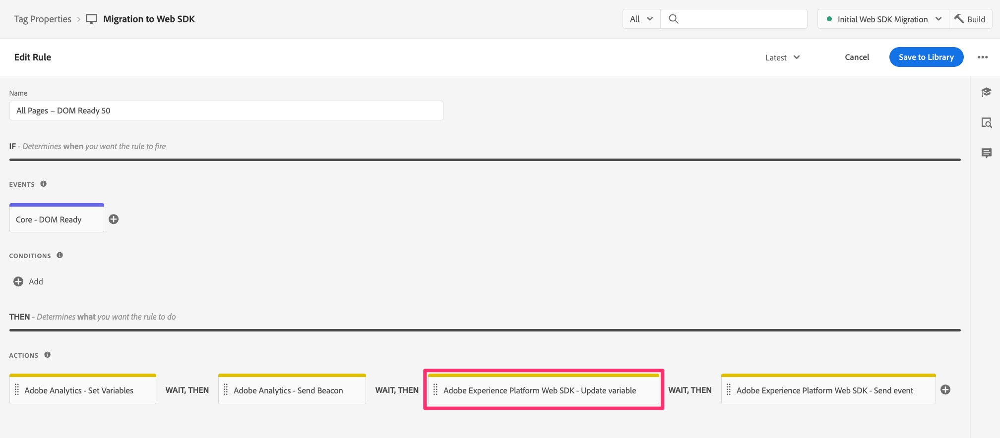
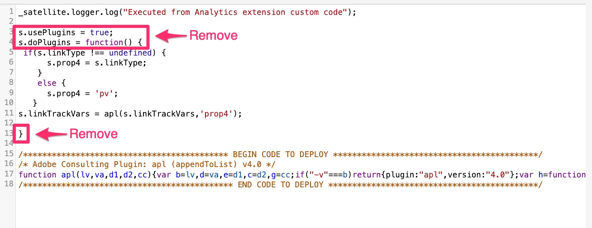

# Migrer le code personnalisé vers le Web SDK

Dans cet exercice, vous apprendrez à migrer du code personnalisé de l’extension Adobe Analytics vers l’extension Adobe Experience Platform Web SDK dans les balises Experience Platform.

## La grande clause de non-responsabilité

Vous ne serez sans doute pas surpris d’apprendre que j’ajouterai quelque chose comme ceci à un document qui commence à vous montrer la meilleure, la plus facile et la plus efficace façon d’utiliser le code. Il existe clairement de nombreuses façons d’écrire, de modifier et de gérer le code. Dans cet exercice, je vais vous fournir un moyen de prendre facilement le code que vous avez dans une règle existante et de le copier, d’ajouter une modification et de le faire fonctionner pour la règle migrée. Si vous pensez à une meilleure façon de le faire, c&#39;est fantastique, et je vous invite non seulement à l&#39;utiliser, mais aussi à le partager avec nous et avec vos pairs de la communauté Experience League (en particulier dans le post de la communauté concernant ce tutoriel). Il en va de même pour la moitié inférieure de la page, qui concerne l’utilisation des modules externes d’implémentation. Je vais vous suggérer un moyen, et ensuite vous faites ce qui vous plaît. OK, entrons dans les détails.

>[!IMPORTANT]
>
>Dans l’esprit du dernier paragraphe, il est également important de vous recommander de saisir cette occasion lors de votre migration vers Web SDK pour examiner attentivement votre code et voir s’il doit être mis à jour ou même supprimé. Dans les paragraphes et les étapes ci-dessous, vous verrez comment migrer votre code, et même s&#39;il est plus facile de tout déplacer d&#39;un seul coup, je m&#39;en voudrais de ne pas recommander de faire un nettoyage de printemps, pour ainsi dire.

## Migration de quel code ?

Le code que nous allons d’abord aborder dans cette section est le code que vous pouvez avoir dans la fenêtre « Code personnalisé » dans toute action Adobe Analytics, y compris les actions **Définir la variable**. En d’autres termes, ouvrez l’une de vos règles et descendez dans la section Actions . Si vous disposez d’une action « Adobe Analytics - Définir des variables », cliquez dessus pour l’ouvrir.


Faites ensuite défiler l’écran vers le bas, sur le côté droit, et vous verrez le bouton « Ouvrir l’éditeur » pour la fenêtre Custom Code (Code personnalisé). Cliquer pour ouvrir.


Si vous y trouvez du code, il devra être migré afin de pouvoir être exécuté et envoyé dans Adobe Analytics à l’aide de Web SDK.
L’idée principale ici est que nous allons convertir l’objet « s » en « contenu ».__adobe.analytics ».

Il nous suffira d’ajouter du code supplémentaire avant le premier appel à l’objet , de sorte qu’il puisse être compris et géré par le SDK Web. L’emplacement où nous ajoutons le code nouvellement modifié est dans la fenêtre Code personnalisé de l’action « Adobe Experience Platform Web SDK - Mettre à jour la variable ».

Supposons, par exemple, que vous ayez le bloc de code suivant dans la fenêtre du code personnalisé :

```javascript
const products = window.digitalData.products;
const productIndex = event.element.dataset.productIndex;
const product = products[productIndex];
s.products = [
product.cat3Tag,
product.id,
1,
product.price
].join(";");
```

Le code à inclure est le suivant :

```javascript
content.__adobe = content.__adobe || {};
content.__adobe.analytics = content.__adobe.analytics || {};
const s = content.__adobe.analytics;
```

Par conséquent, procédez comme suit pour migrer le code personnalisé :

1. Copiez votre code personnalisé depuis la fenêtre de l’action Définir les variables d’Adobe Analytics.
1. Fermez cette fenêtre de code, puis fermez (annulez) l’action.
1. Ouvrez l’action SDK Web - Mettre à jour une variable en cliquant dessus (ou, si vous n’en avez pas encore, ajoutez-en une).

   

1. Sélectionnez l’objet d’analyse en haut de la fenêtre de droite

   

1. Faites défiler l’écran vers le bas et ouvrez la fenêtre Code personnalisé .

   

1. Collez dans le code que vous avez importé à partir de la fenêtre du code personnalisé Analytics
1. Placez maintenant les nouvelles lignes de code au milieu du code existant, de sorte qu’il soit au-dessus de la première mention de l’objet , comme dans l’exemple suivant :


Vous pouvez maintenant enregistrer le code dans la fenêtre Code personnalisé et conserver les modifications dans l’action Mettre à jour les variables. Vous souhaiterez également enregistrer la règle et publier les nouvelles modifications dans la bibliothèque de travail.

## Et les plug-ins ?

Si vous disposez d’une implémentation « appMeasurement » d’Adobe Analytics, qui utilise l’extension Analytics dans les balises Experience Platform (anciennement appelée « Launch »), il est probable que vous utilisiez un ou plusieurs « plug-ins » JavaScript pour définir des variables ou effectuer d’autres tâches. Si ces fonctions et appels JavaScript se trouvent dans une fenêtre de code à l’intérieur d’une règle, les informations ci-dessus sur cette page doivent vous aider à migrer le code vers Web SDK.
Cependant, il est également plus probable que votre code de module se trouve dans la fenêtre de code dans la configuration de l’extension Adobe Analytics elle-même. Pour vérifier si vous disposez de plug-ins et d’autres codes à migrer, ouvrez l’extension Analytics en accédant à Collecte de données et Balises, ouvrez votre propriété, puis cliquez sur **Extensions** dans le volet de navigation de gauche.

1. Sélectionnez l’onglet **Installé** en haut de la page, puis sélectionnez votre extension Adobe Analytics.
1. Ensuite, sur le côté droit de la page, cliquez sur **Configurer**

   

1. Développez la section **Configurer le dispositif de suivi à l’aide du code personnalisé**
1. Cliquer pour **Ouvrir l’éditeur**

   

À ce stade, vous serez en mesure de voir le code que vous avez dans le fichier et vous disposerez peut-être de « plug-ins » JavaScript, c’est-à-dire des extraits de code qui vous aident à obtenir certaines données de votre choix et à les affecter à des dimensions personnalisées, etc.

Tout ce qui se trouve dans cette fenêtre de code ne peut pas être considéré comme un plug-in au sens propre d’Adobe Analytics. Il est important de le comprendre lorsque vous décidez de la migration de votre code.

### Recommandation pour migrer le code depuis la fenêtre de code principale de l’extension

Eh bien, encore une fois, tout ce qui apparaît dans la fenêtre de code n’est peut-être pas un plug-in officiel créé par Adobe Consulting. Il peut s&#39;agir en partie du code que vous avez écrit, que vous l&#39;appeliez ou non un plug-in. Nous recommandons deux modifications. Ils sont destinés à utiliser une nouvelle extension, ainsi qu’à copier et coller le reste de votre code dans un nouvel emplacement.

**Tout d’abord** il existe une extension disponible dans les balises appelée **modules externes courants de SDK Web**. Cette extension est un sous-ensemble de la liste totale des plug-ins d’implémentation répertoriés dans la documentation d’Adobe Analytics. En installant cette extension dans votre propriété Tags, vous installez le code pour les plug-ins inclus. Ensuite, pour utiliser ces plug-ins, vous devez les trouver lors de la création de nouveaux **éléments de données**. J&#39;en dirai plus dans un instant.

**Deuxièmement** il existe une fenêtre de code dans la configuration de l’extension Web SDK dans laquelle vous pouvez placer tout (ou partie) de votre code, SI vous souhaitez que ce code s’exécute juste avant que les événements ne soient envoyés à Adobe Analytics. Les étapes permettant de trouver cette fenêtre de code sont les suivantes :

1. En supposant que vous ayez déjà ajouté l’extension Web SDK à votre propriété, accédez à **Extensions** et sélectionnez l’onglet **Installé**
1. Sélectionnez l’extension Adobe Experience Platform Web SDK **&#x200B;**&#x200B;et ouvrez-la en cliquant sur **Configurer** dans le rail de droite.

   

1. Faites défiler l’écran jusqu’à la section **Collecte de données**, puis cliquez pour ouvrir la fenêtre du code pour **onBeforeEventSend**.

   

C’est là que vous collerez le code que vous souhaitez exécuter juste avant que l’événement ne soit envoyé à Analytics à partir de Web SDK. C’est essentiellement ce que faisait la fonction doPlugins dans votre ancienne mise en œuvre d’Analytics.

La **bonne nouvelle** est que cela doit s’exécuter **à tout moment** vous effectuez un événement d’envoi. Que cela se produise au chargement de la page ou avec un lien personnalisé, ce code doit donc s’exécuter, définir vos variables, etc.

#### Dois-je modifier mon code ?

Eh bien, oui et non. Oui, vous devez modifier quelques petites choses, mais non, vous n’aurez pas besoin de modifier la majeure partie de votre code tant que vous modifiez ces petites choses :

_&#x200B;**Modification de code 1:**&#x200B;_
Après (ou avant) avoir collé votre code « plug-in » dans la fenêtre de code de l&#39;extension Web SDK, **supprimez** les lignes « doPlugin » de votre code. Vous n’en aurez pas besoin et ils provoqueront une erreur, car ils font partie d’appMeasurement.js, mais pas du code Web SDK.



_&#x200B;**Changement de code 2:**&#x200B;_
L’autre modification que vous devrez effectuer consiste à ajouter du code afin que l’objet « s » soit défini, de manière très similaire à ce qui est décrit ci-dessus concernant le code dans les actions de règle. Dans ce cas, nous devrons définir le code un peu différemment, en ajoutant un nœud « data » déjà défini dans l’action de la règle, mais pas ici.
Cette définition doit être placée en haut de la fenêtre de code. Le code qui doit être copié dans (lors du placement du code dans l’extension Web SDK) est le suivant :

```javascript
content.data.__adobe = content.data.__adobe || {};
content.data.__adobe.analytics = content.data.__adobe.analytics || {};
const s = content.data.__adobe.analytics;
```

_&#x200B;**Avec les deux modifications de code :**&#x200B;_
Voici le code répertorié ci-dessus, mais avec les deux modifications dont nous venons de discuter :


### Étapes de migration du code d’extension principal vers Web SDK

Comme indiqué ci-dessus, la recommandation est double : d’utiliser la nouvelle extension de modules externes courants Web SDK et de copier et coller votre code de la configuration de l’extension Analytics dans la configuration de l’extension Web SDK. Dans cette optique, ainsi que la remarque importante en haut de la page pour nettoyer votre code, voici les étapes recommandées à un haut niveau :

1. Copiez l’intégralité de votre code depuis la fenêtre de code de configuration de l’extension Analytics et collez-le dans la fenêtre onBeforeEventSend dans la configuration de l’extension Web SDK (bien que nous puissions copier du code qui doit être supprimé ou mis à jour, nous effectuerons quelques passages au code dans la nouvelle fenêtre).
1. Parcourez maintenant votre code dans l’extension Web SDK et recherchez les appels aux plug-ins ou la définition de fonction pour les plug-ins définis dans l’extension **Plug-ins Web SDK courants**. Vous trouverez la liste des plug-ins dans la fenêtre de définition de l’élément de données Web SDK après l’installation de l’extension des plug-ins. Vous pouvez également le trouver dans la [documentation de cette extension](https://exchange.adobe.com/apps/ec/108520).
1. Pour chacun des plug-ins qui se trouvent dans la nouvelle extension de plug-ins de Web SDK, supprimez l’extension et l’appel correspondant de votre code, puis assurez-vous de compenser cette suppression en créant un élément de données, puis en appelant cet élément de données dans la règle appropriée pour définir des variables, etc.
1. Ensuite, parcourez le code pour voir s’il existe des appels aux fonctions définies dans le fichier appMeasurement.js. **Modification de code 1** ci-dessus en est un exemple, et vous pouvez effectuer cette suppression du code doPlugins à ce stade, si vous ne l’avez pas déjà fait. Pour les autres instances, cela sera plus évident lorsque vous aurez un appel à une fonction qui n’est définie nulle part dans votre code. Vous pouvez également vérifier auprès du service clientèle d’Adobe ou de vos pairs de la communauté des Experience League que c’est bien le cas avec ce code.
1. Ensuite, passez à travers votre code pour mettre à jour ou supprimer tout ancien code qui ne s’applique plus à vos besoins d’analyse, comme recommandé en haut de cette page.
1. Effectuez maintenant la **Modification de code 2** répertoriée ci-dessus, en ajoutant les lignes supplémentaires afin que toute référence à l’objet n’entraîne pas d’erreurs dans votre code.
1. Enfin et surtout, testez, testez et testez encore. Ensuite, testez-le à nouveau. Assurez-vous que votre code fournit les résultats attendus à la fois dans le débogueur Experience Platform et dans les rapports d’Adobe Analytics.

>[!NOTE]
>
>Deux dernières réflexions sur les étapes ci-dessus.
>Tout d’abord, vous pensez peut-être qu’il serait plus facile de laisser tout le code du plug-in à l’intérieur au lieu de le supprimer et d’utiliser la nouvelle extension Plugins de Common Web SDK. C’est très bien, mais en utilisant l’extension, vous bénéficiez des avantages d’une interface utilisateur, de la définition d’un élément de données réutilisable et de la réception automatique de toutes les mises à jour de code à l’avenir. Ça vaut probablement le coup de faire le changement.
>
>Deuxièmement, en parlant de « faire le changement », vous pouvez également décider maintenant de mettre à jour TOUT votre code personnalisé afin qu&#39;il ne fasse aucune référence à l&#39;ancien objet « s », ce qui est une sorte d&#39;extension de l&#39;étape 5 ci-dessus. C&#39;est, bien sûr, tout à fait acceptable et une excellente idée. Ce tutoriel de migration tente simplement de faciliter la migration de votre code personnalisé, au cas où vous en auriez une tonne et que vous ne disposez pas des ressources nécessaires pour tout mettre à jour maintenant. Vous décidez.

Nous terminerons cette leçon de la manière dont nous l’avons commencée, en reconnaissant qu’il existe de nombreuses façons d’écrire du code, et ce document vous donne quelques étapes à suivre si vous souhaitez le faire de cette manière. L’essentiel est que votre code fonctionne et vous apporte les résultats attendus. N’hésitez donc pas à le faire à votre manière. Ai-je mentionné que vous devriez le tester ?
