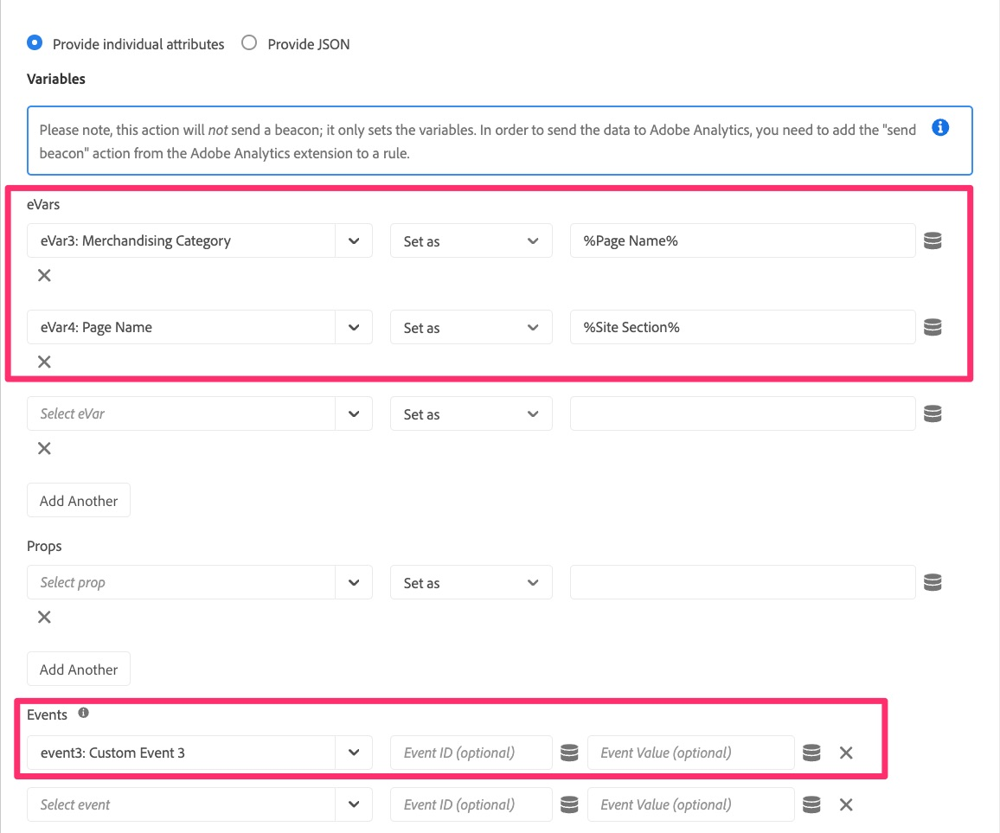

# Migration de votre règle de chargement de page par défaut

Dans cet exercice, vous apprendrez à migrer une règle de chargement de page par défaut dans Adobe Experience Cloud Tags de l’extension Analytics vers l’extension Web SDK.

## Vue d’ensemble

Reculons un peu. Il est probable que vous disposiez d’une règle dans les balises qui se déclenche sur chaque page. Cette règle définit une ou plusieurs variables par défaut, puis déclenche une balise ou un accès dans Adobe Analytics. Cette règle utilise actuellement des « actions » dans l’extension Adobe Analytics pour effectuer ces opérations. À mesure que nous migrons notre implémentation vers Web SDK, nous devons être en mesure de supprimer toutes les références (comme les actions) à l’extension Analytics et de les remplacer par des actions appartenant à Web SDK. Dans les étapes ci-dessous, nous supposons ce qui précède ; c’est-à-dire que vous disposez d’une règle de chargement de page par défaut qui définit des variables et envoie une balise de suivi à Analytics.

## Migration de l’action Définir des variables

Dans cette activité, nous allons créer une action Web SDK qui est l’équivalent de l’action **Définir les variables** dans l’extension Adobe Analytics.

1. Dans l’interface utilisateur de collecte de données et dans votre propriété, accédez à l’écran **[!UICONTROL Règles]** en le sélectionnant dans le volet de navigation de gauche.
1. Sélectionnez la règle correspondant à votre **règle de chargement par défaut d’Analytics**. Si vous ne savez pas quelle règle est votre règle de chargement par défaut, adressez-vous à une personne qui connaît les règles et leur contenu. Là encore, nous recherchons une règle qui s’exécute sur chaque page, définit certaines variables par défaut (par exemple, le nom de la page), puis envoie une balise dans Analytics. Nous apporterons des modifications à cette règle. Le mien s&#39;appelle « All Pages - DOM Ready 50 », mais le vôtre pourrait porter n&#39;importe quel nom.

   

1. Pour migrer les actions en cours de l’extension Analytics vers l’extension Web SDK, nous devons connaître les variables définies. Par conséquent, cliquez sur l’action **Adobe Analytics - Définir les variables** afin de voir quelles variables sont définies (par exemple PageName, props, eVars, événements, etc.).

   
   1. Notez les variables définies dans cette règle
      

1. En haut de la page, modifiez le bouton radio en **Fournir un fichier JSON** et une vue du code des variables définies s’affiche. Cet affichage du code et l’affichage de l’interface utilisateur sont interchangeables. Lorsque vous définissez une valeur dans une interface utilisateur, elle est également mise à jour dans l’autre interface utilisateur.

   

1. Copiez ces données dans le presse-papiers ou enregistrez-les dans un fichier pour les utiliser immédiatement, car dans les étapes suivantes, vous allez coller ce code dans une nouvelle action Web SDK.
1. Annulez l’action de définition de variables d’Analytics afin de revenir à la règle.

   >[!IMPORTANT]
   >
   >Au cours de cette étape, vous avez le choix entre :
   >1. Au lieu d’ajouter une nouvelle action, vous pouvez simplement modifier les actions existantes. Une fois enregistrées, elles suppriment immédiatement toutes les données de la nouvelle suite de rapports Web SDK et ne s’affichent plus dans la suite de rapports Analytics actuelle.
   >1. Vous pouvez créer une action pour envoyer les données dans Analytics via le Web SDK, en laissant l’action Analytics en place pour l’instant. Vous aurez ainsi la possibilité de comparer les données de la nouvelle suite de rapports Web SDK à celles de la suite de rapports Analytics actuelle. **Il s’agit de celui que nous allons réaliser dans ce tutoriel.** Gardez à l’esprit que cette méthode entraînera des accès doubles lorsque vous comparez les données, ce qui entraîne également un coût pour les appels au serveur supplémentaires, jusqu’à ce que vous supprimiez les actions de l’ancienne extension Analytics. Vous ne souhaiterez évidemment pas conserver pour toujours les actions de l’extension Analytics dans le rapport, mais simplement suffisamment longtemps pour vérifier que les données circulent correctement dans la suite de rapports de la nouvelle extension Web SDK.

1. Cliquez sur le bouton **plus** pour ajouter une nouvelle action Web SDK.

   

1. Sélectionnez **Adobe Experience Platform Web SDK** dans la liste déroulante Extension .
1. Sélectionnez **Mettre à jour la variable** dans le menu déroulant Type d’action .
1. Dans le panneau de droite, sélectionnez l’objet **Analytics** dans l’objet de données
1. Assurez-vous également que l’élément de données répertorié en haut du panneau de droite est bien votre nouvel élément de données de type variable.

   

1. Modifiez maintenant le bouton radio en **Fournir un élément JSON ou Data Element** et collez le code que vous avez copié à l’étape précédente de Définir les variables dans cette fenêtre de code. N’oubliez pas que ce que nous montrons ici dans le tutoriel n’est que des exemples. Vous copiez et collez vos propres variables.

   
Cet outil de copie JSON a été créé spécialement pour faciliter la migration. Vous pouvez voir à quel point c’est facile, au lieu d’avoir à prendre des notes détaillées de l’ancienne action et de les appliquer à la nouvelle.

1. Vous pouvez, à tout moment, basculer le bouton radio d’avant en arrière pour afficher les valeurs dans la version de code (affichée ci-dessus) ou dans la version de l’interface utilisateur pour afficher les attributs. Sélectionnez le bouton radio **Fournir des attributs individuels** pour afficher les attributs renseignés.

   
   

1. Lorsque vous pouvez voir vos variables correctement définies, cliquez sur **Conserver les modifications/Enregistrer.**

## Migration de l’action Envoyer la balise

Dans cette activité, nous allons créer un équivalent Web SDK de l’action Analytics « Envoyer la balise », appelé **Envoyer l’événement**.

1. Revenez à la règle de page par défaut dans laquelle vous veniez de vous trouver.
1. Dans la section Actions , cliquez sur le bouton **plus** pour ajouter une autre action. Ce sera notre action **Envoyer l’événement**.

   

1. Pour configurer l’action, sélectionnez **Adobe Experience Platform Web SDK** dans la liste déroulante Extension .
1. Sélectionnez **Envoyer l’événement** dans le type d’action.
1. Dans le panneau de droite, sélectionnez l’icône de l’élément de données à côté de l’objet **Data**.

   

1. Sélectionnez la Variable de données Page vue (ou l’élément de données de type « données » que vous avez appelé), puis cliquez sur le bouton **Sélectionner**.

   

1. Cliquez sur **Conserver les modifications/Enregistrer**.
1. Vous devriez maintenant voir les quatre actions (deux anciennes et deux nouvelles) dans votre règle

   

## Dois-je supprimer les actions de l’extension Analytics ?

Bonne question. La réponse réside dans la validation ou non des nouvelles actions avant de se débarrasser des anciennes. Comme je l’ai mentionné ci-dessus, si vous laissez à la fois les actions Analytics et Web SDK qui envoient des données (Envoyer la balise et Envoyer l’événement), comme nous avons choisi de le faire dans ce tutoriel, vous obtiendrez les mêmes données qui se dirigent vers deux suites de rapports (à savoir, la suite de rapports de production de l’extension Analytics et votre nouvelle suite de rapports de validation de l’extension Web SDK). Cela entraîne un doublement des appels au serveur dans Analytics et des coûts connexes. Cependant, il s’agit du nombre de clientes et clients qui choisissent de le faire, afin qu’ils puissent valider les nouvelles données avant de désactiver les anciennes. À la fin de ce tutoriel, nous aurons un exercice qui montrera comment nettoyer les anciens éléments une fois que vous serez satisfait de la validation, mais si vous souhaitez le faire maintenant afin d’enregistrer les appels au serveur et de ne pas vous soucier de la validation, n’hésitez pas à passer à la fin du tutoriel, ou sinon supprimez simplement les actions de l’extension Analytics des règles au fur et à mesure.
