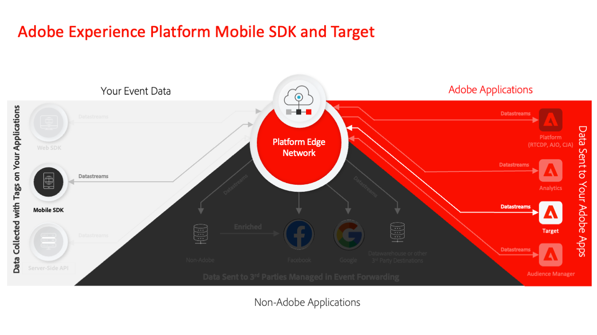

# Migration de votre application mobile de l’Adobe Target vers l’extension Adobe Journey Optimizer - Decisioning

Ce guide s’adresse aux implémentateurs de Adobe Target expérimentés pour apprendre à migrer les implémentations SDK Adobe Experience Platefrom Mobile existantes de l’extension Adobe Target vers l’extension Adobe Journey Optimizer - Decisioning.

Adobe Experience Platform SDK Mobile renforce l’engagement de bout en bout dans vos applications mobiles. L’extension Target s’appuie sur le SDK Mobile pour vous aider à personnaliser les expériences d’application avec Adobe Target. L’extension Decisioning est une approche plus récente pour implémenter Adobe Target dans les applications mobiles qui utilise Adobe Experience Platform fonctionnalités de réseau Edge qui permettent d’intégrer Target avec des applications basées sur Platform telles que la plate-forme de gestion des données clients en temps réel et Journey Optimizer.

## Avantages clés

Voici quelques-uns des avantages de l’extension Adobe Journey Optimizer Decisioning par rapport à l’extension Target :

* Partage plus rapide des audiences depuis [Real-Time Customer Data Platform](https://experienceleague.adobe.com/en/docs/platform-learn/tutorials/experience-cloud/next-hit-personalization)
* Intégration de Target à Journey Optimizer pour prendre en charge la diffusion [Offer Decisioning](https://experienceleague.adobe.com/en/docs/target/using/integrate/ajo/offer-decision)
* Une intégration plus étroite à Adobe Analytics qui ne repose pas sur l’assemblage d’informations provenant d’appels réseau distincts
* Flexibilité d’implémentation supplémentaire pour les développeurs

On peut soutenir que le plus grand avantage de la migration pour Target clients réside dans l’intégration avec les Platform de données client en temps réel. La plateforme CDP en temps réel offre d’énormes capacités de développement d’audience basées sur la gamme complète de données ingérées dans Experience Platform et sa capacité Real-time Customer Profile. Une structure intégrée de gouvernance des données automatise l’utilisation responsable de ces données. Customer AI vous permet d’utiliser facilement des modèles d’apprentissage automatique pour créer des modèles de propension et de désabonnement dont la sortie peut être partagée vers Adobe Target. Enfin, les clients des modules complémentaires facultatifs Healthcare et Privacy &amp; Security Shield peuvent utiliser la fonction d’application du consentement pour appliquer les préférences de consentement des clients individuels. Platform SDK Mobile et l’extension Decisioning sont indispensables pour utiliser ces fonctionnalités CDP en temps réel dans votre canal mobile.

## Étapes de migration

Le niveau d’effort de migration de l’extension Target vers l’extension Decisioning dépend de la complexité de votre implémentation actuelle et de Target fonctionnalités utilisées.

Quelle que soit la simplicité ou la complexité de votre mise en œuvre, il est important de bien comprendre votre état actuel avant de procéder à la migration. Ce guide vous aide à ventiler les composants de votre implémentation actuelle et à développer un plan gérable pour migrer chaque élément.

Le processus de migration implique les étapes clés suivantes :

1. Évaluez votre implémentation actuelle, notamment :
   1. Toutes les API Target SDK utilisées
   1. Modifications des paramètres globaux de Target
   1. Intégration avec Adobe Analytics
   1. Utilisation des paramètres de mbox, de profil et d’entité
   1. Utilisation des scripts de profil et des audiences
   1. Code personnalisé propre à votre mise en œuvre
1. Configurer les composants initiaux pour se connecter au réseau Edge Adobe Experience Platform
1. Mettre à jour l’implémentation de base pour remplacer l’extension Target par l’extension Decisioning
1. Améliorez l’implémentation de SDK pour vos cas d’utilisation spécifiques. Cela peut impliquer de transmettre des paramètres supplémentaires, d’utiliser des jetons de réponse, etc.
1. Mettre à jour des objets dans l’interface Target, tels que des scripts de profil, des activités et des définitions d’audience
1. Validez la mise en œuvre finale avant d’effectuer le changement dans votre application de production.

>[!INFO]
>
>Dans l’écosystème Adobe Experience Platform Mobile SDK, les extensions sont implémentées par des SDK importés dans vos applications, qui peuvent porter des noms différents :
>
> * **Target SDK** met en œuvre l’extension **Adobe Target**
> * **Le kit SDK** Optimize met en œuvre l’extension **Adobe Journey Optimizer - Decisioning**

Ensuite, passez en revue la comparaison détaillée [de l’extension Target et de l’extension](comparison.md) Decisioning pour mieux comprendre les différences techniques et identifier les domaines nécessitant une attention supplémentaire.

>[!NOTE]
>
>Nous nous engageons à vous aider à réussir votre migration Target mobile de l’extension Target vers l’extension Decisioning. Si vous rencontrez des obstacles lors de votre migration ou si vous avez l’impression qu’il manque des informations critiques dans ce guide, veuillez nous le faire savoir en publiant dans [cette discussion](https://experienceleaguecommunities.adobe.com/t5/adobe-experience-platform-data/tutorial-discussion-migrate-adobe-target-to-mobile-sdk-on-edge/m-p/747484#M625) communautaire.
