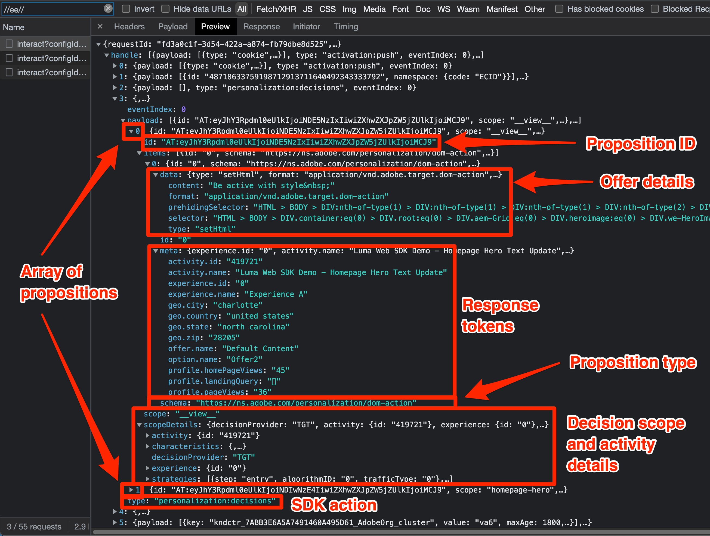

# Débogage de Target avec le SDK Web Platform

Vérification des activités Target et débogage du SDK Web pour résoudre les problèmes de mise en oeuvre, de diffusion de contenu ou de qualification des audiences. Cette page du guide de migration explique les différences entre le débogage avec at.js et le SDK Web Platform.

Le tableau ci-dessous résume les fonctionnalités et la prise en charge des tests et des approches de débogage.

| Fonctionnalité ou outil | Prise en charge d’at.js | Prise en charge du SDK Web Platform |
| --- | --- | --- |
| URL d’AQ d’activité | Oui | Oui |
| `mboxDisable`URL Parameter (Paramètre d’URL) | Oui | Reportez-vous aux informations ci-dessous pour [Désactivation de la fonctionnalité Target](#disable-target-functionality) |
| `mboxDebug`URL Parameter (Paramètre d’URL) | Oui | Utilisation `alloy_debug` paramètre pour des informations de débogage similaires |
| `mboxTrace`URL Parameter (Paramètre d’URL) | Oui | Utilisation de l’extension de navigateur du débogueur Experience Platform |
| Extension Adobe Experience Platform Debugger | Oui | Oui |
| `alloy_debug`URL Parameter (Paramètre d’URL) | Non applicable | Oui |
| Adobe Experience Platform Assurance | Non applicable | Oui |

## Extension de navigateur Adobe Experience Platform Debugger

L’extension Adobe Experience Platform Debugger pour Chrome et Firefox examine vos pages web et vous aide à valider vos mises en oeuvre Adobe Experience Cloud.

Vous pouvez exécuter Platform Debugger sur n’importe quelle page web et l’extension a accès aux données publiques. Pour accéder aux données non publiques à l’aide de l’extension, telles que les informations de suivi de Target, vous devez vous authentifier auprès de l’Experience Cloud via le **[!UICONTROL Se connecter]** lien.

### Obtention et installation du débogueur Adobe Experience Platform

Le débogueur Adobe Experience Platform peut être installé dans les navigateurs Google Chrome ou Mozilla Firefox. Suivez le lien correspondant ci-dessous pour installer l’extension sur votre navigateur préféré :

- [Chrome](https://chrome.google.com/webstore/detail/adobe-experience-platform/bfnnokhpnncpkdmbokanobigaccjkpob)
- [Firefox](https://addons.mozilla.org/fr/firefox/addon/adobe-experience-platform-dbg/)

Une fois que vous avez installé l’extension Chrome ou le module complémentaire Firefox, une icône () est ajouté à la barre d’extension. Sélectionnez cette icône pour ouvrir l’extension.

Pour plus d’informations sur le [Extension Adobe Experience Platform Debugger](https://experienceleague.adobe.com/docs/experience-platform/debugger/home.html) et comment déboguer toutes les applications web Adobe.

## Prévisualisation des activités Target avec des URL AQ

at.js et le SDK Web Platform vous permettent de prévisualiser des activités Target à l’aide des URL AQ de Target. Les deux méthodes de mise en oeuvre prennent en charge les mêmes fonctionnalités d’AQ.

Les URL AQ de Target fonctionnent en demandant à at.js ou au SDK Web de Platform d’écrire un cookie spécifique dans votre navigateur nommé `at_qa_mode`. Ce cookie est utilisé pour forcer la qualification pour une activité et une expérience spécifiques.

>[!CAUTION]
>
>La fonctionnalité du mode AQ de Target est prise en charge par le SDK Web Platform version 2.13.0 ou ultérieure. Le mode AQ de Target est activé en fonction des `xdm.web.webPageDetails.URL` valeur transmise dans la variable `sendEvent` appelez . Toute modification de cette valeur, telle que la mise en minuscule de tous les caractères, peut empêcher le mode AQ de Target de fonctionner correctement.

Consultez le guide dédié pour plus d’informations sur [AQ de l’activité Target](https://experienceleague.adobe.com/docs/target/using/activities/activity-qa/activity-qa.html).

## Implémentation de Debug Target

Le tableau ci-dessous décrit les différences entre les tactiques de débogage d’at.js et du SDK Web Platform :

| fonction at.js | Équivalent SDK Web Platform |
| --- | --- |
| **Désactivation de mbox** - Désactivez Target pour vérifier si la page est rompue sans interactions avec Target.  Charger la page avec le paramètre d’URL : `mboxDisable=true` | Pas d&#39;équivalent direct. Vous pouvez bloquer toutes les demandes du SDK Web Platform à l’aide des outils de développement de votre navigateur. |
| **Débogage de mbox** - consigne toutes les actions at.js dans la console du navigateur pour résoudre les problèmes de rendu.  Charger la page avec le paramètre d’URL : `mboxDebug=true` | **Alloy Debug** - consigne les actions détaillées du SDK, y compris, mais sans s’y limiter, les actions de personnalisation de Target.  Charger la page avec le paramètre d’URL : `alloy_debug=true`    Ou exécutez `alloy("setDebug", { "enabled": true });` dans votre console de développement |
| **Target Trace** - avec un jeton de suivi de mbox généré dans l’interface utilisateur de Target, un objet de trace avec des détails ayant participé au processus de prise de décision est disponible sous `window.___target_trace` .  Charger la page avec le paramètre d’URL : `mboxTrace=window&authorization={TOKEN}` | Utilisez l’extension du débogueur Adobe Experience Platform ou Platform Assurance. |

>[!NOTE]
>
>Toutes les fonctionnalités de débogage at.js répertoriées ci-dessus sont disponibles avec des fonctionnalités améliorées dans le débogueur Adobe Experience Platform.

### Désactivation de la fonctionnalité Target

Le SDK Web Platform ne dispose actuellement pas d’une fonctionnalité permettant de supprimer de manière sélective les réponses Target. Cependant, il est possible de supprimer les requêtes du SDK Web Platform avec les outils de développement de votre navigateur, diverses extensions de navigateur ou des applications tierces. Par exemple, pour bloquer le SDK Web Platform avec Google Chrome :

1. Cliquez avec le bouton droit de la souris n’importe où sur la page, puis sélectionnez **Inspect**
1. Sélectionnez la **Réseau** tab
1. Filtrer par chaîne `//ee//` pour afficher uniquement les appels du SDK Web Platform
1. Rechargez la page
1. Cliquez avec le bouton droit de la souris sur l’une des demandes réseau filtrées et sélectionnez **Domaine de requête de bloc**
1. Rechargez la page et notez que la demande réseau est bloquée.
1. Une fois le débogage terminé, cliquez avec le bouton droit sur la requête réseau bloquée et sélectionnez **Débloquer** ou fermez le panneau Outils de développement

### Affichage de la journalisation du débogage

Journalisation de débogage pour at.js à l’aide de la fonction `mboxDebug=true` Le paramètre d’URL affiche des informations détaillées sur chaque requête, réponse et tentative de rendu du contenu sur la page Target. Le SDK Web de Platform possède une journalisation de débogage similaire à l’aide de la variable `alloy_debug=true` paramètre d’URL.

| Informations consignées | at.js (`mboxDebug=true`) | SDK Web de Platform (`alloy_debug=true`) |
| --- | --- | --- |
| Préfixe de journalisation pour le filtrage | `AT:` | `[alloy]` |
| Détails de la requête de chargement de page | Oui | Oui |
| Détails de la requête de mbox ou de portée | Oui | Oui |
| État de la requête | Oui | Oui |
| Détails de la réponse | Oui | Oui |
| État du rendu | Succès et erreurs | Erreurs uniquement |
| Détails du rendu | Oui | Oui |

>[!NOTE]
>
>Les journaux de débogage pour at.js et le SDK Web Platform fournissent un niveau de détail similaire, à l’exception notable que le SDK Web ne notifie que les erreurs de rendu en raison de sélecteurs non valides. La journalisation de débogage ne confirme pas actuellement que le rendu a réussi.

### Affichage des traces Target

Les traces de Target fournissent des informations détaillées sur les qualifications d’activité et le profil Target du visiteur. Les traces de Target contenant des informations qui ne sont pas disponibles publiquement, leur affichage nécessite un jeton d’autorisation ou une authentification dans la fenêtre d’extension du navigateur du débogueur Adobe Experience Platform.

| Méthode de suivi de cible | at.js | SDK Web de Platform |
| --- | --- | --- |
| `mboxTrace`URL Parameter (Paramètre d’URL) | Oui | Non |
| Extension de navigateur Adobe Experience Platform Debugger | Oui | Oui |
| Adobe Experience Platform Assurance | Non | Oui |

Pour afficher les traces du SDK Web Platform avec le débogueur Adobe Experience Platform, procédez comme suit :

1. Accédez à une page de votre site sur laquelle Target est implémenté avec le SDK Web Platform.
1. Ouvrez l’extension Adobe Experience Platform Debugger en sélectionnant l’icône () dans la barre de navigation du navigateur
1. Sélectionnez la **[!UICONTROL Se connecter]** link
1. Authentification à l’aide de votre connexion Adobe Experience Cloud
1. Sélectionnez la **[!UICONTROL Journaux]** onglet sur la gauche
1. Sélectionnez la **[!UICONTROL Edge]** dans la partie supérieure.
1. Vous pouvez éventuellement donner un nom à votre session de débogage et cliquer sur le bouton **[!UICONTROL Connexion]** button
1. Rechargez la page et le journal doit renseigner des informations détaillées sur les interactions réseau périphériques.
1. Concentrez-vous sur les entrées de journal commençant par &quot;Target Traces&quot; dans la description et sélectionnez **[!UICONTROL Affichage]** pour afficher les détails de la trace Target

{zoomable=&quot;yes&quot;}

Après avoir sélectionné **[!UICONTROL Affichage]**, une superposition s’affiche, vous permettant d’afficher les informations suivantes relatives à la requête :

- Activités mises en correspondance
- Activités inégales
- Détails de la requête
- Instantané du profil

Reportez-vous au guide dédié à [débogage Diffusion de contenu Target](https://experienceleague.adobe.com/docs/target/using/activities/troubleshoot-activities/content-trouble.html) pour plus d’informations sur les traces de Target.

### Résolution des problèmes liés à Assurance

Les informations de suivi de Target sont visibles dans l’extension de navigateur du débogueur Adobe Experience Platform et dans l’application Assurance (anciennement appelée Project Griffon). Pour afficher les traces de Target dans Assurance, procédez comme suit :

1. Ouvrez l’extension de navigateur du débogueur Adobe Experience Platform et connectez-vous à une session de débogage à distance comme indiqué ci-dessus.
1. Sélectionnez le lien avec votre nom de session au-dessus du journal de débogage.
1. Platform Assurance charge et affiche la journalisation détaillée de toutes les applications Adobe configurées dans le flux de données pour votre mise en oeuvre.
1. Filtrez le journal par `adobe.target`
1. Sélectionner une entrée de journal de type `com.adobe.target.trace`
1. Développez les détails de la payload et affichez les informations sous `context > targetTrace`

{zoomable=&quot;yes&quot;}

## Examiner la requête et la réponse réseau

Charge utile de requête et réponse du SDK Web de Platform `sendEvent` Les appels diffèrent d’at.js. La composition ci-dessous doit vous aider à comprendre la structure de la requête et de la réponse tout en examinant les appels réseau avec les outils de développement de votre navigateur.

### Charge utile de requête de contenu

{zoomable=&quot;yes&quot;}

- Les paramètres de profil, d’entité et autres non-mbox sont transmis dans le tableau d’événements sous `data.__adobe.target`
- Les portées de décision se trouvent dans le tableau d’événements sous `query.personalization.decisionScopes`
- Les données XDM mappées aux paramètres de mbox en aval se trouvent dans le tableau d’événements sous `xdm`

### Corps de réponse au contenu

{zoomable=&quot;yes&quot;}

- Le SDK Web de Platform renvoie des actions pour toutes les applications d’Adobe sous le `handle` objet
- Le `personalization:decisions` action signifie une réponse de Target ou d’un offer decisioning
- Les propositions cibles sont présentées sous la forme d’un tableau, chacune avec un identifiant de proposition unique préfixé avec un `AT:`
- La portée des décisions et les détails de l’activité se trouvent dans le tableau de propositions
- Les détails de l’offre se trouvent dans le `items` tableau sous `data`
- Les jetons de réponse se trouvent dans la variable `items` tableau sous `meta`

### Charge utile des événements de proposition

{zoomable=&quot;yes&quot;}

- Les événements de SDK spécifiques à Target sont : `decisioning.propositionDisplay` pour une impression ou `decisioning.propositionInteract` pour une interaction, par exemple un clic
- Les détails de l’événement de proposition se trouvent dans le tableau d’événements sous `xdm._experience.decisioning`
- L’identifiant de proposition de l’événement d’affichage ou d’interaction doit correspondre à l’identifiant de proposition du contenu renvoyé par Target.

Félicitations, vous avez atteint la fin du tutoriel ! Bonne chance pour migrer votre mise en oeuvre Adobe Target vers le SDK web !

>[!NOTE]
>
>Nous nous engageons à vous aider à réussir la migration de Target d’at.js vers le SDK Web. Si vous rencontrez des obstacles lors de votre migration ou si vous pensez qu’il manque des informations essentielles dans ce guide, faites-le nous savoir en publiant sur [cette discussion communautaire](https://experienceleaguecommunities.adobe.com/t5/adobe-experience-platform-data/tutorial-discussion-migrate-target-from-at-js-to-web-sdk/m-p/575587#M463).
