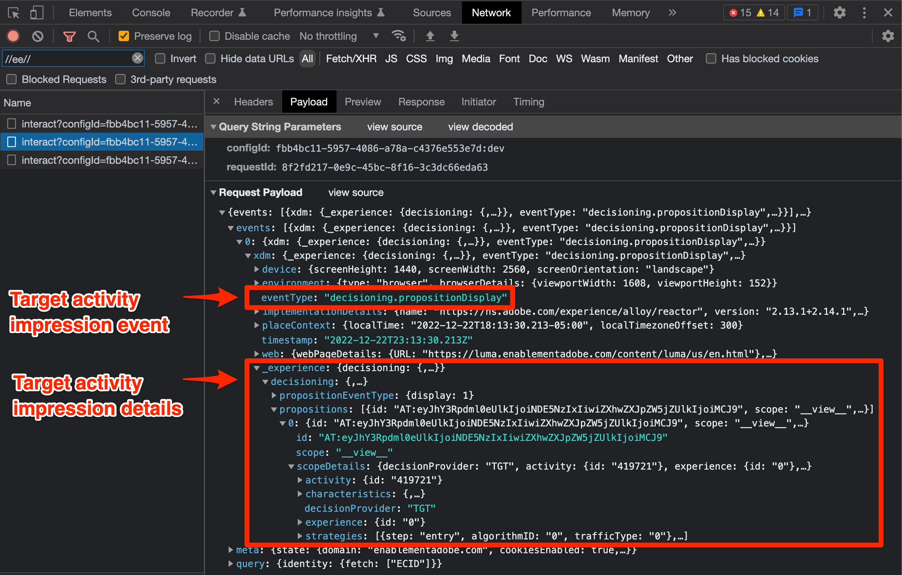

# Rendu des activités du compositeur d’expérience visuelle (VEC) Adobe Target

Les activités Target sont configurées à l’aide du compositeur d’expérience visuelle (VEC) ou du compositeur d’après les formulaires. Le SDK Web de Platform peut récupérer et appliquer des activités basées sur le compositeur d’expérience visuelle à la page, tout comme at.js. Pour cette partie de la migration, vous allez :

* Installation de l’extension de navigateur Visual Editing Helper
* Exécutez un appel `sendEvent` avec le SDK Web Platform pour demander des activités.
* Mettez à jour toutes les références de votre implémentation at.js qui utilisent `getOffers()` pour exécuter une requête Target `pageLoad`.

## Extension Visual Editing Helper du navigateur

L’extension de navigateur Visual Editing Helper de Adobe Experience Cloud pour Google Chrome vous permet de charger de manière fiable des sites web dans le compositeur d’expérience visuelle (VEC) d’Adobe Target afin de créer rapidement des expériences web et d’en contrôler la qualité.

L’extension de navigateur Visual Editing Helper fonctionne avec les sites web qui utilisent at.js ou le SDK web Platform.

### Obtention et installation de l’assistant d’édition visuelle

1. Accédez à l’extension de navigateur [Adobe Experience Cloud Visual Editing Helper dans Chrome Web Store](https://chrome.google.com/webstore/detail/adobe-experience-cloud-vi/kgmjjkfjacffaebgpkpcllakjifppnca).
1. Cliquez sur Ajouter à **Chrome** > **Ajouter une extension**.
1. Ouvrez le VEC dans Target.
1. Pour utiliser l’extension, cliquez sur l’icône d’extension de navigateur Visual Editing Helper {zoomable="yes"} dans la barre d’outils de votre navigateur Chrome en mode VEC ou AQ.

L’assistant d’édition visuelle est automatiquement activé lorsqu’un site web est ouvert dans le VEC de Target pour alimenter la création. L’extension ne comporte aucun paramètre conditionnel. L’extension gère automatiquement tous les paramètres, y compris les paramètres des cookies SameSite.

Reportez-vous à la documentation dédiée pour plus d’informations sur l’ [extension Visual Editing Helper](https://experienceleague.adobe.com/docs/target/using/experiences/vec/troubleshoot-composer/visual-editing-helper-extension.html) et la [résolution des problèmes du compositeur d’expérience visuelle](https://experienceleague.adobe.com/docs/target/using/experiences/vec/troubleshoot-composer/troubleshoot-composer.html).

>[!IMPORTANT]
>
>La nouvelle [extension Visual Editing Helper](https://chrome.google.com/webstore/detail/adobe-experience-cloud-vi/kgmjjkfjacffaebgpkpcllakjifppnca) remplace l’ancienne [ extension de navigateur Target VEC Helper](https://experienceleague.adobe.com/docs/target/using/experiences/vec/troubleshoot-composer/vec-helper-browser-extension.html). Si l’ancienne extension d’assistance VEC est installée, elle doit être supprimée ou désactivée avant d’utiliser l’extension Visual Editing Helper.

## Demander et appliquer automatiquement du contenu

Une fois le SDK Web Platform configuré sur la page, vous pouvez demander du contenu à Target. Contrairement à at.js qui peut être configuré pour demander automatiquement du contenu au chargement de la bibliothèque, le SDK Web Platform exige que vous exécutiez explicitement une commande.

Si le paramètre `pageLoadEnabled` de votre implémentation at.js est défini sur `true`, ce qui permet le rendu automatique des activités basées sur le compositeur d’expérience visuelle, vous exécuterez la commande `sendEvent` suivante avec le SDK Web Platform :

>[!BEGINTABS]

>[!TAB JavaScript]

```Javascript
alloy("sendEvent", {
  "renderDecisions": true
});
```

>[!TAB Balises]

Dans les balises, utilisez le type d’action [!UICONTROL Envoyer l’événement] avec l’option [!UICONTROL &#x200B; Rendre les décisions de personnalisation visuelle &#x200B;] sélectionnée :

{zoomable="yes"}

>[!ENDTABS]

<!--
When the Platform Web SDK renders an activity to the page with `renderDecisions` set to `true`, an additional notification call fires automatically to increment an impression and attribute the visitor to the activity. This call uses an event type with the value `decisioning.propositionDisplay`.

{zoomable="yes"}
-->

## Demander et appliquer du contenu à la demande

Certaines mises en oeuvre de Target nécessitent un traitement personnalisé des offres du compositeur d’expérience visuelle avant de les appliquer à la page. Ou bien, ils demandent plusieurs emplacements dans un seul appel. Dans une implémentation d’at.js, vous pouvez le faire en définissant `pageLoadEnabled` sur `false` et en utilisant la fonction `getOffers()` pour exécuter une requête `pageLoad`.

+++ Exemple d’at.js utilisant `getOffers()` et `applyOffers()` pour effectuer manuellement le rendu des activités basées sur le compositeur d’expérience visuelle

```JavaScript
adobe.target.getOffers({
  request: {
    execute: {
      pageLoad: {}
    }
  }
}).
then(response => adobe.target.applyOffers({ response: response }));
```

+++

Le SDK Web Platform ne possède pas d’événement `pageLoad` spécifique. Toutes les demandes de contenu Target sont contrôlées avec l’option `decisionScopes` avec la commande `sendEvent`. La portée `__view__` sert l’objectif de la requête `pageLoad`.

+++ Une approche équivalente du SDK Web Platform `sendEvent` :

1. Exécutez une commande `sendEvent` qui inclut la portée de décision `__view__`
1. Appliquez le contenu renvoyé à la page avec la commande `applyPropositions`
1. Exécutez une commande `sendEvent` avec le type d’événement `decisioning.propositionDisplay` et les détails de proposition pour incrémenter une impression

```Javascript
alloy("sendEvent", {
  // Request the special "__view__" scope for target-global-mbox / pageLoad
  decisionScopes: ["__view__"]
}).then(function(result) {
  // Check if content (propositions) were returned
  if (result.propositions) {
    var retrievedPropositions = result.propositions;
    // Apply propositions to the page
    return alloy("applyPropositions", {
      propositions: retrievedPropositions
    }).then(function(applyPropositionsResult) {
      var renderedPropositions = applyPropositionsResult.propositions;
      // Send a display notification with the sendEvent command
      alloy("sendEvent", {
        "xdm": {
          "eventType": "decisioning.propositionDisplay",
          "_experience": {
            "decisioning": {
              "propositions": renderedPropositions
            }
          }
        }
      });
    });
  }
});
```

+++

>[!NOTE]
>
>Il est possible de [ effectuer manuellement le rendu des modifications](https://experienceleague.adobe.com/docs/experience-platform/edge/personalization/rendering-personalization-content.html#manually-rendering-content) effectuées dans le compositeur d’expérience visuelle. Le rendu manuel des modifications basées sur VEC n’est pas courant. Vérifiez si votre implémentation at.js utilise la fonction `getOffers()` pour exécuter manuellement une requête Target `pageLoad` sans utiliser `applyOffers()` pour appliquer le contenu à la page.

Le SDK Web Platform offre aux développeurs une grande flexibilité pour demander et générer du contenu. Reportez-vous à la [ documentation dédiée sur le rendu du contenu personnalisé](https://experienceleague.adobe.com/docs/experience-platform/edge/personalization/rendering-personalization-content.html) pour plus d’options et de détails.

## Exemple d’implémentation

La mise en oeuvre de base du SDK Web de Platform est maintenant terminée.

>[!BEGINTABS]

>[!TAB JavaScript]

Exemple JavaScript avec rendu automatique du contenu Target :

```HTML
<!doctype html>
<html>
<head>
  <title>Example page</title>
  <!--Data Layer to enable rich data collection and targeting-->
  <script>
    var digitalData = { 
      // Data layer information goes here
    };
  </script>

  <!--Third party libraries that may be used by Target offers and modifications-->
  <script src="https://ajax.googleapis.com/ajax/libs/jquery/3.6.1/jquery.min.js"></script>

  <!--Prehiding snippet for Target with asynchronous Web SDK deployment-->
  <script>
    !function(e,a,n,t){var i=e.head;if(i){
    if (a) return;
    var o=e.createElement("style");
    o.id="alloy-prehiding",o.innerText=n,i.appendChild(o),setTimeout(function(){o.parentNode&&o.parentNode.removeChild(o)},t)}}
    (document, document.location.href.indexOf("mboxEdit") !== -1, ".body { opacity: 0 !important }", 3000);
  </script>

  <!--Platform Web SDK base code-->
  <script>
    !function(n,o){o.forEach(function(o){n[o]||((n.__alloyNS=n.__alloyNS||
    []).push(o),n[o]=function(){var u=arguments;return new Promise(
    function(i,l){n[o].q.push([i,l,u])})},n[o].q=[])})}
    (window,["alloy"]);
  </script>

  <!--Platform Web SDK loaded asynchonously. Change the src to use the latest supported version.-->
  <script src="https://cdn1.adoberesources.net/alloy/2.6.4/alloy.min.js" async></script>
  
  <!--Configure Platform Web SDK then send event-->
  <script>
    alloy("configure", {
      "edgeConfigId": "ebebf826-a01f-4458-8cec-ef61de241c93",
      "orgId":"ADB3LETTERSANDNUMBERS@AdobeOrg"
    });
    
    // Send an event to the Adobe edge network and render Target content automatically 
    alloy("sendEvent", {
      "renderDecisions": true
    });
  </script>
</head>
<body>
  <h1 id="title">Home Page</h1><br><br>
  <p id="bodyText">Navigation</p><br><br>
  <a id="home" class="navigationLink" href="#">Home</a><br>
  <a id="pageA" class="navigationLink" href="#">Page A</a><br>
  <a id="pageB" class="navigationLink" href="#">Page B</a><br>
  <a id="pageC" class="navigationLink" href="#">Page C</a><br>
  <div id="homepage-hero">Homepage Hero Banner Content</div>
</body>
</html>
```


>[!TAB Balises]

Exemple de page de balises avec rendu automatique du contenu Target :


```HTML
<!doctype html>
<html>
<head>
  <title>Example page</title>
  <!--Data Layer to enable rich data collection and targeting-->
  <script>
    var digitalData = { 
      // Data layer information goes here
    };
  </script>

  <!--Third party libraries that may be used by Target offers and modifications-->
  <script src="https://ajax.googleapis.com/ajax/libs/jquery/3.6.1/jquery.min.js"></script>

  <!--Prehiding snippet for Target with asynchronous Web SDK deployment-->
  <script>
    !function(e,a,n,t){var i=e.head;if(i){
    if (a) return;
    var o=e.createElement("style");
    o.id="alloy-prehiding",o.innerText=n,i.appendChild(o),setTimeout(function(){o.parentNode&&o.parentNode.removeChild(o)},t)}}
    (document, document.location.href.indexOf("mboxEdit") !== -1, ".body { opacity: 0 !important }", 3000);
  </script>

    <!--Tags Header Embed Code: REPLACE WITH THE INSTALL CODE FROM YOUR OWN ENVIRONMENT-->
    <script src="//assets.adobedtm.com/launch-EN93497c30fdf0424eb678d5f4ffac66dc.min.js" async></script>
</head>
<body>
  <h1 id="title">Home Page</h1><br><br>
  <p id="bodyText">Navigation</p><br><br>
  <a id="home" class="navigationLink" href="#">Home</a><br>
  <a id="pageA" class="navigationLink" href="#">Page A</a><br>
  <a id="pageB" class="navigationLink" href="#">Page B</a><br>
  <a id="pageC" class="navigationLink" href="#">Page C</a><br>
  <div id="homepage-hero">Homepage Hero Banner Content</div>
</body>
</html>
```

Dans les balises, ajoutez l’extension SDK Web Adobe Experience Platform :

{zoomable="yes"}

Ajoutez les configurations souhaitées :
{zoomable="yes"}

Créez une règle avec une action [!UICONTROL Envoyer l’événement] et [!UICONTROL Render Visual personalization Decisions] sélectionnée :
{zoomable="yes"}

>[!ENDTABS]

Ensuite, découvrez comment demander et [générer des activités Target basées sur des formulaires](render-form-based-activities.md).

>[!NOTE]
>
>Nous nous engageons à vous aider à réussir la migration de Target d’at.js vers le SDK Web. Si vous rencontrez des obstacles lors de votre migration ou si vous pensez qu’il manque des informations essentielles dans ce guide, faites-le-nous savoir en publiant sur [cette discussion communautaire](https://experienceleaguecommunities.adobe.com/t5/adobe-experience-platform-data/tutorial-discussion-migrate-target-from-at-js-to-web-sdk/m-p/575587#M463).
