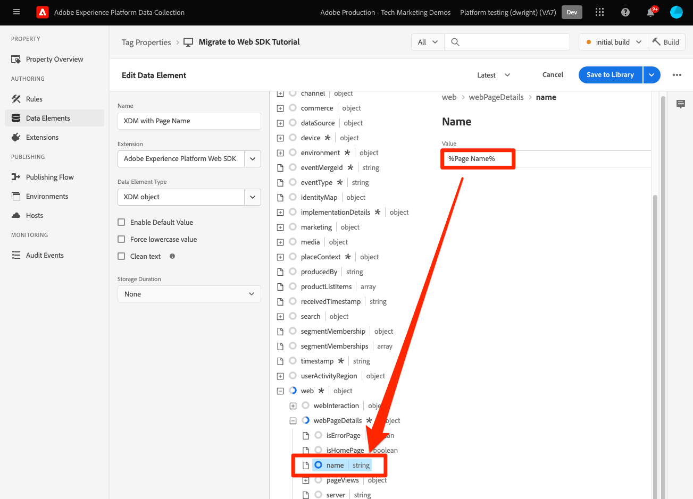
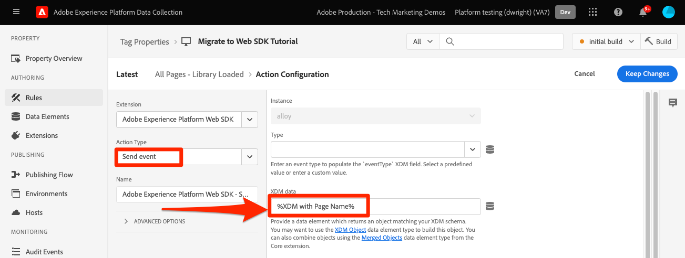
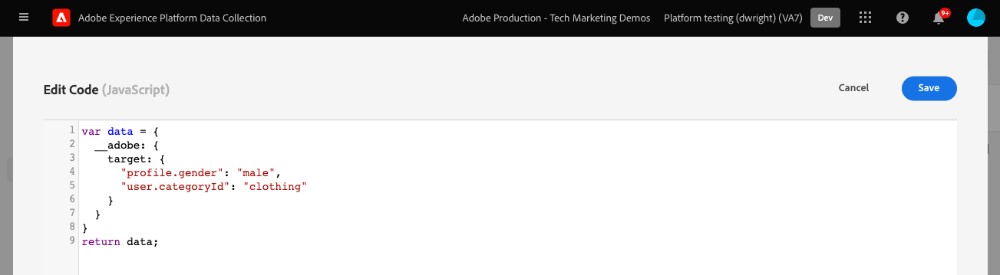
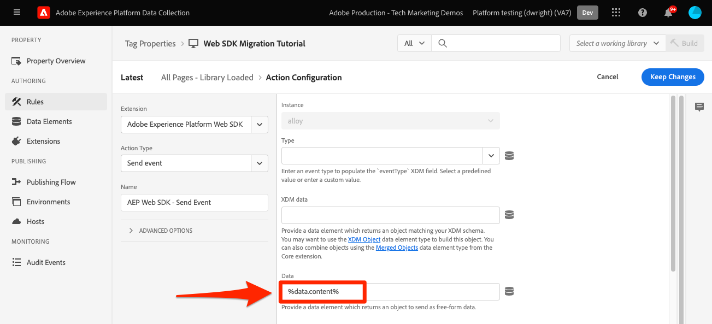
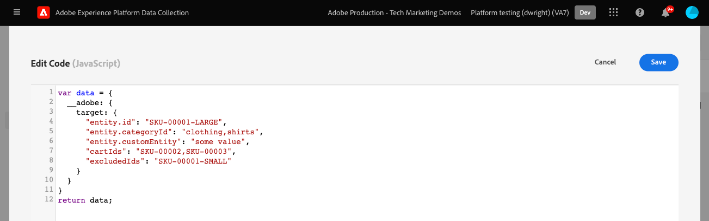
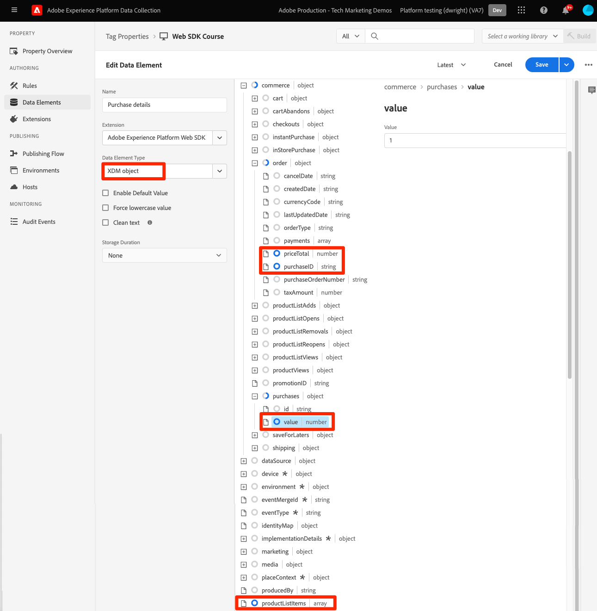
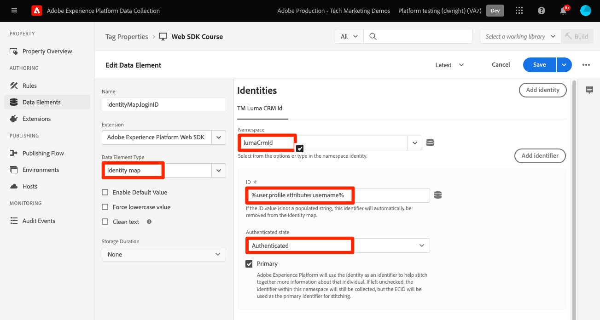
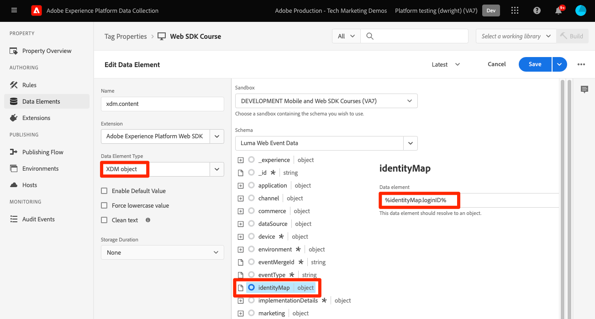
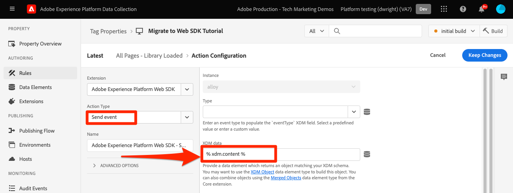
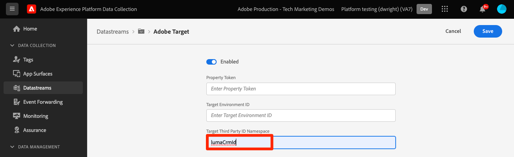

# Envoi de paramètres à Target à l’aide de Platform Web SDK

Les implémentations de Target varient d’un site web à l’autre en fonction de l’architecture, des exigences commerciales et des fonctionnalités utilisées. La plupart des implémentations de Target incluent la transmission de divers paramètres pour les informations contextuelles, les audiences et les recommandations de contenu.

Utilisons une simple page de détails du produit et une page de confirmation de commande pour démontrer les différences entre les bibliothèques lors de la transmission de paramètres à Target.

Supposons que les deux exemples de pages suivants utilisent at.js :

+++at.js sur une page Détails du produit :

```HTML
<!doctype html>
<html>
<head>
  <title>Product Details - Men's Shirt</title>
  <!--Target parameters -->
  <script>
    targetPageParams = function() {
      return {
        // Property token
        "at_property": "5a0fd9bb-67de-4b5a-0fd7-9cc09f50a58d",
        // Mbox parameters
        "pageName": "product detail",
        // Profile parameters
        "profile.gender": "male",
        "user.categoryId": "clothing",
        // Entity parameters for Target Recomendations
        "entity.id": "SKU-00001-LARGE",
        "entity.categoryId": "clothing,shirts",
        "entity.customEntity": "some value",
        "cartIds": "SKU-00002,SKU-00003",
        "excludedIds": "SKU-00001-SMALL",
        // Customer ID for cross-device profile synching and Customer Attributes
        "mbox3rdPartyId": "TT8675309",
      };
    };
  </script>
  <!--Target at.js library loaded asynchonously-->
  <script src="/libraries/at.js" async></script>
</head>
<body>
  <h1 id="title">Men's Large Shirt</h1>
  <p>SKU: SKU-00001-LARGE</p>
</body>
</html>
```

+++ 


+++at.js sur la page de confirmation de commande :

```HTML
<!doctype html>
<html>
<head>
  <title>Order Confirmation</title>-->
  <!--Target parameters -->
  <script>
    targetPageParams = function() {
      return {
        // Property token
        "at_property": "5a0fd9bb-67de-4b5a-0fd7-9cc09f50a58d",
        // Order confirmation parameters
        "orderId": "ABC123",
        "productPurchasedId": "SKU-00002,SKU-00003",
        "orderTotal": 1337.89,
        // Customer ID for cross-device profile synching and Customer Attributes
        "mbox3rdPartyId": "TT8675309",
      };
    };
  </script>
  <!--Target at.js library loaded asynchonously-->
  <script src="/libraries/at.js" async></script>
</head>
<body>
  <h1 id="title">Order Confirmation</h1>
  <p>Thank you for your order</p>
</body>
</html>
```

+++ 


## Résumé du mappage des paramètres

Les paramètres Target de ces pages sont envoyés différemment à l’aide de Platform Web SDK. Il existe plusieurs façons de transmettre des paramètres à Target à l’aide d’at.js :

- Définissez avec `targetPageParams()` fonction pour l’événement de chargement de page (utilisé dans les exemples de cette page).
- Définissez avec `targetPageParamsAll()` fonction pour toutes les requêtes Target de la page.
- Envoi direct de paramètres avec la fonction `getOffer()` pour un seul emplacement
- Envoi direct de paramètres avec la fonction `getOffers()` pour un ou plusieurs emplacements


Platform Web SDK offre un moyen unique et cohérent d’envoyer des données sans avoir besoin de fonctions supplémentaires. Tous les paramètres doivent être transmis dans la payload avec la commande `sendEvent` et appartiennent à deux catégories :

- Mappé automatiquement à partir de l’objet `xdm`
- Transmis manuellement à l’aide de l’objet `data.__adobe.target`

Le tableau ci-dessous décrit comment les paramètres d’exemple seraient remappés à l’aide de Platform Web SDK :

| Exemple de paramètre at.js | Option de Platform Web SDK | Remarques |
| --- | --- | --- |
| `at_property` | S.O. | Les jetons de propriété sont configurés dans le [flux de données](https://experienceleague.adobe.com/docs/experience-platform/edge/datastreams/configure.html#target) et ne peuvent pas être définis dans l’appel `sendEvent`. |
| `pageName` | `xdm.web.webPageDetails.name` | Tous les paramètres de mbox cible doivent être transmis dans le cadre de l’objet `xdm` et être conformes à un schéma à l’aide de la classe XDM ExperienceEvent. Les paramètres de mbox ne peuvent pas être transmis dans le cadre de l’objet `data`. |
| `profile.gender` | `data.__adobe.target.profile.gender` | Tous les paramètres de profil Target doivent être transmis dans le cadre de l’objet `data` et précédés du préfixe `profile.` pour être mappés correctement. |
| `user.categoryId` | `data.__adobe.target.user.categoryId` | Paramètre réservé utilisé pour la fonction Affinité catégorielle de Target qui doit être transmis dans le cadre de l’objet `data`. |
| `entity.id` | `data.__adobe.target.entity.id` <br>OU<br> `xdm.productListItems[0].SKU` | Les identifiants d’entité sont utilisés pour les compteurs comportementaux de Target Recommendations. Ces ID d’entité peuvent être transmis dans le cadre de l’objet `data` ou mappés automatiquement à partir du premier élément du tableau de `xdm.productListItems` si votre implémentation utilise ce groupe de champs. |
| `entity.categoryId` | `data.__adobe.target.entity.categoryId` | Les identifiants de catégorie d’entité peuvent être transmis dans le cadre de l’objet `data`. |
| `entity.customEntity` | `data.__adobe.target.entity.customEntity` | Les paramètres d’entité personnalisés sont utilisés pour mettre à jour le catalogue de produits Recommendations. Ces paramètres personnalisés doivent être transmis dans le cadre de l’objet `data`. |
| `cartIds` | `data.__adobe.target.cartIds` | Utilisé pour les algorithmes de recommandations basés sur le panier de Target. |
| `excludedIds` | `data.__adobe.target.excludedIds` | Utilisé pour empêcher le renvoi d’ID d’entité spécifiques dans une conception Recommendations. |
| `mbox3rdPartyId` | Définir dans l’objet `xdm.identityMap` | Utilisé pour synchroniser les profils Target sur les appareils et les attributs du client. L’espace de noms à utiliser pour l’ID de client doit être spécifié dans la [configuration cible du flux de données](https://experienceleague.adobe.com/docs/experience-platform/edge/personalization/adobe-target/using-mbox-3rdpartyid.html). |
| `orderId` | `xdm.commerce.order.purchaseID` | Utilisé pour identifier une commande unique pour le suivi des conversions dans Target. |
| `orderTotal` | `xdm.commerce.order.priceTotal` | Utilisé pour le suivi des totaux des ordres pour les objectifs de conversion et d’optimisation de Target. |
| `productPurchasedId` | `data.__adobe.target.productPurchasedId` <br>OU<br> `xdm.productListItems[0-n].SKU` | Utilisé pour le suivi des conversions de Target et les algorithmes de recommandations. Pour plus d’informations[&#x200B; reportez-vous à la section &#x200B;](#entity-parameters)paramètres d’entité ci-dessous. |
| `mboxPageValue` | `data.__adobe.target.mboxPageValue` | Utilisé pour l’objectif de l’activité [notation personnalisée](https://experienceleague.adobe.com/docs/target/using/activities/success-metrics/capture-score.html). |

{style="table-layout:auto"}

## Paramètres personnalisés

Les paramètres de mbox personnalisés doivent être transmis en tant que données XDM avec la commande `sendEvent`. Il est important de s’assurer que le schéma XDM inclut tous les champs requis pour votre implémentation de Target.

Exemple d’utilisation d’at.js avec `targetPageParams()` :

```JavaScript
targetPageParams = function() {
  return {
    "pageName": "product detail"
  };
};
```

Exemples de JavaScript de Platform Web SDK à l’aide de la commande `sendEvent` :

>[!BEGINTABS]

>[!TAB JavaScript]

```JavaScript
alloy("sendEvent", {
  "xdm": {
    "web": {
      "webPageDetails": {
        // Other attributes included according to xdm schema
        "name": "product detail"
      }
    }
  }
});
```

>[!TAB Balises]

Dans les balises, utilisez d’abord un élément de données [!UICONTROL objet XDM] pour mapper au champ XDM :

{zoomable="yes"}

Insérez ensuite votre [!UICONTROL objet XDM] dans votre [!UICONTROL événement d’envoi] [!UICONTROL action] (plusieurs [!UICONTROL objets XDM] peuvent être [fusionnés](https://experienceleague.adobe.com/docs/experience-platform/tags/extensions/client/core/overview.html?lang=en#merged-objects)) :

{zoomable="yes"}

>[!ENDTABS]


>[!NOTE]
>
>Étant donné que les paramètres de mbox personnalisés font partie de `xdm`’objet , vous devez mettre à jour les audiences, les activités ou les scripts de profil qui font référence à ces paramètres mbox en utilisant leurs nouveaux noms. Pour plus d’informations, reportez-vous à la page [Mise à jour des audiences Target et des scripts de profil pour la compatibilité de Platform Web SDK](update-audiences.md) de ce tutoriel.


## Paramètres de profil

Les paramètres du profil cible doivent être transmis sous l’objet `data.__adobe.target` dans la payload de commande de `sendEvent` Web SDK Platform.

Comme pour at.js, tous les paramètres de profil doivent également comporter le préfixe `profile.` pour que la valeur soit correctement stockée en tant qu’attribut de profil Target persistant. Le paramètre de `user.categoryId` réservé pour la fonctionnalité Affinité par catégorie de Target comporte le préfixe `user.`.

Exemple d’utilisation d’at.js avec `targetPageParams()` :

```JavaScript
targetPageParams = function() {
  return {
    "profile.gender": "male",
    "user.categoryId": "clothing"
  };
};
```

Exemples de SDK web Platform à l’aide de la commande `sendEvent` :

>[!BEGINTABS]

>[!TAB JavaScript]

```JavaScript
alloy("sendEvent", {
  "data": {
    "__adobe": {
      "target": {
        "profile.gender": "male",
        "user.categoryId": "clothing"
      }
    }
  }
});
```

>[!TAB Balises]

Dans les balises, commencez par créer un élément de données pour définir l’objet `data.__adobe.target` :

{zoomable="yes"}

Insérez ensuite votre objet de données dans votre [!UICONTROL Événement d’envoi] [!UICONTROL action] (plusieurs [!UICONTROL objets] peuvent être [fusionnés](https://experienceleague.adobe.com/docs/experience-platform/tags/extensions/client/core/overview.html?lang=en#merged-objects)) :

{zoomable="yes"}

>[!ENDTABS]

## Paramètres de l’entité

Les paramètres d’entité sont utilisés pour transmettre des données comportementales et des informations de catalogue supplémentaires pour Target Recommendations. Tous les [paramètres d’entité](https://experienceleague.adobe.com/docs/target/using/recommendations/entities/entity-attributes.html) pris en charge par at.js sont également pris en charge par le SDK web de Platform. Tout comme les paramètres de profil, tous les paramètres d’entité doivent être transmis sous l’objet `data.__adobe.target` dans la payload de commande de `sendEvent` Web SDK Platform.

Les paramètres d&#39;entité pour un élément spécifique doivent être précédés de `entity.` pour une capture de données correcte. Les paramètres `cartIds` et `excludedIds` réservés aux algorithmes de recommandations ne doivent pas être précédés de préfixes et la valeur de chaque doit contenir une liste d’identifiants d’entité séparés par des virgules.

Exemple d’utilisation d’at.js avec `targetPageParams()` :

```JavaScript
targetPageParams = function() {
  return {
    "entity.id": "SKU-00001-LARGE",
    "entity.categoryId": "clothing,shirts",
    "entity.customEntity": "some value",
    "cartIds": "SKU-00002,SKU-00003",
    "excludedIds": "SKU-00001-SMALL"
  };
};
```

Exemples de SDK web Platform à l’aide de la commande `sendEvent` :

>[!BEGINTABS]

>[!TAB JavaScript]

```JavaScript
alloy("sendEvent", {
  "data": {
    "__adobe": {
      "target": {
        "entity.id": "SKU-00001-LARGE",
        "entity.categoryId": "clothing,shirts",
        "entity.customEntity": "some value",
        "cartIds": "SKU-00002,SKU-00003",
        "excludedIds": "SKU-00001-SMALL"
      }
    }
  }
});
```

>[!TAB Balises]

Dans les balises, commencez par créer un élément de données pour définir l’objet `data.__adobe.target` :

{zoomable="yes"}

Insérez ensuite votre objet de données dans votre [!UICONTROL Événement d’envoi] [!UICONTROL action] (plusieurs [!UICONTROL objets] peuvent être [fusionnés](https://experienceleague.adobe.com/docs/experience-platform/tags/extensions/client/core/overview.html?lang=en#merged-objects)) :

{zoomable="yes"}

>[!ENDTABS]

>[!NOTE]
>
>Si le groupe de champs `commerce` est utilisé et que le tableau `productListItems` est inclus dans la payload XDM, la première valeur de `SKU` de ce tableau est mappée à `entity.id` à des fins d’incrémentation d’une vue de produit.


## Paramètres d’achat

Les paramètres d’achat sont transmis sur une page de confirmation de commande après une commande réussie et sont utilisés pour les objectifs de conversion et d’optimisation de Target. Avec une implémentation de Platform Web SDK, ces paramètres et sont automatiquement mappés à partir des données XDM transmises dans le cadre du groupe de champs `commerce`.

Exemple d’utilisation d’at.js avec `targetPageParams()` :

```JavaScript
targetPageParams = function() {
  return {
    "orderId": "ABC123",
    "productPurchasedId": "SKU-00002,SKU-00003"
    "orderTotal": 1337.89
  };
};
```

Les informations d’achat sont transmises à Target lorsque le groupe de champs `commerce` a `purchases.value` défini sur `1`. L’ID de commande et le total de la commande sont automatiquement mappés à partir de l’objet `order`. Si le tableau `productListItems` est présent, les valeurs `SKU` sont utilisées pour la `productPurchasedId`.

Exemple de SDK Web Platform utilisant `sendEvent` :

>[!BEGINTABS]

>[!TAB JavaScript]

```JavaScript
alloy("sendEvent", {
  "xdm": {
    "commerce": {
      "order": {
        "purchaseID": "ABC123",
        "priceTotal": 1337.89
      },
      "purchases": {
        "value": 1
      }
    },
    "productListItems": [{
      "SKU": "SKU-00002"
    }, {
      "SKU": "SKU-00003"
    }],
      "_experience": {
          "decisioning": {
              "propositions": [{
                  "scope": "<your_mbox>"
              }],
              "propositionEventType": {
                  "display": 1
              }
          }
      }
  }
});
```

>[!TAB Balises]

Dans les balises, utilisez d’abord un élément de données [!UICONTROL objet XDM] pour mapper les champs XDM obligatoires (voir l’exemple JavaScript) et la portée personnalisée facultative :

{zoomable="yes"}

Insérez ensuite votre [!UICONTROL objet XDM] dans votre [!UICONTROL événement d’envoi] [!UICONTROL action] (plusieurs [!UICONTROL objets XDM] peuvent être [fusionnés](https://experienceleague.adobe.com/docs/experience-platform/tags/extensions/client/core/overview.html?lang=en#merged-objects)) :

{zoomable="yes"}

>[!ENDTABS]

>[!IMPORTANT]
>
> `_experience.decisioning.propositionEventType` doit être défini avec `display: 1` pour que l’appel soit utilisé pour incrémenter une mesure Target.

>[!NOTE]
>
> Si vous souhaitez utiliser un nom d’emplacement/de mbox personnalisé dans votre définition de mesure cible, par exemple `orderConfirmPage`, renseignez le tableau `_experience.decisioning.propositions` avec une portée personnalisée comme dans l’exemple ci-dessus.

>[!NOTE]
>
>La valeur `productPurchasedId` peut également être transmise sous la forme d’une liste d’identifiants d’entité séparés par des virgules sous l’objet `data` .


## Identifiant client (mbox3rdPartyId)

Target permet de synchroniser les profils sur plusieurs appareils et systèmes à l’aide d’un seul identifiant client. Avec at.js, cela peut être défini comme `mbox3rdPartyId` dans la requête Target ou comme premier ID client envoyé au service d’identités d’Experience Cloud. Contrairement à at.js, une implémentation de Platform Web SDK vous permet de spécifier l’ID de client à utiliser comme `mbox3rdPartyId` s’il y en a plusieurs. Par exemple, si votre entreprise dispose d’un ID client global et de plusieurs ID client distincts pour différents secteurs d’activité, vous pouvez configurer l’ID que Target doit utiliser.

Il existe quelques étapes pour configurer la synchronisation des identifiants pour les cas d’utilisation inter-appareils et des attributs du client :

1. Créez un **[!UICONTROL espace de noms d’identité]** pour l’ID de client dans l’écran **[!UICONTROL Identités]** de la Collecte de données ou de Platform
1. Assurez-vous que le **[!UICONTROL alias]** dans Attributs du client correspond au **[!UICONTROL symbole d’identité]** de votre espace de noms
1. Spécifiez le **[!UICONTROL symbole d’identité]** comme **[!UICONTROL espace de noms d’identifiant tiers cible]** dans la configuration cible du flux de données
1. Exécuter une commande `sendEvent` à l’aide du groupe de champs `identityMap`

Exemple d’utilisation d’at.js avec `targetPageParams()` :

```JavaScript
targetPageParams = function() {
  return {
    "mbox3rdPartyId": "TT8675309"
  };
};
```

Exemples de SDK web Platform à l’aide de la commande `sendEvent` :

>[!BEGINTABS]

>[!TAB JavaScript]

```JavaScript
alloy("sendEvent", {
  "xdm": {
    "identityMap": {
      "GLOBAL_CUSTOMER_ID": [{
        "id": "TT8675309",
        "authenticatedState": "authenticated",
        "primary": true
      }]
    }
  }
});
```

>[!TAB Balises]

La valeur [!UICONTROL ID], [!UICONTROL État authentifié] et [!UICONTROL Espace de noms] sont capturés dans un élément de données [!UICONTROL Mappage d’identités] :
{zoomable="yes"}

L’élément de données [!UICONTROL IdentityMap] est ensuite utilisé pour définir le champ [!UICONTROL identityMap] dans l’élément de données [!UICONTROL objet XDM] :
{zoomable="yes"}

L’objet [!UICONTROL XDM] est ensuite inclus dans l’action [!UICONTROL Envoyer l’événement] d’une règle :

{zoomable="yes"}

Dans le service Adobe Target de votre flux de données, veillez à définir l’[!UICONTROL Espace de noms des identifiants tiers cibles] sur le même espace de noms que celui utilisé dans l’élément de données [!UICONTROL Mappage d’identités] :
{zoomable="yes"}

>[!ENDTABS]

>[!NOTE]
>
> Adobe recommande d’envoyer des espaces de noms qui représentent une personne, tels que des identités authentifiées, comme identité principale.


## Exemple de SDK Web Platform

Maintenant que vous comprenez comment les différents paramètres Target sont mappés à l’aide de Platform Web SDK, nos deux exemples de pages peuvent être migrés d’at.js vers Platform Web SDK comme illustré ci-dessous. Voici quelques exemples de pages :

- Fragment de code de masquage préalable cible pour une implémentation de bibliothèque asynchrone
- Code de base de Platform Web SDK
- Bibliothèque JavaScript de Platform Web SDK
- Commande `configure` pour initialiser la bibliothèque
- Une commande `sendEvent` pour envoyer des données et demander le rendu du contenu Target

+++SDK web sur une page de détails du produit :

```HTML
<!doctype html>
<html>
<head>
  <title>Product Details - Men's Shirt</title>

  <!--Prehiding snippet for Target with asynchronous Web SDK deployment-->
  <script>
    !function(e,a,n,t){var i=e.head;if(i){
    if (a) return;
    var o=e.createElement("style");
    o.id="alloy-prehiding",o.innerText=n,i.appendChild(o),setTimeout(function(){o.parentNode&&o.parentNode.removeChild(o)},t)}}
    (document, document.location.href.indexOf("mboxEdit") !== -1, ".body { opacity: 0 !important }", 3000);
  </script>

  <!--Platform Web SDK base code-->
  <script>
    !function(n,o){o.forEach(function(o){n[o]||((n.__alloyNS=n.__alloyNS||
    []).push(o),n[o]=function(){var u=arguments;return new Promise(
    function(i,l){n[o].q.push([i,l,u])})},n[o].q=[])})}
    (window,["alloy"]);
  </script>

  <!--Platform Web SDK loaded asynchonously. Change the src to use the latest supported version.-->
  <script src="https://cdn1.adoberesources.net/alloy/2.6.4/alloy.min.js" async></script>

  <!--Configure Platform Web SDK and send event-->
  <script>
    alloy("configure", {
      "edgeConfigId": "ebebf826-a01f-4458-8cec-ef61de241c93",
      "orgId":"ADB3LETTERSANDNUMBERS@AdobeOrg"
    });
    alloy("sendEvent", {
      "renderDecisions": true,
      "xdm": {
        "identityMap": {
          "GLOBAL_CUSTOMER_ID": [{
            "id": "TT8675309",
            "authenticatedState": "authenticated",
            "primary": true
          }]
        },
        "web": {
          "webPageDetails": {
            // Other attributes included according to XDM schema
            "pageName": "product detail"
          }
        }
      },
      "data": {
        "__adobe": {
          "target": {
            "profile.gender": "male",
            "user.categoryId": "clothing",
            "entity.id": "SKU-00001-LARGE",
            "entity.categoryId": "clothing,shirts",
            "entity.customEntity": "some value",
            "cartIds": "SKU-00002,SKU-00003",
            "excludedIds": "SKU-00001-SMALL"
          }
        }
      }
    });
  </script>
</head>
<body>
  <h1 id="title">Men's Large Shirt</h1>
  <p>SKU: SKU-00001-LARGE</p>
</body>
</html>
```

+++

+++Web SDK sur une page de confirmation de commande :

```HTML
<!doctype html>
<html>
<head>
  <title>Order Confirmation</title>


  <!--Prehiding snippet for Target with asynchronous Web SDK deployment-->

  <script>
    !function(e,a,n,t){var i=e.head;if(i){
    if (a) return;
    var o=e.createElement("style");
    o.id="alloy-prehiding",o.innerText=n,i.appendChild(o),setTimeout(function(){o.parentNode&&o.parentNode.removeChild(o)},t)}}
    (document, document.location.href.indexOf("mboxEdit") !== -1, ".body { opacity: 0 !important }", 3000);
  </script>

  <!--Platform Web SDK base code-->

  <script>
    !function(n,o){o.forEach(function(o){n[o]||((n.__alloyNS=n.__alloyNS||
    []).push(o),n[o]=function(){var u=arguments;return new Promise(
    function(i,l){n[o].q.push([i,l,u])})},n[o].q=[])})}
    (window,["alloy"]);
  </script>
  <!--Platform Web SDK loaded asynchonously. Change the src to use the latest supported version.-->
  <script src="https://cdn1.adoberesources.net/alloy/2.6.4/alloy.min.js" async></script>

  <!--Configure Platform Web SDK and send event-->
  <script>
    alloy("configure", {
      "edgeConfigId": "ebebf826-a01f-4458-8cec-ef61de241c93",
      "orgId":"ADB3LETTERSANDNUMBERS@AdobeOrg"
    });
    alloy("sendEvent", {
      "xdm": {
        "identityMap": {
          "GLOBAL_CUSTOMER_ID": [{
            "id": "TT8675309",
            "authenticatedState": "authenticated",
            "primary": true
          }]
        },
        "commerce": {
          "order": {
            "purchaseID": "ABC123",
            "priceTotal": 1337.89
          },
          "purchases": {
            "value": 1
          }
        },
        "productListItems": [{
          "SKU": "SKU-00002"
        }, {
          "SKU": "SKU-00003"
        }],
        "_experience": {
            "decisioning": {
                "propositions": [{
                    "scope": "<your_mbox>"
                }],
                "propositionEventType": {
                    "display": 1
                }
            }
        }
      }
    });
  </script>
</head>
<body>
  <h1 id="title">Order Confirmation</h1>
  <p>Thank you for your order</p>
</body>
</html>
```

+++

Ensuite, découvrez comment [suivre les événements de conversion Target](track-events.md) avec le SDK web de Platform.

>[!NOTE]
>
>Nous nous engageons à vous aider à réussir la migration de Target d’at.js vers Web SDK. Si vous rencontrez des obstacles avec votre migration ou si vous pensez qu&#39;il manque des informations essentielles dans ce guide, veuillez nous le faire savoir en postant dans [cette discussion communautaire](https://experienceleaguecommunities.adobe.com/t5/adobe-experience-platform-data/tutorial-discussion-migrate-target-from-at-js-to-web-sdk/m-p/575587#M463).
