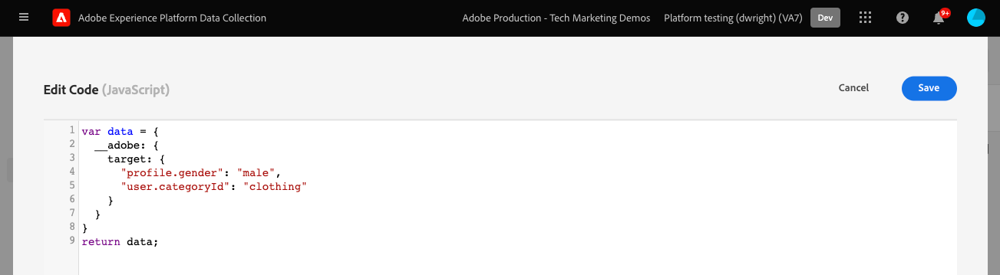
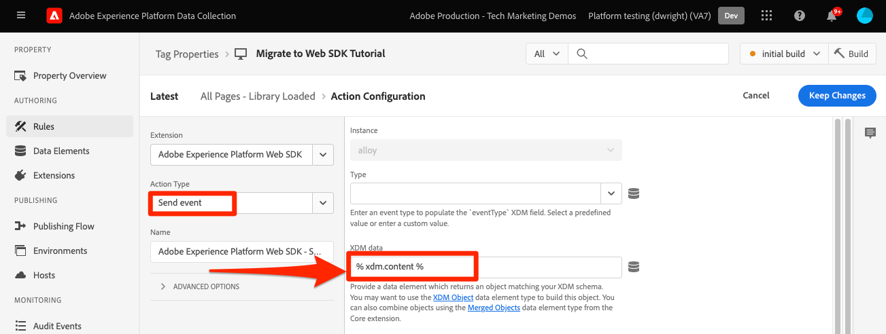

# Envoyer des paramètres à Target à l’aide du SDK Web Platform

Les mises en oeuvre de Target diffèrent d’un site web à l’autre en raison de l’architecture du site, des exigences de l’entreprise et des fonctionnalités utilisées. La plupart des implémentations de Target incluent la transmission de divers paramètres pour les informations contextuelles, les audiences et les recommandations de contenu.

Utilisons une page de détails de produit simple et une page de confirmation de commande pour démontrer les différences entre les bibliothèques lors de la transmission de paramètres à Target.

Prenez les deux exemples de pages suivants à l’aide d’at.js :

+++at.js sur une page Détails du produit :

```HTML
<!doctype html>
<html>
<head>
  <title>Product Details - Men's Shirt</title>
  <!--Target parameters -->
  <script>
    targetPageParams = function() {
      return {
        // Property token
        "at_property": "5a0fd9bb-67de-4b5a-0fd7-9cc09f50a58d",
        // Mbox parameters
        "pageName": "product detail",
        // Profile parameters
        "profile.gender": "male",
        "user.categoryId": "clothing",
        // Entity parameters for Target Recomendations
        "entity.id": "SKU-00001-LARGE",
        "entity.categoryId": "clothing,shirts",
        "entity.customEntity": "some value",
        "cartIds": "SKU-00002,SKU-00003",
        "excludedIds": "SKU-00001-SMALL",
        // Customer ID for cross-device profile synching and Customer Attributes
        "mbox3rdPartyId": "TT8675309",
      };
    };
  </script>
  <!--Target at.js library loaded asynchonously-->
  <script src="/libraries/at.js" async></script>
</head>
<body>
  <h1 id="title">Men's Large Shirt</h1>
  <p>SKU: SKU-00001-LARGE</p>
</body>
</html>
```

+++


+++at.js sur une page de confirmation de commande :

```HTML
<!doctype html>
<html>
<head>
  <title>Order Confirmation</title>-->
  <!--Target parameters -->
  <script>
    targetPageParams = function() {
      return {
        // Property token
        "at_property": "5a0fd9bb-67de-4b5a-0fd7-9cc09f50a58d",
        // Order confirmation parameters
        "orderId": "ABC123",
        "productPurchasedId": "SKU-00002,SKU-00003",
        "orderTotal": 1337.89,
        // Customer ID for cross-device profile synching and Customer Attributes
        "mbox3rdPartyId": "TT8675309",
      };
    };
  </script>
  <!--Target at.js library loaded asynchonously-->
  <script src="/libraries/at.js" async></script>
</head>
<body>
  <h1 id="title">Order Confirmation</h1>
  <p>Thank you for your order</p>
</body>
</html>
```

+++


## Synthèse du mapping des paramètres

Les paramètres Target de ces pages sont envoyés différemment à l’aide du SDK Web Platform. Il existe plusieurs façons de transférer des paramètres à Target à l’aide d’at.js :

- Défini avec la fonction `targetPageParams()` pour l’événement de chargement de page (utilisé dans les exemples de cette page)
- Défini avec la fonction `targetPageParamsAll()` pour toutes les requêtes Target sur la page.
- Envoyez les paramètres directement avec la fonction `getOffer()` pour un emplacement unique
- Envoyez des paramètres directement avec la fonction `getOffers()` pour un ou plusieurs emplacements


Le SDK Web Platform offre un moyen unique et cohérent d’envoyer des données sans avoir besoin de fonctions supplémentaires. Tous les paramètres doivent être transmis dans la payload avec la commande `sendEvent` et se classer dans deux catégories :

- Mappé automatiquement à partir de l’objet `xdm`
- Transmis manuellement à l’aide de l’objet `data.__adobe.target`

Le tableau ci-dessous décrit comment les exemples de paramètres seraient mappés à l’aide du SDK Web Platform :

| Exemple de paramètre at.js | Option SDK Web Platform | Notes |
| --- | --- | --- |
| `at_property` | S/O | Les jetons de propriété sont configurés dans le [datastream](https://experienceleague.adobe.com/docs/experience-platform/edge/datastreams/configure.html#target) et ne peuvent pas être définis dans l’appel `sendEvent`. |
| `pageName` | `xdm.web.webPageDetails.name` | Tous les paramètres de mbox Target doivent être transmis dans le cadre de l’objet `xdm` et conformes à un schéma à l’aide de la classe XDM ExperienceEvent. Les paramètres de mbox ne peuvent pas être transmis dans le cadre de l’objet `data`. |
| `profile.gender` | `data.__adobe.target.profile.gender` | Tous les paramètres de profil Target doivent être transmis dans le cadre de l’objet `data` et précédés du préfixe `profile.` pour être mappés correctement. |
| `user.categoryId` | `data.__adobe.target.user.categoryId` | Paramètre réservé utilisé pour la fonctionnalité Affinité catégorielle de Target qui doit être transmis dans le cadre de l’objet `data`. |
| `entity.id` | `data.__adobe.target.entity.id` <br>OR<br> `xdm.productListItems[0].SKU` | Les identifiants d’entité sont utilisés pour les compteurs de comportement de Target Recommendations. Ces identifiants d’entité peuvent être transmis dans le cadre de l’objet `data` ou mappés automatiquement à partir du premier élément du tableau `xdm.productListItems` si votre implémentation utilise ce groupe de champs. |
| `entity.categoryId` | `data.__adobe.target.entity.categoryId` | Les identifiants de catégorie d’entité peuvent être transmis dans le cadre de l’objet `data`. |
| `entity.customEntity` | `data.__adobe.target.entity.customEntity` | Les paramètres d’entité personnalisés sont utilisés pour la mise à jour du catalogue de produits Recommendations. Ces paramètres personnalisés doivent être transmis dans le cadre de l’objet `data`. |
| `cartIds` | `data.__adobe.target.cartIds` | Utilisé pour les algorithmes de recommandations basés sur le panier de Target. |
| `excludedIds` | `data.__adobe.target.excludedIds` | Utilisé pour empêcher le renvoi d’ID d’entité spécifiques dans une conception de recommandations. |
| `mbox3rdPartyId` | Défini dans l’objet `xdm.identityMap` | Utilisé pour synchroniser les profils Target sur les appareils et les attributs du client. L’espace de noms à utiliser pour l’ID de client doit être spécifié dans la configuration [Target de la banque de données](https://experienceleague.adobe.com/docs/experience-platform/edge/personalization/adobe-target/using-mbox-3rdpartyid.html). |
| `orderId` | `xdm.commerce.order.purchaseID` | Utilisé pour identifier une commande unique pour le suivi de conversion de Target. |
| `orderTotal` | `xdm.commerce.order.priceTotal` | Utilisé pour le suivi des totaux des commandes pour les objectifs de conversion et d’optimisation de Target. |
| `productPurchasedId` | `data.__adobe.target.productPurchasedId` <br>OR<br> `xdm.productListItems[0-n].SKU` | Utilisé pour le suivi des conversions Target et les algorithmes de recommandations. Pour plus d’informations, reportez-vous à la section [paramètres d’entité](#entity-parameters) ci-dessous. |
| `mboxPageValue` | `data.__adobe.target.mboxPageValue` | Utilisé pour l’objectif de l’activité [score personnalisé](https://experienceleague.adobe.com/docs/target/using/activities/success-metrics/capture-score.html). |

{style="table-layout:auto"}

## Paramètres personnalisés

Les paramètres mbox personnalisés doivent être transmis en tant que données XDM avec la commande `sendEvent`. Il est important de s’assurer que le schéma XDM inclut tous les champs requis pour votre mise en oeuvre Target.

Exemple d’at.js utilisant `targetPageParams()` :

```JavaScript
targetPageParams = function() {
  return {
    "pageName": "product detail"
  };
};
```

Exemples JavaScript du SDK Web Platform à l’aide de la commande `sendEvent` :

>[!BEGINTABS]

>[!TAB JavaScript]

```JavaScript
alloy("sendEvent", {
  "xdm": {
    "web": {
      "webPageDetails": {
        // Other attributes included according to xdm schema
        "name": "product detail"
      }
    }
  }
});
```

>[!TAB Balises]

Dans les balises, utilisez d’abord un élément de données [!UICONTROL objet XDM] pour mapper le fichier au champ XDM :

{zoomable="yes"}

Ensuite, incluez votre [!UICONTROL objet XDM] dans votre [!UICONTROL événement d’envoi] [!UICONTROL action] (plusieurs [!UICONTROL objets XDM] peuvent être [fusionnés](https://experienceleague.adobe.com/docs/experience-platform/tags/extensions/client/core/overview.html?lang=en#merged-objects)) :

{zoomable="yes"}

>[!ENDTABS]


>[!NOTE]
>
>Les paramètres de mbox personnalisés faisant partie de l’objet `xdm`, vous devez mettre à jour les audiences, les activités ou les scripts de profil qui référencent ces paramètres de mbox à l’aide de leurs nouveaux noms. Pour plus d’informations, consultez la page [Mise à jour des audiences Target et des scripts de profil pour la compatibilité du SDK Web Platform](update-audiences.md) de ce tutoriel.


## Paramètres de profil

Les paramètres de profil Target doivent être transmis sous l’objet `data.__adobe.target` dans la payload de commande du SDK Web Platform `sendEvent`.

Tout comme at.js, tous les paramètres de profil doivent également comporter le préfixe `profile.` pour que la valeur soit correctement stockée en tant qu’attribut de profil Target persistant. Le paramètre réservé `user.categoryId` pour la fonctionnalité d’affinité catégorielle de Target est précédé du préfixe `user.`.

Exemple d’at.js utilisant `targetPageParams()` :

```JavaScript
targetPageParams = function() {
  return {
    "profile.gender": "male",
    "user.categoryId": "clothing"
  };
};
```

Exemples de SDK Web Platform à l’aide de la commande `sendEvent` :

>[!BEGINTABS]

>[!TAB JavaScript]

```JavaScript
alloy("sendEvent", {
  "data": {
    "__adobe": {
      "target": {
        "profile.gender": "male",
        "user.categoryId": "clothing"
      }
    }
  }
});
```

>[!TAB Balises]

Dans les balises , créez d’abord un élément de données pour définir l’objet `data.__adobe.target` :

{zoomable="yes"}

Ensuite, incluez votre objet de données dans votre [!UICONTROL Envoyer l’événement] [!UICONTROL action] (plusieurs [!UICONTROL objets] peuvent être [fusionnés](https://experienceleague.adobe.com/docs/experience-platform/tags/extensions/client/core/overview.html?lang=en#merged-objects)) :

{zoomable="yes"}

>[!ENDTABS]

## Paramètres d’entité

Les paramètres d’entité sont utilisés pour transmettre des données comportementales et des informations de catalogue supplémentaires pour Target Recommendations. Tous les [paramètres d’entité](https://experienceleague.adobe.com/docs/target/using/recommendations/entities/entity-attributes.html) pris en charge par at.js sont également pris en charge par le SDK Web Platform. Tout comme les paramètres de profil, tous les paramètres d’entité doivent être transmis sous l’objet `data.__adobe.target` dans la payload de commande du SDK Web Platform `sendEvent`.

Les paramètres d’entité d’un élément spécifique doivent comporter le préfixe `entity.` pour une capture de données correcte. Les paramètres réservés `cartIds` et `excludedIds` pour les algorithmes de recommandations ne doivent pas être précédés d’un préfixe et la valeur de chacun d’eux doit contenir une liste séparée par des virgules d’identifiants d’entité.

Exemple d’at.js utilisant `targetPageParams()` :

```JavaScript
targetPageParams = function() {
  return {
    "entity.id": "SKU-00001-LARGE",
    "entity.categoryId": "clothing,shirts",
    "entity.customEntity": "some value",
    "cartIds": "SKU-00002,SKU-00003",
    "excludedIds": "SKU-00001-SMALL"
  };
};
```

Exemples de SDK Web Platform à l’aide de la commande `sendEvent` :

>[!BEGINTABS]

>[!TAB JavaScript]

```JavaScript
alloy("sendEvent", {
  "data": {
    "__adobe": {
      "target": {
        "entity.id": "SKU-00001-LARGE",
        "entity.categoryId": "clothing,shirts",
        "entity.customEntity": "some value",
        "cartIds": "SKU-00002,SKU-00003",
        "excludedIds": "SKU-00001-SMALL"
      }
    }
  }
});
```

>[!TAB Balises]

Dans les balises , créez d’abord un élément de données pour définir l’objet `data.__adobe.target` :

{zoomable="yes"}

Ensuite, incluez votre objet de données dans votre [!UICONTROL Envoyer l’événement] [!UICONTROL action] (plusieurs [!UICONTROL objets] peuvent être [fusionnés](https://experienceleague.adobe.com/docs/experience-platform/tags/extensions/client/core/overview.html?lang=en#merged-objects)) :

{zoomable="yes"}

>[!ENDTABS]

>[!NOTE]
>
>Si le groupe de champs `commerce` est utilisé et que le tableau `productListItems` est inclus dans la charge utile XDM, la première valeur `SKU` de ce tableau est mappée à `entity.id` dans le but d’incrémenter une vue de produit.


## Paramètres d’achat

Les paramètres d’achat sont transmis sur une page de confirmation de commande après une commande réussie et sont utilisés pour les objectifs de conversion et d’optimisation de Target. Avec une implémentation du SDK Web Platform, ces paramètres et sont automatiquement mappés à partir des données XDM transmises dans le cadre du groupe de champs `commerce`.

Exemple d’at.js utilisant `targetPageParams()` :

```JavaScript
targetPageParams = function() {
  return {
    "orderId": "ABC123",
    "productPurchasedId": "SKU-00002,SKU-00003"
    "orderTotal": 1337.89
  };
};
```

Les informations d’achat sont transmises à Target lorsque `purchases.value` est défini sur `1` pour le groupe de champs `commerce`. L’identifiant de commande et le total de la commande sont automatiquement mappés à partir de l’objet `order`. Si le tableau `productListItems` est présent, les valeurs `SKU` sont utilisées pour `productPurchasedId`.

Exemples de SDK Web Platform à l’aide de la commande `sendEvent` :

>[!BEGINTABS]

>[!TAB JavaScript]

```JavaScript
alloy("sendEvent", {
  "xdm": {
    "commerce": {
      "order": {
        "purchaseID": "ABC123",
        "priceTotal": 1337.89
      },
      "purchases": {
        "value": 1
      }
    },
    "productListItems": [{
      "SKU": "SKU-00002"
    }, {
      "SKU": "SKU-00003"
    }]
  }
});
```

>[!TAB Balises]

Dans les balises, utilisez d’abord un élément de données [!UICONTROL objet XDM] pour mapper les données aux champs XDM :

{zoomable="yes"}

Ensuite, incluez votre [!UICONTROL objet XDM] dans votre [!UICONTROL événement d’envoi] [!UICONTROL action] (plusieurs [!UICONTROL objets XDM] peuvent être [fusionnés](https://experienceleague.adobe.com/docs/experience-platform/tags/extensions/client/core/overview.html?lang=en#merged-objects)) :

{zoomable="yes"}

>[!ENDTABS]


>[!NOTE]
>
>La valeur `productPurchasedId` peut également être transmise sous la forme d’une liste d’identifiants d’entité séparés par des virgules sous l’objet `data`.


## ID de client (mbox3rdPartyId)

Target permet la synchronisation des profils entre appareils et systèmes à l’aide d’un seul ID de client. Avec at.js, cette variable peut être définie comme `mbox3rdPartyId` dans la requête Target ou comme premier ID de client envoyé à l’Experience Cloud Identity Service. Contrairement à at.js, une implémentation du SDK Web Platform vous permet de spécifier l’ID de client à utiliser comme `mbox3rdPartyId` s’il en existe plusieurs. Par exemple, si votre entreprise possède un ID de client global et des ID de client distincts pour différents secteurs d’activité, vous pouvez configurer l’ID que Target doit utiliser.

Il existe quelques étapes pour configurer la synchronisation des identifiants pour les cas d’utilisation de Target sur plusieurs appareils et des attributs du client :

1. Créez un **[!UICONTROL espace de noms d’identité]** pour l’ID de client dans l’écran **[!UICONTROL Identités]** de la collecte de données ou de la plateforme
1. Assurez-vous que l’ **[!UICONTROL alias]** dans les attributs du client correspond au **[!UICONTROL symbole d’identité]** de votre espace de noms
1. Spécifiez le **[!UICONTROL symbole d’identy]** comme **[!UICONTROL espace de noms d’identifiant tiers Target]** dans la configuration Target de la banque de données.
1. Exécutez une commande `sendEvent` en utilisant le groupe de champs `identityMap`

Exemple d’at.js utilisant `targetPageParams()` :

```JavaScript
targetPageParams = function() {
  return {
    "mbox3rdPartyId": "TT8675309"
  };
};
```

Exemples de SDK Web Platform à l’aide de la commande `sendEvent` :

>[!BEGINTABS]

>[!TAB JavaScript]

```JavaScript
alloy("sendEvent", {
  "xdm": {
    "identityMap": {
      "GLOBAL_CUSTOMER_ID": [{
        "id": "TT8675309",
        "authenticatedState": "authenticated"
      }]
    }
  }
});
```

>[!TAB Balises]

La valeur [!UICONTROL ID], [!UICONTROL État authentifié] et [!UICONTROL Espace de noms] sont capturés dans un élément de données [!UICONTROL carte des identités] :
{zoomable="yes"}

L’élément de données [!UICONTROL Identity Map] est ensuite utilisé pour définir le champ [!UICONTROL identityMap] dans l’élément de données [!UICONTROL objet XDM] :
{zoomable="yes"}

L’ [!UICONTROL objet XDM] est alors inclus dans l’action [!UICONTROL Envoyer l’événement] d’une règle :

{zoomable="yes"}

Dans le service Adobe Target de votre banque de données, veillez à définir l’[!UICONTROL espace de noms d’ID tiers Target] sur le même espace de noms que celui utilisé dans l’élément de données [!UICONTROL Identity Map] :
{zoomable="yes"}

>[!ENDTABS]

## Exemple de SDK Web Platform

Maintenant que vous comprenez comment les différents paramètres Target sont mappés à l’aide du SDK Web Platform, nos deux exemples de pages peuvent être migrés d’at.js vers le SDK Web Platform comme illustré ci-dessous. Les exemples de pages sont les suivants :

- Fragment de code de prémasquage de Target pour une implémentation de bibliothèque asynchrone
- Le code de base du SDK Web Platform
- Bibliothèque JavaScript du SDK Web Platform
- Une commande `configure` pour initialiser la bibliothèque
- Une commande `sendEvent` pour envoyer des données et demander le rendu du contenu Target.

+++SDK Web sur une page Détails du produit :

```HTML
<!doctype html>
<html>
<head>
  <title>Product Details - Men's Shirt</title>

  <!--Prehiding snippet for Target with asynchronous Web SDK deployment-->
  <script>
    !function(e,a,n,t){var i=e.head;if(i){
    if (a) return;
    var o=e.createElement("style");
    o.id="alloy-prehiding",o.innerText=n,i.appendChild(o),setTimeout(function(){o.parentNode&&o.parentNode.removeChild(o)},t)}}
    (document, document.location.href.indexOf("mboxEdit") !== -1, ".body { opacity: 0 !important }", 3000);
  </script>

  <!--Platform Web SDK base code-->
  <script>
    !function(n,o){o.forEach(function(o){n[o]||((n.__alloyNS=n.__alloyNS||
    []).push(o),n[o]=function(){var u=arguments;return new Promise(
    function(i,l){n[o].q.push([i,l,u])})},n[o].q=[])})}
    (window,["alloy"]);
  </script>

  <!--Platform Web SDK loaded asynchonously. Change the src to use the latest supported version.-->
  <script src="https://cdn1.adoberesources.net/alloy/2.6.4/alloy.min.js" async></script>

  <!--Configure Platform Web SDK and send event-->
  <script>
    alloy("configure", {
      "edgeConfigId": "ebebf826-a01f-4458-8cec-ef61de241c93",
      "orgId":"ADB3LETTERSANDNUMBERS@AdobeOrg"
    });
    alloy("sendEvent", {
      "renderDecisions": true,
      "xdm": {
        "identityMap": {
          "GLOBAL_CUSTOMER_ID": [{
            "id": "TT8675309",
            "authenticatedState": "authenticated"
          }]
        },
        "web": {
          "webPageDetails": {
            // Other attributes included according to XDM schema
            "pageName": "product detail"
          }
        }
      },
      "data": {
        "__adobe": {
          "target": {
            "profile.gender": "male",
            "user.categoryId": "clothing",
            "entity.id": "SKU-00001-LARGE",
            "entity.categoryId": "clothing,shirts",
            "entity.customEntity": "some value",
            "cartIds": "SKU-00002,SKU-00003",
            "excludedIds": "SKU-00001-SMALL"
          }
        }
      }
    });
  </script>
</head>
<body>
  <h1 id="title">Men's Large Shirt</h1>
  <p>SKU: SKU-00001-LARGE</p>
</body>
</html>
```

+++

+++SDK Web sur une page de confirmation de commande :

```HTML
<!doctype html>
<html>
<head>
  <title>Order Confirmation</title>


  <!--Prehiding snippet for Target with asynchronous Web SDK deployment-->

  <script>
    !function(e,a,n,t){var i=e.head;if(i){
    if (a) return;
    var o=e.createElement("style");
    o.id="alloy-prehiding",o.innerText=n,i.appendChild(o),setTimeout(function(){o.parentNode&&o.parentNode.removeChild(o)},t)}}
    (document, document.location.href.indexOf("mboxEdit") !== -1, ".body { opacity: 0 !important }", 3000);
  </script>

  <!--Platform Web SDK base code-->

  <script>
    !function(n,o){o.forEach(function(o){n[o]||((n.__alloyNS=n.__alloyNS||
    []).push(o),n[o]=function(){var u=arguments;return new Promise(
    function(i,l){n[o].q.push([i,l,u])})},n[o].q=[])})}
    (window,["alloy"]);
  </script>
  <!--Platform Web SDK loaded asynchonously. Change the src to use the latest supported version.-->
  <script src="https://cdn1.adoberesources.net/alloy/2.6.4/alloy.min.js" async></script>

  <!--Configure Platform Web SDK and send event-->
  <script>
    alloy("configure", {
      "edgeConfigId": "ebebf826-a01f-4458-8cec-ef61de241c93",
      "orgId":"ADB3LETTERSANDNUMBERS@AdobeOrg"
    });
    alloy("sendEvent", {
      "xdm": {
        "identityMap": {
          "GLOBAL_CUSTOMER_ID": [{
            "id": "TT8675309",
            "authenticatedState": "authenticated"
          }]
        },
        "commerce": {
          "order": {
            "purchaseID": "ABC123",
            "priceTotal": 1337.89
          },
          "purchases": {
            "value": 1
          }
        },
        "productListItems": [{
          "SKU": "SKU-00002"
        }, {
          "SKU": "SKU-00003"
        }]
      }
    });
  </script>
</head>
<body>
  <h1 id="title">Order Confirmation</h1>
  <p>Thank you for your order</p>
</body>
</html>
```

+++

Ensuite, découvrez comment [suivre les événements de conversion Target](track-events.md) avec le SDK Web Platform.

>[!NOTE]
>
>Nous nous engageons à vous aider à réussir la migration de Target d’at.js vers le SDK Web. Si vous rencontrez des obstacles lors de votre migration ou si vous pensez qu’il manque des informations essentielles dans ce guide, faites-le-nous savoir en publiant sur [cette discussion communautaire](https://experienceleaguecommunities.adobe.com/t5/adobe-experience-platform-data/tutorial-discussion-migrate-target-from-at-js-to-web-sdk/m-p/575587#M463).
