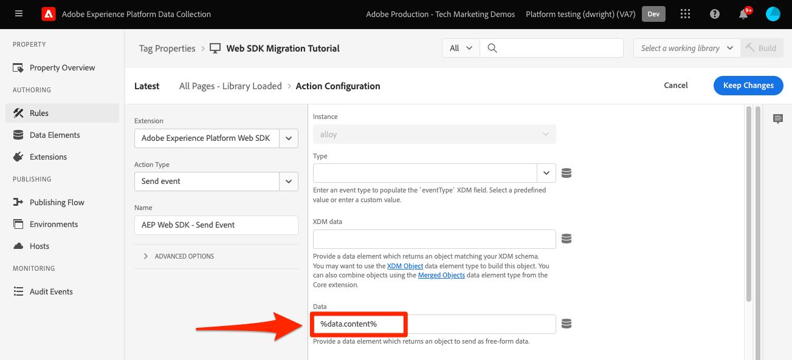
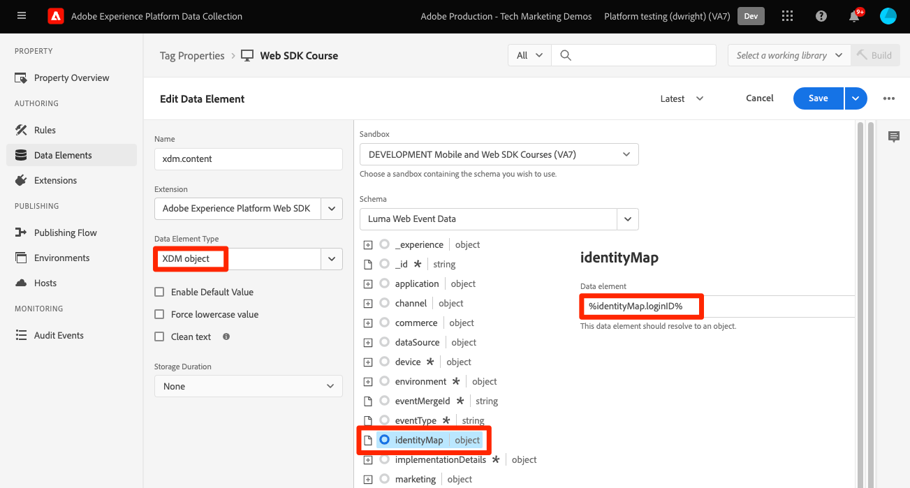

# Envoyer des paramètres à Target à l’aide du SDK Web Platform

Les mises en oeuvre de Target diffèrent d’un site web à l’autre en raison de l’architecture du site, des exigences de l’entreprise et des fonctionnalités utilisées. La plupart des implémentations de Target incluent la transmission de divers paramètres pour les informations contextuelles, les audiences et les recommandations de contenu.

Utilisons une page de détails de produit simple et une page de confirmation de commande pour démontrer les différences entre les bibliothèques lors de la transmission de paramètres à Target.

Prenez les deux exemples de pages suivants à l’aide d’at.js :

+++at.js sur une page Détails du produit :

```HTML
<!doctype html>
<html>
<head>
  <title>Product Details - Men's Shirt</title>
  <!--Target parameters -->
  <script>
    targetPageParams = function() {
      return {
        // Property token
        "at_property": "5a0fd9bb-67de-4b5a-0fd7-9cc09f50a58d",
        // Mbox parameters
        "pageName": "product detail",
        // Profile parameters
        "profile.gender": "male",
        "user.categoryId": "clothing",
        // Entity parameters for Target Recomendations
        "entity.id": "SKU-00001-LARGE",
        "entity.categoryId": "clothing,shirts",
        "entity.customEntity": "some value",
        "cartIds": "SKU-00002,SKU-00003",
        "excludedIds": "SKU-00001-SMALL",
        // Customer ID for cross-device profile synching and Customer Attributes
        "mbox3rdPartyId": "TT8675309",
      };
    };
  </script>
  <!--Target at.js library loaded asynchonously-->
  <script src="/libraries/at.js" async></script>
</head>
<body>
  <h1 id="title">Men's Large Shirt</h1>
  <p>SKU: SKU-00001-LARGE</p>
</body>
</html>
```

+++


+++at.js sur une page de confirmation de commande :

```HTML
<!doctype html>
<html>
<head>
  <title>Order Confirmation</title>-->
  <!--Target parameters -->
  <script>
    targetPageParams = function() {
      return {
        // Property token
        "at_property": "5a0fd9bb-67de-4b5a-0fd7-9cc09f50a58d",
        // Order confirmation parameters
        "orderId": "ABC123",
        "productPurchasedId": "SKU-00002,SKU-00003",
        "orderTotal": 1337.89,
        // Customer ID for cross-device profile synching and Customer Attributes
        "mbox3rdPartyId": "TT8675309",
      };
    };
  </script>
  <!--Target at.js library loaded asynchonously-->
  <script src="/libraries/at.js" async></script>
</head>
<body>
  <h1 id="title">Order Confirmation</h1>
  <p>Thank you for your order</p>
</body>
</html>
```

+++


## Synthèse du mapping des paramètres

Les paramètres Target de ces pages sont envoyés différemment à l’aide du SDK Web Platform. Il existe plusieurs façons de transférer des paramètres à Target à l’aide d’at.js :

- Défini sur `targetPageParams()` pour l’événement de chargement de page (utilisé dans les exemples de cette page).
- Défini sur `targetPageParamsAll()` pour toutes les requêtes Target sur la page.
- Envoyez les paramètres directement avec la fonction `getOffer()` pour un emplacement unique
- Envoyez les paramètres directement avec la fonction `getOffers()` fonction pour un ou plusieurs emplacements


Le SDK Web Platform offre un moyen unique et cohérent d’envoyer des données sans avoir besoin de fonctions supplémentaires. Tous les paramètres doivent être transmis dans la payload avec la variable `sendEvent` et se rangent dans deux catégories :

- Mappé automatiquement à partir du `xdm` objet
- Transmis manuellement à l’aide de la méthode `data.__adobe.target` objet

Le tableau ci-dessous décrit comment les exemples de paramètres seraient mappés à l’aide du SDK Web Platform :

| Exemple de paramètre at.js | Option SDK Web Platform | Notes |
| --- | --- | --- |
| `at_property` | S/O | Les jetons de propriété sont configurés dans la variable [datastream](https://experienceleague.adobe.com/docs/experience-platform/edge/datastreams/configure.html#target) et ne peuvent pas être définis dans la variable `sendEvent` appelez . |
| `pageName` | `xdm.web.webPageDetails.name` | Tous les paramètres de mbox Target doivent être transmis dans le cadre de la `xdm` et se conformer à un schéma à l’aide de la classe XDM ExperienceEvent. Les paramètres de mbox ne peuvent pas être transmis dans le cadre de `data` . |
| `profile.gender` | `data.__adobe.target.profile.gender` | Tous les paramètres de profil Target doivent être transmis dans le cadre de la `data` avec le préfixe `profile.` à mapper correctement. |
| `user.categoryId` | `data.__adobe.target.user.categoryId` | Paramètre réservé utilisé pour la fonction Affinité catégorielle de Target qui doit être transmis dans le cadre de la fonction `data` . |
| `entity.id` | `data.__adobe.target.entity.id` <br>OU<br> `xdm.productListItems[0].SKU` | Les ID d’entité sont utilisés pour les compteurs comportementaux de Target Recommendations. Ces identifiants d’entité peuvent être transmis dans le cadre de la variable `data` ou mappé automatiquement à partir du premier élément dans la variable `xdm.productListItems` si votre implémentation utilise ce groupe de champs. |
| `entity.categoryId` | `data.__adobe.target.entity.categoryId` | Les ID de catégorie d’entité peuvent être transmis dans le cadre de la variable `data` . |
| `entity.customEntity` | `data.__adobe.target.entity.customEntity` | Les paramètres d’entité personnalisés sont utilisés pour la mise à jour du catalogue de produits Recommendations. Ces paramètres personnalisés doivent être transmis dans le cadre du `data` . |
| `cartIds` | `data.__adobe.target.cartIds` | Utilisé pour les algorithmes de recommandations basés sur le panier de Target. |
| `excludedIds` | `data.__adobe.target.excludedIds` | Utilisé pour empêcher le renvoi d’ID d’entité spécifiques dans une conception de recommandations. |
| `mbox3rdPartyId` | Défini dans la variable `xdm.identityMap` objet | Utilisé pour synchroniser les profils Target sur les appareils et les attributs du client. L’espace de noms à utiliser pour l’ID de client doit être spécifié dans la variable [Configuration cible du flux de données](https://experienceleague.adobe.com/docs/experience-platform/edge/personalization/adobe-target/using-mbox-3rdpartyid.html). |
| `orderId` | `xdm.commerce.order.purchaseID` | Utilisé pour identifier une commande unique pour le suivi de conversion de Target. |
| `orderTotal` | `xdm.commerce.order.priceTotal` | Utilisé pour le suivi des totaux des commandes pour les objectifs de conversion et d’optimisation de Target. |
| `productPurchasedId` | `data.__adobe.target.productPurchasedId` <br>OU<br> `xdm.productListItems[0-n].SKU` | Utilisé pour le suivi des conversions Target et les algorithmes de recommandations. Reportez-vous à la section [paramètres d&#39;entité](#entity-parameters) pour plus d’informations. |
| `mboxPageValue` | `data.__adobe.target.mboxPageValue` | Utilisé pour le [notation personnalisée](https://experienceleague.adobe.com/docs/target/using/activities/success-metrics/capture-score.html) objectif de l’activité. |

{style=&quot;table-layout:auto&quot;}

## Paramètres personnalisés

Les paramètres de mbox personnalisés doivent être transmis en tant que données XDM avec la variable `sendEvent` . Il est important de s’assurer que le schéma XDM inclut tous les champs requis pour votre mise en oeuvre Target.

Exemple d’at.js avec `targetPageParams()`:

```JavaScript
targetPageParams = function() {
  return {
    "pageName": "product detail"
  };
};
```

Exemples JavaScript de SDK Web Platform utilisant `sendEvent` command :

>[!BEGINTABS]

>[!TAB JavaScript]

```JavaScript
alloy("sendEvent", {
  "xdm": {
    "web": {
      "webPageDetails": {
        // Other attributes included according to xdm schema
        "name": "product detail"
      }
    }
  }
});
```

>[!TAB Balises]

Dans les balises , utilisez d’abord une [!UICONTROL Objet XDM] élément de données à mapper au champ XDM :

{zoomable=&quot;yes&quot;}

Ensuite, incluez votre [!UICONTROL Objet XDM] dans votre [!UICONTROL Envoyer un événement] [!UICONTROL action] (multiple [!UICONTROL Objets XDM] peut être [fusionné](https://experienceleague.adobe.com/docs/experience-platform/tags/extensions/client/core/overview.html?lang=en#merged-objects)) :

{zoomable=&quot;yes&quot;}

>[!ENDTABS]


>[!NOTE]
>
>Parce que les paramètres de mbox personnalisés font partie de `xdm` vous devez mettre à jour les audiences, les activités ou les scripts de profil qui référencent ces paramètres de mbox à l’aide de leurs nouveaux noms. Voir [Mise à jour des audiences Target et des scripts de profil pour la compatibilité du SDK Web Platform](update-audiences.md) page de ce tutoriel pour plus d’informations.


## Paramètres de profil

Les paramètres de profil Target doivent être transmis sous la variable `data.__adobe.target` dans le SDK Web Platform `sendEvent` payload de commande.

Tout comme at.js, tous les paramètres de profil doivent également comporter le préfixe `profile.` pour que la valeur soit correctement stockée en tant qu’attribut de profil Target persistant. La réserve `user.categoryId` Le préfixe du paramètre de la fonctionnalité Affinité catégorielle de Target est `user.`.

Exemple d’at.js avec `targetPageParams()`:

```JavaScript
targetPageParams = function() {
  return {
    "profile.gender": "male",
    "user.categoryId": "clothing"
  };
};
```

Exemples de SDK Web Platform à l’aide de `sendEvent` command :

>[!BEGINTABS]

>[!TAB JavaScript]

```JavaScript
alloy("sendEvent", {
  "data": {
    "__adobe": {
      "target": {
        "profile.gender": "male",
        "user.categoryId": "clothing"
      }
    }
  }
});
```

>[!TAB Balises]

Dans les balises , commencez par créer un élément de données pour définir la variable `data.__adobe.target` objet :

{zoomable=&quot;yes&quot;}

Insérez ensuite votre objet de données dans votre [!UICONTROL Envoyer un événement] [!UICONTROL action] (multiple [!UICONTROL objet] peut être [fusionné](https://experienceleague.adobe.com/docs/experience-platform/tags/extensions/client/core/overview.html?lang=en#merged-objects)) :

{zoomable=&quot;yes&quot;}

>[!ENDTABS]

## Paramètres d’entité

Les paramètres d’entité sont utilisés pour transmettre des données comportementales et des informations de catalogue supplémentaires pour Target Recommendations. Tous [paramètres d&#39;entité](https://experienceleague.adobe.com/docs/target/using/recommendations/entities/entity-attributes.html) Les solutions prises en charge par at.js sont également prises en charge par le SDK Web de Platform. Tout comme les paramètres de profil, tous les paramètres d’entité doivent être transmis sous la variable `data.__adobe.target` dans le SDK Web Platform `sendEvent` payload de commande.

Les paramètres d’entité d’un élément spécifique doivent comporter le préfixe `entity.` pour une capture de données correcte. La réserve `cartIds` et `excludedIds` Les paramètres des algorithmes de recommandations ne doivent pas comporter de préfixe et la valeur de chacun d’eux doit contenir une liste d’identifiants d’entité séparés par des virgules.

Exemple d’at.js avec `targetPageParams()`:

```JavaScript
targetPageParams = function() {
  return {
    "entity.id": "SKU-00001-LARGE",
    "entity.categoryId": "clothing,shirts",
    "entity.customEntity": "some value",
    "cartIds": "SKU-00002,SKU-00003",
    "excludedIds": "SKU-00001-SMALL"
  };
};
```

Exemples de SDK Web Platform à l’aide de `sendEvent` command :

>[!BEGINTABS]

>[!TAB JavaScript]

```JavaScript
alloy("sendEvent", {
  "data": {
    "__adobe": {
      "target": {
        "entity.id": "SKU-00001-LARGE",
        "entity.categoryId": "clothing,shirts",
        "entity.customEntity": "some value",
        "cartIds": "SKU-00002,SKU-00003",
        "excludedIds": "SKU-00001-SMALL"
      }
    }
  }
});
```

>[!TAB Balises]

Dans les balises , commencez par créer un élément de données pour définir la variable `data.__adobe.target` objet :

{zoomable=&quot;yes&quot;}

Insérez ensuite votre objet de données dans votre [!UICONTROL Envoyer un événement] [!UICONTROL action] (multiple [!UICONTROL objet] peut être [fusionné](https://experienceleague.adobe.com/docs/experience-platform/tags/extensions/client/core/overview.html?lang=en#merged-objects)) :

{zoomable=&quot;yes&quot;}

>[!ENDTABS]

>[!NOTE]
>
>Si la variable `commerce` Le groupe de champs est utilisé et la variable `productListItems` est inclus dans la charge utile XDM, puis le premier `SKU` est mappée sur la valeur de ce tableau. `entity.id` aux fins de l’incrémentation d’une consultation de produit.


## Paramètres d’achat

Les paramètres d’achat sont transmis sur une page de confirmation de commande après une commande réussie et sont utilisés pour les objectifs de conversion et d’optimisation de Target. Avec une implémentation du SDK Web Platform, ces paramètres sont automatiquement mappés à partir des données XDM transmises dans le cadre de `commerce` groupe de champs.

Exemple d’at.js avec `targetPageParams()`:

```JavaScript
targetPageParams = function() {
  return {
    "orderId": "ABC123",
    "productPurchasedId": "SKU-00002,SKU-00003"
    "orderTotal": 1337.89
  };
};
```

Les informations d’achat sont transmises à Target lorsque la variable `commerce` groupe de champs possède `purchases.value` défini sur `1`. L’identifiant de commande et le total de commande sont automatiquement mappés à partir de la variable `order` . Si la variable `productListItems` est présent, puis le `SKU` Les valeurs sont utilisées pour `productPurchasedId`.

Exemples de SDK Web Platform à l’aide de `sendEvent` command :

>[!BEGINTABS]

>[!TAB JavaScript]

```JavaScript
alloy("sendEvent", {
  "xdm": {
    "commerce": {
      "order": {
        "purchaseID": "ABC123",
        "priceTotal": 1337.89
      },
      "purchases": {
        "value": 1
      }
    },
    "productListItems": [{
      "SKU": "SKU-00002"
    }, {
      "SKU": "SKU-00003"
    }]
  }
});
```

>[!TAB Balises]

Dans les balises , utilisez d’abord une [!UICONTROL Objet XDM] élément de données à mapper aux champs XDM :

{zoomable=&quot;yes&quot;}

Ensuite, incluez votre [!UICONTROL Objet XDM] dans votre [!UICONTROL Envoyer un événement] [!UICONTROL action] (multiple [!UICONTROL Objets XDM] peut être [fusionné](https://experienceleague.adobe.com/docs/experience-platform/tags/extensions/client/core/overview.html?lang=en#merged-objects)) :

{zoomable=&quot;yes&quot;}

>[!ENDTABS]


>[!NOTE]
>
>Le `productPurchasedId` peut également être transmise sous la forme d’une liste d’identifiants d’entité séparés par des virgules, sous `data` .


## ID de client (mbox3rdPartyId)

Target permet la synchronisation des profils entre appareils et systèmes à l’aide d’un seul ID de client. Avec at.js, cette variable peut être définie comme la variable `mbox3rdPartyId` dans la requête Target ou en tant que premier ID de client envoyé au service Identity Experience Cloud. Contrairement à at.js, une implémentation du SDK Web Platform vous permet de spécifier l’ID de client à utiliser comme `mbox3rdPartyId` s’il y en a plusieurs. Par exemple, si votre entreprise possède un ID de client global et des ID de client distincts pour différents secteurs d’activité, vous pouvez configurer l’ID que Target doit utiliser.

Il existe quelques étapes pour configurer la synchronisation des identifiants pour les cas d’utilisation de Target sur plusieurs appareils et des attributs du client :

1. Créez un **[!UICONTROL namespace d’identité]** pour l’ID de client dans **[!UICONTROL Identités]** écran Collecte de données ou plateforme
1. Assurez-vous que la variable **[!UICONTROL alias]** dans Attributs du client correspond à la variable **[!UICONTROL symbole d’identité]** de votre espace de noms
1. Spécifiez la variable **[!UICONTROL symbole identy]** comme la propriété **[!UICONTROL Espace de noms des identifiants tiers de Target]** dans la configuration Target de la banque de données
1. Exécuter une `sendEvent` à l’aide de la commande `identityMap` groupe de champs

Exemple d’at.js avec `targetPageParams()`:

```JavaScript
targetPageParams = function() {
  return {
    "mbox3rdPartyId": "TT8675309"
  };
};
```

Exemples de SDK Web Platform à l’aide de `sendEvent` command :

>[!BEGINTABS]

>[!TAB JavaScript]

```JavaScript
alloy("sendEvent", {
  "xdm": {
    "identityMap": {
      "GLOBAL_CUSTOMER_ID": [{
        "id": "TT8675309",
        "authenticatedState": "authenticated"
      }]
    }
  }
});
```

>[!TAB Balises]

Le [!UICONTROL ID] value, [!UICONTROL État authentifié] et [!UICONTROL Espace de noms] sont capturés dans une [!UICONTROL Mappage d’identités] élément de données :
{zoomable=&quot;yes&quot;}

Le [!UICONTROL Mappage d’identités] L’élément de données est ensuite utilisé pour définir la variable [!UICONTROL identityMap] dans le champ [!UICONTROL Objet XDM] élément de données :
{zoomable=&quot;yes&quot;}

Le [!UICONTROL Objet XDM] est ensuite inclus dans la variable [!UICONTROL Envoyer un événement] action d’une règle :

{zoomable=&quot;yes&quot;}

Dans le service Adobe Target de votre flux de données, veillez à définir la variable [!UICONTROL Espace de noms des identifiants tiers de Target] au même espace de noms utilisé dans la variable [!UICONTROL Mappage d’identités] élément de données :
{zoomable=&quot;yes&quot;}

>[!ENDTABS]

## Exemple de SDK Web Platform

Maintenant que vous comprenez comment les différents paramètres Target sont mappés à l’aide du SDK Web Platform, nos deux exemples de pages peuvent être migrés d’at.js vers le SDK Web Platform comme illustré ci-dessous. Les exemples de pages sont les suivants :

- Fragment de code de prémasquage de Target pour une implémentation de bibliothèque asynchrone
- Le code de base du SDK Web Platform
- Bibliothèque JavaScript du SDK Web Platform
- A `configure` pour initialiser la bibliothèque
- A `sendEvent` pour envoyer des données et demander le rendu du contenu Target

+++SDK Web sur une page Détails du produit :

```HTML
<!doctype html>
<html>
<head>
  <title>Product Details - Men's Shirt</title>

  <!--Prehiding snippet for Target with asynchronous Web SDK deployment-->
  <script>
    !function(e,a,n,t){var i=e.head;if(i){
    if (a) return;
    var o=e.createElement("style");
    o.id="alloy-prehiding",o.innerText=n,i.appendChild(o),setTimeout(function(){o.parentNode&&o.parentNode.removeChild(o)},t)}}
    (document, document.location.href.indexOf("mboxEdit") !== -1, ".body { opacity: 0 !important }", 3000);
  </script>

  <!--Platform Web SDK base code-->
  <script>
    !function(n,o){o.forEach(function(o){n[o]||((n.__alloyNS=n.__alloyNS||
    []).push(o),n[o]=function(){var u=arguments;return new Promise(
    function(i,l){n[o].q.push([i,l,u])})},n[o].q=[])})}
    (window,["alloy"]);
  </script>

  <!--Platform Web SDK loaded asynchonously. Change the src to use the latest supported version.-->
  <script src="https://cdn1.adoberesources.net/alloy/2.6.4/alloy.min.js" async></script>

  <!--Configure Platform Web SDK and send event-->
  <script>
    alloy("configure", {
      "edgeConfigId": "ebebf826-a01f-4458-8cec-ef61de241c93",
      "orgId":"ADB3LETTERSANDNUMBERS@AdobeOrg"
    });
    alloy("sendEvent", {
      "renderDecisions": true,
      "xdm": {
        "identityMap": {
          "GLOBAL_CUSTOMER_ID": [{
            "id": "TT8675309",
            "authenticatedState": "authenticated"
          }]
        },
        "web": {
          "webPageDetails": {
            // Other attributes included according to XDM schema
            "pageName": "product detail"
          }
        }
      },
      "data": {
        "__adobe": {
          "target": {
            "profile.gender": "male",
            "user.categoryId": "clothing",
            "entity.id": "SKU-00001-LARGE",
            "entity.categoryId": "clothing,shirts",
            "entity.customEntity": "some value",
            "cartIds": "SKU-00002,SKU-00003",
            "excludedIds": "SKU-00001-SMALL"
          }
        }
      }
    });
  </script>
</head>
<body>
  <h1 id="title">Men's Large Shirt</h1>
  <p>SKU: SKU-00001-LARGE</p>
</body>
</html>
```

+++

+++SDK Web sur une page de confirmation de commande :

```HTML
<!doctype html>
<html>
<head>
  <title>Order Confirmation</title>


  <!--Prehiding snippet for Target with asynchronous Web SDK deployment-->

  <script>
    !function(e,a,n,t){var i=e.head;if(i){
    if (a) return;
    var o=e.createElement("style");
    o.id="alloy-prehiding",o.innerText=n,i.appendChild(o),setTimeout(function(){o.parentNode&&o.parentNode.removeChild(o)},t)}}
    (document, document.location.href.indexOf("mboxEdit") !== -1, ".body { opacity: 0 !important }", 3000);
  </script>

  <!--Platform Web SDK base code-->

  <script>
    !function(n,o){o.forEach(function(o){n[o]||((n.__alloyNS=n.__alloyNS||
    []).push(o),n[o]=function(){var u=arguments;return new Promise(
    function(i,l){n[o].q.push([i,l,u])})},n[o].q=[])})}
    (window,["alloy"]);
  </script>
  <!--Platform Web SDK loaded asynchonously. Change the src to use the latest supported version.-->
  <script src="https://cdn1.adoberesources.net/alloy/2.6.4/alloy.min.js" async></script>

  <!--Configure Platform Web SDK and send event-->
  <script>
    alloy("configure", {
      "edgeConfigId": "ebebf826-a01f-4458-8cec-ef61de241c93",
      "orgId":"ADB3LETTERSANDNUMBERS@AdobeOrg"
    });
    alloy("sendEvent", {
      "xdm": {
        "identityMap": {
          "GLOBAL_CUSTOMER_ID": [{
            "id": "TT8675309",
            "authenticatedState": "authenticated"
          }]
        },
        "commerce": {
          "order": {
            "purchaseID": "ABC123",
            "priceTotal": 1337.89
          },
          "purchases": {
            "value": 1
          }
        },
        "productListItems": [{
          "SKU": "SKU-00002"
        }, {
          "SKU": "SKU-00003"
        }]
      }
    });
  </script>
</head>
<body>
  <h1 id="title">Order Confirmation</h1>
  <p>Thank you for your order</p>
</body>
</html>
```

+++

Ensuite, apprenez à [suivi des événements de conversion Target](track-events.md) avec le SDK Web Platform.

>[!NOTE]
>
>Nous nous engageons à vous aider à réussir la migration de Target d’at.js vers le SDK Web. Si vous rencontrez des obstacles lors de votre migration ou si vous pensez qu’il manque des informations essentielles dans ce guide, faites-le nous savoir en publiant sur [cette discussion communautaire](https://experienceleaguecommunities.adobe.com/t5/adobe-experience-platform-data/tutorial-discussion-migrate-target-from-at-js-to-web-sdk/m-p/575587#M463).
