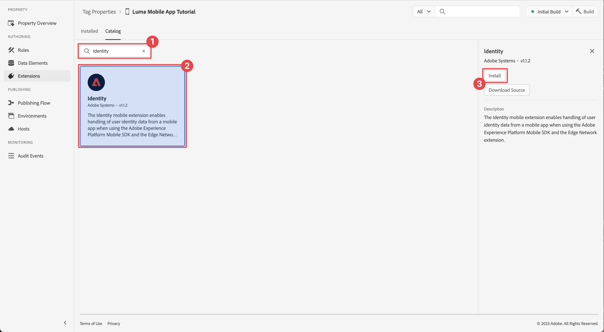

# Configuration d’une propriété de balise

Découvrez comment configurer une propriété de balise dans le [!UICONTROL Collecte de données] .

Les balises dans Adobe Experience Platform Launch représentent la nouvelle génération des fonctionnalités de gestion des balises dʼAdobe. Les balises offrent aux clients un moyen simple de déployer et gérer des balises d’analyse, de marketing et de publicité nécessaires pour offrir des expériences client pertinentes. En savoir plus sur [Balises](https://experienceleague.adobe.com/docs/experience-platform/tags/home.html?lang=fr) dans la documentation du produit.

## Conditions préalables

Pour terminer la leçon, vous devez disposer des autorisations nécessaires pour créer une propriété de balise. Il est également utile d’avoir une compréhension de base des balises.

>[!NOTE]
>
> Le platform launch (côté client) est désormais [tags](https://experienceleague.adobe.com/docs/experience-platform/tags/home.html?lang=fr)

## Objectifs d&#39;apprentissage

Dans cette leçon, vous allez :

* Installez et configurez les extensions de balise mobile.
* Générez les instructions d’installation du SDK.

## Configuration initiale

1. Créez une nouvelle propriété de balise mobile dans l’interface de collecte de données :
   1. Sélectionner **[!UICONTROL Balises]** dans le volet de navigation de gauche.
   1. Sélectionnez **[!UICONTROL Nouvelle propriété]**
      .
   1. Pour le **[!UICONTROL Nom]**, saisissez `Luma Mobile App Tutorial`.
   1. Pour le **[!UICONTROL Plateforme]**, sélectionnez **[!UICONTROL Mobile]**.
   1. Sélectionnez **[!UICONTROL Enregistrer]**.

      

      >[!NOTE]
      >
      > Les paramètres de consentement par défaut pour les implémentations de sdk mobile basées sur les périphériques, comme celle que vous effectuez dans ce tutoriel, proviennent de la [!UICONTROL Extension de consentement] et non le [!UICONTROL Privacy] dans la configuration de la propriété de balise. Vous allez ajouter et configurer l’extension Consentement plus loin dans cette leçon. Pour plus d’informations, voir [la documentation](https://developer.adobe.com/client-sdks/documentation/privacy-and-gdpr/).

1. Ouvrez la nouvelle propriété.
1. Créer une bibliothèque :

   1. Accédez à **[!UICONTROL Flux de publication]** dans le volet de navigation de gauche.
   1. Sélectionner **[!UICONTROL Ajouter une bibliothèque]**.

      

   1. Pour le **[!UICONTROL Nom]**, saisissez `Initial Build`.
   1. Pour le **[!UICONTROL Environnement]**, sélectionnez **[!UICONTROL Développement (développement)]**.
   1. Sélectionner   **[!UICONTROL Ajouter toutes les ressources modifiées]**.
   1. Sélectionner **[!UICONTROL Enregistrement et création pour le développement]**.

      

   1. Enfin, sélectionnez **[!UICONTROL Version initiale]** en tant que bibliothèque de travail du **[!UICONTROL Sélectionner une bibliothèque de travail]** .
      
1. Vérifier les extensions :

   1. Assurez-vous que **[!UICONTROL Version initiale]** est sélectionné comme bibliothèque par défaut.

   1. Sélectionnez **[!UICONTROL Extensions]** dans le rail de gauche.

   1. Sélectionnez la variable **[!UICONTROL Installé]** .

      La variable [!UICONTROL Mobile Core] et [!UICONTROL Profil] Les extensions doivent être préinstallées.

      

## Configuration d’extension

1. Vérifiez que vous êtes dans **[!UICONTROL Extensions]** dans la propriété de votre application mobile.

1. Sélectionner **[!UICONTROL Catalogue]**.

   

1. Utilisez la variable  **[!UICONTROL Rechercher]** du champ Rechercher **Identité** extension .

   1. Recherchez `Identity`.

   2. Sélectionnez la variable **[!UICONTROL Identité]** extension .

   3. Sélectionner **[!UICONTROL Installer]**.

      

   Cette extension ne nécessite aucune configuration supplémentaire.

1. Utilisez la variable  **[!UICONTROL Rechercher]** pour rechercher et installer le champ **Assurance AEP** extension .

   Cette extension ne nécessite aucune configuration supplémentaire.

1. Utilisez la variable  **[!UICONTROL Rechercher]** pour rechercher et installer le champ **Consentement** extension . Dans l’écran de configuration :

   1. Sélectionner **[!UICONTROL En attente]**. Dans ce tutoriel, vous gérez davantage le consentement dans l’application. En savoir plus sur l’extension Consent dans [la documentation](https://developer.adobe.com/client-sdks/documentation/consent-for-edge-network/).
   1. Sélectionner **[!UICONTROL Enregistrer dans la bibliothèque]**.

      

1. Utilisez la variable  **[!UICONTROL Rechercher]** pour rechercher et installer le champ **Adobe Experience Platform Edge Network** extension .

   1. Dans **[!UICONTROL Datastreams]** sélectionnez l’option **[!UICONTROL Datastream]** que vous avez créé dans le [étape précédente](create-datastream.md) pour chacun des environnements, par exemple **[!UICONTROL Application mobile Luma]**.

   1. Spécifiez la variable **[!UICONTROL Domaine du réseau Edge]** dans **[!UICONTROL Configuration des domaines]**. Le domaine réseau Edge est le nom de votre environnement de test, suivi de `data.adobedc.net`, par exemple `techmarketingdemos.data.adobedc.net`.

   1. Dans la **[!UICONTROL Enregistrer dans la bibliothèque]** menu, sélectionnez **[!UICONTROL Enregistrer dans la bibliothèque et créer]**.

      

Votre bibliothèque est créée pour les nouvelles extensions et configurations. Une version réussie est indiquée par une ● dans le **[!UICONTROL Version initiale]** bouton .

## Instructions d’installation du SDK Generate

1. Sélectionner **[!UICONTROL Environnements]** dans le rail de gauche.

1. Sélectionnez la variable **[!UICONTROL Développement]** icône d’installation  .

   

1. Dans le [!UICONTROL Instructions d’installation mobile] , sélectionnez **[!UICONTROL iOS]** .

1. Vous pouvez copier  les instructions pour configurer votre projet à l’aide de CocoaPods. Les CocoaPods sont utilisés pour gérer les versions et téléchargements de SDK. Pour en savoir plus, consultez la section [documentation](https://cocoapods.org/).

   Les instructions d’installation vous fournissent un bon point de départ pour la mise en oeuvre. Vous trouverez des informations supplémentaires [here](https://developer.adobe.com/client-sdks/documentation/getting-started/get-the-sdk/).

1. Sélectionnez la variable **[!UICONTROL Swift]** sous-onglet **[!UICONTROL Ajout d’un code d’initialisation]**. Ce bloc de code indique comment importer les SDK requis et enregistrer les extensions au lancement.

1. Copier  la valeur **[!UICONTROL Identifiant de fichier d’environnement]** et le stocker à un endroit où vous en aurez besoin plus tard. Cet identifiant unique pointe vers votre environnement de développement. Chaque environnement (production, évaluation, développement) possède sa propre valeur d’identifiant unique.

   

>[!NOTE]
>
>Les instructions d’installation doivent être considérées comme un point de départ et non comme une documentation définitive. Vous trouverez les dernières versions du SDK et des exemples de code dans la [documentation](https://developer.adobe.com/client-sdks/documentation/).

>[!INFO]
>
>Pour le reste de ce tutoriel, vous êtes **not** à l’aide des instructions CocoaPods , mais regardez une configuration native basée sur un package Swift.

## Architecture des balises mobiles

Si vous connaissez la version web des balises, anciennement Launch, il est important de comprendre les différences sur mobile.

* Sur le Web, une propriété de balise est rendue dans JavaScript, qui est ensuite (généralement) hébergée dans le cloud. Ce fichier JavaScript est référencé directement dans le site web.

* Dans une propriété de balise mobile, les règles et les configurations sont rendues dans des fichiers JSON hébergés dans le cloud. Les fichiers JSON sont téléchargés et lus par l’extension Mobile Core dans l’application mobile. Les extensions sont des SDK distincts qui fonctionnent ensemble. Si vous ajoutez une extension à votre propriété de balise, vous devez également mettre à jour l’application. Si vous modifiez un paramètre d’extension ou créez une règle, ces modifications sont répercutées dans l’application une fois que vous avez publié la bibliothèque de balises mise à jour.

>[!SUCCESS]
>
>Vous devez maintenant utiliser une propriété de balise mobile dans le reste de ce tutoriel. Merci d’investir votre temps à apprendre sur le SDK Adobe Experience Platform Mobile. Si vous avez des questions, souhaitez partager des commentaires généraux ou avez des suggestions sur le contenu futur, partagez-les à ce sujet. [Article de discussion de la communauté Experience League](https://experienceleaguecommunities.adobe.com/t5/adobe-experience-platform-launch/tutorial-discussion-implement-adobe-experience-cloud-in-mobile/td-p/443796)

Suivant : **[Installation des SDK](install-sdks.md)**
