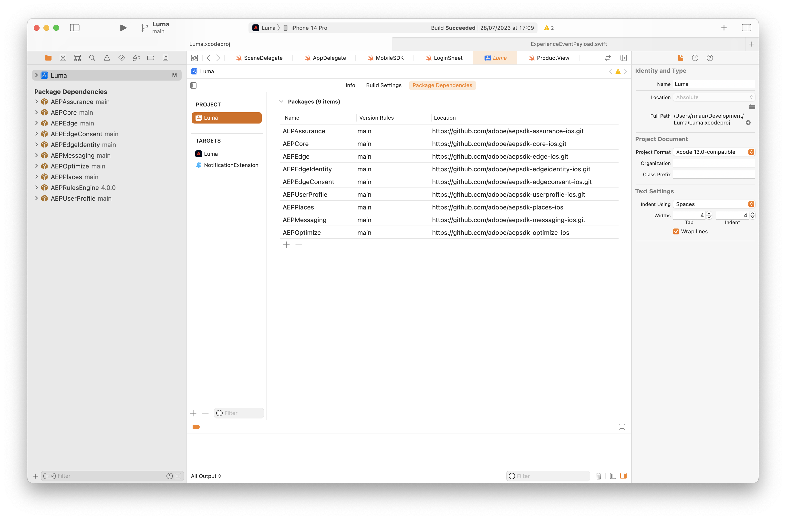

# Installation des SDK Adobe Experience Platform Mobile

Découvrez comment mettre en oeuvre le SDK Mobile Adobe Experience Platform dans une application mobile.

## Conditions préalables

* La bibliothèque de balises a été créée avec succès avec les extensions décrites dans la section [leçon précédente](configure-tags.md).
* Identifiant du fichier d’environnement de développement du [Instructions d’installation mobile](configure-tags.md#generate-sdk-install-instructions).
* Téléchargé, vide [exemple d’application](https://github.com/Adobe-Marketing-Cloud/Luma-iOS-Mobile-App{target="_blank"}).
* Expérience avec [XCode](https://developer.apple.com/xcode/{target="_blank"}).

## Objectifs d&#39;apprentissage

Dans cette leçon, vous allez :

* Ajoutez les SDK requis à votre projet à l’aide du gestionnaire de modules Swift.
* Enregistrez les extensions.

>[!NOTE]
>
>Dans une mise en oeuvre d’applications mobiles, les termes &quot;extensions&quot; et &quot;SDK&quot; sont presque interchangeables.

## Swift Package Manager

Au lieu d’utiliser CocoaPods et un fichier Pod (comme indiqué dans les instructions d’installation mobile), voir [Instructions d’installation du SDK Generate](./configure-tags.md#generate-sdk-install-instructions)), vous ajoutez des modules individuels à l’aide du gestionnaire de modules Swift natif de Xcode.

Dans Xcode, utilisez **[!UICONTROL Fichier]** > **[!UICONTROL Ajouter des packages...]** et installez tous les packages répertoriés dans le tableau ci-dessous. Sélectionnez le lien du package dans le tableau pour obtenir l&#39;URL complète du package spécifique.

| Package | Description |
|---|---|
| [AEP Core](https://github.com/adobe/aepsdk-core-ios.git) | La variable `AEPCore`, `AEPServices`, et `AEPIdentity` Les extensions représentent la base du SDK Adobe Experience Platform. Chaque application utilisant le SDK doit les inclure. Ces modules contiennent un ensemble commun de fonctionnalités et de services requis par toutes les extensions du SDK.<br/>`AEPCore` contient l’implémentation de Event Hub. Event Hub est le mécanisme utilisé pour diffuser des événements entre l’application et le SDK. Event Hub est également utilisé pour le partage de données entre les extensions.<br/>`AEPServices` fournit plusieurs implémentations réutilisables nécessaires à la prise en charge de la plateforme, notamment la mise en réseau, l’accès au disque et la gestion de base de données.<br/>`AEPIdentity` met en oeuvre l’intégration avec les services Adobe Experience Platform Identity.<br/>`AEPSignal` représente l’extension Signal du SDK Adobe Experience Platform qui permet aux marketeurs d’envoyer un &quot;signal&quot; à leurs applications afin d’envoyer des données à des destinations externes ou d’ouvrir des URL.<br/>`AEPLifecycle` représente l’extension Lifecycle du SDK Adobe Experience Platform qui permet de collecter les mesures de cycle de vie des applications, telles que les informations d’installation ou de mise à niveau de l’application, les informations de lancement et de session de l’application, les informations sur le périphérique et toute donnée contextuelle supplémentaire fournie par le développeur de l’application. |
| [AEP Edge](https://github.com/adobe/aepsdk-edge-ios.git) | L’extension mobile Adobe Experience Platform Edge Network vous permet d’envoyer des données à Adobe Edge Network à partir d’une application mobile. Cette extension vous permet d’implémenter les fonctionnalités de Adobe Experience Cloud de manière plus robuste, de servir plusieurs solutions d’Adobe par le biais d’un seul appel réseau et de transférer simultanément ces informations à Adobe Experience Platform.<br/>L’extension mobile Edge Network est une extension du SDK Adobe Experience Platform qui requiert le `AEPCore` et `AEPServices` les extensions pour la gestion des événements, ainsi que la variable `AEPEdgeIdentity` pour récupérer les identités, telles qu’ECID. |
| [AEP Edge Identity](https://github.com/adobe/aepsdk-edgeidentity-ios.git) | L’extension mobile AEP Edge Identity permet de gérer les données d’identité utilisateur d’une application mobile lors de l’utilisation du SDK Adobe Experience Platform et de l’extension Edge Network. |
| [Consentement AEP Edge](https://github.com/adobe/aepsdk-edgeconsent-ios.git) | L’extension mobile AEP Consent Collection permet la collecte des préférences de consentement de l’application mobile lors de l’utilisation du SDK Adobe Experience Platform et de l’extension Edge Network. |
| [Profil utilisateur AEP](https://github.com/adobe/aepsdk-userprofile-ios.git) | L’extension mobile Profil utilisateur Adobe Experience Platform est une extension permettant de gérer les profils utilisateur pour le SDK Adobe Experience Platform. |
| [Places AEP](https://github.com/adobe/aepsdk-places-ios) | L’extension Adobe Experience Platform Places est une extension du SDK Adobe Experience Platform Swift. L’extension AEPPlaces vous permet de suivre les événements de géolocalisation tels que définis dans l’interface utilisateur d’Adobe Places et dans les règles Adobe Launch. |
| [Messagerie AEP](https://github.com/adobe/aepsdk-messaging-ios.git) | L’extension de messagerie AEP est une extension du SDK Adobe Experience Platform Swift. L’extension de messagerie AEP vous permet d’envoyer des jetons de notification push et des commentaires de clic publicitaire de notification push à Adobe Experience Platform. |
| [Optimisation AEP](https://github.com/adobe/aepsdk-optimize-ios) | L’extension AEP Optimize fournit des API pour activer les workflows de personnalisation en temps réel dans les SDK Adobe Experience Platform Mobile à l’aide d’Adobe Target ou de Adobe Journey Optimizer Offer Decisioning. Cela nécessite `AEPCore` et `AEPEdge` extensions pour envoyer des événements de requête de personnalisation au réseau Experience Edge. |
| [Assurance AEP](https://github.com/adobe/aepsdk-assurance-ios.git) | Assurance (alias Griffon) est un nouveau produit innovant qui vous aide à inspecter, à tester, à simuler et à valider la manière dont vous collectez des données ou diffusez des expériences dans votre application mobile. |


Après avoir installé tous les packages, votre code Xcode **[!UICONTROL Dépendances de modules]** L’écran doit se présenter comme suit :




## Importation d’extensions

Dans Xcode dans la source pour **[!UICONTROL AppDelegate]** et **[!UICONTROL MobileSDK]**, ajoutez les imports suivants.

```swift
import AEPCore
import AEPServices
import AEPIdentity
import AEPSignal
import AEPLifecycle
import AEPEdge
import AEPEdgeIdentity
import AEPEdgeConsent
import AEPUserProfile
import AEPPlaces
import AEPMessaging
import AEPOptimize
import AEPAssurance
```

## Mettre à jour AppDelegate

Dans **AppDelegate**,

1. Définissez la variable `@AppStorage` valeur pour `environmentFileId` à la valeur d’identifiant de fichier d’environnement de développement que vous avez récupérée à partir des balises à l’étape 6 de la section [Instructions d’installation du SDK Generate](configure-tags.md#generate-sdk-install-instructions).

   ```swift
   @AppStorage("environmentFileId") private var environmentFileId = "b5cbd1a1220e/1857ef6cacb5/launch-2594f26b23cd-development"
   ```

1. Ajoutez le code mis en surbrillance suivant au `application(_, didFinishLaunchingWithOptions)` de la fonction

   ```swift {highlight="10-39"}
   func application(_ application: UIApplication, didFinishLaunchingWithOptions launchOptions: [UIApplication.LaunchOptionsKey: Any]?) -> Bool {
   
       UNUserNotificationCenter.current().delegate = self
   
       // step-init-start
       MobileCore.setLogLevel(.trace)
       let appState = application.applicationState;
   
       let extensions = [
           AEPIdentity.Identity.self,
           Lifecycle.self,
           Signal.self,
           Edge.self,
           AEPEdgeIdentity.Identity.self,
           Consent.self,
           UserProfile.self,
           Places.self,
           Messaging.self,
           Optimize.self,
           Assurance.self
       ]
   
       MobileCore.registerExtensions(extensions, {
           // Use the environment file id assigned to this application via Adobe Experience Platform Data Collection
           Logger.aepMobileSDK.info("Luma - using mobile config: \(self.environmentFileId)")
           MobileCore.configureWith(appId: self.environmentFileId)
   
           // set this to false or comment it when deploying to TestFlight (default is false),
           // set this to true when testing on your device.
           MobileCore.updateConfigurationWith(configDict: ["messaging.useSandbox": true])
           if appState != .background {
               // only start lifecycle if the application is not in the background
               MobileCore.lifecycleStart(additionalContextData: nil)
           }
   
           // assume unknown, adapt to your needs.
           MobileCore.setPrivacyStatus(.unknown)
   
           // update version and build
           Logger.configuration.info("Luma - Updating version and build number...")
           SettingsBundleHelper.setVersionAndBuildNumber()
       })
   
       // register push notification
       registerForPushNotifications(application: application)
   
       // set up core location
       let locationManager = LocationManager()
       locationManager.requestAuthorisation()
   
       return true
   }
   ```

Le code ci-dessus effectue les opérations suivantes :

1. Enregistre les extensions requises.
1. Configure MobileCore et d’autres extensions pour utiliser la configuration de la propriété de balise.
1. Active la journalisation de débogage. Vous trouverez plus de détails et d’options dans la section [Documentation du SDK Mobile Adobe Experience Platform](https://developer.adobe.com/client-sdks/documentation/getting-started/enable-debug-logging/).

>[!IMPORTANT]
>
>Veillez à mettre à jour `MobileCore.configureWith(appId: self.environmentFileId)` avec la propriété `appId` en fonction de la variable `environmentFileId` à partir de l’environnement de balises pour lequel vous créez (développement, évaluation ou production).
>

>[!SUCCESS]
>
>Vous avez maintenant installé les packages nécessaires et mis à jour votre projet afin d’enregistrer correctement les extensions de SDK Mobile Adobe Experience Platform requises que vous allez utiliser pour le reste du tutoriel.<br/>Merci d’investir votre temps à apprendre sur le SDK Adobe Experience Platform Mobile. Si vous avez des questions, souhaitez partager des commentaires généraux ou avez des suggestions sur le contenu futur, partagez-les à ce sujet. [Article de discussion de la communauté Experience League](https://experienceleaguecommunities.adobe.com/t5/adobe-experience-platform-launch/tutorial-discussion-implement-adobe-experience-cloud-in-mobile/td-p/443796)

Suivant : **[Configuration d’Assurance](assurance.md)**
