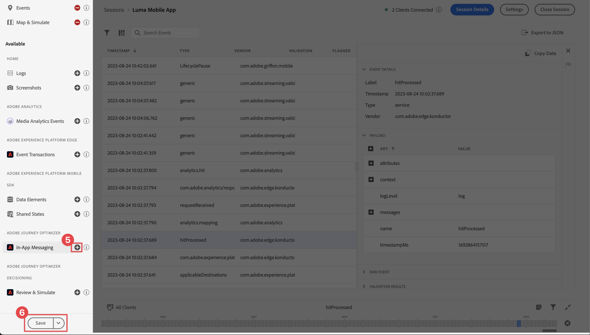
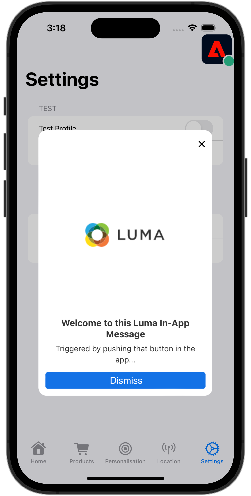

# Messagerie in-app Journey Optimizer

Découvrez comment créer des messages in-app pour les applications mobiles avec le SDK Mobile Platform et Journey Optimizer.

Journey Optimizer vous permet de créer des campagnes pour envoyer des messages in-app aux audiences ciblées. Avant d’envoyer des messages in-app avec Journey Optimizer, vous devez vous assurer que les configurations et intégrations appropriées sont en place. Pour comprendre le flux de données de la messagerie in-app dans Journey Optimizer, reportez-vous à la section [la documentation](https://experienceleague.adobe.com/docs/journey-optimizer/using/in-app/inapp-configuration.html?lang=en).

>[!NOTE]
>
>Cette leçon est facultative et s’applique uniquement aux utilisateurs de Journey Optimizer qui souhaitent envoyer des messages in-app.


## Conditions préalables

* Création et exécution de l’application avec les SDK installés et configurés.
* Accès à Journey Optimizer et autorisations suffisantes, comme décrit [here](https://experienceleague.adobe.com/docs/journey-optimizer/using/configuration/configuration-message/push-config/push-configuration.html?lang=en). Vous avez également besoin d’une autorisation suffisante pour accéder aux fonctionnalités Journey Optimizer suivantes.
   * Gestion des campagnes.
* Compte de développeur Apple payant disposant d’un accès suffisant pour créer des certificats, identifiants et clés.
* Appareil ou simulateur iOS physique à tester.
* Identifiant d’application enregistré avec service de notification push Apple
* Ajout des informations d’identification push de votre application dans Data Collection
* Extension des balises Journey Optimizer installées
* Mise en oeuvre de Journey Optimizer dans l’application


## Objectifs d&#39;apprentissage

Dans cette leçon, vous allez

* Enregistrez l’ID d’application avec le service Apple Push Notification (APN).
* Créez une surface d’application dans AJO.
* Installez et configurez l’extension de balise Journey Optimizer.
* Mettez à jour votre application pour inclure l’extension de balise Journey Optimizer.
* Validez la configuration dans Assurance.
* Définissez votre propre campagne et votre propre expérience de message in-app dans Journey Optimizer.
* Envoyez votre propre message in-app depuis l’application.

## Configuration

>[!TIP]
>
>Si vous avez déjà configuré votre environnement dans le cadre de la [Messagerie push Journey Optimizer](journey-optimizer-push.md) vous pouvez ignorer cette section.

### Enregistrement de l’ID d’application avec APNS

Les étapes suivantes ne sont pas spécifiques à Adobe Experience Cloud et sont conçues pour vous guider tout au long de la configuration APNS.

### Création d’une clé privée

1. Sur le portail destiné aux développeurs Apple, accédez à **[!UICONTROL Clés]**.
1. Pour créer une clé, sélectionnez **[!UICONTROL +]**.
   

1. Fournissez une **[!UICONTROL Nom de la clé]**.
1. Sélectionnez la variable **[!UICONTROL Service de notification push Apple] (APNS)** .
1. Sélectionnez **[!UICONTROL Continuer]**.
   
1. Vérifiez la configuration et sélectionnez **[!UICONTROL Enregistrer]**.
1. Téléchargez la `.p8` clé privée. Il est utilisé dans la configuration Surface de l’application.
1. Prenez note de la **[!UICONTROL ID de clé]**. Il est utilisé dans la configuration Surface de l’application.
1. Prenez note de la **[!UICONTROL Identifiant de l’équipe]**. Il est utilisé dans la configuration Surface de l’application.
   

Une documentation supplémentaire peut être [se trouve ici](https://help.apple.com/developer-account/#/devcdfbb56a3).

### Ajout des informations d’identification push de votre application à la collecte de données

1. Dans la [Interface de collecte de données](https://experience.adobe.com/data-collection/), sélectionnez **[!UICONTROL Surfaces de l’application]** dans le panneau de gauche.
1. Pour créer une configuration, sélectionnez **[!UICONTROL Créer une surface d’application]**.
   
1. Saisissez un **[!UICONTROL Nom]** pour la configuration, par exemple `Luma App Tutorial`  .
1. De **[!UICONTROL Configuration des applications mobiles]**, sélectionnez **[!UICONTROL Apple iOS]**.
1. Renseignez l&#39;ID de bundle de l&#39;application mobile dans le champ **[!UICONTROL ID de l&#39;application (ID de bundle iOS)]**. Par exemple : `com.adobe.luma.tutorial.swiftui`.
1. Activez l’option **[!UICONTROL Informations d’identification push]** pour ajouter vos informations d’identification.
1. Faites glisser et déposez votre `.p8` **Clé d’authentification des notifications push Apple** fichier .
1. Fournissez les **[!UICONTROL ID de clé]**, chaîne de 10 caractères attribuée lors de la création de la variable `p8` clé auth. Elle se trouve sous la variable **[!UICONTROL Clés]** dans le **Certificats, identifiants et profils** page des pages du portail des développeurs Apple. Voir aussi [Création d’une clé privée](#create-a-private-key).
1. Indiquez l&#39;**[!UICONTROL identifiant d&#39;équipe]**. L’ ID d’équipe est une valeur qui se trouve sous la variable **Abonnement** ou dans la partie supérieure de la page Portail des développeurs Apple. Voir aussi [Création d’une clé privée](#create-a-private-key).
1. Sélectionnez **[!UICONTROL Enregistrer]**.

   

### Installation de l’extension de balises Journey Optimizer

Pour que votre application fonctionne avec Journey Optimizer, vous devez mettre à jour votre propriété de balise.

1. Accédez à **[!UICONTROL Balises]** > **[!UICONTROL Extensions]** > **[!UICONTROL Catalogue]**,
1. Ouvrez votre propriété, par exemple **[!UICONTROL Tutoriel sur l’application mobile Luma]**.
1. Sélectionner **[!UICONTROL Catalogue]**.
1. Recherchez le **[!UICONTROL Adobe Journey Optimizer]** extension .
1. Installation l’extension.
1. Dans le **[!UICONTROL Installer l’extension]** dialog
   1. Sélectionnez un environnement, par exemple **[!UICONTROL Développement]**.
   1. Sélectionnez la variable **[!UICONTROL Jeu de données d’événement de suivi push AJO]** jeu de données à partir du **[!UICONTROL Jeu de données d’événement]** liste.
   1. Sélectionner **[!UICONTROL Enregistrer dans la bibliothèque et créer]**.
      

>[!NOTE]
>
>Si vous ne voyez pas `AJO Push Tracking Experience Event Dataset` contactez l’assistance clientèle.
>

### Mise en oeuvre de Journey Optimizer dans l’application

Comme indiqué dans les leçons précédentes, l’installation d’une extension de balise mobile fournit uniquement la configuration. Vous devez ensuite installer et enregistrer le SDK de messagerie. Si ces étapes ne sont pas claires, passez en revue la [Installation des SDK](install-sdks.md) .

>[!NOTE]
>
>Si vous avez terminé la [Installation des SDK](install-sdks.md) , le SDK est déjà installé et vous pouvez ignorer cette étape.
>

1. Dans Xcode, assurez-vous que [Messagerie AEP](https://github.com/adobe/aepsdk-messaging-ios.git) est ajouté à la liste des modules dans les dépendances de modules. Voir [Swift Package Manager](install-sdks.md#swift-package-manager).
1. Accédez à **[!UICONTROL Luma]** > **[!UICONTROL Luma]** > **[!UICONTROL AppDelegate]** dans le navigateur de projet Xcode.
1. Assurez-vous que `AEPMessaging` fait partie de votre liste d’importations.

   `import AEPMessaging`

1. Assurez-vous que `Messaging.self` fait partie du tableau des extensions que vous enregistrez.

   ```swift
   let extensions = [
       AEPIdentity.Identity.self,
       Lifecycle.self,
       Signal.self,
       Edge.self,
       AEPEdgeIdentity.Identity.self,
       Consent.self,
       UserProfile.self,
       Places.self,
       Messaging.self,
       Optimize.self,
       Assurance.self
   ]
   ```

1. Ajoutez la variable `MobileCore.setPushIdentifier` à la fonction `func application(_ application: UIApplication, didRegisterForRemoteNotificationsWithDeviceToken deviceToken: Data)` de la fonction

   ```swift
   // Send push token to Experience Platform
   MobileCore.setPushIdentifier(deviceToken)
   ```

   Cette fonction récupère le jeton de l’appareil unique sur lequel l’application est installée. Définit ensuite le jeton pour la diffusion de la notification push à l’aide de la configuration que vous avez configurée et qui repose sur le service Apple Push Notification (APN).


## Validation de la configuration Assurance

1. Consultez la section [instructions de configuration](assurance.md) .
1. Installez l’application sur votre appareil physique ou sur le simulateur.
1. Lancez l’application à l’aide de l’URL générée par Assurance.
1. Dans l’interface utilisateur d’assurance, sélectionnez **[!UICONTROL Configurer]**.
   
1. Sélectionnez la variable  bouton en regard de **[!UICONTROL Messagerie in-app]**.
1. Sélectionnez **[!UICONTROL Enregistrer]**.
   
1. Sélectionner **[!UICONTROL Messagerie in-app]** dans le volet de navigation de gauche.
1. Sélectionnez la variable **[!UICONTROL Validation]** .
1. Confirmez que vous n’obtenez aucune erreur.
   


## Créer votre propre message in-app

Pour créer votre propre message in-app, vous devez définir dans Journey Optimizer une campagne qui déclenche un message in-app en fonction des événements qui se produisent. Ces événements peuvent être :

* données envoyées à Adobe Experience Platform,
* les événements de suivi principaux, tels que l’action, l’état ou la collecte des données de PII, via les API génériques Mobile Core,
* les événements de cycle de vie des applications, tels que le lancement, l’installation, la mise à niveau, la fermeture ou le blocage,
* événements de géolocalisation, comme l’entrée ou la sortie d’un point ciblé.

Dans ce tutoriel, vous allez utiliser les API génériques et indépendantes de l’extension Mobile Core pour faciliter le suivi des événements des écrans utilisateur, des actions et des données de PII. Les événements générés par ces API sont publiés sur le centre d’événements du SDK et peuvent être utilisés par des extensions. Par exemple, lorsque l’extension Analytics est installée, toutes les actions de l’utilisateur et les données d’événement des écrans d’application sont envoyées aux points de terminaison de création de rapports Analytics appropriés.

1. Dans l’interface utilisateur de Journey Optimizer, sélectionnez **[!UICONTROL Campagnes]** dans le rail de gauche.
1. Sélectionner **[!UICONTROL Créer une campagne]**.
1. Dans le **[!UICONTROL Créer une campagne]** écran :
   1. Sélectionner **[!UICONTROL Message in-app]** et sélectionnez une surface d’application dans la **[!UICONTROL Surface de l’application]** liste, par exemple **[!UICONTROL Application mobile Luma]**.
   1. Sélectionnez **[!UICONTROL Créer]**
      
1. Dans l’écran de définition de campagne, à l’adresse **[!UICONTROL Propriétés]**, saisissez une **[!UICONTROL Nom]** pour la campagne, par exemple `Luma - In-App Messaging Campaign`, et a **[!UICONTROL Description]**, par exemple `In-app messaging campaign for Luma app`.
   
1. Faites défiler jusqu’à **[!UICONTROL Action]**, puis sélectionnez **[!UICONTROL Modifier le contenu]**.
1. Dans le **[!UICONTROL Message In-App]** écran :
   1. Sélectionner **[!UICONTROL Modal]** comme la propriété **[!UICONTROL Disposition du message]**.
   2. Entrée `https://luma.enablementadobe.com/content/dam/luma/en/logos/Luma_Logo.png` pour **[!UICONTROL URL du média]**.
   3. Saisissez un **[!UICONTROL En-tête]**, par exemple `Welcome to this Luma In-App Message` et saisissez un **[!UICONTROL Corps]**, par exemple `Triggered by pushing that button in the app...`.
   4. Entrée **[!UICONTROL Ignorer]** comme la propriété **[!UICONTROL Texte #1 bouton (principal)]**.
   5. Notez comment l’aperçu est mis à jour.
   6. Sélectionner **[!UICONTROL Réviser pour activer]**.
      
1. Dans le **[!UICONTROL Réviser pour activer (Luma - Campagne de messagerie in-app)]** écran, sélectionnez  dans le **[!UICONTROL Planification]** mosaïque.
   
1. De retour dans le **[!UICONTROL Luma - Campagne de messagerie in-app]** écran, sélectionnez  **[!UICONTROL Modifier les déclencheurs]**.
1. Dans le **[!UICONTROL Déclencheur de message in-app]** vous pouvez configurer les détails de l’action de suivi qui déclenche le message in-app :
   1. Pour supprimer **[!UICONTROL Événement de lancement d’application]**, sélectionnez  .
   1. Utilisation  **[!UICONTROL Ajouter une condition]** pour créer à plusieurs reprises la logique suivante pour **[!UICONTROL Afficher le message si]**.
   1. Cliquez sur **[!UICONTROL Terminé]**.
      

   Vous avez défini une action de suivi, où la variable **[!UICONTROL Action]** est égal à `in-app` et la variable **[!UICONTROL Données contextuelles]** avec l’action est une paire valeur-clé de `"showMessage" : "true"`.

1. De retour dans le **[!UICONTROL Luma - Campagne de messagerie in-app]** écran, sélectionnez **[!UICONTROL Réviser pour activer]**.
1. Dans le **[!UICONTROL Réviser pour activer (Luma - Campagne de messagerie in-app)]** écran, sélectionnez **[!UICONTROL Activer]**.
1. Vous voyez votre **[!UICONTROL Luma - Campagne de messagerie in-app]** avec état **[!UICONTROL En direct]** dans le **[!UICONTROL Campagnes]** liste.
   


## Déclenchement du message in-app

Vous disposez de tous les ingrédients nécessaires pour envoyer un message in-app. Reste à savoir comment déclencher ce message in-app dans votre application.

1. Accédez à **[!UICONTROL Luma]** > **[!UICONTROL Luma]** > **[!UICONTROL Utils]** > **[!UICONTROL MobileSDK]** dans le navigateur de projet Xcode. Recherchez le `func sendTrackAction(action: String, data: [String: Any]?)` et ajoutez le code suivant, qui appelle la fonction `MobileCore.track` fonction, en fonction des paramètres `action` et `data`.


   ```swift
   // send trackAction event
   MobileCore.track(action: action, data: data)
   ```

1. Accédez à **[!UICONTROL Luma]** > **[!UICONTROL Luma]** > **[!UICONTROL Vues]** > **[!UICONTROL Général]** > **[!UICONTROL ConfigView]** dans Xcode Project Navigator (Navigateur de projets Xcode). Recherchez le code du bouton Message in-app et ajoutez le code suivant :

   ```swift
   Task {
       AEPService.shared.sendTrackAction(action: "in-app", data: ["showMessage": "true"])
   }
   ```

## Validation à l’aide de votre application

1. Ouvrez votre application sur un appareil ou dans le simulateur.

1. Accédez au **[!UICONTROL Paramètres]** .

1. Appuyer **[!UICONTROL Message In-App]**. Le message in-app apparaît dans votre application.

   


## Validation de la mise en oeuvre dans Assurance

Vous pouvez valider vos messages in-app dans l’interface utilisateur d’assurance.

1. Sélectionner **[!UICONTROL Messagerie in-app]**.
1. Sélectionner **[!UICONTROL Liste des événements]**.
1. Sélectionnez une **[!UICONTROL Afficher le message]** entrée .
1. Inspect de l’événement brut, en particulier le `html`, qui contient la mise en page et le contenu complets du message in-app.
   


## Étapes suivantes

Vous devriez maintenant disposer de tous les outils pour commencer à ajouter des messages in-app, le cas échéant et applicable, à l’application Luma. Par exemple, la promotion de produits en fonction d’interactions spécifiques suivies dans l’application.

>[!SUCCESS]
>
>Vous avez activé l’application pour la messagerie in-app et ajouté une campagne de messagerie in-app à l’aide de Journey Optimizer et de l’extension Journey Optimizer pour le SDK mobile Experience Platform.<br/>Merci d’investir votre temps à apprendre sur le SDK Adobe Experience Platform Mobile. Si vous avez des questions, souhaitez partager des commentaires généraux ou avez des suggestions sur le contenu futur, partagez-les à ce sujet. [Article de discussion de la communauté Experience League](https://experienceleaguecommunities.adobe.com/t5/adobe-experience-platform-launch/tutorial-discussion-implement-adobe-experience-cloud-in-mobile/td-p/443796).

Suivant : **[Affichage d’offres avec Journey Optimizer](journey-optimizer-offers.md)**
